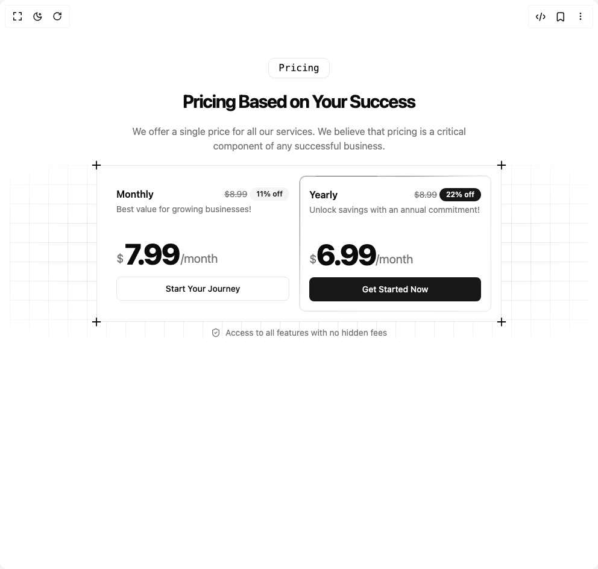

# Build Single Pricing Card 1 in BuilderStudio

> Build this component in our Agentic IDE: [BuilderStudio](https://builderstudio.dev).
>
> Join the BuilderStudio community on [Discord](https://discord.gg/QdWeSGCqfe) and [Reddit](https://reddit.com/r/builderstudio).



## Component

- Author group: `efferd`
- Component: `single-pricing-card-1`
- Variant: `default`
- Rendered HTML snapshot: [`rendered.html`](rendered.html)

## BuilderStudio prompt

You are implementing a React component based on a component reference.

## Component identity

- Author: efferd
- Component slug: single-pricing-card-1
- Demo slug: default
- Title: single-pricing-card-1
- Description: 

## Goal

Recreate this component in a React + TypeScript + Tailwind CSS project. Preserve the visual layout, spacing, colors, border radius, shadows, interaction behavior, animation behavior, responsive behavior, and dark mode behavior shown in the rendered demo.

## Implementation requirements

- Use React and TypeScript.
- Use Tailwind CSS classes whenever possible.
- Keep the component self-contained unless the source files require helper components.
- If the source uses CSS variables, custom CSS, animations, or keyframes, include them.
- If the source uses external packages, list and use the required packages.
- Preserve accessibility attributes, button semantics, links, keyboard behavior, and ARIA attributes when visible in the source.
- Do not replace the component with a simplified placeholder.
- Return complete production-ready code.

## Dependencies

No reference metadata available.

## Rendered DOM snapshot

This is the rendered demo HTML extracted from the live preview. Use it to verify structure, class names, visible content, and layout.

```html
<div id="root"><section class="relative min-h-screen overflow-hidden py-24"><div id="pricing" class="mx-auto w-full max-w-6xl space-y-5 px-4"><div class="mx-auto max-w-xl space-y-5" style="opacity: 1; transform: none;"><div class="flex justify-center"><div class="rounded-lg border px-4 py-1 font-mono">Pricing</div></div><h2 class="mt-5 text-center text-2xl font-bold tracking-tighter md:text-3xl lg:text-4xl">Pricing Based on Your Success</h2><p class="text-muted-foreground mt-5 text-center text-sm md:text-base">We offer a single price for all our services. We believe that pricing is a critical component of any successful business.</p></div><div class="relative"><div class="z--10 pointer-events-none absolute inset-0 size-full bg-[linear-gradient(to_right,--theme(--color-foreground/.2)_1px,transparent_1px),linear-gradient(to_bottom,--theme(--color-foreground/.2)_1px,transparent_1px)] bg-[size:32px_32px] [mask-image:radial-gradient(ellipse_at_center,var(--background)_10%,transparent)]"></div><div class="mx-auto w-full max-w-2xl space-y-2" style="opacity: 1; transform: none;"><div class="grid md:grid-cols-2 bg-background relative border p-4"><svg xmlns="http://www.w3.org/2000/svg" width="24" height="24" viewBox="0 0 24 24" fill="none" stroke="currentColor" stroke-width="2" stroke-linecap="round" stroke-linejoin="round" class="lucide lucide-plus absolute -top-3 -left-3  size-5.5" aria-hidden="true"><path d="M5 12h14"></path><path d="M12 5v14"></path></svg><svg xmlns="http://www.w3.org/2000/svg" width="24" height="24" viewBox="0 0 24 24" fill="none" stroke="currentColor" stroke-width="2" stroke-linecap="round" stroke-linejoin="round" class="lucide lucide-plus absolute -top-3 -right-3 size-5.5" aria-hidden="true"><path d="M5 12h14"></path><path d="M12 5v14"></path></svg><svg xmlns="http://www.w3.org/2000/svg" width="24" height="24" viewBox="0 0 24 24" fill="none" stroke="currentColor" stroke-width="2" stroke-linecap="round" stroke-linejoin="round" class="lucide lucide-plus absolute -bottom-3 -left-3 size-5.5" aria-hidden="true"><path d="M5 12h14"></path><path d="M12 5v14"></path></svg><svg xmlns="http://www.w3.org/2000/svg" width="24" height="24" viewBox="0 0 24 24" fill="none" stroke="currentColor" stroke-width="2" stroke-linecap="round" stroke-linejoin="round" class="lucide lucide-plus absolute -right-3 -bottom-3 size-5.5" aria-hidden="true"><path d="M5 12h14"></path><path d="M12 5v14"></path></svg><div class="w-full px-4 pt-5 pb-4"><div class="space-y-1"><div class="flex items-center justify-between"><h3 class="leading-none font-semibold">Monthly</h3><div class="flex items-center gap-x-1"><span class="text-muted-foreground text-sm line-through">$8.99</span><div class="inline-flex items-center rounded-full border px-2.5 py-0.5 text-xs font-semibold transition-colors focus:outline-none focus:ring-2 focus:ring-ring focus:ring-offset-2 border-transparent bg-secondary text-secondary-foreground hover:bg-secondary/80">11% off</div></div></div><p class="text-muted-foreground text-sm">Best value for growing businesses!</p></div><div class="mt-10 space-y-4"><div class="text-muted-foreground flex items-end gap-0.5 text-xl"><span>$</span><span class="text-foreground -mb-0.5 text-4xl font-extrabold tracking-tighter md:text-5xl">7.99</span><span>/month</span></div><a href="#" class="inline-flex items-center justify-center whitespace-nowrap rounded-md text-sm font-medium ring-offset-background transition-colors focus-visible:outline-none focus-visible:ring-2 focus-visible:ring-ring focus-visible:ring-offset-2 disabled:pointer-events-none disabled:opacity-50 border border-input bg-background hover:bg-accent hover:text-accent-foreground h-10 px-4 py-2 w-full">Start Your Journey</a></div></div><div class="relative w-full rounded-lg border px-4 pt-5 pb-4"><div class="pointer-events-none absolute inset-0 rounded-[inherit] border border-transparent [mask-clip:padding-box,border-box] [mask-composite:intersect] [mask-image:linear-gradient(transparent,transparent),linear-gradient(#000,#000)]"><div class="absolute aspect-square bg-zinc-500" style="width: 100px; offset-path: rect(0px auto auto 0px round 100px); box-shadow: rgba(255, 255, 255, 0.5) 0px 0px 60px 30px, rgba(0, 0, 0, 0.5) 0px 0px 100px 60px, rgba(0, 0, 0, 0.5) 0px 0px 140px 90px; offset-distance: 96.92%;"></div></div><div class="space-y-1"><div class="flex items-center justify-between"><h3 class="leading-none font-semibold">Yearly</h3><div class="flex items-center gap-x-1"><span class="text-muted-foreground text-sm line-through">$8.99</span><div class="inline-flex items-center rounded-full border px-2.5 py-0.5 text-xs font-semibold transition-colors focus:outline-none focus:ring-2 focus:ring-ring focus:ring-offset-2 border-transparent bg-primary text-primary-foreground hover:bg-primary/80">22% off</div></div></div><p class="text-muted-foreground text-sm">Unlock savings with an annual commitment!</p></div><div class="mt-10 space-y-4"><div class="text-muted-foreground flex items-end text-xl"><span>$</span><span class="text-foreground -mb-0.5 text-4xl font-extrabold tracking-tighter md:text-5xl">6.99</span><span>/month</span></div><a href="#" class="inline-flex items-center justify-center whitespace-nowrap rounded-md text-sm font-medium ring-offset-background transition-colors focus-visible:outline-none focus-visible:ring-2 focus-visible:ring-ring focus-visible:ring-offset-2 disabled:pointer-events-none disabled:opacity-50 bg-primary text-primary-foreground hover:bg-primary/90 h-10 px-4 py-2 w-full">Get Started Now</a></div></div></div><div class="text-muted-foreground flex items-center justify-center gap-x-2 text-sm"><svg xmlns="http://www.w3.org/2000/svg" width="24" height="24" viewBox="0 0 24 24" fill="none" stroke="currentColor" stroke-width="2" stroke-linecap="round" stroke-linejoin="round" class="lucide lucide-shield-check size-4" aria-hidden="true"><path d="M20 13c0 5-3.5 7.5-7.66 8.95a1 1 0 0 1-.67-.01C7.5 20.5 4 18 4 13V6a1 1 0 0 1 1-1c2 0 4.5-1.2 6.24-2.72a1.17 1.17 0 0 1 1.52 0C14.51 3.81 17 5 19 5a1 1 0 0 1 1 1z"></path><path d="m9 12 2 2 4-4"></path></svg><span>Access to all features with no hidden fees</span></div></div></div></div></section></div>
```

## Reference source files

No reference source files were available.
