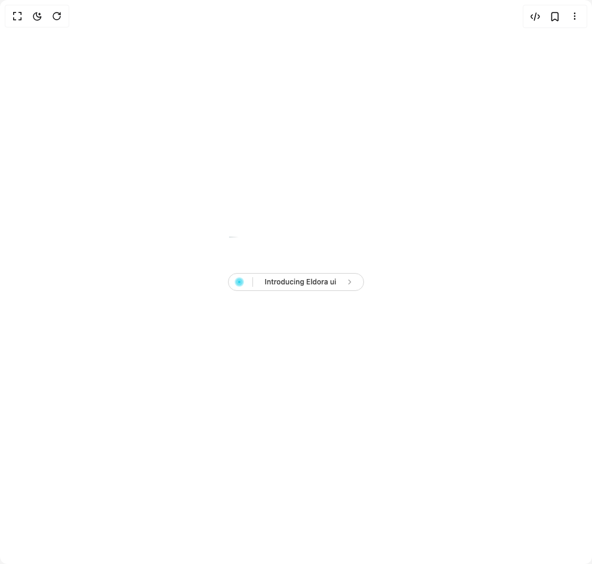
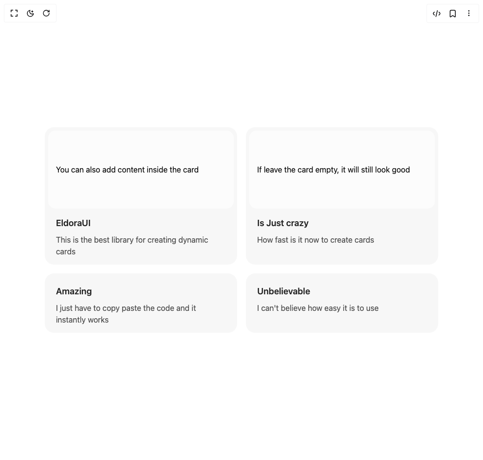
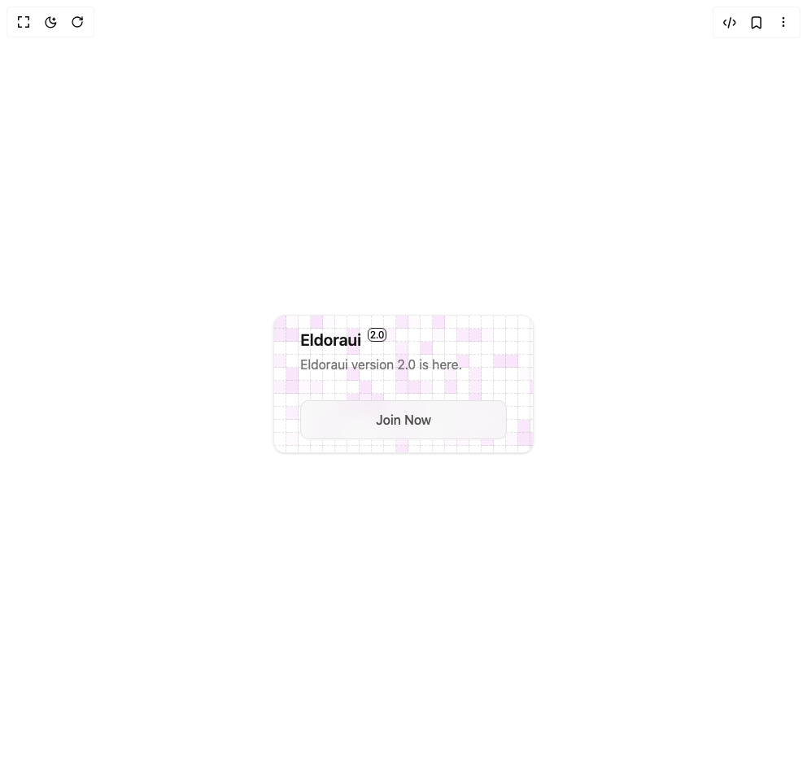
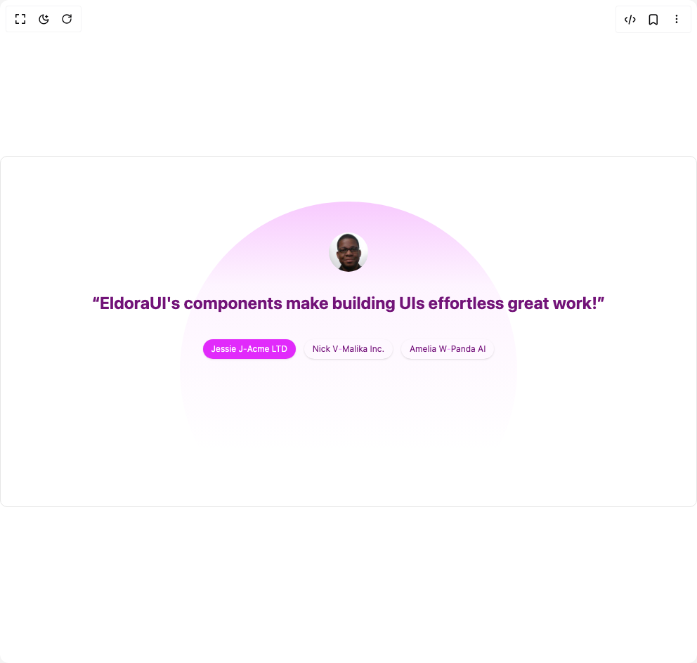

# Eldora Ui Components

5 components are available in this author group.

> Build any component in [BuilderStudio](https://builderstudio.dev), then share improvements with the community on [Discord](https://discord.gg/QdWeSGCqfe) or [Reddit](https://reddit.com/r/builderstudio).

| Preview | Component | Variant |
| --- | --- | --- |
|  | [Animated Badge](animated-badge/default/README.md) | `default` |
|  | [Animated Card](animated-card/default/README.md) | `default` |
|  | [Dynamic Square](dynamic-square/default/README.md) | `default` |
|  | [Testimonal Slider](testimonal-slider/default/README.md) | `default` |
|  | [Testimonals Carousel](testimonals-carousel/default/README.md) | `default` |
