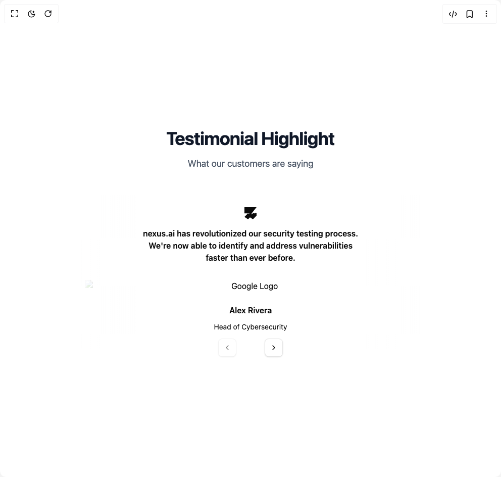

# Build Testimonals Carousel in BuilderStudio

> Build this component in our Agentic IDE: [BuilderStudio](https://builderstudio.dev).
>
> Join the BuilderStudio community on [Discord](https://discord.gg/QdWeSGCqfe) and [Reddit](https://reddit.com/r/builderstudio).



## Component

- Author group: `eldora-ui`
- Component: `testimonals-carousel`
- Variant: `default`
- Rendered HTML snapshot: [`rendered.html`](rendered.html)

## BuilderStudio prompt

You are implementing a React component based on a component reference.

## Component identity

- Author: eldora-ui
- Component slug: testimonals-carousel
- Demo slug: default
- Title: testimonals-carousel
- Description: 

## Goal

Recreate this component in a React + TypeScript + Tailwind CSS project. Preserve the visual layout, spacing, colors, border radius, shadows, interaction behavior, animation behavior, responsive behavior, and dark mode behavior shown in the rendered demo.

## Implementation requirements

- Use React and TypeScript.
- Use Tailwind CSS classes whenever possible.
- Keep the component self-contained unless the source files require helper components.
- If the source uses CSS variables, custom CSS, animations, or keyframes, include them.
- If the source uses external packages, list and use the required packages.
- Preserve accessibility attributes, button semantics, links, keyboard behavior, and ARIA attributes when visible in the source.
- Do not replace the component with a simplified placeholder.
- Return complete production-ready code.

## Dependencies

No reference metadata available.

## Rendered DOM snapshot

This is the rendered demo HTML extracted from the live preview. Use it to verify structure, class names, visible content, and layout.

```html
<div id="root"><div class="w-screen min-h-screen flex justify-center items-center"><div class="w-screen min-h-screen flex justify-center items-center"><div class="flex w-full min-h-screen justify-center items-center p-4"><section class="py-12 sm:py-24"><div class="mx-auto max-w-7xl px-4 sm:px-6 lg:px-8 text-center"><h2 class="text-3xl font-bold tracking-tight text-gray-900 sm:text-4xl">Testimonial Highlight</h2><p class="mt-4 text-lg text-gray-600">What our customers are saying</p><div class="mt-12"><div class="relative" role="region" aria-roledescription="carousel"><div class="relative mx-auto max-w-2xl"><div class="overflow-hidden"><div class="flex -ml-4" style="transform: translate3d(0px, 0px, 0px);"><div role="group" aria-roledescription="slide" class="min-w-0 shrink-0 grow-0 basis-full pl-4"><div class="p-2 pb-5"><div class="text-center"><svg class="text-themeDarkGray mx-auto my-4 text-4xl" xmlns="http://www.w3.org/2000/svg" width="24" height="24" viewBox="0 0 24 24" fill="currentColor"><path d="M9.99 12.15l-1.42 1.42L7.15 12 0 19.15 7.15 24 14.3 16.85 14.3 0H0v12.15h9.99zM24 0v12.15l-1.42-1.42-1.42 1.42L16.85 12 9.7 19.15 16.85 24 24 16.85V0h-9.7v12.15L24 0z"></path></svg><h4 class="text-1xl mx-auto max-w-lg px-10 font-semibold">nexus.ai has revolutionized our security testing process. We're now able to identify and address vulnerabilities faster than ever before.</h4><div class="mt-8"></div><div><h4 class="text-1xl my-2 font-semibold">Alex Rivera</h4></div><div class="mb-3"><span class="text-themeDarkGray text-sm">Head of Cybersecurity</span></div></div></div></div><div role="group" aria-roledescription="slide" class="min-w-0 shrink-0 grow-0 basis-full pl-4"><div class="p-2 pb-5"><div class="text-center"><svg class="text-themeDarkGray mx-auto my-4 text-4xl" xmlns="http://www.w3.org/2000/svg" width="24" height="24" viewBox="0 0 24 24" fill="currentColor"><path d="M9.99 12.15l-1.42 1.42L7.15 12 0 19.15 7.15 24 14.3 16.85 14.3 0H0v12.15h9.99zM24 0v12.15l-1.42-1.42-1.42 1.42L16.85 12 9.7 19.15 16.85 24 24 16.85V0h-9.7v12.15L24 0z"></path></svg><h4 class="text-1xl mx-auto max-w-lg px-10 font-semibold">With nexus.ai, we've significantly improved our security posture. It's like having an AI-powered ethical hacker working around the clock.</h4><div class="mt-8"></div><div><h4 class="text-1xl my-2 font-semibold">Samantha Lee</h4></div><div class="mb-3"><span class="text-themeDarkGray text-sm">Chief Information Security Officer</span></div></div></div></div><div role="group" aria-roledescription="slide" class="min-w-0 shrink-0 grow-0 basis-full pl-4"><div class="p-2 pb-5"><div class="text-center"><svg class="text-themeDarkGray mx-auto my-4 text-4xl" xmlns="http://www.w3.org/2000/svg" width="24" height="24" viewBox="0 0 24 24" fill="currentColor"><path d="M9.99 12.15l-1.42 1.42L7.15 12 0 19.15 7.15 24 14.3 16.85 14.3 0H0v12.15h9.99zM24 0v12.15l-1.42-1.42-1.42 1.42L16.85 12 9.7 19.15 16.85 24 24 16.85V0h-9.7v12.15L24 0z"></path></svg><h4 class="text-1xl mx-auto max-w-lg px-10 font-semibold">The AI-driven insights from nexus.ai have transformed how we approach cybersecurity. It's a game-changer for our platform's security.</h4><div class="mt-8"></div><div><h4 class="text-1xl my-2 font-semibold">Raj Patel</h4></div><div class="mb-3"><span class="text-themeDarkGray text-sm">VP of Engineering</span></div></div></div></div><div role="group" aria-roledescription="slide" class="min-w-0 shrink-0 grow-0 basis-full pl-4"><div class="p-2 pb-5"><div class="text-center"><svg class="text-themeDarkGray mx-auto my-4 text-4xl" xmlns="http://www.w3.org/2000/svg" width="24" height="24" viewBox="0 0 24 24" fill="currentColor"><path d="M9.99 12.15l-1.42 1.42L7.15 12 0 19.15 7.15 24 14.3 16.85 14.3 0H0v12.15h9.99zM24 0v12.15l-1.42-1.42-1.42 1.42L16.85 12 9.7 19.15 16.85 24 24 16.85V0h-9.7v12.15L24 0z"></path></svg><h4 class="text-1xl mx-auto max-w-lg px-10 font-semibold">nexus.ai's automated penetration testing has saved us countless hours and dramatically enhanced our security measures.</h4><div class="mt-8"></div><div><h4 class="text-1xl my-2 font-semibold">Emily Chen</h4></div><div class="mb-3"><span class="text-themeDarkGray text-sm">Security Operations Manager</span></div></div></div></div><div role="group" aria-roledescription="slide" class="min-w-0 shrink-0 grow-0 basis-full pl-4"><div class="p-2 pb-5"><div class="text-center"><svg class="text-themeDarkGray mx-auto my-4 text-4xl" xmlns="http://www.w3.org/2000/svg" width="24" height="24" viewBox="0 0 24 24" fill="currentColor"><path d="M9.99 12.15l-1.42 1.42L7.15 12 0 19.15 7.15 24 14.3 16.85 14.3 0H0v12.15h9.99zM24 0v12.15l-1.42-1.42-1.42 1.42L16.85 12 9.7 19.15 16.85 24 24 16.85V0h-9.7v12.15L24 0z"></path></svg><h4 class="text-1xl mx-auto max-w-lg px-10 font-semibold">Implementing nexus.ai was seamless, and the results were immediate. We're now proactively addressing potential security issues before they become threats.</h4><div class="mt-8"></div><div><h4 class="text-1xl my-2 font-semibold">Michael Brown</h4></div><div class="mb-3"><span class="text-themeDarkGray text-sm">Director of IT Security</span></div></div></div></div><div role="group" aria-roledescription="slide" class="min-w-0 shrink-0 grow-0 basis-full pl-4"><div class="p-2 pb-5"><div class="text-center"><svg class="text-themeDarkGray mx-auto my-4 text-4xl" xmlns="http://www.w3.org/2000/svg" width="24" height="24" viewBox="0 0 24 24" fill="currentColor"><path d="M9.99 12.15l-1.42 1.42L7.15 12 0 19.15 7.15 24 14.3 16.85 14.3 0H0v12.15h9.99zM24 0v12.15l-1.42-1.42-1.42 1.42L16.85 12 9.7 19.15 16.85 24 24 16.85V0h-9.7v12.15L24 0z"></path></svg><h4 class="text-1xl mx-auto max-w-lg px-10 font-semibold">The continuous monitoring capabilities of nexus.ai give us peace of mind. We're always one step ahead in protecting our users' data.</h4><div class="mt-8"></div><div><h4 class="text-1xl my-2 font-semibold">Linda Wu</h4></div><div class="mb-3"><span class="text-themeDarkGray text-sm">Lead Security Architect</span></div></div></div></div><div role="group" aria-roledescription="slide" class="min-w-0 shrink-0 grow-0 basis-full pl-4"><div class="p-2 pb-5"><div class="text-center"><svg class="text-themeDarkGray mx-auto my-4 text-4xl" xmlns="http://www.w3.org/2000/svg" width="24" height="24" viewBox="0 0 24 24" fill="currentColor"><path d="M9.99 12.15l-1.42 1.42L7.15 12 0 19.15 7.15 24 14.3 16.85 14.3 0H0v12.15h9.99zM24 0v12.15l-1.42-1.42-1.42 1.42L16.85 12 9.7 19.15 16.85 24 24 16.85V0h-9.7v12.15L24 0z"></path></svg><h4 class="text-1xl mx-auto max-w-lg px-10 font-semibold">nexus.ai's compliance mapping feature has streamlined our security audit processes. It's an essential tool for maintaining trust with our users.</h4><div class="mt-8"></div><div><h4 class="text-1xl my-2 font-semibold">Carlos Gomez</h4></div><div class="mb-3"><span class="text-themeDarkGray text-sm">Chief Technology Officer</span></div></div></div></div></div></div><div class="pointer-events-none absolute inset-y-0 left-0 h-full w-2/12 bg-gradient-to-r from-background"></div><div class="pointer-events-none absolute inset-y-0 right-0 h-full  w-2/12 bg-gradient-to-l from-background"></div></div><div class="hidden md:block"><button class="inline-flex items-center justify-center whitespace-nowrap rounded-md text-sm font-medium transition-colors focus-visible:outline-none focus-visible:ring-1 focus-visible:ring-ring disabled:pointer-events-none disabled:opacity-50 border border-input bg-background shadow-sm hover:bg-accent hover:text-accent-foreground h-9 w-9 absolute  size-8 rounded-full bottom-0 left-1/2 -translate-x-16 translate-y-4" disabled=""><svg xmlns="http://www.w3.org/2000/svg" width="24" height="24" viewBox="0 0 24 24" fill="none" stroke="currentColor" stroke-width="2" stroke-linecap="round" stroke-linejoin="round" class="size-4"><path d="m15 18-6-6 6-6"></path></svg><span class="sr-only">Previous slide</span></button><button class="inline-flex items-center justify-center whitespace-nowrap rounded-md text-sm font-medium transition-colors focus-visible:outline-none focus-visible:ring-1 focus-visible:ring-ring disabled:pointer-events-none disabled:opacity-50 border border-input bg-background shadow-sm hover:bg-accent hover:text-accent-foreground h-9 w-9 absolute size-8 rounded-full bottom-0 right-1/2 translate-x-16 translate-y-4"><svg xmlns="http://www.w3.org/2000/svg" width="24" height="24" viewBox="0 0 24 24" fill="none" stroke="currentColor" stroke-width="2" stroke-linecap="round" stroke-linejoin="round" class="size-4"><path d="m9 18 6-6-6-6"></path></svg><span class="sr-only">Next slide</span></button></div></div></div></div></section></div></div></div></div>
```

## Reference source files

No reference source files were available.
