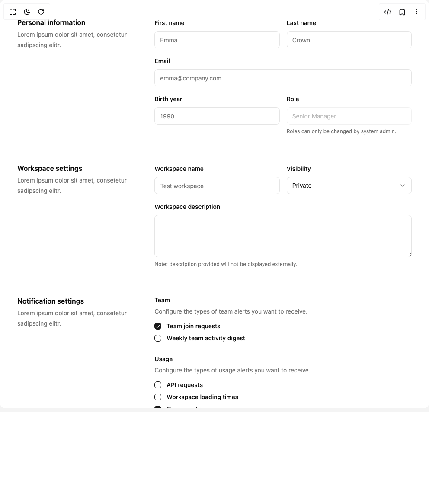

# Build Form Layout in BuilderStudio

> Build this component in our Agentic IDE: [BuilderStudio](https://builderstudio.dev).
>
> Join the BuilderStudio community on [Discord](https://discord.gg/QdWeSGCqfe) and [Reddit](https://reddit.com/r/builderstudio).



## Component

- Author group: `ephraimduncan`
- Component: `form-layout`
- Variant: `form-sections-with-checkbox-settings`
- Rendered HTML snapshot: [`rendered.html`](rendered.html)

## BuilderStudio prompt

You are implementing a React component based on a component reference.

## Component identity

- Author: ephraimduncan
- Component slug: form-layout
- Demo slug: form-sections-with-checkbox-settings
- Title: form-layout
- Description: 

## Goal

Recreate this component in a React + TypeScript + Tailwind CSS project. Preserve the visual layout, spacing, colors, border radius, shadows, interaction behavior, animation behavior, responsive behavior, and dark mode behavior shown in the rendered demo.

## Implementation requirements

- Use React and TypeScript.
- Use Tailwind CSS classes whenever possible.
- Keep the component self-contained unless the source files require helper components.
- If the source uses CSS variables, custom CSS, animations, or keyframes, include them.
- If the source uses external packages, list and use the required packages.
- Preserve accessibility attributes, button semantics, links, keyboard behavior, and ARIA attributes when visible in the source.
- Do not replace the component with a simplified placeholder.
- Return complete production-ready code.

## Dependencies

No reference metadata available.

## Rendered DOM snapshot

This is the rendered demo HTML extracted from the live preview. Use it to verify structure, class names, visible content, and layout.

```html
<div id="root"><div class="w-screen min-h-screen flex justify-center items-center"><div class="w-screen min-h-screen flex justify-center items-center"><div class="flex items-center justify-center p-10"><form><div class="grid grid-cols-1 gap-10 md:grid-cols-3"><div><h2 class="font-semibold text-foreground dark:text-foreground">Personal information</h2><p class="mt-1 text-sm leading-6 text-muted-foreground dark:text-muted-foreground">Lorem ipsum dolor sit amet, consetetur sadipscing elitr.</p></div><div class="sm:max-w-3xl md:col-span-2"><div class="grid grid-cols-1 gap-4 sm:grid-cols-6"><div class="col-span-full sm:col-span-3"><label class="peer-disabled:cursor-not-allowed peer-disabled:opacity-70 text-sm font-medium text-foreground dark:text-foreground" for="first-name">First name</label><input class="flex h-10 w-full rounded-md border border-input bg-background px-3 py-2 text-sm ring-offset-background file:border-0 file:bg-transparent file:text-sm file:font-medium file:text-foreground placeholder:text-muted-foreground focus-visible:outline-none focus-visible:ring-2 focus-visible:ring-ring focus-visible:ring-offset-2 disabled:cursor-not-allowed disabled:opacity-50 mt-2" id="first-name" autocomplete="given-name" placeholder="Emma" type="text" name="first-name"></div><div class="col-span-full sm:col-span-3"><label class="peer-disabled:cursor-not-allowed peer-disabled:opacity-70 text-sm font-medium text-foreground dark:text-foreground" for="last-name">Last name</label><input class="flex h-10 w-full rounded-md border border-input bg-background px-3 py-2 text-sm ring-offset-background file:border-0 file:bg-transparent file:text-sm file:font-medium file:text-foreground placeholder:text-muted-foreground focus-visible:outline-none focus-visible:ring-2 focus-visible:ring-ring focus-visible:ring-offset-2 disabled:cursor-not-allowed disabled:opacity-50 mt-2" id="last-name" autocomplete="family-name" placeholder="Crown" type="text" name="last-name"></div><div class="col-span-full"><label class="peer-disabled:cursor-not-allowed peer-disabled:opacity-70 text-sm font-medium text-foreground dark:text-foreground" for="email">Email</label><input class="flex h-10 w-full rounded-md border border-input bg-background px-3 py-2 text-sm ring-offset-background file:border-0 file:bg-transparent file:text-sm file:font-medium file:text-foreground placeholder:text-muted-foreground focus-visible:outline-none focus-visible:ring-2 focus-visible:ring-ring focus-visible:ring-offset-2 disabled:cursor-not-allowed disabled:opacity-50 mt-2" id="email" autocomplete="email" placeholder="emma@company.com" type="email" name="email"></div><div class="col-span-full sm:col-span-3"><label class="peer-disabled:cursor-not-allowed peer-disabled:opacity-70 text-sm font-medium text-foreground dark:text-foreground" for="birthyear">Birth year</label><input class="flex h-10 w-full rounded-md border border-input bg-background px-3 py-2 text-sm ring-offset-background file:border-0 file:bg-transparent file:text-sm file:font-medium file:text-foreground placeholder:text-muted-foreground focus-visible:outline-none focus-visible:ring-2 focus-visible:ring-ring focus-visible:ring-offset-2 disabled:cursor-not-allowed disabled:opacity-50 mt-2" id="birthyear" placeholder="1990" type="number" name="year"></div><div class="col-span-full sm:col-span-3"><label class="peer-disabled:cursor-not-allowed peer-disabled:opacity-70 text-sm font-medium text-foreground dark:text-foreground" for="role">Role</label><input class="flex h-10 w-full rounded-md border border-input bg-background px-3 py-2 text-sm ring-offset-background file:border-0 file:bg-transparent file:text-sm file:font-medium file:text-foreground placeholder:text-muted-foreground focus-visible:outline-none focus-visible:ring-2 focus-visible:ring-ring focus-visible:ring-offset-2 disabled:cursor-not-allowed disabled:opacity-50 mt-2" id="role" placeholder="Senior Manager" disabled="" type="text" name="role"><p class="mt-2 text-xs text-muted-foreground dark:text-muted-foreground">Roles can only be changed by system admin.</p></div></div></div></div><div data-orientation="horizontal" role="none" class="shrink-0 bg-border h-[1px] w-full my-8"></div><div class="grid grid-cols-1 gap-10 md:grid-cols-3"><div><h2 class="font-semibold text-foreground dark:text-foreground">Workspace settings</h2><p class="mt-1 text-sm leading-6 text-muted-foreground dark:text-muted-foreground">Lorem ipsum dolor sit amet, consetetur sadipscing elitr.</p></div><div class="sm:max-w-3xl md:col-span-2"><div class="grid grid-cols-1 gap-4 sm:grid-cols-6"><div class="col-span-full sm:col-span-3"><label class="peer-disabled:cursor-not-allowed peer-disabled:opacity-70 text-sm font-medium text-foreground dark:text-foreground" for="workspace-name">Workspace name</label><input class="flex h-10 w-full rounded-md border border-input bg-background px-3 py-2 text-sm ring-offset-background file:border-0 file:bg-transparent file:text-sm file:font-medium file:text-foreground placeholder:text-muted-foreground focus-visible:outline-none focus-visible:ring-2 focus-visible:ring-ring focus-visible:ring-offset-2 disabled:cursor-not-allowed disabled:opacity-50 mt-2" id="workspace-name" placeholder="Test workspace" type="text" name="workspace-name"></div><div class="col-span-full sm:col-span-3"><label class="peer-disabled:cursor-not-allowed peer-disabled:opacity-70 text-sm font-medium text-foreground dark:text-foreground" for="visibility">Visibility</label><button type="button" role="combobox" aria-controls="radix-«r0»" aria-expanded="false" aria-autocomplete="none" dir="ltr" data-state="closed" class="flex h-10 w-full items-center justify-between rounded-md border border-input bg-background px-3 py-2 text-sm ring-offset-background placeholder:text-muted-foreground focus:outline-none focus:ring-2 focus:ring-ring focus:ring-offset-2 disabled:cursor-not-allowed disabled:opacity-50 [&amp;&gt;span]:line-clamp-1 mt-2" id="visibility"><span style="pointer-events: none;">Private</span><svg xmlns="http://www.w3.org/2000/svg" width="24" height="24" viewBox="0 0 24 24" fill="none" stroke="currentColor" stroke-width="2" stroke-linecap="round" stroke-linejoin="round" class="lucide lucide-chevron-down h-4 w-4 opacity-50" aria-hidden="true"><path d="m6 9 6 6 6-6"></path></svg></button><select aria-hidden="true" tabindex="-1" name="visibility" style="position: absolute; border: 0px; width: 1px; height: 1px; padding: 0px; margin: -1px; overflow: hidden; clip: rect(0px, 0px, 0px, 0px); white-space: nowrap; overflow-wrap: normal;"><option value="public">Public</option><option value="private" selected="">Private</option></select></div><div class="col-span-full"><label class="peer-disabled:cursor-not-allowed peer-disabled:opacity-70 text-sm font-medium text-foreground dark:text-foreground" for="workspace-description">Workspace description</label><textarea class="flex min-h-[80px] w-full rounded-md border border-input bg-background px-3 py-2 text-sm ring-offset-background placeholder:text-muted-foreground focus-visible:outline-none focus-visible:ring-2 focus-visible:ring-ring focus-visible:ring-offset-2 disabled:cursor-not-allowed disabled:opacity-50 mt-2" id="workspace-description" name="workspace-description" rows="4"></textarea><p class="mt-2 text-xs text-muted-foreground dark:text-muted-foreground">Note: description provided will not be displayed externally.</p></div></div></div></div><div data-orientation="horizontal" role="none" class="shrink-0 bg-border h-[1px] w-full my-8"></div><div class="grid grid-cols-1 gap-10 md:grid-cols-3"><div><h2 class="font-semibold text-foreground dark:text-foreground">Notification settings</h2><p class="mt-1 text-sm leading-6 text-muted-foreground dark:text-muted-foreground">Lorem ipsum dolor sit amet, consetetur sadipscing elitr.</p></div><div class="sm:max-w-3xl md:col-span-2"><fieldset><legend class="text-sm font-medium text-foreground dark:text-foreground">Team</legend><p class="mt-1 text-sm leading-6 text-muted-foreground dark:text-muted-foreground">Configure the types of team alerts you want to receive.</p><div class="mt-2"><div class="flex items-center gap-x-3 py-1"><button type="button" role="checkbox" aria-checked="true" data-state="checked" value="on" class="peer h-4 w-4 shrink-0 rounded-sm border border-primary ring-offset-background focus-visible:outline-none focus-visible:ring-2 focus-visible:ring-ring focus-visible:ring-offset-2 disabled:cursor-not-allowed disabled:opacity-50 data-[state=checked]:bg-primary data-[state=checked]:text-primary-foreground" id="team-requests"><span data-state="checked" class="flex items-center justify-center text-current" style="pointer-events: none;"><svg xmlns="http://www.w3.org/2000/svg" width="24" height="24" viewBox="0 0 24 24" fill="none" stroke="currentColor" stroke-width="2" stroke-linecap="round" stroke-linejoin="round" class="lucide lucide-check h-4 w-4" aria-hidden="true"><path d="M20 6 9 17l-5-5"></path></svg></span></button><input aria-hidden="true" tabindex="-1" type="checkbox" value="on" checked="" name="team-requests" style="position: absolute; pointer-events: none; opacity: 0; margin: 0px; transform: translateX(-100%); width: 16px; height: 16px;"><label class="peer-disabled:cursor-not-allowed peer-disabled:opacity-70 text-sm font-medium text-foreground dark:text-foreground" for="team-requests">Team join requests</label></div><div class="flex items-center gap-x-3 py-1"><button type="button" role="checkbox" aria-checked="false" data-state="unchecked" value="on" class="peer h-4 w-4 shrink-0 rounded-sm border border-primary ring-offset-background focus-visible:outline-none focus-visible:ring-2 focus-visible:ring-ring focus-visible:ring-offset-2 disabled:cursor-not-allowed disabled:opacity-50 data-[state=checked]:bg-primary data-[state=checked]:text-primary-foreground" id="team-activity-digest"></button><input aria-hidden="true" tabindex="-1" type="checkbox" value="on" name="team-activity-digest" style="position: absolute; pointer-events: none; opacity: 0; margin: 0px; transform: translateX(-100%); width: 16px; height: 16px;"><label class="peer-disabled:cursor-not-allowed peer-disabled:opacity-70 text-sm font-medium text-foreground dark:text-foreground" for="team-activity-digest">Weekly team activity digest</label></div></div></fieldset><fieldset class="mt-6"><legend class="text-sm font-medium text-foreground dark:text-foreground">Usage</legend><p class="mt-1 text-sm leading-6 text-muted-foreground dark:text-muted-foreground">Configure the types of usage alerts you want to receive.</p><div class="mt-2"><div class="flex items-center gap-x-3 py-1"><button type="button" role="checkbox" aria-checked="false" data-state="unchecked" value="on" class="peer h-4 w-4 shrink-0 rounded-sm border border-primary ring-offset-background focus-visible:outline-none focus-visible:ring-2 focus-visible:ring-ring focus-visible:ring-offset-2 disabled:cursor-not-allowed disabled:opacity-50 data-[state=checked]:bg-primary data-[state=checked]:text-primary-foreground" id="api-requests"></button><input aria-hidden="true" tabindex="-1" type="checkbox" value="on" name="api-requests" style="position: absolute; pointer-events: none; opacity: 0; margin: 0px; transform: translateX(-100%); width: 16px; height: 16px;"><label class="peer-disabled:cursor-not-allowed peer-disabled:opacity-70 text-sm font-medium text-foreground dark:text-foreground" for="api-requests">API requests</label></div><div class="flex items-center gap-x-3 py-1"><button type="button" role="checkbox" aria-checked="false" data-state="unchecked" value="on" class="peer h-4 w-4 shrink-0 rounded-sm border border-primary ring-offset-background focus-visible:outline-none focus-visible:ring-2 focus-visible:ring-ring focus-visible:ring-offset-2 disabled:cursor-not-allowed disabled:opacity-50 data-[state=checked]:bg-primary data-[state=checked]:text-primary-foreground" id="workspace-execution"></button><input aria-hidden="true" tabindex="-1" type="checkbox" value="on" name="workspace-execution" style="position: absolute; pointer-events: none; opacity: 0; margin: 0px; transform: translateX(-100%); width: 16px; height: 16px;"><label class="peer-disabled:cursor-not-allowed peer-disabled:opacity-70 text-sm font-medium text-foreground dark:text-foreground" for="workspace-execution">Workspace loading times</label></div><div class="flex items-center gap-x-3 py-1"><button type="button" role="checkbox" aria-checked="true" data-state="checked" value="on" class="peer h-4 w-4 shrink-0 rounded-sm border border-primary ring-offset-background focus-visible:outline-none focus-visible:ring-2 focus-visible:ring-ring focus-visible:ring-offset-2 disabled:cursor-not-allowed disabled:opacity-50 data-[state=checked]:bg-primary data-[state=checked]:text-primary-foreground" id="query-caching"><span data-state="checked" class="flex items-center justify-center text-current" style="pointer-events: none;"><svg xmlns="http://www.w3.org/2000/svg" width="24" height="24" viewBox="0 0 24 24" fill="none" stroke="currentColor" stroke-width="2" stroke-linecap="round" stroke-linejoin="round" class="lucide lucide-check h-4 w-4" aria-hidden="true"><path d="M20 6 9 17l-5-5"></path></svg></span></button><input aria-hidden="true" tabindex="-1" type="checkbox" value="on" checked="" name="query-caching" style="position: absolute; pointer-events: none; opacity: 0; margin: 0px; transform: translateX(-100%); width: 16px; height: 16px;"><label class="peer-disabled:cursor-not-allowed peer-disabled:opacity-70 text-sm font-medium text-foreground dark:text-foreground" for="query-caching">Query caching</label></div><div class="flex items-center gap-x-3 py-1"><button type="button" role="checkbox" aria-checked="true" data-state="checked" value="on" class="peer h-4 w-4 shrink-0 rounded-sm border border-primary ring-offset-background focus-visible:outline-none focus-visible:ring-2 focus-visible:ring-ring focus-visible:ring-offset-2 disabled:cursor-not-allowed disabled:opacity-50 data-[state=checked]:bg-primary data-[state=checked]:text-primary-foreground" id="storage"><span data-state="checked" class="flex items-center justify-center text-current" style="pointer-events: none;"><svg xmlns="http://www.w3.org/2000/svg" width="24" height="24" viewBox="0 0 24 24" fill="none" stroke="currentColor" stroke-width="2" stroke-linecap="round" stroke-linejoin="round" class="lucide lucide-check h-4 w-4" aria-hidden="true"><path d="M20 6 9 17l-5-5"></path></svg></span></button><input aria-hidden="true" tabindex="-1" type="checkbox" value="on" checked="" name="storage" style="position: absolute; pointer-events: none; opacity: 0; margin: 0px; transform: translateX(-100%); width: 16px; height: 16px;"><label class="peer-disabled:cursor-not-allowed peer-disabled:opacity-70 text-sm font-medium text-foreground dark:text-foreground" for="storage">Storage</label></div></div></fieldset></div></div><div data-orientation="horizontal" role="none" class="shrink-0 bg-border h-[1px] w-full my-8"></div><div class="flex items-center justify-end space-x-4"><button class="inline-flex items-center justify-center rounded-md text-sm font-medium ring-offset-background transition-colors focus-visible:outline-none focus-visible:ring-2 focus-visible:ring-ring focus-visible:ring-offset-2 disabled:pointer-events-none disabled:opacity-50 border border-input bg-background hover:bg-accent hover:text-accent-foreground h-10 px-4 py-2 whitespace-nowrap" type="button">Go back</button><button class="inline-flex items-center justify-center rounded-md text-sm font-medium ring-offset-background transition-colors focus-visible:outline-none focus-visible:ring-2 focus-visible:ring-ring focus-visible:ring-offset-2 disabled:pointer-events-none disabled:opacity-50 bg-primary text-primary-foreground hover:bg-primary/90 h-10 px-4 py-2 whitespace-nowrap" type="submit">Save settings</button></div></form></div></div></div></div>
```

## Reference source files

No reference source files were available.
