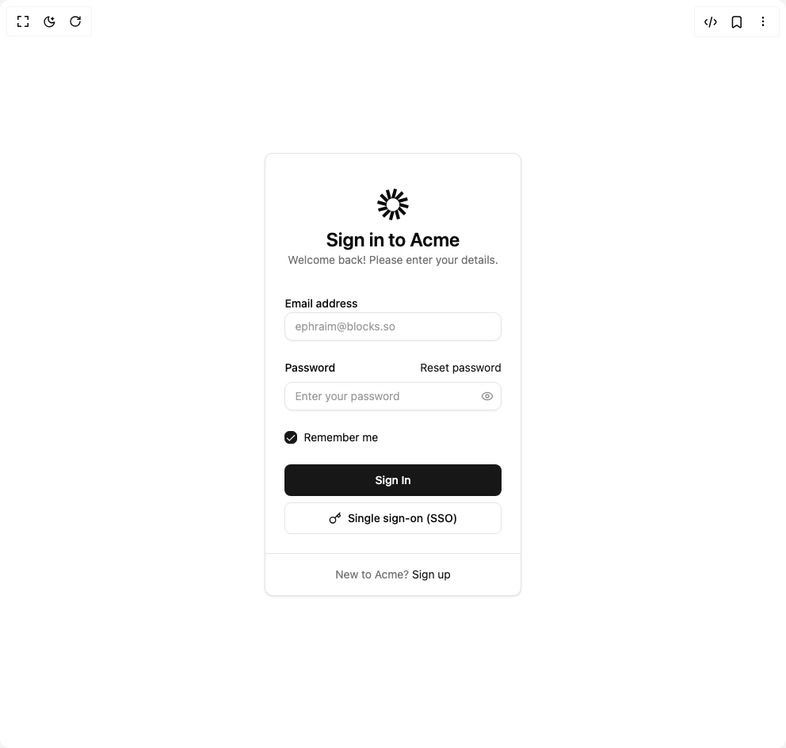

# Build Login Signup in BuilderStudio

> Build this component in our Agentic IDE: [BuilderStudio](https://builderstudio.dev).
>
> Join the BuilderStudio community on [Discord](https://discord.gg/QdWeSGCqfe) and [Reddit](https://reddit.com/r/builderstudio).



## Component

- Author group: `ephraimduncan`
- Component: `login-signup`
- Variant: `login-with-sso`
- Rendered HTML snapshot: [`rendered.html`](rendered.html)

## BuilderStudio prompt

You are implementing a React component based on a component reference.

## Component identity

- Author: ephraimduncan
- Component slug: login-signup
- Demo slug: login-with-sso
- Title: login-signup
- Description: 

## Goal

Recreate this component in a React + TypeScript + Tailwind CSS project. Preserve the visual layout, spacing, colors, border radius, shadows, interaction behavior, animation behavior, responsive behavior, and dark mode behavior shown in the rendered demo.

## Implementation requirements

- Use React and TypeScript.
- Use Tailwind CSS classes whenever possible.
- Keep the component self-contained unless the source files require helper components.
- If the source uses CSS variables, custom CSS, animations, or keyframes, include them.
- If the source uses external packages, list and use the required packages.
- Preserve accessibility attributes, button semantics, links, keyboard behavior, and ARIA attributes when visible in the source.
- Do not replace the component with a simplified placeholder.
- Return complete production-ready code.

## Dependencies

No reference metadata available.

## Rendered DOM snapshot

This is the rendered demo HTML extracted from the live preview. Use it to verify structure, class names, visible content, and layout.

```html
<div id="root"><div class="w-screen min-h-screen flex justify-center items-center"><div class="w-screen min-h-screen flex justify-center items-center"><div class="flex items-center justify-center min-h-screen"><div class="rounded-lg border bg-card text-card-foreground shadow-sm w-full max-w-md mx-4 pb-0"><div class="flex flex-col p-6 space-y-1 text-center mb-2 mt-4"><div class="flex justify-center"><svg fill="currentColor" height="48" viewBox="0 0 40 48" width="40"><clipPath id="a"><path d="m0 0h40v48h-40z"></path></clipPath><g clip-path="url(#a)"><path d="m25.0887 5.05386-3.933-1.05386-3.3145 12.3696-2.9923-11.16736-3.9331 1.05386 3.233 12.0655-8.05262-8.0526-2.87919 2.8792 8.83271 8.8328-10.99975-2.9474-1.05385625 3.933 12.01860625 3.2204c-.1376-.5935-.2104-1.2119-.2104-1.8473 0-4.4976 3.646-8.1436 8.1437-8.1436 4.4976 0 8.1436 3.646 8.1436 8.1436 0 .6313-.0719 1.2459-.2078 1.8359l10.9227 2.9267 1.0538-3.933-12.0664-3.2332 11.0005-2.9476-1.0539-3.933-12.0659 3.233 8.0526-8.0526-2.8792-2.87916-8.7102 8.71026z"></path><path d="m27.8723 26.2214c-.3372 1.4256-1.0491 2.7063-2.0259 3.7324l7.913 7.9131 2.8792-2.8792z"></path><path d="m25.7665 30.0366c-.9886 1.0097-2.2379 1.7632-3.6389 2.1515l2.8794 10.746 3.933-1.0539z"></path><path d="m21.9807 32.2274c-.65.1671-1.3313.2559-2.0334.2559-.7522 0-1.4806-.102-2.1721-.2929l-2.882 10.7558 3.933 1.0538z"></path><path d="m17.6361 32.1507c-1.3796-.4076-2.6067-1.1707-3.5751-2.1833l-7.9325 7.9325 2.87919 2.8792z"></path><path d="m13.9956 29.8973c-.9518-1.019-1.6451-2.2826-1.9751-3.6862l-10.95836 2.9363 1.05385 3.933z"></path></g></svg></div><div><h2 class="text-2xl font-semibold">Sign in to Acme</h2><p class="text-muted-foreground text-sm">Welcome back! Please enter your details.</p></div></div><div class="p-6 pt-0 space-y-6"><div class="space-y-2"><label class="text-sm font-medium leading-none peer-disabled:cursor-not-allowed peer-disabled:opacity-70" for="email">Email address</label><input class="flex h-9 w-full rounded-lg border border-input bg-background px-3 py-2 text-sm text-foreground shadow-sm shadow-black/5 transition-shadow placeholder:text-muted-foreground/70 focus-visible:border-ring focus-visible:outline-none focus-visible:ring-[3px] focus-visible:ring-ring/20 disabled:cursor-not-allowed disabled:opacity-50" id="email" placeholder="ephraim@blocks.so" type="email"></div><div class="space-y-0"><div class="flex items-center justify-between mb-2"><label class="text-sm font-medium leading-none peer-disabled:cursor-not-allowed peer-disabled:opacity-70" for="password">Password</label><a href="#" class="text-sm text-primary hover:underline">Reset password</a></div><div class="relative"><input class="flex h-9 w-full rounded-lg border border-input bg-background px-3 py-2 text-sm text-foreground shadow-sm shadow-black/5 transition-shadow placeholder:text-muted-foreground/70 focus-visible:border-ring focus-visible:outline-none focus-visible:ring-[3px] focus-visible:ring-ring/20 disabled:cursor-not-allowed disabled:opacity-50 pe-9" id="password" placeholder="Enter your password" type="password"><button class="text-muted-foreground/80 hover:text-foreground focus-visible:border-ring focus-visible:ring-ring/50 absolute inset-y-0 end-0 flex h-full w-9 items-center justify-center rounded-e-md transition-[color,box-shadow] outline-none focus:z-10 focus-visible:ring-[3px] disabled:pointer-events-none disabled:cursor-not-allowed disabled:opacity-50" type="button" aria-label="Show password" aria-pressed="false" aria-controls="password"><svg xmlns="http://www.w3.org/2000/svg" width="16" height="16" viewBox="0 0 24 24" fill="none" stroke="currentColor" stroke-width="2" stroke-linecap="round" stroke-linejoin="round" class="lucide lucide-eye" aria-hidden="true"><path d="M2.062 12.348a1 1 0 0 1 0-.696 10.75 10.75 0 0 1 19.876 0 1 1 0 0 1 0 .696 10.75 10.75 0 0 1-19.876 0"></path><circle cx="12" cy="12" r="3"></circle></svg></button></div></div><div class="flex items-center space-x-2"><button type="button" role="checkbox" aria-checked="true" data-state="checked" value="on" class="peer h-4 w-4 shrink-0 rounded-sm border border-primary ring-offset-background focus-visible:outline-none focus-visible:ring-2 focus-visible:ring-ring focus-visible:ring-offset-2 disabled:cursor-not-allowed disabled:opacity-50 data-[state=checked]:bg-primary data-[state=checked]:text-primary-foreground" id="remember"><span data-state="checked" class="flex items-center justify-center text-current" style="pointer-events: none;"><svg xmlns="http://www.w3.org/2000/svg" width="24" height="24" viewBox="0 0 24 24" fill="none" stroke="currentColor" stroke-width="2" stroke-linecap="round" stroke-linejoin="round" class="lucide lucide-check h-4 w-4" aria-hidden="true"><path d="M20 6 9 17l-5-5"></path></svg></span></button><label class="peer-disabled:cursor-not-allowed peer-disabled:opacity-70 text-sm font-normal" for="remember">Remember me</label></div><div class="space-y-2"><button class="inline-flex items-center justify-center whitespace-nowrap rounded-md text-sm font-medium ring-offset-background transition-colors focus-visible:outline-none focus-visible:ring-2 focus-visible:ring-ring focus-visible:ring-offset-2 disabled:pointer-events-none disabled:opacity-50 bg-primary text-primary-foreground hover:bg-primary/90 h-10 px-4 py-2 w-full" type="submit">Sign In</button><button class="inline-flex items-center justify-center whitespace-nowrap rounded-md text-sm font-medium ring-offset-background transition-colors focus-visible:outline-none focus-visible:ring-2 focus-visible:ring-ring focus-visible:ring-offset-2 disabled:pointer-events-none disabled:opacity-50 border border-input bg-background hover:bg-accent hover:text-accent-foreground h-10 px-4 py-2 w-full" type="button"><svg xmlns="http://www.w3.org/2000/svg" width="24" height="24" viewBox="0 0 24 24" fill="none" stroke="currentColor" stroke-width="2" stroke-linecap="round" stroke-linejoin="round" class="lucide lucide-key mr-2 h-4 w-4" aria-hidden="true"><path d="m15.5 7.5 2.3 2.3a1 1 0 0 0 1.4 0l2.1-2.1a1 1 0 0 0 0-1.4L19 4"></path><path d="m21 2-9.6 9.6"></path><circle cx="7.5" cy="15.5" r="5.5"></circle></svg>Single sign-on (SSO)</button></div></div><div class="items-center p-6 pt-0 flex justify-center border-t !py-4"><p class="text-center text-sm text-muted-foreground">New to Acme? <a href="#" class="text-primary hover:underline">Sign up</a></p></div></div></div></div></div></div>
```

## Reference source files

No reference source files were available.
