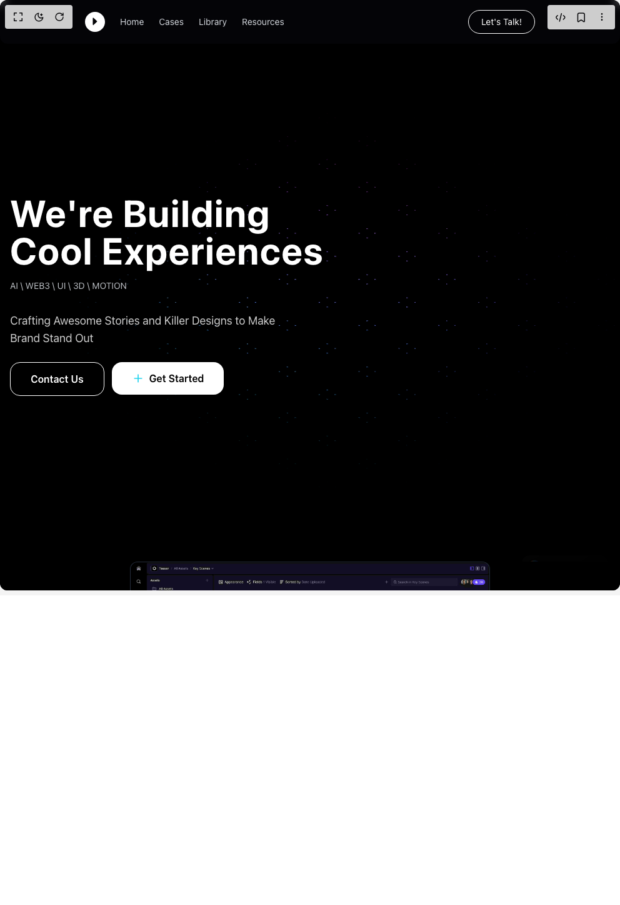

# Build 3d Hero Section Boxes in BuilderStudio

> Build this component in our Agentic IDE: [BuilderStudio](https://builderstudio.dev).
>
> Join the BuilderStudio community on [Discord](https://discord.gg/QdWeSGCqfe) and [Reddit](https://reddit.com/r/builderstudio).



## Component

- Author group: `erikx`
- Component: `3d-hero-section-boxes`
- Variant: `default`
- Rendered HTML snapshot: [`rendered.html`](rendered.html)

## BuilderStudio prompt

You are implementing a React component based on a component reference.

## Component identity

- Author: erikx
- Component slug: 3d-hero-section-boxes
- Demo slug: default
- Title: 3d-hero-section-boxes
- Description: 

## Goal

Recreate this component in a React + TypeScript + Tailwind CSS project. Preserve the visual layout, spacing, colors, border radius, shadows, interaction behavior, animation behavior, responsive behavior, and dark mode behavior shown in the rendered demo.

## Implementation requirements

- Use React and TypeScript.
- Use Tailwind CSS classes whenever possible.
- Keep the component self-contained unless the source files require helper components.
- If the source uses CSS variables, custom CSS, animations, or keyframes, include them.
- If the source uses external packages, list and use the required packages.
- Preserve accessibility attributes, button semantics, links, keyboard behavior, and ARIA attributes when visible in the source.
- Do not replace the component with a simplified placeholder.
- Return complete production-ready code.

## Dependencies

No reference metadata available.

## Rendered DOM snapshot

This is the rendered demo HTML extracted from the live preview. Use it to verify structure, class names, visible content, and layout.

```html
<div id="root"><div class="bg-background text-foreground"><div class="w-full"><div><div class="relative"><nav class="fixed top-0 left-0 right-0 z-20" style="background-color: rgba(13, 13, 24, 0.3); backdrop-filter: blur(8px); border-radius: 0px 0px 0.75rem 0.75rem;"><div class="container mx-auto px-4 py-4 md:px-6 lg:px-8 flex items-center justify-between"><div class="flex items-center space-x-6 lg:space-x-8"><div class="text-white" style="width: 32px; height: 32px;"><svg width="32" height="32" viewBox="0 0 32 32" fill="none" xmlns="http://www.w3.org/2000/svg"><path fill-rule="evenodd" clip-rule="evenodd" d="M16 32C24.8366 32 32 24.8366 32 16C32 7.16344 24.8366 0 16 0C7.16344 0 0 7.16344 0 16C0 24.8366 7.16344 32 16 32ZM12.4306 9.70695C12.742 9.33317 13.2633 9.30058 13.6052 9.62118L19.1798 14.8165C19.4894 15.1054 19.4894 15.5841 19.1798 15.873L13.6052 21.0683C13.2633 21.3889 12.742 21.3563 12.4306 19.9991V9.70695Z" fill="currentColor"></path></svg></div><div class="hidden md:flex items-center space-x-6"><a href="#" class="text-gray-300 hover:text-white text-sm transition duration-150">Home</a><a href="#" class="text-gray-300 hover:text-white text-sm transition duration-150">Cases</a><a href="#" class="text-gray-300 hover:text-white text-sm transition duration-150">Library</a><a href="#" class="text-gray-300 hover:text-white text-sm transition duration-150">Resources</a></div></div><div class="flex items-center"><a href="#" class="border border-white text-white px-5 py-2 rounded-full text-sm hover:bg-white hover:text-black transition duration-300">Let's Talk!</a></div></div></nav><div class="relative min-h-screen"><div class="absolute inset-0 z-0 pointer-events-auto"><div style="position: relative; width: 100%; height: 100vh; pointer-events: auto; overflow: hidden;"><div style="width: 100%; height: 100vh; overflow: hidden; pointer-events: auto;"><canvas width="992" height="944" style="display: block; width: 100%; height: 100%;"></canvas></div><div style="position: absolute; top: 0px; left: 0px; width: 100%; height: 100vh; background: linear-gradient(to right, rgba(0, 0, 0, 0.8), transparent 30%, transparent 70%, rgba(0, 0, 0, 0.8)), linear-gradient(transparent 50%, rgba(0, 0, 0, 0.9)); pointer-events: none;"></div></div></div><div style="position: absolute; top: 0px; left: 0px; width: 100%; height: 100vh; display: flex; justify-content: center; align-items: center; z-index: 10; pointer-events: none;"><div class="text-white px-4 max-w-screen-xl mx-auto w-full flex flex-col lg:flex-row justify-between items-start lg:items-center py-16"><div class="w-full lg:w-1/2 pr-0 lg:pr-8 mb-8 lg:mb-0"><h1 class="text-4xl sm:text-5xl md:text-6xl lg:text-7xl font-bold mb-4 leading-tight tracking-wide">We're Building<br>Cool Experiences</h1><div class="text-sm text-gray-300 opacity-90 mt-4">AI \ WEB3 \ UI \ 3D \ MOTION</div></div><div class="w-full lg:w-1/2 pl-0 lg:pl-8 flex flex-col items-start"><p class="text-base sm:text-lg opacity-80 mb-6 max-w-md">Crafting Awesome Stories and Killer Designs to Make Brand Stand Out</p><div class="flex pointer-events-auto flex-col sm:flex-row items-start space-y-3 sm:space-y-0 sm:space-x-3"><button class="border border-white text-white font-semibold py-2.5 sm:py-3.5 px-6 sm:px-8 rounded-2xl transition duration-300 w-full sm:w-auto hover:bg-white hover:text-black">Contact Us</button><button class="pointer-events-auto bg-white text-black font-semibold py-2.5 sm:py-3.5 px-6 sm:px-8 rounded-2xl transition duration-300 hover:scale-105 flex items-center justify-center w-full sm:w-auto"><svg class="w-4 h-4 sm:w-5 sm:h-5 mr-2 text-cyan-400" fill="currentColor" viewBox="0 0 24 24" xmlns="http://www.w3.org/2000/svg"><path d="M12 4C11.4477 4 11 4.44772 11 5V11H5C4.44772 11 4 11.4477 4 12C4 12.5523 4.44772 13 5 13H11V19C11 19.5523 11.4477 20 12 20C12.5523 20 13 19.5523 13 19V13H19C19.5523 13 20 12.5523 20 12C20 11.4477 19.5523 11 19 11H13V5C13 4.44772 12.5523 4 12 4Z" fill="currentColor"></path></svg>Get Started</button></div></div></div></div></div><div class="bg-black relative z-10" style="margin-top: -10vh;"><section class="relative z-10 container mx-auto px-4 md:px-6 lg:px-8 mt-11 md:mt-12"><div class="bg-gray-900 rounded-xl overflow-hidden shadow-2xl border border-gray-700/50 w-full md:w-[80%] lg:w-[70%] mx-auto"><div></div></div></section><div class="container mx-auto px-4 py-16 text-white"><h2 class="text-4xl font-bold text-center mb-8">Other Content Below</h2><p class="text-center max-w-xl mx-auto opacity-80">This is where additional sections of your landing page would go.</p></div></div></div></div></div></div></div>
```

## Reference source files

No reference source files were available.
