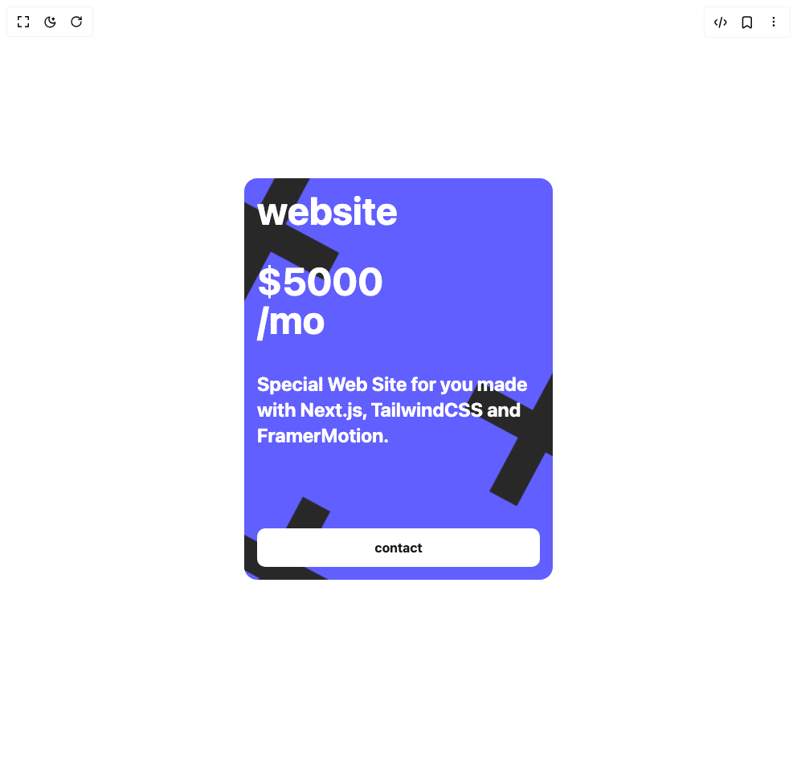

# Build Aniamted Pricing Cards in BuilderStudio

> Build this component in our Agentic IDE: [BuilderStudio](https://builderstudio.dev).
>
> Join the BuilderStudio community on [Discord](https://discord.gg/QdWeSGCqfe) and [Reddit](https://reddit.com/r/builderstudio).



## Component

- Author group: `erikx`
- Component: `aniamted-pricing-cards`
- Variant: `cros`
- Rendered HTML snapshot: [`rendered.html`](rendered.html)

## BuilderStudio prompt

You are implementing a React component based on a component reference.

## Component identity

- Author: erikx
- Component slug: aniamted-pricing-cards
- Demo slug: cros
- Title: aniamted-pricing-cards
- Description: 

## Goal

Recreate this component in a React + TypeScript + Tailwind CSS project. Preserve the visual layout, spacing, colors, border radius, shadows, interaction behavior, animation behavior, responsive behavior, and dark mode behavior shown in the rendered demo.

## Implementation requirements

- Use React and TypeScript.
- Use Tailwind CSS classes whenever possible.
- Keep the component self-contained unless the source files require helper components.
- If the source uses CSS variables, custom CSS, animations, or keyframes, include them.
- If the source uses external packages, list and use the required packages.
- Preserve accessibility attributes, button semantics, links, keyboard behavior, and ARIA attributes when visible in the source.
- Do not replace the component with a simplified placeholder.
- Return complete production-ready code.

## Dependencies

No reference metadata available.

## Rendered DOM snapshot

This is the rendered demo HTML extracted from the live preview. Use it to verify structure, class names, visible content, and layout.

```html
<div id="root"><div class="w-screen min-h-screen flex justify-center items-center"><div class="w-screen min-h-screen flex justify-center items-center"><div class=" h-[600px] w-full flex gap-12 items-center justify-center"><article class="min-h-[300px] h-[600px] max-h-[500px] max-w-sm w-full relative overflow-hidden rounded-2xl text-white bg-indigo-500"><span class="w-full h-full absolute top-0 left-0 z-[2] p-4 flex flex-col items-start justify-start sm:gap-10 gap-7"><h1 class="sm:text-5xl text-[clamp(1.7rem,10vw,3rem)] font-bold">website</h1><div class="sm:text-5xl text-[clamp(1.7rem,10vw,3rem)] font-bold" style="line-height: 1;">$5000<br>/mo</div><p class="sm:text-2xl text-[clamp(0.1rem,20vw,1.25rem)] font-bold">Special Web Site for you made with Next.js, TailwindCSS and FramerMotion.</p><div class="w-full h-full flex items-end justify-end text-base"><a href="/" class="w-full h-fit"><button class="h-12 w-full bg-white rounded-lg text-neutral-900 font-bold">contact</button></a></div></span><div class="w-fit h-fit absolute top-0 -left-10 z-0 animate-[spin_5s_linear_infinite]"><svg width="130" height="130" viewBox="0 0 130 130" fill="none" class="scale-125" xmlns="http://www.w3.org/2000/svg"><path d="M11 11L118.899 119M11.101 119L119 11" stroke="#282828" stroke-width="31"></path></svg></div><div class="w-fit h-fit absolute top-1/2 -right-12 z-0 animate-[spin_5s_linear_infinite]"><svg width="130" height="130" viewBox="0 0 130 130" fill="none" class="scale-125" xmlns="http://www.w3.org/2000/svg"><path d="M11 11L118.899 119M11.101 119L119 11" stroke="#282828" stroke-width="31"></path></svg></div><div class="w-fit h-fit absolute top-[85%] -left-5 z-0 animate-[spin_5s_linear_infinite]"><svg width="130" height="130" viewBox="0 0 130 130" fill="none" class="scale-125" xmlns="http://www.w3.org/2000/svg"><path d="M11 11L118.899 119M11.101 119L119 11" stroke="#282828" stroke-width="31"></path></svg></div></article></div></div></div></div>
```

## Reference source files

No reference source files were available.
