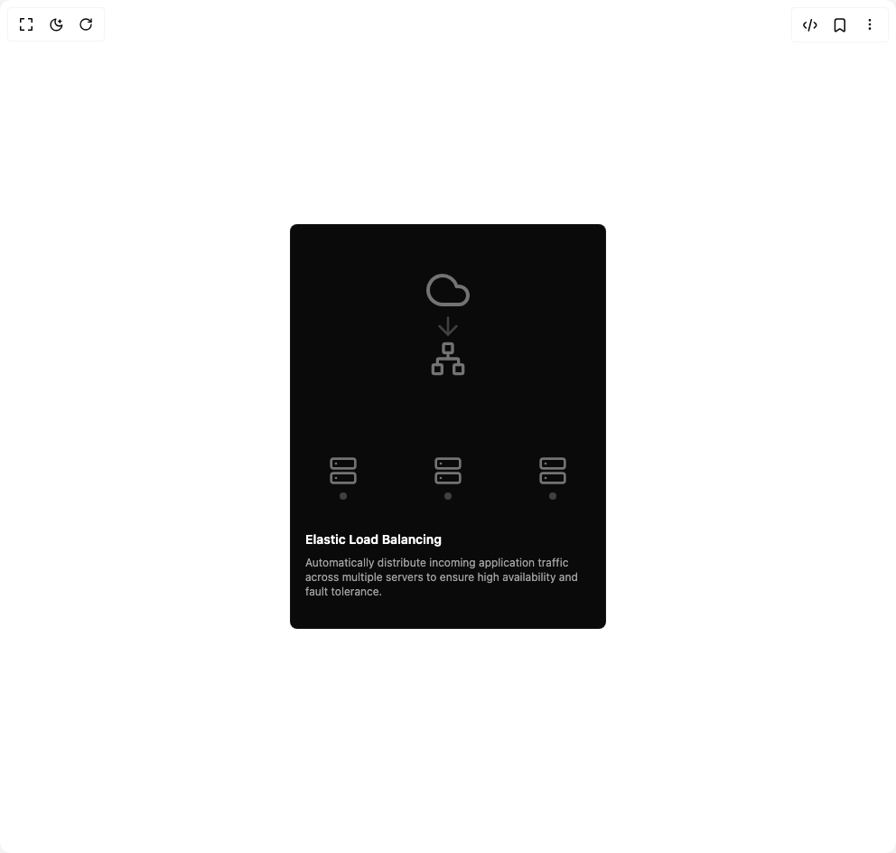

# Build Animated Card in BuilderStudio

> Build this component in our Agentic IDE: [BuilderStudio](https://builderstudio.dev).
>
> Join the BuilderStudio community on [Discord](https://discord.gg/QdWeSGCqfe) and [Reddit](https://reddit.com/r/builderstudio).



## Component

- Author group: `erikx`
- Component: `animated-card`
- Variant: `default`
- Rendered HTML snapshot: [`rendered.html`](rendered.html)

## BuilderStudio prompt

You are implementing a React component based on a component reference.

## Component identity

- Author: erikx
- Component slug: animated-card
- Demo slug: default
- Title: animated-card
- Description: 

## Goal

Recreate this component in a React + TypeScript + Tailwind CSS project. Preserve the visual layout, spacing, colors, border radius, shadows, interaction behavior, animation behavior, responsive behavior, and dark mode behavior shown in the rendered demo.

## Implementation requirements

- Use React and TypeScript.
- Use Tailwind CSS classes whenever possible.
- Keep the component self-contained unless the source files require helper components.
- If the source uses CSS variables, custom CSS, animations, or keyframes, include them.
- If the source uses external packages, list and use the required packages.
- Preserve accessibility attributes, button semantics, links, keyboard behavior, and ARIA attributes when visible in the source.
- Do not replace the component with a simplified placeholder.
- Return complete production-ready code.

## Dependencies

No reference metadata available.

## Rendered DOM snapshot

This is the rendered demo HTML extracted from the live preview. Use it to verify structure, class names, visible content, and layout.

```html
<div id="root"><div class="w-screen min-h-screen flex justify-center items-center"><div class="w-screen min-h-screen flex justify-center items-center"><div class="relative flex flex-col justify-between h-[28rem] w-full max-w-[350px] space-y-4 overflow-hidden rounded-md border border-neutral-800/50 bg-neutral-950"><div class="absolute inset-x-0 top-12 flex h-64 items-center justify-center"><div class="relative flex h-full w-full flex-col items-center"><svg stroke="currentColor" fill="none" stroke-width="2" viewBox="0 0 24 24" stroke-linecap="round" stroke-linejoin="round" class="size-12 text-neutral-500" height="1em" width="1em" xmlns="http://www.w3.org/2000/svg"><path d="M18 10h-1.26A8 8 0 1 0 9 20h9a5 5 0 0 0 0-10z"></path></svg><svg stroke="currentColor" fill="none" stroke-width="2" viewBox="0 0 24 24" stroke-linecap="round" stroke-linejoin="round" class="size-8 text-neutral-700" height="1em" width="1em" xmlns="http://www.w3.org/2000/svg"><path d="M12 5v14"></path><path d="m19 12-7 7-7-7"></path></svg><svg stroke="currentColor" fill="none" stroke-width="2" viewBox="0 0 24 24" stroke-linecap="round" stroke-linejoin="round" class="size-10 text-neutral-500" height="1em" width="1em" xmlns="http://www.w3.org/2000/svg"><rect x="16" y="16" width="6" height="6" rx="1"></rect><rect x="2" y="16" width="6" height="6" rx="1"></rect><rect x="9" y="2" width="6" height="6" rx="1"></rect><path d="M5 16v-3a1 1 0 0 1 1-1h12a1 1 0 0 1 1 1v3"></path><path d="M12 12V8"></path></svg><div class="absolute bottom-0 flex w-full justify-around"><div class="flex flex-col items-center gap-2"><svg stroke="currentColor" fill="none" stroke-width="2" viewBox="0 0 24 24" stroke-linecap="round" stroke-linejoin="round" class="size-8 text-neutral-500" height="1em" width="1em" xmlns="http://www.w3.org/2000/svg"><rect x="2" y="2" width="20" height="8" rx="2" ry="2"></rect><rect x="2" y="14" width="20" height="8" rx="2" ry="2"></rect><line x1="6" y1="6" x2="6.01" y2="6"></line><line x1="6" y1="18" x2="6.01" y2="18"></line></svg><div class="h-2 w-2 rounded-full" style="background-color: rgb(64, 64, 64);"></div></div><div class="flex flex-col items-center gap-2"><svg stroke="currentColor" fill="none" stroke-width="2" viewBox="0 0 24 24" stroke-linecap="round" stroke-linejoin="round" class="size-8 text-neutral-500" height="1em" width="1em" xmlns="http://www.w3.org/2000/svg"><rect x="2" y="2" width="20" height="8" rx="2" ry="2"></rect><rect x="2" y="14" width="20" height="8" rx="2" ry="2"></rect><line x1="6" y1="6" x2="6.01" y2="6"></line><line x1="6" y1="18" x2="6.01" y2="18"></line></svg><div class="h-2 w-2 rounded-full" style="background-color: rgb(64, 64, 64);"></div></div><div class="flex flex-col items-center gap-2"><svg stroke="currentColor" fill="none" stroke-width="2" viewBox="0 0 24 24" stroke-linecap="round" stroke-linejoin="round" class="size-8 text-neutral-500" height="1em" width="1em" xmlns="http://www.w3.org/2000/svg"><rect x="2" y="2" width="20" height="8" rx="2" ry="2"></rect><rect x="2" y="14" width="20" height="8" rx="2" ry="2"></rect><line x1="6" y1="6" x2="6.01" y2="6"></line><line x1="6" y1="18" x2="6.01" y2="18"></line></svg><div class="h-2 w-2 rounded-full" style="background-color: rgb(64, 64, 64);"></div></div></div><div><div class="absolute top-0 size-1.5 rounded-full bg-emerald-400" style="opacity: 0; transform: translateY(-20px);"></div><div class="absolute top-0 size-1.5 rounded-full bg-emerald-400" style="opacity: 0; transform: translateY(-20px);"></div><div class="absolute top-0 size-1.5 rounded-full bg-emerald-400" style="opacity: 0; transform: translateY(-20px);"></div><div class="absolute top-0 size-1.5 rounded-full bg-emerald-400" style="opacity: 0; transform: translateY(-20px);"></div><div class="absolute top-0 size-1.5 rounded-full bg-emerald-400" style="opacity: 0; transform: translateY(-20px);"></div></div></div></div><div class="absolute bottom-0 z-10 w-full px-4 pb-4"><div class="mt-3 text-sm font-semibold text-white">Elastic Load Balancing</div><div class="mt-2 text-xs text-neutral-400">Automatically distribute incoming application traffic across multiple servers to ensure high availability and fault tolerance.</div></div><div class="absolute bottom-0 left-0 h-20 w-full bg-gradient-to-t from-neutral-950 to-transparent"></div></div></div></div></div>
```

## Reference source files

No reference source files were available.
