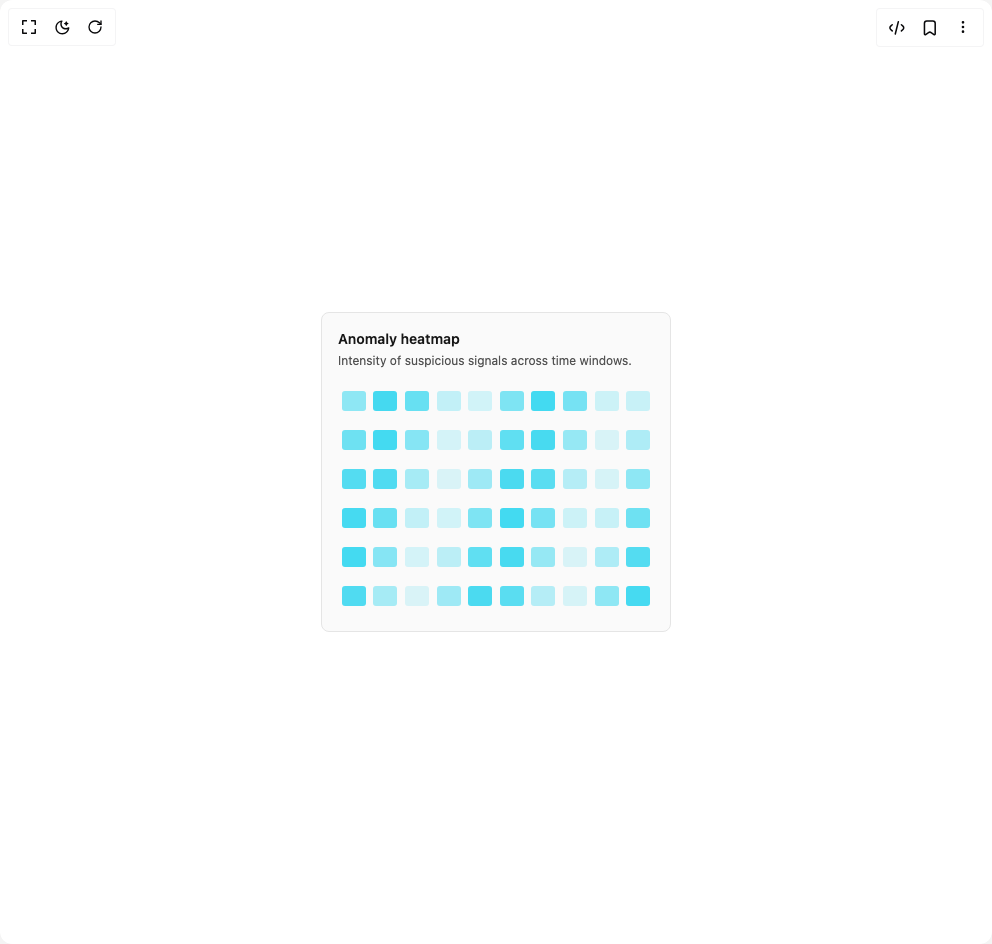

# Build Anomaly Heatmap in BuilderStudio

> Build this component in our Agentic IDE: [BuilderStudio](https://builderstudio.dev).
>
> Join the BuilderStudio community on [Discord](https://discord.gg/QdWeSGCqfe) and [Reddit](https://reddit.com/r/builderstudio).



## Component

- Author group: `erikx`
- Component: `anomaly-heatmap`
- Variant: `default`
- Rendered HTML snapshot: [`rendered.html`](rendered.html)

## BuilderStudio prompt

You are implementing a React component based on a component reference.

## Component identity

- Author: erikx
- Component slug: anomaly-heatmap
- Demo slug: default
- Title: anomaly-heatmap
- Description: 

## Goal

Recreate this component in a React + TypeScript + Tailwind CSS project. Preserve the visual layout, spacing, colors, border radius, shadows, interaction behavior, animation behavior, responsive behavior, and dark mode behavior shown in the rendered demo.

## Implementation requirements

- Use React and TypeScript.
- Use Tailwind CSS classes whenever possible.
- Keep the component self-contained unless the source files require helper components.
- If the source uses CSS variables, custom CSS, animations, or keyframes, include them.
- If the source uses external packages, list and use the required packages.
- Preserve accessibility attributes, button semantics, links, keyboard behavior, and ARIA attributes when visible in the source.
- Do not replace the component with a simplified placeholder.
- Return complete production-ready code.

## Dependencies

No reference metadata available.

## Rendered DOM snapshot

This is the rendered demo HTML extracted from the live preview. Use it to verify structure, class names, visible content, and layout.

```html
<div id="root"><div class="w-screen min-h-screen flex justify-center items-center"><div class="w-screen min-h-screen flex justify-center items-center"><div class="relative flex flex-col justify-between h-[20rem] w-[350px] max-w-[350px] rounded-md border bg-neutral-50 p-4 dark:bg-neutral-900"><div><h3 class="text-sm font-semibold text-primary">Anomaly heatmap</h3><p class="mt-1 text-xs text-neutral-600 dark:text-neutral-400">Intensity of suspicious signals across time windows.</p></div><div class="mt-3 grid flex-1 place-items-center" style="grid-template-columns: repeat(10, minmax(0px, 1fr));"><div class="m-[2px] h-5 w-6 rounded-[3px]" style="opacity: 1; transform: none; background-color: rgba(34, 211, 238, 0.5); box-shadow: none;"></div><div class="m-[2px] h-5 w-6 rounded-[3px]" style="opacity: 1; transform: none; background-color: rgba(34, 211, 238, 0.835); box-shadow: none;"></div><div class="m-[2px] h-5 w-6 rounded-[3px]" style="opacity: 1; transform: none; background-color: rgba(34, 211, 238, 0.682); box-shadow: none;"></div><div class="m-[2px] h-5 w-6 rounded-[3px]" style="opacity: 1; transform: none; background-color: rgba(34, 211, 238, 0.26); box-shadow: none;"></div><div class="m-[2px] h-5 w-6 rounded-[3px]" style="opacity: 1; transform: none; background-color: rgba(34, 211, 238, 0.192); box-shadow: none;"></div><div class="m-[2px] h-5 w-6 rounded-[3px]" style="opacity: 1; transform: none; background-color: rgba(34, 211, 238, 0.576); box-shadow: none;"></div><div class="m-[2px] h-5 w-6 rounded-[3px]" style="opacity: 1; transform: none; background-color: rgba(34, 211, 238, 0.85); box-shadow: none;"></div><div class="m-[2px] h-5 w-6 rounded-[3px]" style="opacity: 1; transform: none; background-color: rgba(34, 211, 238, 0.61); box-shadow: none;"></div><div class="m-[2px] h-5 w-6 rounded-[3px]" style="opacity: 1; transform: none; background-color: rgba(34, 211, 238, 0.21); box-shadow: none;"></div><div class="m-[2px] h-5 w-6 rounded-[3px]" style="opacity: 1; transform: none; background-color: rgba(34, 211, 238, 0.23); box-shadow: none;"></div><div class="m-[2px] h-5 w-6 rounded-[3px]" style="opacity: 1; transform: none; background-color: rgba(34, 211, 238, 0.647); box-shadow: none;"></div><div class="m-[2px] h-5 w-6 rounded-[3px]" style="opacity: 1; transform: none; background-color: rgba(34, 211, 238, 0.847); box-shadow: none;"></div><div class="m-[2px] h-5 w-6 rounded-[3px]" style="opacity: 1; transform: none; background-color: rgba(34, 211, 238, 0.537); box-shadow: none;"></div><div class="m-[2px] h-5 w-6 rounded-[3px]" style="opacity: 1; transform: none; background-color: rgba(34, 211, 238, 0.176); box-shadow: none;"></div><div class="m-[2px] h-5 w-6 rounded-[3px]" style="opacity: 1; transform: none; background-color: rgba(34, 211, 238, 0.29); box-shadow: none;"></div><div class="m-[2px] h-5 w-6 rounded-[3px]" style="opacity: 1; transform: none; background-color: rgba(34, 211, 238, 0.714); box-shadow: none;"></div><div class="m-[2px] h-5 w-6 rounded-[3px]" style="opacity: 1; transform: none; background-color: rgba(34, 211, 238, 0.824); box-shadow: none;"></div><div class="m-[2px] h-5 w-6 rounded-[3px]" style="opacity: 1; transform: none; background-color: rgba(34, 211, 238, 0.463); box-shadow: none;"></div><div class="m-[2px] h-5 w-6 rounded-[3px]" style="opacity: 1; transform: none; background-color: rgba(34, 211, 238, 0.153); box-shadow: none;"></div><div class="m-[2px] h-5 w-6 rounded-[3px]" style="opacity: 1; transform: none; background-color: rgba(34, 211, 238, 0.353); box-shadow: none;"></div><div class="m-[2px] h-5 w-6 rounded-[3px]" style="opacity: 1; transform: none; background-color: rgba(34, 211, 238, 0.77); box-shadow: none;"></div><div class="m-[2px] h-5 w-6 rounded-[3px]" style="opacity: 1; transform: none; background-color: rgba(34, 211, 238, 0.79); box-shadow: none;"></div><div class="m-[2px] h-5 w-6 rounded-[3px]" style="opacity: 1; transform: none; background-color: rgba(34, 211, 238, 0.39); box-shadow: none;"></div><div class="m-[2px] h-5 w-6 rounded-[3px]" style="opacity: 1; transform: none; background-color: rgba(34, 211, 238, 0.15); box-shadow: none;"></div><div class="m-[2px] h-5 w-6 rounded-[3px]" style="opacity: 1; transform: none; background-color: rgba(34, 211, 238, 0.424); box-shadow: none;"></div><div class="m-[2px] h-5 w-6 rounded-[3px]" style="opacity: 1; transform: none; background-color: rgba(34, 211, 238, 0.808); box-shadow: none;"></div><div class="m-[2px] h-5 w-6 rounded-[3px]" style="opacity: 1; transform: none; background-color: rgba(34, 211, 238, 0.74); box-shadow: none;"></div><div class="m-[2px] h-5 w-6 rounded-[3px]" style="opacity: 1; transform: none; background-color: rgba(34, 211, 238, 0.318); box-shadow: none;"></div><div class="m-[2px] h-5 w-6 rounded-[3px]" style="opacity: 1; transform: none; background-color: rgba(34, 211, 238, 0.165); box-shadow: none;"></div><div class="m-[2px] h-5 w-6 rounded-[3px]" style="opacity: 1; transform: none; background-color: rgba(34, 211, 238, 0.5); box-shadow: none;"></div><div class="m-[2px] h-5 w-6 rounded-[3px]" style="opacity: 1; transform: none; background-color: rgba(34, 211, 238, 0.84); box-shadow: none;"></div><div class="m-[2px] h-5 w-6 rounded-[3px]" style="opacity: 1; transform: none; background-color: rgba(34, 211, 238, 0.68); box-shadow: none;"></div><div class="m-[2px] h-5 w-6 rounded-[3px]" style="opacity: 1; transform: none; background-color: rgba(34, 211, 238, 0.26); box-shadow: none;"></div><div class="m-[2px] h-5 w-6 rounded-[3px]" style="opacity: 1; transform: none; background-color: rgba(34, 211, 238, 0.192); box-shadow: none;"></div><div class="m-[2px] h-5 w-6 rounded-[3px]" style="opacity: 1; transform: none; background-color: rgba(34, 211, 238, 0.576); box-shadow: none;"></div><div class="m-[2px] h-5 w-6 rounded-[3px]" style="opacity: 1; transform: none; background-color: rgba(34, 211, 238, 0.85); box-shadow: none;"></div><div class="m-[2px] h-5 w-6 rounded-[3px]" style="opacity: 1; transform: none; background-color: rgba(34, 211, 238, 0.61); box-shadow: none;"></div><div class="m-[2px] h-5 w-6 rounded-[3px]" style="opacity: 1; transform: none; background-color: rgba(34, 211, 238, 0.21); box-shadow: none;"></div><div class="m-[2px] h-5 w-6 rounded-[3px]" style="opacity: 1; transform: none; background-color: rgba(34, 211, 238, 0.235); box-shadow: none;"></div><div class="m-[2px] h-5 w-6 rounded-[3px]" style="opacity: 1; transform: none; background-color: rgba(34, 211, 238, 0.647); box-shadow: none;"></div><div class="m-[2px] h-5 w-6 rounded-[3px]" style="opacity: 1; transform: none; background-color: rgba(34, 211, 238, 0.847); box-shadow: none;"></div><div class="m-[2px] h-5 w-6 rounded-[3px]" style="opacity: 1; transform: none; background-color: rgba(34, 211, 238, 0.537); box-shadow: none;"></div><div class="m-[2px] h-5 w-6 rounded-[3px]" style="opacity: 1; transform: none; background-color: rgba(34, 211, 238, 0.176); box-shadow: none;"></div><div class="m-[2px] h-5 w-6 rounded-[3px]" style="opacity: 1; transform: none; background-color: rgba(34, 211, 238, 0.29); box-shadow: none;"></div><div class="m-[2px] h-5 w-6 rounded-[3px]" style="opacity: 1; transform: none; background-color: rgba(34, 211, 238, 0.714); box-shadow: none;"></div><div class="m-[2px] h-5 w-6 rounded-[3px]" style="opacity: 1; transform: none; background-color: rgba(34, 211, 238, 0.824); box-shadow: none;"></div><div class="m-[2px] h-5 w-6 rounded-[3px]" style="opacity: 1; transform: none; background-color: rgba(34, 211, 238, 0.463); box-shadow: none;"></div><div class="m-[2px] h-5 w-6 rounded-[3px]" style="opacity: 1; transform: none; background-color: rgba(34, 211, 238, 0.153); box-shadow: none;"></div><div class="m-[2px] h-5 w-6 rounded-[3px]" style="opacity: 1; transform: none; background-color: rgba(34, 211, 238, 0.353); box-shadow: none;"></div><div class="m-[2px] h-5 w-6 rounded-[3px]" style="opacity: 1; transform: none; background-color: rgba(34, 211, 238, 0.77); box-shadow: none;"></div><div class="m-[2px] h-5 w-6 rounded-[3px]" style="opacity: 1; transform: none; background-color: rgba(34, 211, 238, 0.79); box-shadow: none;"></div><div class="m-[2px] h-5 w-6 rounded-[3px]" style="opacity: 1; transform: none; background-color: rgba(34, 211, 238, 0.39); box-shadow: none;"></div><div class="m-[2px] h-5 w-6 rounded-[3px]" style="opacity: 1; transform: none; background-color: rgba(34, 211, 238, 0.15); box-shadow: none;"></div><div class="m-[2px] h-5 w-6 rounded-[3px]" style="opacity: 1; transform: none; background-color: rgba(34, 211, 238, 0.424); box-shadow: none;"></div><div class="m-[2px] h-5 w-6 rounded-[3px]" style="opacity: 1; transform: none; background-color: rgba(34, 211, 238, 0.808); box-shadow: none;"></div><div class="m-[2px] h-5 w-6 rounded-[3px]" style="opacity: 1; transform: none; background-color: rgba(34, 211, 238, 0.74); box-shadow: none;"></div><div class="m-[2px] h-5 w-6 rounded-[3px]" style="opacity: 1; transform: none; background-color: rgba(34, 211, 238, 0.318); box-shadow: none;"></div><div class="m-[2px] h-5 w-6 rounded-[3px]" style="opacity: 1; transform: none; background-color: rgba(34, 211, 238, 0.165); box-shadow: none;"></div><div class="m-[2px] h-5 w-6 rounded-[3px]" style="opacity: 1; transform: none; background-color: rgba(34, 211, 238, 0.5); box-shadow: none;"></div><div class="m-[2px] h-5 w-6 rounded-[3px]" style="opacity: 1; transform: none; background-color: rgba(34, 211, 238, 0.84); box-shadow: none;"></div></div></div></div></div></div>
```

## Reference source files

No reference source files were available.
