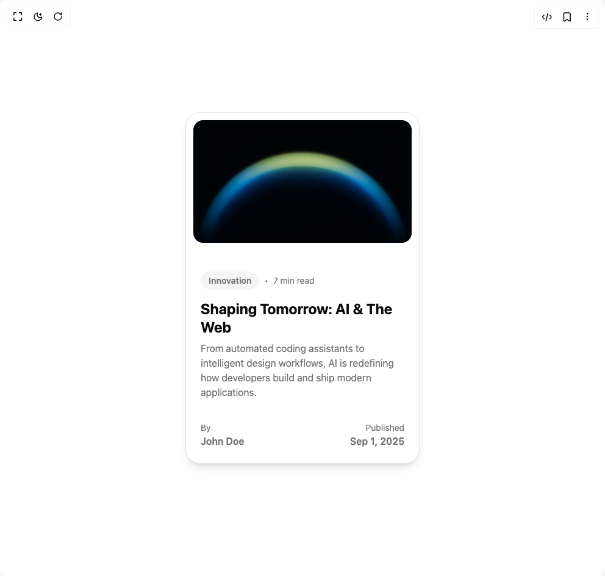

# Build Blog Post Card in BuilderStudio

> Build this component in our Agentic IDE: [BuilderStudio](https://builderstudio.dev).
>
> Join the BuilderStudio community on [Discord](https://discord.gg/QdWeSGCqfe) and [Reddit](https://reddit.com/r/builderstudio).



## Component

- Author group: `erikx`
- Component: `blog-post-card`
- Variant: `default`
- Rendered HTML snapshot: [`rendered.html`](rendered.html)

## BuilderStudio prompt

You are implementing a React component based on a component reference.

## Component identity

- Author: erikx
- Component slug: blog-post-card
- Demo slug: default
- Title: blog-post-card
- Description: 

## Goal

Recreate this component in a React + TypeScript + Tailwind CSS project. Preserve the visual layout, spacing, colors, border radius, shadows, interaction behavior, animation behavior, responsive behavior, and dark mode behavior shown in the rendered demo.

## Implementation requirements

- Use React and TypeScript.
- Use Tailwind CSS classes whenever possible.
- Keep the component self-contained unless the source files require helper components.
- If the source uses CSS variables, custom CSS, animations, or keyframes, include them.
- If the source uses external packages, list and use the required packages.
- Preserve accessibility attributes, button semantics, links, keyboard behavior, and ARIA attributes when visible in the source.
- Do not replace the component with a simplified placeholder.
- Return complete production-ready code.

## Dependencies

No reference metadata available.

## Rendered DOM snapshot

This is the rendered demo HTML extracted from the live preview. Use it to verify structure, class names, visible content, and layout.

```html
<div id="root"><div class="w-screen min-h-screen flex justify-center items-center"><div class="w-screen min-h-screen flex justify-center items-center"><div class="flex w-full justify-center p-6 bg-background"><div class="bg-card text-card-foreground flex w-full max-w-sm flex-col gap-3 overflow-hidden rounded-3xl border p-3 shadow-lg"><div class="flex flex-col space-y-1.5 p-0"><div class="relative h-56 w-full"></div></div><div class="flex-grow p-3"><div class="mb-4 flex items-center text-sm text-muted-foreground"><div class="inline-flex items-center border font-semibold transition-colors focus:outline-none focus:ring-2 focus:ring-ring focus:ring-offset-2 border-transparent hover:bg-primary/80 rounded-full bg-muted px-3 py-1 text-sm text-muted-foreground hover:text-black">Innovation</div><span class="mx-2">•</span><span>7 min read</span></div><h2 class="mb-2 text-2xl font-bold leading-tight text-card-foreground">Shaping Tomorrow: AI &amp; The Web</h2><p class="text-muted-foreground">From automated coding assistants to intelligent design workflows, AI is redefining how developers build and ship modern applications.</p></div><div class="flex items-center justify-between p-3"><div><p class="text-sm text-muted-foreground">By</p><p class="font-semibold text-muted-foreground">John Doe</p></div><div class="text-right"><p class="text-sm text-muted-foreground">Published</p><p class="font-semibold text-muted-foreground">Sep 1, 2025</p></div></div></div></div></div></div></div>
```

## Reference source files

No reference source files were available.
