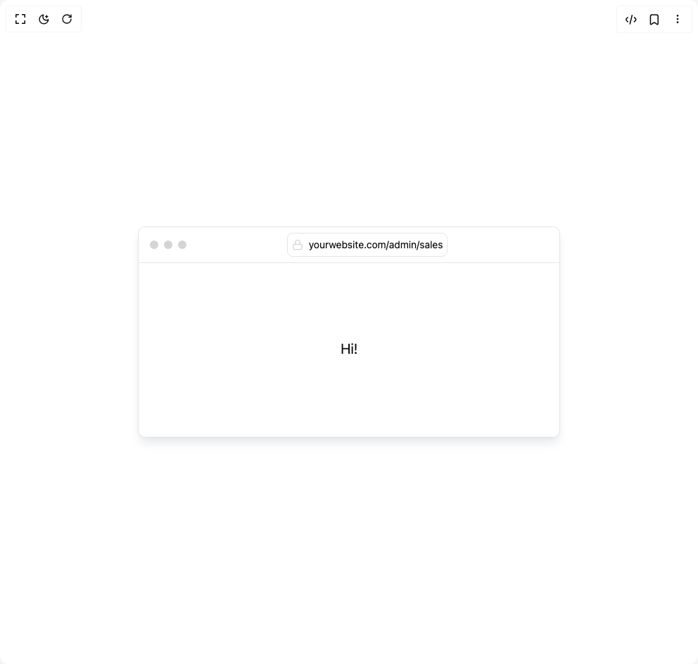

# Build Browser Preview in BuilderStudio

> Build this component in our Agentic IDE: [BuilderStudio](https://builderstudio.dev).
>
> Join the BuilderStudio community on [Discord](https://discord.gg/QdWeSGCqfe) and [Reddit](https://reddit.com/r/builderstudio).



## Component

- Author group: `erikx`
- Component: `browser-preview`
- Variant: `default`
- Rendered HTML snapshot: [`rendered.html`](rendered.html)

## BuilderStudio prompt

You are implementing a React component based on a component reference.

## Component identity

- Author: erikx
- Component slug: browser-preview
- Demo slug: default
- Title: browser-preview
- Description: 

## Goal

Recreate this component in a React + TypeScript + Tailwind CSS project. Preserve the visual layout, spacing, colors, border radius, shadows, interaction behavior, animation behavior, responsive behavior, and dark mode behavior shown in the rendered demo.

## Implementation requirements

- Use React and TypeScript.
- Use Tailwind CSS classes whenever possible.
- Keep the component self-contained unless the source files require helper components.
- If the source uses CSS variables, custom CSS, animations, or keyframes, include them.
- If the source uses external packages, list and use the required packages.
- Preserve accessibility attributes, button semantics, links, keyboard behavior, and ARIA attributes when visible in the source.
- Do not replace the component with a simplified placeholder.
- Return complete production-ready code.

## Dependencies

No reference metadata available.

## Rendered DOM snapshot

This is the rendered demo HTML extracted from the live preview. Use it to verify structure, class names, visible content, and layout.

```html
<div id="root"><div class="w-screen min-h-screen flex justify-center items-center"><div class="w-screen min-h-screen flex justify-center items-center"><div class="relative text-sm dark:text-neutral-400 text-neutral-950 border dark:border-neutral-800 rounded-lg dark:shadow-none shadow-lg shadow-gray-200 dark:dots-neutral-800 dots-gray-300 dark:bg-neutral-950 bg-white w-full max-w-[600px] h-[300px]"><div class="border-b border-inherit flex items-center justify-between w-full py-2 px-4 bg-inherit rounded-t-lg"><div class="flex gap-2"><div class="w-3 h-3 rounded-full dark:bg-neutral-800 bg-neutral-300"></div><div class="w-3 h-3 rounded-full dark:bg-neutral-800 bg-neutral-300"></div><div class="w-3 h-3 rounded-full dark:bg-neutral-800 bg-neutral-300"></div></div><div class="border border-inherit rounded-md flex gap-2 px-1.5 py-1 font-sans w-fit min-w-1/3"><svg xmlns="http://www.w3.org/2000/svg" width="24" height="24" viewBox="0 0 24 24" fill="none" stroke-width="2" class="dark:stroke-neutral-700 stroke-neutral-300 w-4 max-w-5" stroke-linecap="round" stroke-linejoin="round"><rect width="18" height="11" x="3" y="11" rx="2" ry="2"></rect><path d="M7 11V7a5 5 0 0 1 10 0v4"></path></svg><span class="text-sm flex items-center justify-center">yourwebsite.com/admin/sales</span></div><div></div></div><div class="w-full h-full absolute top-0 left-0 pt-12"><section class="w-full h-full flex items-center justify-center"><h1 class="md:text-xl text-base">Hi!</h1></section></div></div></div></div></div>
```

## Reference source files

No reference source files were available.
