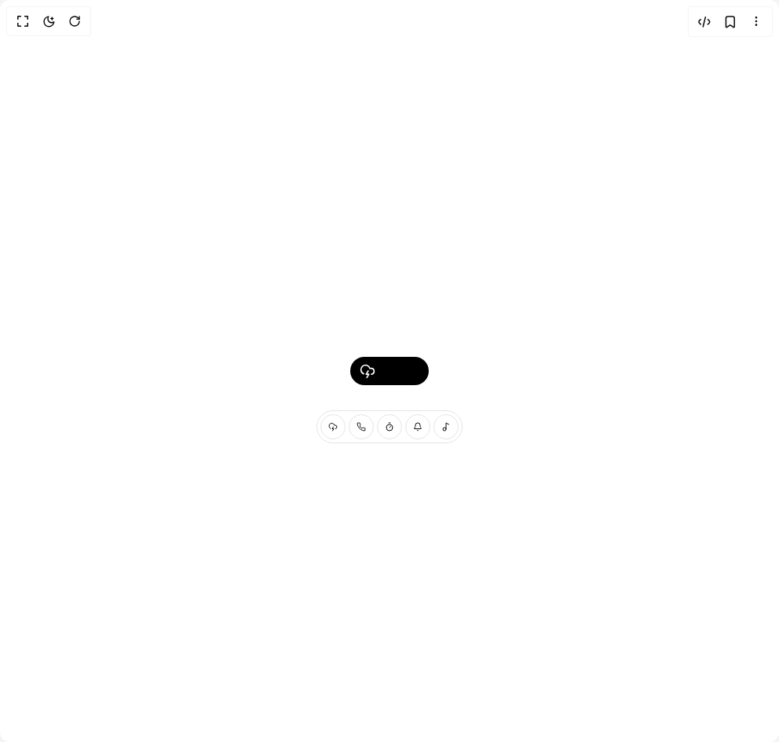

# Build Dynamic Island in BuilderStudio

> Build this component in our Agentic IDE: [BuilderStudio](https://builderstudio.dev).
>
> Join the BuilderStudio community on [Discord](https://discord.gg/QdWeSGCqfe) and [Reddit](https://reddit.com/r/builderstudio).



## Component

- Author group: `erikx`
- Component: `dynamic-island`
- Variant: `default`
- Rendered HTML snapshot: [`rendered.html`](rendered.html)

## BuilderStudio prompt

You are implementing a React component based on a component reference.

## Component identity

- Author: erikx
- Component slug: dynamic-island
- Demo slug: default
- Title: dynamic-island
- Description: 

## Goal

Recreate this component in a React + TypeScript + Tailwind CSS project. Preserve the visual layout, spacing, colors, border radius, shadows, interaction behavior, animation behavior, responsive behavior, and dark mode behavior shown in the rendered demo.

## Implementation requirements

- Use React and TypeScript.
- Use Tailwind CSS classes whenever possible.
- Keep the component self-contained unless the source files require helper components.
- If the source uses CSS variables, custom CSS, animations, or keyframes, include them.
- If the source uses external packages, list and use the required packages.
- Preserve accessibility attributes, button semantics, links, keyboard behavior, and ARIA attributes when visible in the source.
- Do not replace the component with a simplified placeholder.
- Return complete production-ready code.

## Dependencies

No reference metadata available.

## Rendered DOM snapshot

This is the rendered demo HTML extracted from the live preview. Use it to verify structure, class names, visible content, and layout.

```html
<div id="root"><div class="w-screen min-h-screen flex justify-center items-center"><div class="w-screen min-h-screen flex justify-center items-center"><div class="h-[200px] "><div class="relative flex h-full w-full flex-col justify-center"><div class="mx-auto w-fit min-w-[100px] overflow-hidden rounded-full bg-black" style="border-radius: 32px;"><div style="opacity: 1; filter: blur(0px); transform: none; transform-origin: 50% 50% 0px;"><div class="flex items-center gap-2 px-3 py-2"><div class="text-foreground" style="opacity: 1; transform: none;"><svg xmlns="http://www.w3.org/2000/svg" width="24" height="24" viewBox="0 0 24 24" fill="none" stroke="currentColor" stroke-width="2" stroke-linecap="round" stroke-linejoin="round" class="lucide lucide-cloud-lightning h-5 w-5 text-white" aria-hidden="true"><path d="M6 16.326A7 7 0 1 1 15.71 8h1.79a4.5 4.5 0 0 1 .5 8.973"></path><path d="m13 12-3 5h4l-3 5"></path></svg></div></div></div></div><div class="bg-background absolute bottom-2 left-1/2 z-10 flex -translate-x-1/2 justify-center gap-1 rounded-full border p-1"><button type="button" class="flex size-8 cursor-pointer items-center justify-center rounded-full border px-2" aria-label="idle"><svg xmlns="http://www.w3.org/2000/svg" width="24" height="24" viewBox="0 0 24 24" fill="none" stroke="currentColor" stroke-width="2" stroke-linecap="round" stroke-linejoin="round" class="lucide lucide-cloud-lightning size-3" aria-hidden="true"><path d="M6 16.326A7 7 0 1 1 15.71 8h1.79a4.5 4.5 0 0 1 .5 8.973"></path><path d="m13 12-3 5h4l-3 5"></path></svg></button><button type="button" class="flex size-8 cursor-pointer items-center justify-center rounded-full border px-2" aria-label="ring"><svg xmlns="http://www.w3.org/2000/svg" width="24" height="24" viewBox="0 0 24 24" fill="none" stroke="currentColor" stroke-width="2" stroke-linecap="round" stroke-linejoin="round" class="lucide lucide-phone size-3" aria-hidden="true"><path d="M22 16.92v3a2 2 0 0 1-2.18 2 19.79 19.79 0 0 1-8.63-3.07 19.5 19.5 0 0 1-6-6 19.79 19.79 0 0 1-3.07-8.67A2 2 0 0 1 4.11 2h3a2 2 0 0 1 2 1.72 12.84 12.84 0 0 0 .7 2.81 2 2 0 0 1-.45 2.11L8.09 9.91a16 16 0 0 0 6 6l1.27-1.27a2 2 0 0 1 2.11-.45 12.84 12.84 0 0 0 2.81.7A2 2 0 0 1 22 16.92z"></path></svg></button><button type="button" class="flex size-8 cursor-pointer items-center justify-center rounded-full border px-2" aria-label="timer"><svg xmlns="http://www.w3.org/2000/svg" width="24" height="24" viewBox="0 0 24 24" fill="none" stroke="currentColor" stroke-width="2" stroke-linecap="round" stroke-linejoin="round" class="lucide lucide-timer size-3" aria-hidden="true"><line x1="10" x2="14" y1="2" y2="2"></line><line x1="12" x2="15" y1="14" y2="11"></line><circle cx="12" cy="14" r="8"></circle></svg></button><button type="button" class="flex size-8 cursor-pointer items-center justify-center rounded-full border px-2" aria-label="notification"><svg xmlns="http://www.w3.org/2000/svg" width="24" height="24" viewBox="0 0 24 24" fill="none" stroke="currentColor" stroke-width="2" stroke-linecap="round" stroke-linejoin="round" class="lucide lucide-bell size-3" aria-hidden="true"><path d="M10.268 21a2 2 0 0 0 3.464 0"></path><path d="M3.262 15.326A1 1 0 0 0 4 17h16a1 1 0 0 0 .74-1.673C19.41 13.956 18 12.499 18 8A6 6 0 0 0 6 8c0 4.499-1.411 5.956-2.738 7.326"></path></svg></button><button type="button" class="flex size-8 cursor-pointer items-center justify-center rounded-full border px-2" aria-label="music"><svg xmlns="http://www.w3.org/2000/svg" width="24" height="24" viewBox="0 0 24 24" fill="none" stroke="currentColor" stroke-width="2" stroke-linecap="round" stroke-linejoin="round" class="lucide lucide-music2 lucide-music-2 size-3" aria-hidden="true"><circle cx="8" cy="18" r="4"></circle><path d="M12 18V2l7 4"></path></svg></button></div></div></div></div></div></div>
```

## Reference source files

No reference source files were available.
