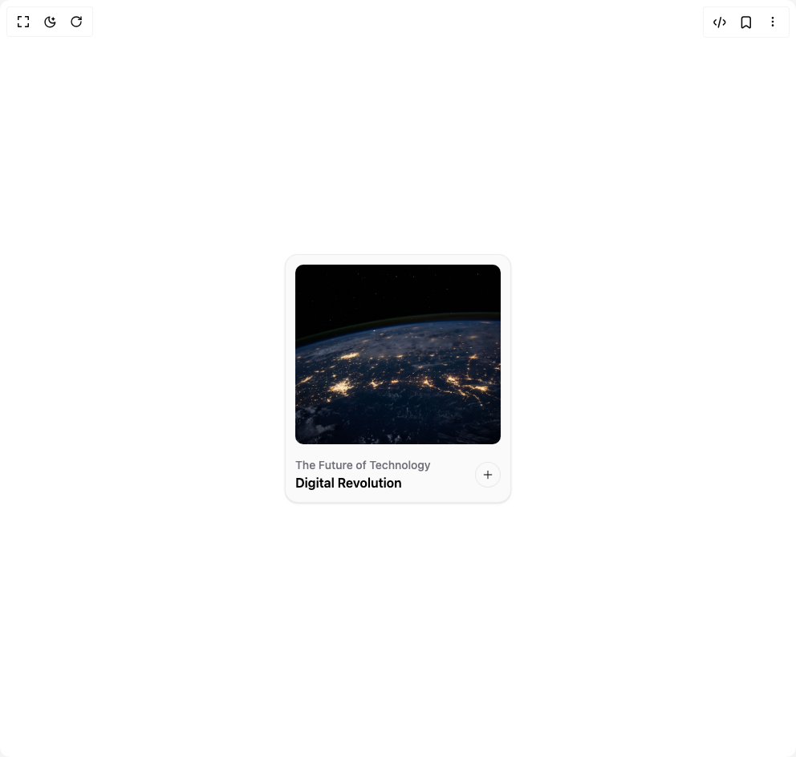

# Build Expandable Card in BuilderStudio

> Build this component in our Agentic IDE: [BuilderStudio](https://builderstudio.dev).
>
> Join the BuilderStudio community on [Discord](https://discord.gg/QdWeSGCqfe) and [Reddit](https://reddit.com/r/builderstudio).



## Component

- Author group: `erikx`
- Component: `expandable-card`
- Variant: `default`
- Rendered HTML snapshot: [`rendered.html`](rendered.html)

## BuilderStudio prompt

You are implementing a React component based on a component reference.

## Component identity

- Author: erikx
- Component slug: expandable-card
- Demo slug: default
- Title: expandable-card
- Description: 

## Goal

Recreate this component in a React + TypeScript + Tailwind CSS project. Preserve the visual layout, spacing, colors, border radius, shadows, interaction behavior, animation behavior, responsive behavior, and dark mode behavior shown in the rendered demo.

## Implementation requirements

- Use React and TypeScript.
- Use Tailwind CSS classes whenever possible.
- Keep the component self-contained unless the source files require helper components.
- If the source uses CSS variables, custom CSS, animations, or keyframes, include them.
- If the source uses external packages, list and use the required packages.
- Preserve accessibility attributes, button semantics, links, keyboard behavior, and ARIA attributes when visible in the source.
- Do not replace the component with a simplified placeholder.
- Return complete production-ready code.

## Dependencies

No reference metadata available.

## Rendered DOM snapshot

This is the rendered demo HTML extracted from the live preview. Use it to verify structure, class names, visible content, and layout.

```html
<div id="root"><div class="w-screen min-h-screen flex justify-center items-center"><div class="w-screen min-h-screen flex justify-center items-center"><div role="dialog" aria-labelledby="card-title-«r0»" aria-modal="true" class="p-3 flex flex-col justify-between items-center bg-zinc-50 shadow-sm dark:shadow-none dark:bg-zinc-950 rounded-2xl cursor-pointer border border-gray-200/70 dark:border-zinc-900" style="opacity: 1;"><div class="flex gap-4 flex-col"><div style="opacity: 1;"></div><div class="flex justify-between items-center"><div class="flex flex-col"><p class="text-zinc-500 dark:text-zinc-400 md:text-left text-sm font-medium" style="opacity: 1;">The Future of Technology</p><h3 class="text-black dark:text-white md:text-left font-semibold" style="opacity: 1;">Digital Revolution</h3></div><button aria-label="Open card" class="h-8 w-8 shrink-0 flex items-center justify-center rounded-full bg-zinc-50 dark:bg-zinc-950 hover:bg-neutral-50 dark:hover:bg-neutral-950 dark:text-white/70 text-black/70 border border-gray-200/90 dark:border-zinc-900 hover:border-gray-300/90 hover:text-black dark:hover:text-white dark:hover:border-zinc-800 transition-colors duration-300 focus:outline-none" style="opacity: 1;"><div style="transform: none;"><svg xmlns="http://www.w3.org/2000/svg" width="16" height="16" viewBox="0 0 24 24" fill="none" stroke="currentColor" stroke-width="2" stroke-linecap="round" stroke-linejoin="round"><path d="M5 12h14"></path><path d="M12 5v14"></path></svg></div></button></div></div></div></div></div></div>
```

## Reference source files

No reference source files were available.
