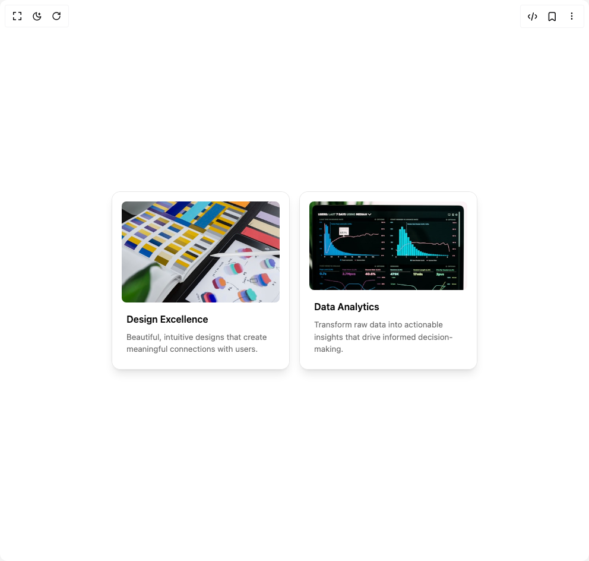

# Build Flipping Card in BuilderStudio

> Build this component in our Agentic IDE: [BuilderStudio](https://builderstudio.dev).
>
> Join the BuilderStudio community on [Discord](https://discord.gg/QdWeSGCqfe) and [Reddit](https://reddit.com/r/builderstudio).



## Component

- Author group: `erikx`
- Component: `flipping-card`
- Variant: `default`
- Rendered HTML snapshot: [`rendered.html`](rendered.html)

## BuilderStudio prompt

You are implementing a React component based on a component reference.

## Component identity

- Author: erikx
- Component slug: flipping-card
- Demo slug: default
- Title: flipping-card
- Description: 

## Goal

Recreate this component in a React + TypeScript + Tailwind CSS project. Preserve the visual layout, spacing, colors, border radius, shadows, interaction behavior, animation behavior, responsive behavior, and dark mode behavior shown in the rendered demo.

## Implementation requirements

- Use React and TypeScript.
- Use Tailwind CSS classes whenever possible.
- Keep the component self-contained unless the source files require helper components.
- If the source uses CSS variables, custom CSS, animations, or keyframes, include them.
- If the source uses external packages, list and use the required packages.
- Preserve accessibility attributes, button semantics, links, keyboard behavior, and ARIA attributes when visible in the source.
- Do not replace the component with a simplified placeholder.
- Return complete production-ready code.

## Dependencies

No reference metadata available.

## Rendered DOM snapshot

This is the rendered demo HTML extracted from the live preview. Use it to verify structure, class names, visible content, and layout.

```html
<div id="root"><div class="w-screen min-h-screen flex justify-center items-center"><div class="w-screen min-h-screen flex justify-center items-center"><div class="flex gap-4 flex-wrap justify-center p-8"><div class="group/flipping-card [perspective:1000px]" style="--height: 300px; --width: 300px;"><div class="relative rounded-xl border border-neutral-200 bg-white shadow-lg transition-all duration-700 [transform-style:preserve-3d] group-hover/flipping-card:[transform:rotateY(180deg)] dark:border-neutral-800 dark:bg-neutral-950 h-[var(--height)] w-[var(--width)]"><div class="absolute inset-0 h-full w-full rounded-[inherit] bg-white text-neutral-950 [transform-style:preserve-3d] [backface-visibility:hidden] [transform:rotateY(0deg)] dark:bg-zinc-950 dark:text-neutral-50"><div class="[transform:translateZ(70px)_scale(.93)] h-full w-full"><div class="flex flex-col h-full w-full p-4"><div class="p-2"><h3 class="text-base font-semibold mt-2">Design Excellence</h3><p class="text-[13.5px] mt-2 text-muted-foreground">Beautiful, intuitive designs that create meaningful connections with users.</p></div></div></div></div><div class="absolute inset-0 h-full w-full rounded-[inherit] bg-white text-neutral-950 [transform-style:preserve-3d] [backface-visibility:hidden] [transform:rotateY(180deg)] dark:bg-zinc-950 dark:text-neutral-50"><div class="[transform:translateZ(70px)_scale(.93)] h-full w-full"><div class="flex flex-col items-center justify-center h-full w-full p-6"><p class="text-[13.5px] mt-2 text-muted-foreground text-center">We craft exceptional user experiences through thoughtful design, user research, and modern design systems that ensure consistency and accessibility.</p><button class="mt-6 bg-foreground text-background px-4 py-2 rounded-md text-[13.5px] w-min whitespace-nowrap h-8 flex items-center justify-center">View Portfolio</button></div></div></div></div></div><div class="group/flipping-card [perspective:1000px]" style="--height: 300px; --width: 300px;"><div class="relative rounded-xl border border-neutral-200 bg-white shadow-lg transition-all duration-700 [transform-style:preserve-3d] group-hover/flipping-card:[transform:rotateY(180deg)] dark:border-neutral-800 dark:bg-neutral-950 h-[var(--height)] w-[var(--width)]"><div class="absolute inset-0 h-full w-full rounded-[inherit] bg-white text-neutral-950 [transform-style:preserve-3d] [backface-visibility:hidden] [transform:rotateY(0deg)] dark:bg-zinc-950 dark:text-neutral-50"><div class="[transform:translateZ(70px)_scale(.93)] h-full w-full"><div class="flex flex-col h-full w-full p-4"><div class="p-2"><h3 class="text-base font-semibold mt-2">Data Analytics</h3><p class="text-[13.5px] mt-2 text-muted-foreground">Transform raw data into actionable insights that drive informed decision-making.</p></div></div></div></div><div class="absolute inset-0 h-full w-full rounded-[inherit] bg-white text-neutral-950 [transform-style:preserve-3d] [backface-visibility:hidden] [transform:rotateY(180deg)] dark:bg-zinc-950 dark:text-neutral-50"><div class="[transform:translateZ(70px)_scale(.93)] h-full w-full"><div class="flex flex-col items-center justify-center h-full w-full p-6"><p class="text-[13.5px] mt-2 text-muted-foreground text-center">Our data analytics platform provides real-time insights, predictive modeling, and interactive dashboards to help businesses make data-driven decisions.</p><button class="mt-6 bg-foreground text-background px-4 py-2 rounded-md text-[13.5px] w-min whitespace-nowrap h-8 flex items-center justify-center">Learn More</button></div></div></div></div></div></div></div></div></div>
```

## Reference source files

No reference source files were available.
