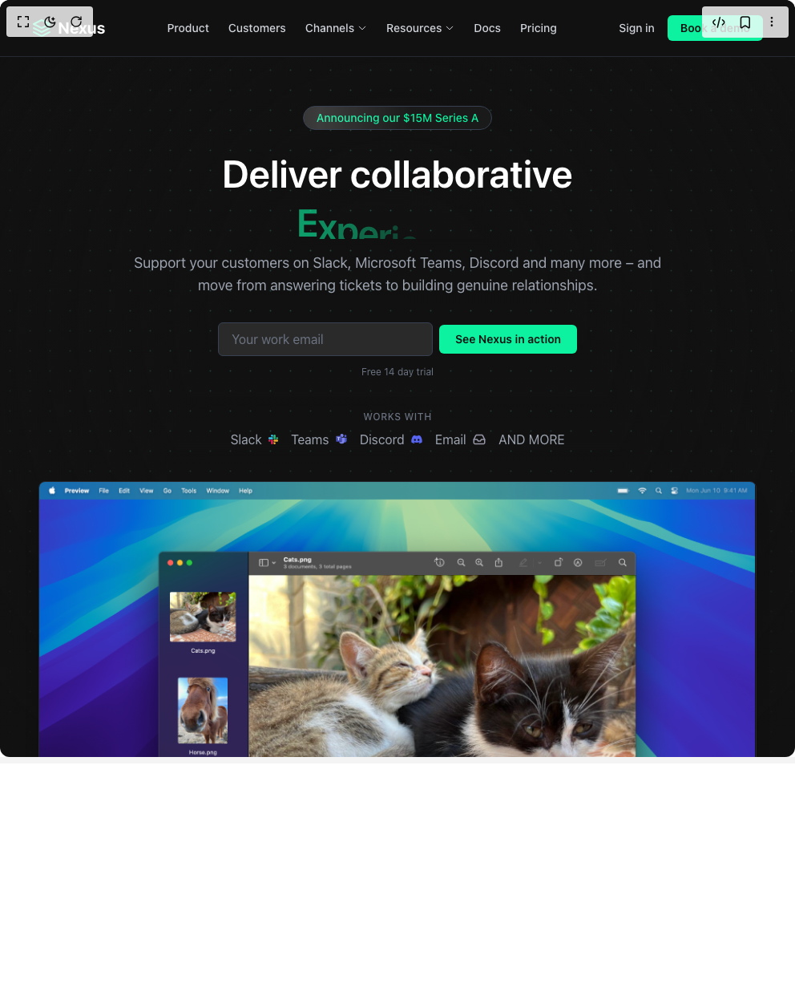

# Build Hero Section Nexus in BuilderStudio

> Build this component in our Agentic IDE: [BuilderStudio](https://builderstudio.dev).
>
> Join the BuilderStudio community on [Discord](https://discord.gg/QdWeSGCqfe) and [Reddit](https://reddit.com/r/builderstudio).



## Component

- Author group: `erikx`
- Component: `hero-section-nexus`
- Variant: `demo-home-page`
- Rendered HTML snapshot: [`rendered.html`](rendered.html)

## BuilderStudio prompt

You are implementing a React component based on a component reference.

## Component identity

- Author: erikx
- Component slug: hero-section-nexus
- Demo slug: demo-home-page
- Title: hero-section-nexus
- Description: 

## Goal

Recreate this component in a React + TypeScript + Tailwind CSS project. Preserve the visual layout, spacing, colors, border radius, shadows, interaction behavior, animation behavior, responsive behavior, and dark mode behavior shown in the rendered demo.

## Implementation requirements

- Use React and TypeScript.
- Use Tailwind CSS classes whenever possible.
- Keep the component self-contained unless the source files require helper components.
- If the source uses CSS variables, custom CSS, animations, or keyframes, include them.
- If the source uses external packages, list and use the required packages.
- Preserve accessibility attributes, button semantics, links, keyboard behavior, and ARIA attributes when visible in the source.
- Do not replace the component with a simplified placeholder.
- Return complete production-ready code.

## Dependencies

No reference metadata available.

## Rendered DOM snapshot

This is the rendered demo HTML extracted from the live preview. Use it to verify structure, class names, visible content, and layout.

```html
<div id="root"><div class="bg-background text-foreground"><div class="w-full"><div><div class="pt-[100px] relative bg-[#111111] text-gray-300 min-h-screen flex flex-col overflow-x-hidden"><canvas class="absolute inset-0 z-0 pointer-events-none opacity-80" width="992" height="1224"></canvas><div class="absolute inset-0 z-1 pointer-events-none" style="background: linear-gradient(transparent 0%, rgb(17, 17, 17) 90%), radial-gradient(transparent 40%, rgb(17, 17, 17) 95%);"></div><header class="px-6 w-full md:px-10 lg:px-16 sticky top-0 z-30 backdrop-blur-md border-b" style="background-color: rgba(17, 17, 17, 0.8); border-bottom-color: rgba(55, 65, 81, 0.5); position: fixed; box-shadow: none;"><nav class="flex justify-between items-center max-w-screen-xl mx-auto h-[70px]"><div class="flex items-center flex-shrink-0"><svg width="24" height="24" viewBox="0 0 24 24" fill="none" xmlns="http://www.w3.org/2000/svg"><path d="M12 2L2 7L12 12L22 7L12 2Z" stroke="#0CF2A0" stroke-width="2" stroke-linecap="round" stroke-linejoin="round"></path><path d="M2 17L12 22L22 17" stroke="#0CF2A0" stroke-width="2" stroke-linecap="round" stroke-linejoin="round"></path><path d="M2 12L12 17L22 12" stroke="#0CF2A0" stroke-width="2" stroke-linecap="round" stroke-linejoin="round"></path></svg><span class="text-xl font-bold text-white ml-2">Nexus</span></div><div class="hidden md:flex items-center justify-center flex-grow space-x-6 lg:space-x-8 px-4"><a href="#" class="relative group text-sm font-medium text-gray-300 hover:text-white transition-colors duration-200 flex items-center py-1">Product<div class="absolute bottom-[-2px] left-0 right-0 h-[1px] bg-[#0CF2A0]" style="transform: scaleX(0); transform-origin: 50% 50% 0px;"></div></a><a href="#" class="relative group text-sm font-medium text-gray-300 hover:text-white transition-colors duration-200 flex items-center py-1">Customers<div class="absolute bottom-[-2px] left-0 right-0 h-[1px] bg-[#0CF2A0]" style="transform: scaleX(0); transform-origin: 50% 50% 0px;"></div></a><div class="relative"><a href="#" class="relative group text-sm font-medium text-gray-300 hover:text-white transition-colors duration-200 flex items-center py-1">Channels<svg xmlns="http://www.w3.org/2000/svg" fill="none" viewBox="0 0 24 24" stroke-width="2" stroke="currentColor" class="w-3 h-3 ml-1 inline-block transition-transform duration-200 group-hover:rotate-180"><path stroke-linecap="round" stroke-linejoin="round" d="m19.5 8.25-7.5 7.5-7.5-7.5"></path></svg></a></div><div class="relative"><a href="#" class="relative group text-sm font-medium text-gray-300 hover:text-white transition-colors duration-200 flex items-center py-1">Resources<svg xmlns="http://www.w3.org/2000/svg" fill="none" viewBox="0 0 24 24" stroke-width="2" stroke="currentColor" class="w-3 h-3 ml-1 inline-block transition-transform duration-200 group-hover:rotate-180"><path stroke-linecap="round" stroke-linejoin="round" d="m19.5 8.25-7.5 7.5-7.5-7.5"></path></svg></a></div><a href="#" class="relative group text-sm font-medium text-gray-300 hover:text-white transition-colors duration-200 flex items-center py-1">Docs<div class="absolute bottom-[-2px] left-0 right-0 h-[1px] bg-[#0CF2A0]" style="transform: scaleX(0); transform-origin: 50% 50% 0px;"></div></a><a href="#" class="relative group text-sm font-medium text-gray-300 hover:text-white transition-colors duration-200 flex items-center py-1">Pricing<div class="absolute bottom-[-2px] left-0 right-0 h-[1px] bg-[#0CF2A0]" style="transform: scaleX(0); transform-origin: 50% 50% 0px;"></div></a></div><div class="flex items-center flex-shrink-0 space-x-4 lg:space-x-6"><a href="#" class="relative group text-sm font-medium text-gray-300 hover:text-white transition-colors duration-200 flex items-center py-1 hidden md:inline-block">Sign in<div class="absolute bottom-[-2px] left-0 right-0 h-[1px] bg-[#0CF2A0]" style="transform: scaleX(0); transform-origin: 50% 50% 0px;"></div></a><a href="#" class="bg-[#0CF2A0] text-[#111111] px-4 py-[6px] rounded-md text-sm font-semibold hover:bg-opacity-90 transition-colors duration-200 whitespace-nowrap shadow-sm hover:shadow-md" tabindex="0">Book a demo</a><button class="md:hidden text-gray-300 hover:text-white z-50" aria-label="Toggle menu" tabindex="0"><svg xmlns="http://www.w3.org/2000/svg" fill="none" viewBox="0 0 24 24" stroke-width="1.5" stroke="currentColor" class="w-6 h-6"><path stroke-linecap="round" stroke-linejoin="round" d="M3.75 6.75h16.5M3.75 12h16.5m-16.5 5.25h16.5"></path></svg></button></div></nav></header><main class="flex-grow flex flex-col items-center justify-center text-center px-4 pt-8 pb-16 relative z-10"><div class="mb-6" style="opacity: 1; transform: none;"><span class="relative overflow-hidden inline-block bg-[#1a1a1a] border border-gray-700 text-[#0CF2A0] px-4 py-1 rounded-full text-xs sm:text-sm font-medium cursor-pointer hover:border-[#0CF2A0]/50 transition-colors">Announcing our $15M Series A<span style="position: absolute; inset: 0px; background: linear-gradient(90deg, transparent, rgba(255, 255, 255, 0.3), transparent); animation: 2s linear 0s infinite normal none running shine; opacity: 0.5; pointer-events: none;"></span><style>
            @keyframes shine {
                0% { transform: translateX(-100%); }
                100% { transform: translateX(100%); }
            }
        </style></span></div><h1 class="text-4xl sm:text-5xl lg:text-[64px] font-semibold text-white leading-tight max-w-4xl mb-4" style="opacity: 1;">Deliver collaborative<br> <span class="inline-block h-[1.2em] sm:h-[1.2em] lg:h-[1.2em] overflow-hidden align-bottom"><span class="inline-flex flex-wrap whitespace-pre-wrap relative align-bottom pb-[10px] text-[#0CF2A0] mx-1"><span class="sr-only">Relationships</span><div class="inline-flex flex-wrap relative flex-row items-baseline" aria-hidden="true"><span class="inline-flex" style="white-space: pre;"><span class="inline-block leading-none tracking-tight" style="opacity: 1; transform: none;">E</span><span class="inline-block leading-none tracking-tight" style="opacity: 1; transform: none;">x</span><span class="inline-block leading-none tracking-tight" style="opacity: 1; transform: none;">p</span><span class="inline-block leading-none tracking-tight" style="opacity: 1; transform: translateY(0.33349%);">e</span><span class="inline-block leading-none tracking-tight" style="opacity: 1; transform: translateY(2.82012%);">r</span><span class="inline-block leading-none tracking-tight" style="opacity: 1; transform: translateY(7.34421%);">i</span><span class="inline-block leading-none tracking-tight" style="opacity: 1; transform: translateY(13.4668%);">e</span><span class="inline-block leading-none tracking-tight" style="opacity: 1; transform: translateY(20.7849%);">n</span><span class="inline-block leading-none tracking-tight" style="opacity: 1; transform: translateY(28.9344%);">c</span><span class="inline-block leading-none tracking-tight" style="opacity: 1; transform: translateY(37.5922%);">e</span><span class="inline-block leading-none tracking-tight" style="opacity: 1; transform: translateY(46.477%);">s</span></span></div></span></span></h1><p class="text-base sm:text-lg lg:text-xl text-gray-400 max-w-2xl mx-auto mb-8" style="opacity: 1; transform: none;">Support your customers on Slack, Microsoft Teams, Discord and many more – and move from answering tickets to building genuine relationships.</p><form class="flex flex-col sm:flex-row items-center justify-center gap-2 w-full max-w-md mx-auto mb-3" style="opacity: 1; transform: none;"><input placeholder="Your work email" required="" aria-label="Work Email" class="flex-grow w-full sm:w-auto px-4 py-2 rounded-md bg-[#2a2a2a] border border-gray-700 text-white placeholder-gray-500 focus:outline-none focus:ring-2 focus:ring-[#0CF2A0] focus:border-transparent transition-all" type="email"><button type="submit" class="w-full sm:w-auto bg-[#0CF2A0] text-[#111111] px-5 py-2 rounded-md text-sm font-semibold hover:bg-opacity-90 transition-colors duration-200 whitespace-nowrap shadow-sm hover:shadow-md flex-shrink-0" tabindex="0">See Nexus in action</button></form><p class="text-xs text-gray-500 mb-10" style="opacity: 1;">Free 14 day trial</p><div class="flex flex-col items-center justify-center space-y-2 mb-10" style="opacity: 1;"><span class="text-xs uppercase text-gray-500 tracking-wider font-medium">Works with</span><div class="flex flex-wrap items-center justify-center gap-x-4 gap-y-1 text-gray-400"><span class="flex items-center whitespace-nowrap">Slack&nbsp;&nbsp;<svg width="12" height="12" viewBox="0 0 12 12" fill="none"><path d="M2.52118 7.58241C2.52118 8.27634 1.9544 8.8432 1.26059 8.8432C0.566777 8.8432 0 8.27634 0 7.58241C0 6.88849 0.566777 6.32162 1.26059 6.32162H2.52118V7.58241Z" fill="#E21E5B"></path><path d="M3.15625 7.5825C3.15625 6.88858 3.72303 6.32172 4.41684 6.32172C5.11065 6.32172 5.67743 6.88858 5.67743 7.5825V10.7394C5.67743 11.4333 5.11065 12.0002 4.41684 12.0002C3.72303 12.0002 3.15625 11.4333 3.15625 10.7394V7.5825Z" fill="#E21E5B"></path><path d="M4.41684 2.52164C3.72303 2.52164 3.15625 1.95477 3.15625 1.26085C3.15625 0.566928 3.72303 6.10352e-05 4.41684 6.10352e-05C5.11065 6.10352e-05 5.67743 0.566928 5.67743 1.26085V2.52164H4.41684Z" fill="#36C6F0"></path><path d="M4.41695 3.15518C5.11076 3.15518 5.67754 3.72205 5.67754 4.41597C5.67754 5.10989 5.11076 5.67676 4.41695 5.67676H1.26059C0.566777 5.67676 0 5.10989 0 4.41597C0 3.72205 0.566777 3.15518 1.26059 3.15518H4.41695Z" fill="#36C6F0"></path><path d="M9.48047 4.41719C9.48047 3.72327 10.0472 3.1564 10.7411 3.1564C11.4349 3.1564 12.0016 3.72327 12.0016 4.41719C12.0016 5.11111 11.4349 5.67798 10.7411 5.67798H9.48047V4.41719Z" fill="#2EB77D"></path><path d="M8.8454 4.41765C8.8454 5.11157 8.27862 5.67844 7.58481 5.67844C6.89099 5.67844 6.32422 5.11157 6.32422 4.41765V1.26079C6.32422 0.566867 6.89099 0 7.58481 0C8.27862 0 8.8454 0.566867 8.8454 1.26079V4.41765Z" fill="#2EB77D"></path><path d="M7.58481 9.47812C8.27862 9.47812 8.8454 10.045 8.8454 10.7389C8.8454 11.4328 8.27862 11.9997 7.58481 11.9997C6.89099 11.9997 6.32422 11.4328 6.32422 10.7389V9.47812H7.58481Z" fill="#ECB22D"></path><path d="M7.58481 8.8432C6.89099 8.8432 6.32422 8.27634 6.32422 7.58241C6.32422 6.88849 6.89099 6.32162 7.58481 6.32162H10.7412C11.435 6.32162 12.0018 6.88849 12.0018 7.58241C12.0018 8.27634 11.435 8.8432 10.7412 8.8432H7.58481Z" fill="#ECB22D"></path></svg></span><span class="flex items-center whitespace-nowrap">Teams&nbsp;&nbsp;<svg width="14" height="13" viewBox="0 0 14 13" fill="none"><g clip-path="url(#clip0_2019_82286)"><path d="M9.66723 4.70923H13.1543C13.4838 4.70923 13.7508 4.97629 13.7508 5.30574V8.48201C13.7508 9.6928 12.7693 10.6743 11.5585 10.6743H11.5481C10.3373 10.6745 9.35564 9.69311 9.35547 8.48232C9.35547 8.48221 9.35547 8.48211 9.35547 8.482V5.02099C9.35547 4.84881 9.49505 4.70923 9.66723 4.70923Z" fill="#5059C9"></path><path d="M12.0222 4.08135C12.8024 4.08135 13.435 3.44882 13.435 2.66856C13.435 1.8883 12.8024 1.25577 12.0222 1.25577C11.2419 1.25577 10.6094 1.8883 10.6094 2.66856C10.6094 3.44882 11.2419 4.08135 12.0222 4.08135Z" fill="#5059C9"></path><path d="M7.62664 4.08134C8.75368 4.08134 9.66734 3.16769 9.66734 2.04064C9.66734 0.913591 8.75368 -6.10352e-05 7.62664 -6.10352e-05C6.49959 -6.10352e-05 5.58594 0.913591 5.58594 2.04064C5.58594 3.16769 6.49959 4.08134 7.62664 4.08134Z" fill="#7B83EB"></path><path d="M10.3481 4.70923H4.59208C4.26656 4.71728 4.00905 4.98743 4.0166 5.31296V8.93568C3.97114 10.8892 5.51666 12.5103 7.47009 12.5581C9.42353 12.5103 10.969 10.8892 10.9236 8.93568V5.31296C10.9311 4.98743 10.6736 4.71728 10.3481 4.70923Z" fill="#7B83EB"></path><path opacity="0.1" d="M7.78323 4.70923V9.78586C7.78167 10.0187 7.6406 10.2278 7.42533 10.3164C7.35679 10.3454 7.28312 10.3604 7.2087 10.3604H4.29207C4.25126 10.2568 4.21358 10.1532 4.18218 10.0464C4.07229 9.68619 4.01621 9.31169 4.01579 8.93504V5.31202C4.00824 4.98701 4.26532 4.71728 4.59032 4.70923H7.78323Z" fill="black"></path><path opacity="0.2" d="M7.46928 4.70923V10.0998C7.46927 10.1742 7.45432 10.2479 7.42533 10.3164C7.33669 10.5317 7.12755 10.6728 6.89475 10.6743H4.43963C4.38626 10.5707 4.33603 10.4671 4.29207 10.3604C4.24811 10.2536 4.21358 10.1532 4.18218 10.0464C4.07229 9.6862 4.01621 9.31169 4.01579 8.93504V5.31202C4.00824 4.98701 4.26532 4.71728 4.59032 4.70923H7.46928Z" fill="black"></path><path opacity="0.2" d="M7.46928 4.70923V9.47191C7.46688 9.78822 7.21106 10.044 6.89474 10.0464H4.18218C4.07229 9.68619 4.01621 9.31169 4.01579 8.93504V5.31202C4.00824 4.98701 4.26532 4.71728 4.59032 4.70923H7.46928Z" fill="black"></path><path opacity="0.2" d="M7.15532 4.70923V9.47191C7.15293 9.78822 6.8971 10.044 6.58079 10.0464H4.18218C4.07229 9.68619 4.01621 9.31169 4.01579 8.93504V5.31202C4.00824 4.98701 4.26532 4.71728 4.59032 4.70923H7.15532Z" fill="black"></path><path opacity="0.1" d="M7.7857 3.0861V4.07505C7.73232 4.07819 7.68209 4.08133 7.62872 4.08133C7.57535 4.08133 7.52512 4.07819 7.47174 4.07505C7.36577 4.06802 7.26067 4.0512 7.15779 4.02482C6.52203 3.87426 5.99679 3.42839 5.745 2.82552C5.70167 2.72428 5.66804 2.61915 5.64453 2.51157H7.21116C7.52797 2.51277 7.78449 2.76928 7.7857 3.0861Z" fill="black"></path><path opacity="0.2" d="M7.46893 3.40006V4.07506C7.36296 4.06803 7.25786 4.05122 7.15498 4.02483C6.51922 3.87427 5.99398 3.42841 5.74219 2.82553H6.8944C7.2112 2.82673 7.46772 3.08326 7.46893 3.40006Z" fill="black"></path><path opacity="0.2" d="M7.46893 3.40006V4.07506C7.36296 4.06803 7.25786 4.05122 7.15498 4.02483C6.51922 3.87427 5.99398 3.42841 5.74219 2.82553H6.8944C7.2112 2.82673 7.46772 3.08326 7.46893 3.40006Z" fill="black"></path><path opacity="0.2" d="M7.15498 3.40007V4.02483C6.51922 3.87427 5.99398 3.42841 5.74219 2.82553H6.58044C6.89725 2.82674 7.15377 3.08326 7.15498 3.40007Z" fill="black"></path><path d="M0.825474 2.82553H6.5815C6.89932 2.82553 7.15697 3.08318 7.15697 3.401V9.15703C7.15697 9.47485 6.89932 9.7325 6.5815 9.7325H0.825474C0.507646 9.7325 0.25 9.47485 0.25 9.15703V3.401C0.25 3.08318 0.507652 2.82553 0.825474 2.82553Z" fill="url(#paint0_linear_2019_82286)"></path><path d="M5.21652 5.01629H4.06588V8.14955H3.3328V5.01629H2.1875V4.40848H5.21652V5.01629Z" fill="white"></path></g><defs><linearGradient id="paint0_linear_2019_82286" x1="1.44988" y1="2.37586" x2="5.9571" y2="10.1822" gradientUnits="userSpaceOnUse"><stop stop-color="#5A62C3"></stop><stop offset="0.5" stop-color="#4D55BD"></stop><stop offset="1" stop-color="#3940AB"></stop></linearGradient><clipPath id="clip0_2019_82286"><rect width="13.5" height="12.5581" fill="white" transform="translate(0.25 -6.10352e-05)"></rect></clipPath></defs></svg></span><span class="flex items-center whitespace-nowrap">Discord&nbsp;&nbsp;<svg width="14" height="12" viewBox="0 0 14 12" fill="none"><path d="M11.6783 1.68101C10.8179 1.28619 9.89518 0.995304 8.93044 0.828702C8.91287 0.825486 8.89532 0.833522 8.88627 0.849593C8.76761 1.06066 8.63616 1.33601 8.54411 1.55243C7.50648 1.39708 6.47417 1.39708 5.45781 1.55243C5.36574 1.3312 5.22952 1.06066 5.11032 0.849593C5.10127 0.834058 5.08372 0.826023 5.06615 0.828702C4.10195 0.994772 3.17925 1.28566 2.31828 1.68101C2.31082 1.68422 2.30443 1.68959 2.30019 1.69655C0.550033 4.31133 0.0705905 6.86184 0.305789 9.38073C0.306853 9.39305 0.313771 9.40484 0.323349 9.41233C1.47805 10.2603 2.59659 10.7752 3.69434 11.1164C3.71191 11.1218 3.73053 11.1153 3.74171 11.1009C4.00138 10.7462 4.23286 10.3723 4.43133 9.9791C4.44304 9.95607 4.43186 9.92875 4.40792 9.91964C4.04076 9.78036 3.69115 9.61054 3.35485 9.41769C3.32825 9.40216 3.32612 9.36411 3.35059 9.34589C3.42136 9.29286 3.49215 9.23768 3.55972 9.18197C3.57195 9.17179 3.58899 9.16965 3.60336 9.17607C5.81272 10.1848 8.20462 10.1848 10.3879 9.17607C10.4023 9.16911 10.4193 9.17126 10.4321 9.18143C10.4997 9.23715 10.5704 9.29286 10.6417 9.34589C10.6662 9.36411 10.6646 9.40216 10.638 9.41769C10.3017 9.61428 9.95211 9.78036 9.58441 9.91911C9.56047 9.92822 9.54983 9.95607 9.56154 9.9791C9.76427 10.3718 9.99574 10.7457 10.2506 11.1003C10.2613 11.1153 10.2804 11.1218 10.298 11.1164C11.4011 10.7752 12.5196 10.2603 13.6743 9.41233C13.6844 9.40484 13.6908 9.39358 13.6919 9.38126C13.9734 6.46915 13.2204 3.93955 11.6959 1.69708C11.6921 1.68959 11.6858 1.68422 11.6783 1.68101ZM4.76126 7.84699C4.09609 7.84699 3.54801 7.23629 3.54801 6.4863C3.54801 5.7363 4.08546 5.12561 4.76126 5.12561C5.44237 5.12561 5.98514 5.74167 5.97449 6.4863C5.97449 7.23629 5.43704 7.84699 4.76126 7.84699ZM9.24705 7.84699C8.58189 7.84699 8.03381 7.23629 8.03381 6.4863C8.03381 5.7363 8.57125 5.12561 9.24705 5.12561C9.92817 5.12561 10.4709 5.74167 10.4603 6.4863C10.4603 7.23629 9.92817 7.84699 9.24705 7.84699Z" fill="#5865F2"></path></svg></span><span class="flex items-center whitespace-nowrap">Email&nbsp;&nbsp;<svg width="16" height="14" viewBox="0 0 16 14" fill="none"><path fill-rule="evenodd" clip-rule="evenodd" d="M0.5 7.00012C0.5 6.58591 0.835786 6.25012 1.25 6.25012H5.3C5.55076 6.25012 5.78494 6.37545 5.92404 6.5841L7.05139 8.27512H8.94861L10.076 6.5841C10.2151 6.37545 10.4492 6.25012 10.7 6.25012H14.75C15.1642 6.25012 15.5 6.58591 15.5 7.00012C15.5 7.41434 15.1642 7.75012 14.75 7.75012H11.1014L9.97404 9.44115C9.83494 9.6498 9.60076 9.77512 9.35 9.77512H6.65C6.39923 9.77512 6.16506 9.6498 6.02596 9.44115L4.89861 7.75012H1.25C0.835786 7.75012 0.5 7.41434 0.5 7.00012Z" fill="#9898A9"></path><path fill-rule="evenodd" clip-rule="evenodd" d="M4.787 0.849976L11.213 0.849976C11.6037 0.850183 11.987 0.959373 12.319 1.16527C12.6506 1.37092 12.9184 1.66491 13.0923 2.01424C13.0925 2.01465 13.0927 2.01506 13.0929 2.01548L15.4206 6.66418C15.4728 6.76842 15.5 6.88354 15.5 7.00012V11.05C15.5 11.6069 15.2787 12.1411 14.8849 12.5349C14.4911 12.9287 13.957 13.15 13.4 13.15H2.6C2.04304 13.15 1.5089 12.9287 1.11508 12.5349C0.721249 12.1411 0.5 11.6069 0.5 11.05V7.00012C0.5 6.88354 0.527177 6.76842 0.579374 6.66418L2.9071 2.01548C2.90728 2.01511 2.90747 2.01474 2.90765 2.01437C3.08152 1.66498 3.34932 1.37095 3.681 1.16527C4.01303 0.959373 4.39631 0.850183 4.787 0.849976ZM4.78726 2.34998C4.67568 2.35006 4.56634 2.38126 4.47151 2.44006C4.37665 2.49889 4.30007 2.58301 4.2504 2.68298L4.24938 2.68503L2 7.17726V11.05C2 11.2091 2.06321 11.3617 2.17574 11.4742C2.28826 11.5868 2.44087 11.65 2.6 11.65H13.4C13.5591 11.65 13.7117 11.5868 13.8243 11.4742C13.9368 11.3617 14 11.2091 14 11.05V7.17726L11.7506 2.68503L11.7496 2.68298C11.6999 2.58301 11.6234 2.49889 11.5285 2.44006C11.4337 2.38126 11.3243 2.35006 11.2127 2.34998H4.78726Z" fill="#9898A9"></path></svg></span><span class="flex items-center whitespace-nowrap">AND MORE</span></div></div><div class="w-full max-w-4xl mx-auto px-4 sm:px-0" style="opacity: 1; transform: none;"></div></main></div></div></div></div></div>
```

## Reference source files

No reference source files were available.
