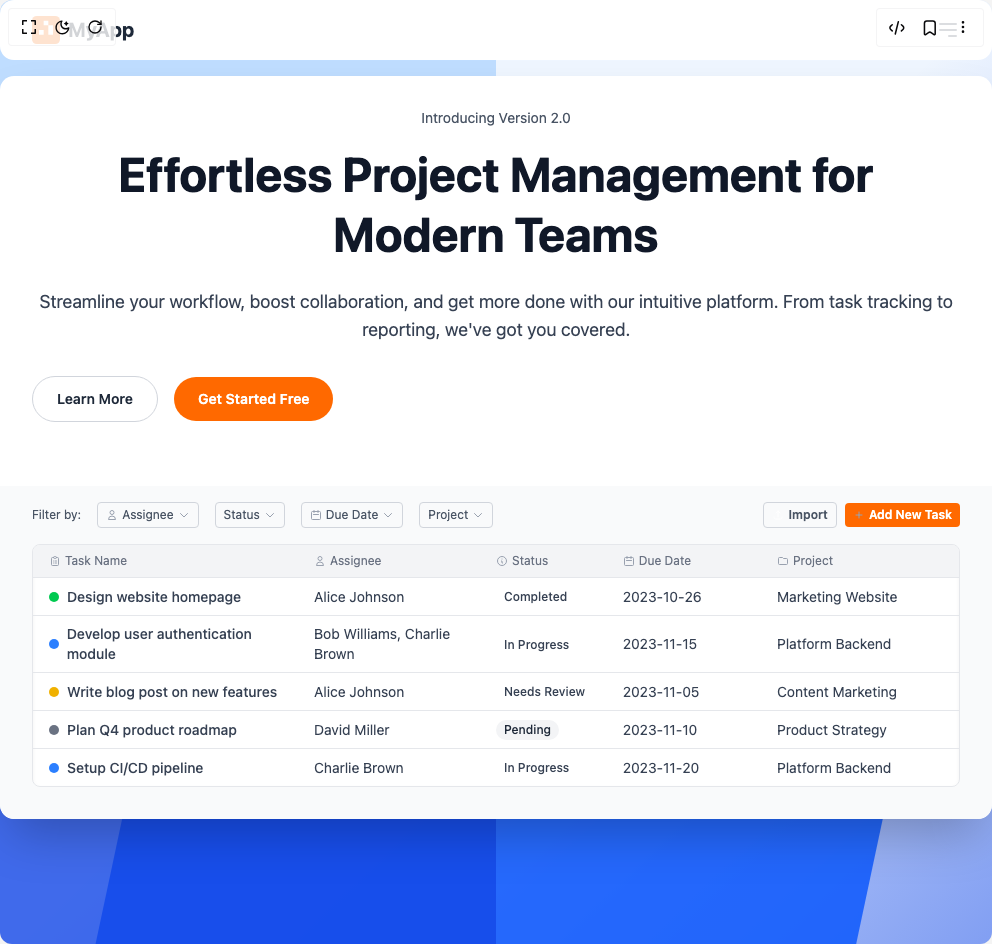

# Build Hero Section in BuilderStudio

> Build this component in our Agentic IDE: [BuilderStudio](https://builderstudio.dev).
>
> Join the BuilderStudio community on [Discord](https://discord.gg/QdWeSGCqfe) and [Reddit](https://reddit.com/r/builderstudio).



## Component

- Author group: `erikx`
- Component: `hero-section`
- Variant: `default`
- Rendered HTML snapshot: [`rendered.html`](rendered.html)

## BuilderStudio prompt

You are implementing a React component based on a component reference.

## Component identity

- Author: erikx
- Component slug: hero-section
- Demo slug: default
- Title: hero-section
- Description: 

## Goal

Recreate this component in a React + TypeScript + Tailwind CSS project. Preserve the visual layout, spacing, colors, border radius, shadows, interaction behavior, animation behavior, responsive behavior, and dark mode behavior shown in the rendered demo.

## Implementation requirements

- Use React and TypeScript.
- Use Tailwind CSS classes whenever possible.
- Keep the component self-contained unless the source files require helper components.
- If the source uses CSS variables, custom CSS, animations, or keyframes, include them.
- If the source uses external packages, list and use the required packages.
- Preserve accessibility attributes, button semantics, links, keyboard behavior, and ARIA attributes when visible in the source.
- Do not replace the component with a simplified placeholder.
- Return complete production-ready code.

## Dependencies

No reference metadata available.

## Rendered DOM snapshot

This is the rendered demo HTML extracted from the live preview. Use it to verify structure, class names, visible content, and layout.

```html
<div id="root"><div class="relative min-h-screen bg-blue-50 overflow-hidden font-sans"><div><div class="absolute inset-0 bg-gradient-to-br from-transparent via-transparent to-blue-700 opacity-50 z-0"></div> <div class="absolute bottom-0 right-0 w-3/4 h-3/4 bg-blue-600 transform origin-bottom-right rotate-12 translate-y-1/3 -translate-x-1/4 opacity-90 z-0"></div><div class="absolute bottom-0 left-0 w-1/2 h-1/2 bg-blue-700 opacity-80 z-0"></div><div class="absolute top-0 left-0 w-1/2 h-full bg-blue-400 transform -skew-y-6 origin-top-left -translate-y-1/4 opacity-30 z-0"></div></div><nav class="mb-4 bg-white rounded-xl relative z-10 max-w-6xl mx-auto flex items-center justify-between py-4 px-8 lg:px-12 lg:py-4"><div class="flex items-center space-x-2"><svg width="28" height="28" viewBox="0 0 24 24" fill="none" xmlns="http://www.w3.org/2000/svg"><rect width="24" height="24" rx="4" fill="#F97316"></rect><path d="M6 12H10V16H6V12ZM14 8H18V16H14V8ZM10 4H14V8H10V4Z" fill="white"></path></svg><span class="text-xl font-bold text-gray-800">MyApp</span></div><div class="flex items-center space-x-6 text-gray-600 text-sm"><ul class="hidden lg:flex items-center space-x-6"><li><a href="#features" class="hover:text-orange-600">Features</a></li><li><a href="#pricing" class="hover:text-orange-600">Pricing</a></li><li><a href="#about" class="hover:text-orange-600">About</a></li><li><a href="#contact" class="hover:text-orange-600">Contact</a></li></ul><div class="hidden lg:flex items-center space-x-4"><a href="#signin" class="text-gray-600 hover:text-orange-600 undefined">Sign In</a><button class="px-4 py-2 bg-orange-500 text-white rounded-md hover:bg-orange-600 font-semibold undefined">Sign Up</button></div></div><button class="lg:hidden text-gray-600 hover:text-orange-600 focus:outline-none" aria-label="Open mobile menu"><svg class="w-6 h-6" fill="none" stroke="currentColor" viewBox="0 0 24 24" xmlns="http://www.w3.org/2000/svg"><path stroke-linecap="round" stroke-linejoin="round" stroke-width="2" d="M4 6h16M4 12h16m-7 6h7"></path></svg></button></nav><div class="relative z-10 max-w-6xl mx-auto bg-white rounded-xl shadow-2xl overflow-hidden"><div class="flex flex-col lg:flex-row items-center lg:items-start text-center lg:text-left p-8 lg:px-12 lg:pt-8 lg:pb-16"><div class="lg:w-3/5 pr-0 lg:pr-16"><p class="text-sm text-gray-600 mb-4">Introducing Version 2.0</p><h1 class="text-4xl md:text-5xl font-bold text-gray-900 mb-6 leading-tight">Effortless Project Management for Modern Teams</h1><p class="text-lg text-gray-700 mb-8">Streamline your workflow, boost collaboration, and get more done with our intuitive platform. From task tracking to reporting, we've got you covered.</p><div class="flex flex-col sm:flex-row items-center space-y-4 sm:space-y-0 sm:space-x-4 mb-8"><a href="#details" class="w-full sm:w-auto px-6 py-3 border border-gray-300 rounded-full text-gray-800 font-semibold hover:bg-gray-50 text-sm">Learn More</a><a href="#try-for-free" class="w-full sm:w-auto px-6 py-3 bg-orange-500 text-white rounded-full font-semibold hover:bg-orange-600 text-sm">Get Started Free</a></div></div></div><div class="relative z-20 px-8 lg:px-12 pb-8 bg-gray-50 rounded-b-xl"><div class="flex flex-col md:flex-row items-start md:items-center justify-end text-gray-500 text-xs space-y-4 md:space-y-0 pt-4 mb-4"><div class="flex flex-col md:flex-row items-start md:items-center justify-between text-gray-500 text-xs space-y-2 md:space-y-0 w-full"><div class="flex flex-wrap items-center space-x-2 md:space-x-4"><span class="hidden md:inline-block text-gray-600">Filter by:</span><button class="flex items-center px-2 py-1 border border-gray-300 rounded text-xs hover:bg-gray-100"><svg class="w-3 h-3 mr-1 text-gray-400" fill="none" stroke="currentColor" viewBox="0 0 24 24" xmlns="http://www.w3.org/2000/svg"><path stroke-linecap="round" stroke-linejoin="round" stroke-width="2" d="M16 7a4 4 0 11-8 0 4 4 0 018 0zM12 14a7 7 0 00-7 7h14a7 7 0 00-7-7z"></path></svg><span class="text-gray-600">Assignee</span><svg class="w-3 h-3 ml-1 text-gray-400" fill="none" stroke="currentColor" viewBox="0 0 24 24" xmlns="http://www.w3.org/2000/svg"><path stroke-linecap="round" stroke-linejoin="round" stroke-width="2" d="M19 9l-7 7-7-7"></path></svg></button><button class="flex items-center px-2 py-1 border border-gray-300 rounded text-xs hover:bg-gray-100"><span class="text-gray-600">Status</span><svg class="w-3 h-3 ml-1 text-gray-400" fill="none" stroke="currentColor" viewBox="0 0 24 24" xmlns="http://www.w3.org/2000/svg"><path stroke-linecap="round" stroke-linejoin="round" stroke-width="2" d="M19 9l-7 7-7-7"></path></svg></button><button class="flex items-center px-2 py-1 border border-gray-300 rounded text-xs hover:bg-gray-100"><svg class="w-3 h-3 mr-1 text-gray-400" fill="none" stroke="currentColor" viewBox="0 0 24 24" xmlns="http://www.w3.org/2000/svg"><path stroke-linecap="round" stroke-linejoin="round" stroke-width="2" d="M8 7V3m8 4V3m-9 8h10M5 21h14a2 2 0 002-2V7a2 2 0 00-2-2H5a2 2 0 00-2 2v12a2 2 0 002 2z"></path></svg><span class="text-gray-600">Due Date</span><svg class="w-3 h-3 ml-1 text-gray-400" fill="none" stroke="currentColor" viewBox="0 0 24 24" xmlns="http://www.w3.org/2000/svg"><path stroke-linecap="round" stroke-linejoin="round" stroke-width="2" d="M19 9l-7 7-7-7"></path></svg></button><button class="flex items-center px-2 py-1 border border-gray-300 rounded text-xs hover:bg-gray-100"><span class="text-gray-600">Project</span><svg class="w-3 h-3 ml-1 text-gray-400" fill="none" stroke="currentColor" viewBox="0 0 24 24" xmlns="http://www.w3.org/2000/svg"><path stroke-linecap="round" stroke-linejoin="round" stroke-width="2" d="M19 9l-7 7-7-7"></path></svg></button></div><div class="flex items-center space-x-2 mt-2 md:mt-0"><button class="flex items-center px-2 py-1 rounded text-xs font-semibold border border-gray-300 text-gray-600 hover:bg-gray-100"><svg class="w-3 h-3 mr-1 text-gray-400" fill="none" stroke="white" viewBox="0 0 24 24" xmlns="http://www.w3.org/2000/svg"><path stroke-linecap="round" stroke-linejoin="round" stroke-width="2" d="M4 16v1a3 3 0 003 3h10a3 3 0 003-3v-1m-4-8l-4-4m0 0L8 8m4-4v12"></path></svg>Import</button><button class="flex items-center px-2 py-1 rounded text-xs font-semibold bg-orange-500 text-white hover:bg-orange-600"><svg class="w-3 h-3 mr-1 text-gray-400" fill="none" stroke="currentColor" viewBox="0 0 24 24" xmlns="http://www.w3.org/2000/svg"><path stroke-linecap="round" stroke-linejoin="round" stroke-width="2" d="M12 6v6m0 0v6m0-6h6m-6 0H6"></path></svg>Add New Task</button></div></div></div><div class="bg-white rounded-md shadow-inner overflow-hidden border border-gray-200"><div class="grid grid-cols-[1.8fr_1.2fr_0.8fr_1fr_1.2fr] gap-4 text-xs text-gray-500 px-4 py-2 border-b border-gray-200 bg-gray-100"><div class="flex items-center"><svg class="w-3 h-3 mr-1 text-gray-400" fill="none" stroke="currentColor" viewBox="0 0 24 24" xmlns="http://www.w3.org/2000/svg"><path stroke-linecap="round" stroke-linejoin="round" stroke-width="2" d="M9 5H7a2 2 0 00-2 2v12a2 2 0 002 2h10a2 2 0 002-2V7a2 2 0 00-2-2h-2M9 5a2 2 0 002 2h2a2 2 0 002-2M9 5a2 2 0 012-2h2a2 2 0 012 2m-3 7h3m-3 4h3m-6-4h.01M9 16h.01"></path></svg>Task Name</div><div class="flex items-center"><svg class="w-3 h-3 mr-1 text-gray-400" fill="none" stroke="currentColor" viewBox="0 0 24 24" xmlns="http://www.w3.org/2000/svg"><path stroke-linecap="round" stroke-linejoin="round" stroke-width="2" d="M16 7a4 4 0 11-8 0 4 4 0 018 0zM12 14a7 7 0 00-7 7h14a7 7 0 00-7-7z"></path></svg>Assignee</div><div class="flex items-center"><svg class="w-3 h-3 mr-1 text-gray-400" fill="none" stroke="currentColor" viewBox="0 0 24 24" xmlns="http://www.w3.org/2000/svg"><path stroke-linecap="round" stroke-linejoin="round" stroke-width="2" d="M13 16h-1v-4h-1m1-4h.01M21 12a9 9 0 11-18 0 9 9 0 0118 0z"></path></svg>Status</div><div class="flex items-center"><svg class="w-3 h-3 mr-1 text-gray-400" fill="none" stroke="currentColor" viewBox="0 0 24 24" xmlns="http://www.w3.org/2000/svg"><path stroke-linecap="round" stroke-linejoin="round" stroke-width="2" d="M8 7V3m8 4V3m-9 8h10M5 21h14a2 2 0 002-2V7a2 2 0 00-2-2H5a2 2 0 00-2 2v12a2 2 0 002 2z"></path></svg>Due Date</div><div class="flex items-center"><svg class="w-3 h-3 mr-1 text-gray-400" fill="none" stroke="currentColor" viewBox="0 0 24 24" xmlns="http://www.w3.org/2000/svg"><path stroke-linecap="round" stroke-linejoin="round" stroke-width="2" d="M3 7v10a2 2 0 002 2h14a2 2 0 002-2V9a2 2 0 00-2-2h-6l-2-2H5a2 2 0 00-2 2z"></path></svg>Project</div></div><div class="grid grid-cols-[1.8fr_1.2fr_0.8fr_1fr_1.2fr] gap-4 text-sm text-gray-700 px-4 py-2 items-center cursor-pointer hover:bg-gray-50 border-b border-gray-200"><div class="flex items-center font-medium"><span class="inline-block w-2.5 h-2.5 bg-green-500 rounded-full mr-2"></span>Design website homepage</div><div>Alice Johnson</div><div><span class="inline-block px-2 py-0.5 bg-green-100 text-green-800 rounded-full text-xs font-medium">Completed</span></div><div class="text-gray-700">2023-10-26</div><div class="text-gray-700 truncate">Marketing Website</div></div><div class="grid grid-cols-[1.8fr_1.2fr_0.8fr_1fr_1.2fr] gap-4 text-sm text-gray-700 px-4 py-2 items-center cursor-pointer hover:bg-gray-50 border-b border-gray-200"><div class="flex items-center font-medium"><span class="inline-block w-2.5 h-2.5 bg-blue-500 rounded-full mr-2"></span>Develop user authentication module</div><div>Bob Williams, Charlie Brown</div><div><span class="inline-block px-2 py-0.5 bg-blue-100 text-blue-800 rounded-full text-xs font-medium">In Progress</span></div><div class="text-gray-700">2023-11-15</div><div class="text-gray-700 truncate">Platform Backend</div></div><div class="grid grid-cols-[1.8fr_1.2fr_0.8fr_1fr_1.2fr] gap-4 text-sm text-gray-700 px-4 py-2 items-center cursor-pointer hover:bg-gray-50 border-b border-gray-200"><div class="flex items-center font-medium"><span class="inline-block w-2.5 h-2.5 bg-yellow-500 rounded-full mr-2"></span>Write blog post on new features</div><div>Alice Johnson</div><div><span class="inline-block px-2 py-0.5 bg-yellow-100 text-yellow-800 rounded-full text-xs font-medium">Needs Review</span></div><div class="text-gray-700">2023-11-05</div><div class="text-gray-700 truncate">Content Marketing</div></div><div class="grid grid-cols-[1.8fr_1.2fr_0.8fr_1fr_1.2fr] gap-4 text-sm text-gray-700 px-4 py-2 items-center cursor-pointer hover:bg-gray-50 border-b border-gray-200"><div class="flex items-center font-medium"><span class="inline-block w-2.5 h-2.5 bg-gray-500 rounded-full mr-2"></span>Plan Q4 product roadmap</div><div>David Miller</div><div><span class="inline-block px-2 py-0.5 bg-gray-100 text-gray-800 rounded-full text-xs font-medium">Pending</span></div><div class="text-gray-700">2023-11-10</div><div class="text-gray-700 truncate">Product Strategy</div></div><div class="grid grid-cols-[1.8fr_1.2fr_0.8fr_1fr_1.2fr] gap-4 text-sm text-gray-700 px-4 py-2 items-center cursor-pointer hover:bg-gray-50 "><div class="flex items-center font-medium"><span class="inline-block w-2.5 h-2.5 bg-blue-500 rounded-full mr-2"></span>Setup CI/CD pipeline</div><div>Charlie Brown</div><div><span class="inline-block px-2 py-0.5 bg-blue-100 text-blue-800 rounded-full text-xs font-medium">In Progress</span></div><div class="text-gray-700">2023-11-20</div><div class="text-gray-700 truncate">Platform Backend</div></div></div></div></div><div class="
            fixed inset-0 z-40 bg-white transition-transform duration-300 ease-in-out
            translate-x-full
            lg:hidden
            overflow-y-auto
            p-8
        "><div class="flex items-center justify-between mb-8"><div class="flex items-center space-x-2"><svg width="28" height="28" viewBox="0 0 24 24" fill="none" xmlns="http://www.w3.org/2000/svg"><rect width="24" height="24" rx="4" fill="#F97316"></rect><path d="M6 12H10V16H6V12ZM14 8H18V16H14V8ZM10 4H14V8H10V4Z" fill="white"></path></svg><span class="text-xl font-bold text-gray-800">MyApp</span></div><button class="text-gray-600 hover:text-orange-600 focus:outline-none" aria-label="Close mobile menu"><svg class="w-6 h-6" fill="none" stroke="currentColor" viewBox="0 0 24 24" xmlns="http://www.w3.org/2000/svg"><path stroke-linecap="round" stroke-linejoin="round" stroke-width="2" d="M6 18L18 6M6 6l12 12"></path></svg></button></div><div class="flex flex-col space-y-4 mt-8"><a href="#features" class="text-gray-800 text-lg font-medium hover:text-orange-600">Features</a><a href="#pricing" class="text-gray-800 text-lg font-medium hover:text-orange-600">Pricing</a><a href="#about" class="text-gray-800 text-lg font-medium hover:text-orange-600">About</a><a href="#contact" class="text-gray-800 text-lg font-medium hover:text-orange-600">Contact</a></div><div class="flex flex-col space-y-4 mt-8 pt-6 border-t border-gray-200"><a href="#signin" class="text-gray-600 hover:text-orange-600 text-lg undefined">Sign In</a><button class="px-4 py-3 bg-orange-500 text-white rounded-md hover:bg-orange-600 font-semibold text-lg undefined">Sign Up</button></div></div></div></div>
```

## Reference source files

No reference source files were available.
