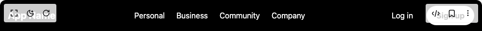

# Build Navbar With Animated Mega Dropdown in BuilderStudio

> Build this component in our Agentic IDE: [BuilderStudio](https://builderstudio.dev).
>
> Join the BuilderStudio community on [Discord](https://discord.gg/QdWeSGCqfe) and [Reddit](https://reddit.com/r/builderstudio).



## Component

- Author group: `erikx`
- Component: `navbar-with-animated-mega-dropdown`
- Variant: `default`
- Rendered HTML snapshot: [`rendered.html`](rendered.html)

## BuilderStudio prompt

You are implementing a React component based on a component reference.

## Component identity

- Author: erikx
- Component slug: navbar-with-animated-mega-dropdown
- Demo slug: default
- Title: navbar-with-animated-mega-dropdown
- Description: 

## Goal

Recreate this component in a React + TypeScript + Tailwind CSS project. Preserve the visual layout, spacing, colors, border radius, shadows, interaction behavior, animation behavior, responsive behavior, and dark mode behavior shown in the rendered demo.

## Implementation requirements

- Use React and TypeScript.
- Use Tailwind CSS classes whenever possible.
- Keep the component self-contained unless the source files require helper components.
- If the source uses CSS variables, custom CSS, animations, or keyframes, include them.
- If the source uses external packages, list and use the required packages.
- Preserve accessibility attributes, button semantics, links, keyboard behavior, and ARIA attributes when visible in the source.
- Do not replace the component with a simplified placeholder.
- Return complete production-ready code.

## Dependencies

No reference metadata available.

## Rendered DOM snapshot

This is the rendered demo HTML extracted from the live preview. Use it to verify structure, class names, visible content, and layout.

```html
<div id="root"><nav class="relative bg-black text-white z-50"><div class="flex items-center justify-between h-16 max-w-screen-xl mx-auto px-4"><div class="text-xl font-bold">App Name</div><ul class="hidden md:flex gap-6 mx-10 list-none p-0 m-0 h-full"><li class="flex items-center h-full relative "><a href="#" class="py-2 hover:text-gray-400 no-underline">Personal</a></li><li class="flex items-center h-full relative "><a href="#" class="py-2 hover:text-gray-400 no-underline">Business</a></li><li class="flex items-center h-full relative "><a href="#" class="py-2 hover:text-gray-400 no-underline">Community</a></li><li class="flex items-center h-full relative "><a href="#" class="py-2 hover:text-gray-400 no-underline">Company</a></li></ul><div class="hidden md:flex gap-3"><button class="bg-transparent border-none text-white px-4 py-2 hover:opacity-80 cursor-pointer">Log in</button><button class="bg-white text-black px-5 py-2 rounded-full font-bold hover:opacity-90 cursor-pointer">Sign up</button></div><button class="md:hidden text-white focus:outline-none" aria-label="Toggle mobile menu"><svg class="w-6 h-6" fill="none" stroke="currentColor" viewBox="0 0 24 24" xmlns="http://www.w3.org/2000/svg"><path stroke-linecap="round" stroke-linejoin="round" stroke-width="2" d="M4 6h16M4 12h16M4 18h16"></path></svg></button></div></nav></div>
```

## Reference source files

No reference source files were available.
