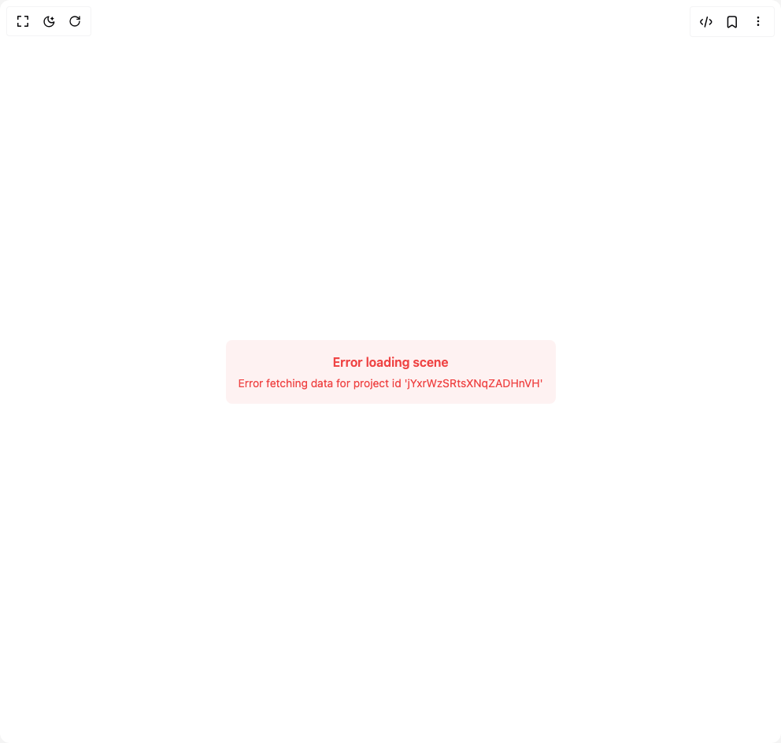

# Build Rainbow Matrix Shader in BuilderStudio

> Build this component in our Agentic IDE: [BuilderStudio](https://builderstudio.dev).
>
> Join the BuilderStudio community on [Discord](https://discord.gg/QdWeSGCqfe) and [Reddit](https://reddit.com/r/builderstudio).



## Component

- Author group: `erikx`
- Component: `rainbow-matrix-shader`
- Variant: `default`
- Rendered HTML snapshot: [`rendered.html`](rendered.html)

## BuilderStudio prompt

You are implementing a React component based on a component reference.

## Component identity

- Author: erikx
- Component slug: rainbow-matrix-shader
- Demo slug: default
- Title: rainbow-matrix-shader
- Description: 

## Goal

Recreate this component in a React + TypeScript + Tailwind CSS project. Preserve the visual layout, spacing, colors, border radius, shadows, interaction behavior, animation behavior, responsive behavior, and dark mode behavior shown in the rendered demo.

## Implementation requirements

- Use React and TypeScript.
- Use Tailwind CSS classes whenever possible.
- Keep the component self-contained unless the source files require helper components.
- If the source uses CSS variables, custom CSS, animations, or keyframes, include them.
- If the source uses external packages, list and use the required packages.
- Preserve accessibility attributes, button semantics, links, keyboard behavior, and ARIA attributes when visible in the source.
- Do not replace the component with a simplified placeholder.
- Return complete production-ready code.

## Dependencies

No reference metadata available.

## Rendered DOM snapshot

This is the rendered demo HTML extracted from the live preview. Use it to verify structure, class names, visible content, and layout.

```html
<div id="root"><div class="w-screen min-h-screen flex justify-center items-center"><div class="w-screen min-h-screen flex justify-center items-center"><div class="flex flex-col items-center"><div class="" id="unicorn-lpuimo00u" data-scene-id="id-96gez7mta3qyl1s9tgqpq" style="position: relative; width: var(--unicorn-width); height: var(--unicorn-height); --unicorn-width: 992px; --unicorn-height: 944px;"><div style="display: flex; align-items: center; justify-content: center; height: 100%;"><div style="text-align: center; padding: 1rem; border-radius: 0.5rem; background-color: rgb(254, 242, 242); color: rgb(239, 68, 68);"><p style="font-weight: 600; margin-bottom: 0.25rem;">Error loading scene</p><p style="font-size: 0.875rem; margin-top: 0.25rem;">Error fetching data for project id 'jYxrWzSRtsXNqZADHnVH'</p></div></div></div></div></div></div></div>
```

## Reference source files

No reference source files were available.
