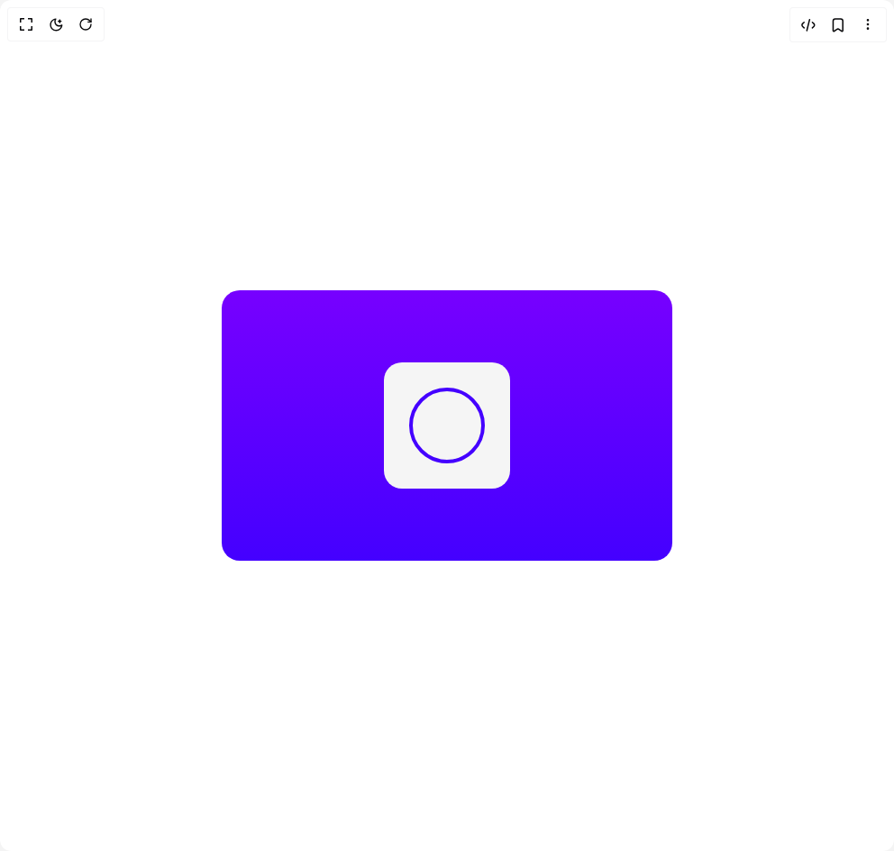

# Build Swipe Animation in BuilderStudio

> Build this component in our Agentic IDE: [BuilderStudio](https://builderstudio.dev).
>
> Join the BuilderStudio community on [Discord](https://discord.gg/QdWeSGCqfe) and [Reddit](https://reddit.com/r/builderstudio).



## Component

- Author group: `erikx`
- Component: `swipe-animation`
- Variant: `default`
- Rendered HTML snapshot: [`rendered.html`](rendered.html)

## BuilderStudio prompt

You are implementing a React component based on a component reference.

## Component identity

- Author: erikx
- Component slug: swipe-animation
- Demo slug: default
- Title: swipe-animation
- Description: 

## Goal

Recreate this component in a React + TypeScript + Tailwind CSS project. Preserve the visual layout, spacing, colors, border radius, shadows, interaction behavior, animation behavior, responsive behavior, and dark mode behavior shown in the rendered demo.

## Implementation requirements

- Use React and TypeScript.
- Use Tailwind CSS classes whenever possible.
- Keep the component self-contained unless the source files require helper components.
- If the source uses CSS variables, custom CSS, animations, or keyframes, include them.
- If the source uses external packages, list and use the required packages.
- Preserve accessibility attributes, button semantics, links, keyboard behavior, and ARIA attributes when visible in the source.
- Do not replace the component with a simplified placeholder.
- Return complete production-ready code.

## Dependencies

No reference metadata available.

## Rendered DOM snapshot

This is the rendered demo HTML extracted from the live preview. Use it to verify structure, class names, visible content, and layout.

```html
<div id="root"><div class="w-screen min-h-screen flex justify-center items-center"><div class="w-screen min-h-screen flex justify-center items-center"><div class="flex justify-center items-center p-4"><div style="display: flex; justify-content: center; align-items: center; flex: 1 1 0%; width: 500px; height: 300px; max-width: 100%; border-radius: 20px; background: linear-gradient(rgb(119, 0, 255) 0%, rgb(68, 0, 255) 100%);"><div class="icon-wrapper" draggable="false" style="width: 140px; height: 140px; background-color: rgb(245, 245, 245); border-radius: 20px; padding: 20px; transform: none; user-select: none; touch-action: pan-y;"><svg viewBox="0 0 50 50" class="progress-svg"><path fill="none" stroke-width="2" stroke="rgba(68, 0, 255, 1)" d="M 0,20 a 20,20 0 1,0 40,0 a 20,20 0 1,0 -40,0" style="transform: translateX(5px) translateY(5px); transform-origin: 50% 50%; transform-box: fill-box;"></path><path fill="none" stroke-width="2" stroke="rgba(68, 0, 255, 1)" d="M14,26 L22,33 L35,16" stroke-dasharray="0px 1px" pathLength="1" stroke-dashoffset="0px"></path><path fill="none" stroke-width="2" stroke="rgba(68, 0, 255, 1)" d="M17,17 L33,33" stroke-dasharray="0px 1px" pathLength="1" stroke-dashoffset="0px"></path><path fill="none" stroke-width="2" stroke="rgba(68, 0, 255, 1)" d="M33,17 L17,33" stroke-dasharray="0px 1px" pathLength="1" stroke-dashoffset="0px"></path></svg></div></div></div></div></div></div>
```

## Reference source files

No reference source files were available.
