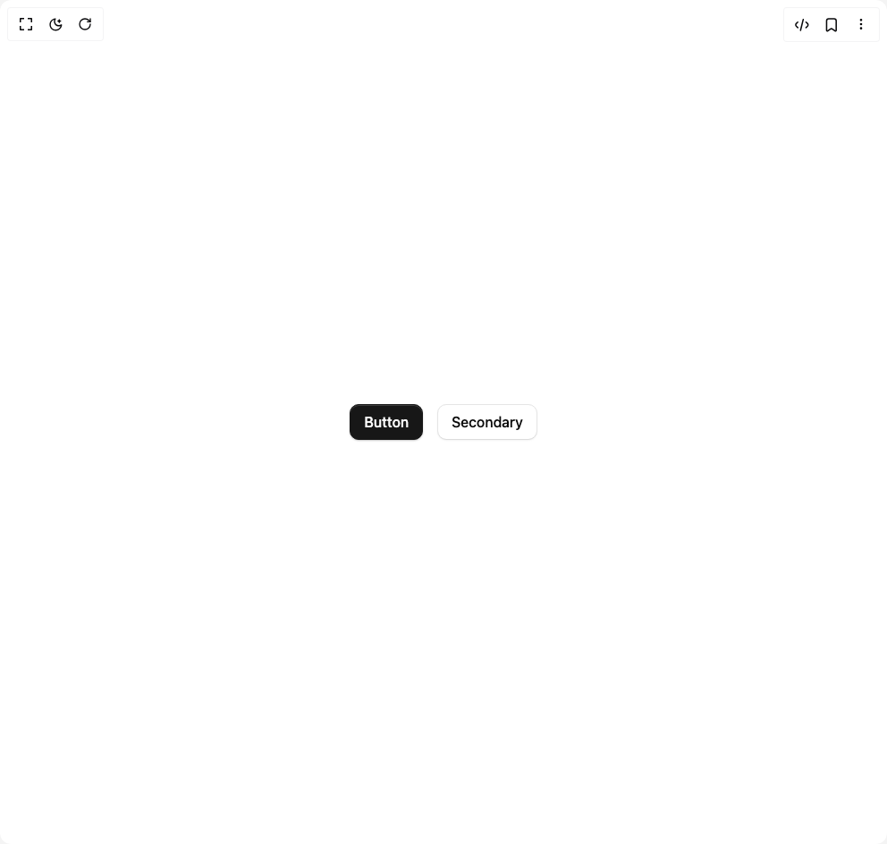
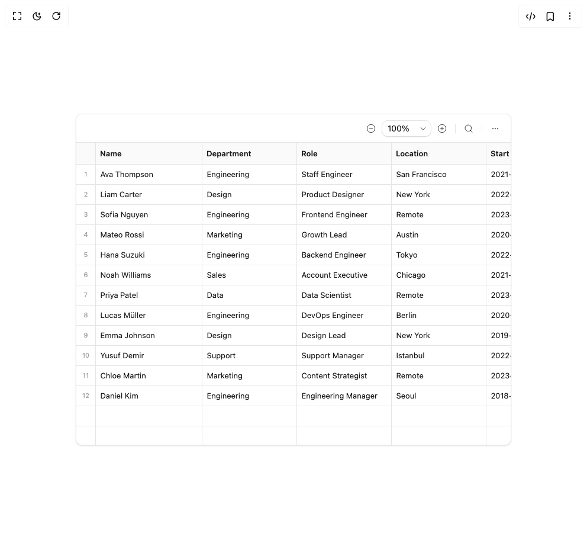
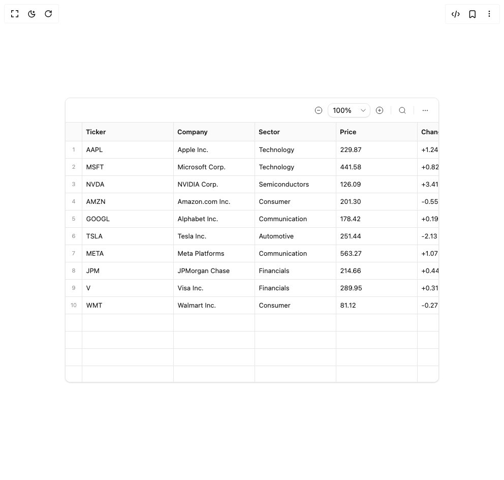
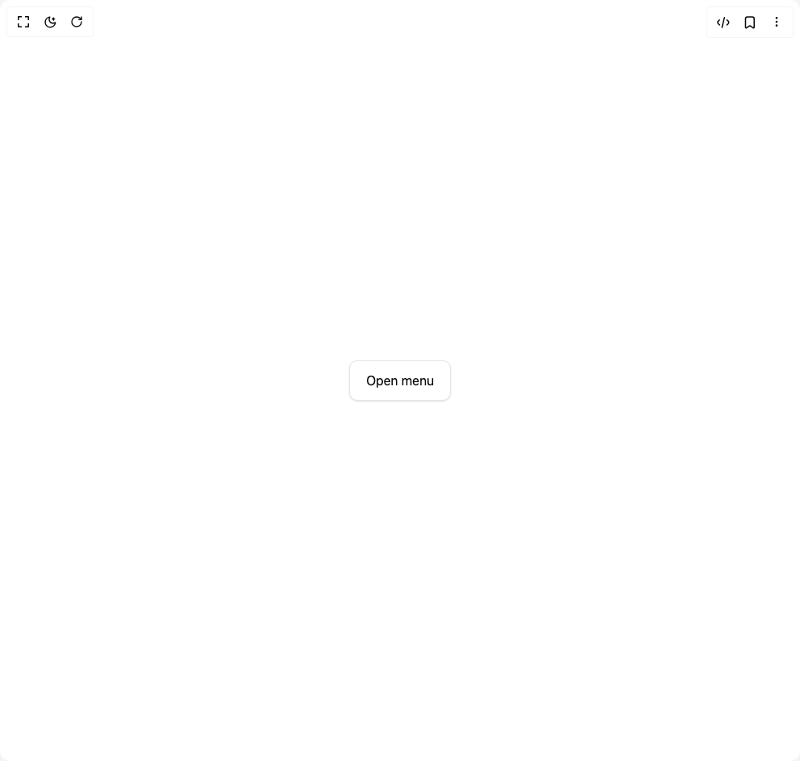
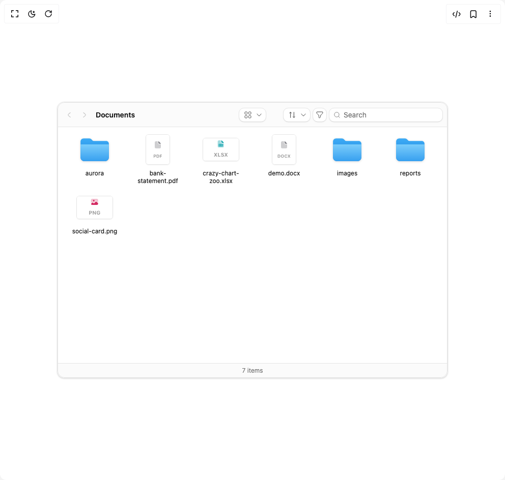
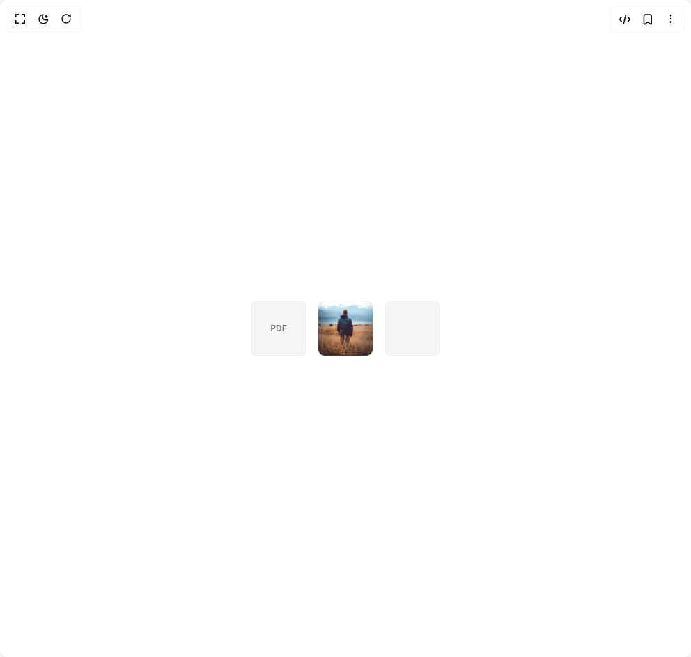
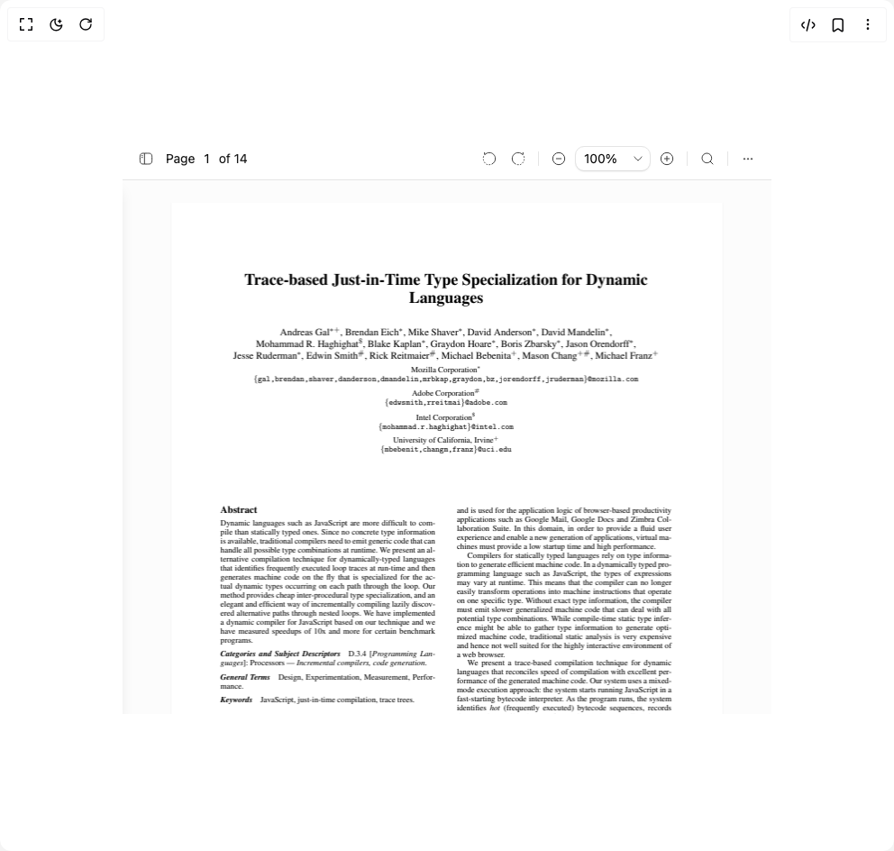
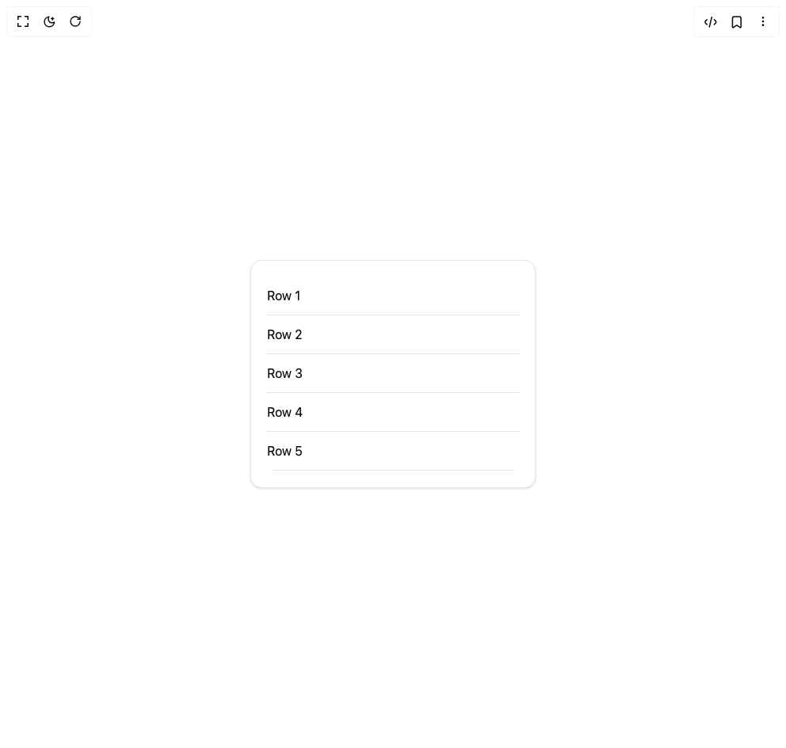
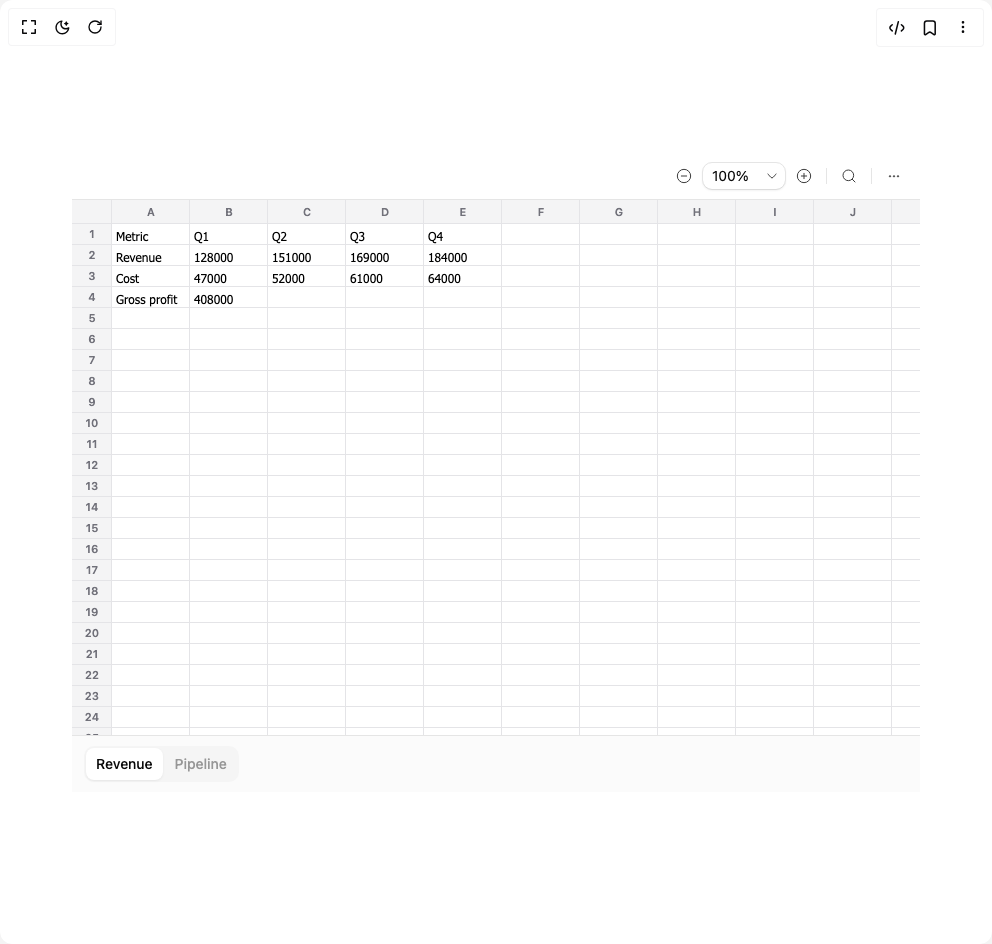

# Extend Hq Components

13 components are available in this author group.

> Build any component in [BuilderStudio](https://builderstudio.dev), then share improvements with the community on [Discord](https://discord.gg/QdWeSGCqfe) or [Reddit](https://reddit.com/r/builderstudio).

| Preview | Component | Variant |
| --- | --- | --- |
|  | [Button](button/default/README.md) | `default` |
|  | [Card](card/default/README.md) | `default` |
|  | [Csv Viewer](csv-viewer/default/README.md) | `default` |
|  | [Csv Viewer](csv-viewer/tsv/README.md) | `tsv` |
|  | [Document Viewer Sidebar](document-viewer-sidebar/default/README.md) | `default` |
|  | [Dropdown Menu](dropdown-menu/default/README.md) | `default` |
|  | [File System](file-system/default/README.md) | `default` |
|  | [File Thumbnail](file-thumbnail/default/README.md) | `default` |
|  | [File Upload](file-upload/default/README.md) | `default` |
|  | [Pdf Viewer](pdf-viewer/default/README.md) | `default` |
|  | [Scroll Area](scroll-area/default/README.md) | `default` |
|  | [Select](select/default/README.md) | `default` |
|  | [Xlsx Viewer](xlsx-viewer/default/README.md) | `default` |
