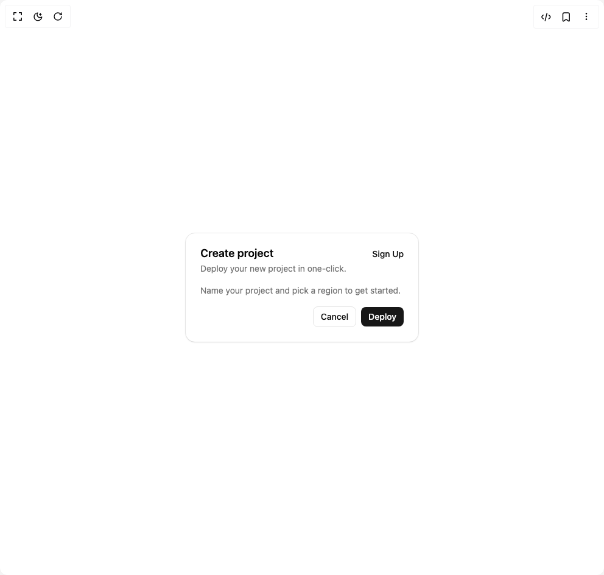

# Build Card in BuilderStudio

> Build this component in our Agentic IDE: [BuilderStudio](https://builderstudio.dev).
>
> Join the BuilderStudio community on [Discord](https://discord.gg/QdWeSGCqfe) and [Reddit](https://reddit.com/r/builderstudio).



## Component

- Author group: `extend-hq`
- Component: `card`
- Variant: `default`
- Rendered HTML snapshot: [`rendered.html`](rendered.html)

## BuilderStudio prompt

You are implementing a React component based on a component reference.

## Component identity

- Author: extend-hq
- Component slug: card
- Demo slug: default
- Title: card
- Description: 

## Goal

Recreate this component in a React + TypeScript + Tailwind CSS project. Preserve the visual layout, spacing, colors, border radius, shadows, interaction behavior, animation behavior, responsive behavior, and dark mode behavior shown in the rendered demo.

## Implementation requirements

- Use React and TypeScript.
- Use Tailwind CSS classes whenever possible.
- Keep the component self-contained unless the source files require helper components.
- If the source uses CSS variables, custom CSS, animations, or keyframes, include them.
- If the source uses external packages, list and use the required packages.
- Preserve accessibility attributes, button semantics, links, keyboard behavior, and ARIA attributes when visible in the source.
- Do not replace the component with a simplified placeholder.
- Return complete production-ready code.

## Dependencies

No reference metadata available.

## Rendered DOM snapshot

This is the rendered demo HTML extracted from the live preview. Use it to verify structure, class names, visible content, and layout.

```html
<div id="root"><div class="w-screen min-h-screen flex justify-center items-center"><div class="w-screen min-h-screen flex justify-center items-center"><div class="flex min-h-screen w-full items-center justify-center p-8"><div class="relative flex flex-col rounded-2xl border bg-card text-card-foreground shadow-xs/5 not-dark:bg-clip-padding before:pointer-events-none before:absolute before:inset-0 before:rounded-[calc(var(--radius-2xl)-1px)] before:shadow-[0_1px_--theme(--color-black/4%)] dark:before:shadow-[0_-1px_--theme(--color-white/6%)] w-full max-w-sm" data-slot="card"><div class="grid auto-rows-min grid-rows-[auto_auto] items-start gap-1.5 p-6 in-[[data-slot=card]:has(&gt;[data-slot=card-panel])]:pb-4 has-data-[slot=card-action]:grid-cols-[1fr_auto]" data-slot="card-header"><div class="text-lg leading-none font-semibold" data-slot="card-title">Create project</div><div class="text-sm text-muted-foreground" data-slot="card-description">Deploy your new project in one-click.</div><div class="col-start-2 row-span-2 row-start-1 inline-flex self-start justify-self-end" data-slot="card-action"><button class="text-sm font-medium underline-offset-4 hover:underline">Sign Up</button></div></div><div class="flex-1 p-6 in-[[data-slot=card]:has(&gt;[data-slot=card-footer]:not(.border-t))]:pb-0 in-[[data-slot=card]:has(&gt;[data-slot=card-header]:not(.border-b))]:pt-0" data-slot="card-panel"><p class="text-sm text-muted-foreground">Name your project and pick a region to get started.</p></div><div class="items-center p-6 in-[[data-slot=card]:has(&gt;[data-slot=card-panel])]:pt-4 flex justify-end gap-2" data-slot="card-footer"><button class="rounded-md border px-3 py-1.5 text-sm font-medium">Cancel</button><button class="rounded-md bg-primary px-3 py-1.5 text-sm font-medium text-primary-foreground">Deploy</button></div></div></div></div></div></div>
```

## Reference source files

No reference source files were available.
