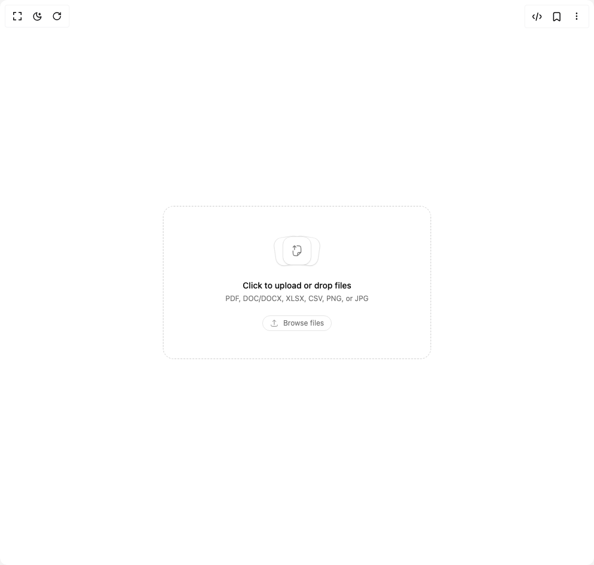

# Build File Upload in BuilderStudio

> Build this component in our Agentic IDE: [BuilderStudio](https://builderstudio.dev).
>
> Join the BuilderStudio community on [Discord](https://discord.gg/QdWeSGCqfe) and [Reddit](https://reddit.com/r/builderstudio).



## Component

- Author group: `extend-hq`
- Component: `file-upload`
- Variant: `default`
- Rendered HTML snapshot: [`rendered.html`](rendered.html)

## BuilderStudio prompt

You are implementing a React component based on a component reference.

## Component identity

- Author: extend-hq
- Component slug: file-upload
- Demo slug: default
- Title: file-upload
- Description: 

## Goal

Recreate this component in a React + TypeScript + Tailwind CSS project. Preserve the visual layout, spacing, colors, border radius, shadows, interaction behavior, animation behavior, responsive behavior, and dark mode behavior shown in the rendered demo.

## Implementation requirements

- Use React and TypeScript.
- Use Tailwind CSS classes whenever possible.
- Keep the component self-contained unless the source files require helper components.
- If the source uses CSS variables, custom CSS, animations, or keyframes, include them.
- If the source uses external packages, list and use the required packages.
- Preserve accessibility attributes, button semantics, links, keyboard behavior, and ARIA attributes when visible in the source.
- Do not replace the component with a simplified placeholder.
- Return complete production-ready code.

## Dependencies

No reference metadata available.

## Rendered DOM snapshot

This is the rendered demo HTML extracted from the live preview. Use it to verify structure, class names, visible content, and layout.

```html
<div id="root"><div class="w-screen min-h-screen flex justify-center items-center"><div class="w-screen min-h-screen flex justify-center items-center"><div class="flex min-h-screen w-full items-center justify-center p-8"><div class="w-full max-w-md"><div class="space-y-3"><style>
@property --beam-angle-«r0» {
  syntax: "<angle>";
  initial-value: 0deg;
  inherits: true;
}

@property --beam-opacity-«r0» {
  syntax: "<number>";
  initial-value: 0;
  inherits: true;
}

[data-beam="«r0»"] {
  position: relative;
  border-radius: 18px;
  overflow: hidden;
}

[data-beam="«r0»"][data-active] {
  animation:
    beam-spin-«r0» 2.4s linear infinite,
    beam-fade-in-«r0» 0.6s ease forwards;
}

[data-beam="«r0»"][data-fading] {
  animation:
    beam-spin-«r0» 2.4s linear infinite,
    beam-fade-out-«r0» 0.5s ease forwards;
}

[data-beam="«r0»"][data-active]::after,
[data-beam="«r0»"][data-fading]::after {
  content: "";
  position: absolute;
  inset: 0;
  border-radius: 17px;
  padding: 1px;
  clip-path: inset(0 round 18px);
  background: conic-gradient(
        from var(--beam-angle-«r0»),
        transparent 0%, transparent 54%,
        rgba(0, 0, 0, 0.08) 57%,
        rgba(0, 0, 0, 0.2) 60%,
        rgba(0, 0, 0, 0.4) 63%,
        rgba(0, 0, 0, 0.55) 66%,
        rgba(0, 0, 0, 0.4) 69%,
        rgba(0, 0, 0, 0.2) 72%,
        rgba(0, 0, 0, 0.08) 75%,
        transparent 78%, transparent 100%
      ),radial-gradient(ellipse 70px 40px at 33% -7.4%, rgb(100, 80, 220), transparent),
    radial-gradient(ellipse 60px 35px at 12% -5%, rgb(60, 120, 255), transparent),
    radial-gradient(ellipse 40px 70px at 2.1% 68.3%, rgb(80, 100, 200), transparent),
    radial-gradient(ellipse 20px 35px at 2.1% 68.3%, rgb(50, 140, 220), transparent),
    radial-gradient(ellipse 180px 32px at 74.4% 100%, rgb(120, 80, 255), transparent),
    radial-gradient(ellipse 85px 26px at 55% 100%, rgb(70, 130, 255), transparent),
    radial-gradient(ellipse 74px 32px at 93.9% 0%, rgb(140, 100, 240), transparent),
    radial-gradient(ellipse 26px 42px at 100% 27.1%, rgb(90, 110, 230), transparent),
    radial-gradient(ellipse 52px 48px at 100% 27.1%, rgb(130, 70, 255), transparent);
  -webkit-mask:
    conic-gradient(
      from var(--beam-angle-«r0»),
      transparent 0%, transparent 30%,
      rgba(255, 255, 255, 0.1) 36%, rgba(255, 255, 255, 0.35) 44%,
      white 52%, white 80%,
      rgba(255, 255, 255, 0.35) 86%, rgba(255, 255, 255, 0.1) 92%,
      transparent 95%, transparent 100%
    ),
    linear-gradient(#fff 0 0) content-box,
    linear-gradient(#fff 0 0);
  -webkit-mask-composite: source-in, xor;
  mask:
    conic-gradient(
      from var(--beam-angle-«r0»),
      transparent 0%, transparent 30%,
      rgba(255, 255, 255, 0.1) 36%, rgba(255, 255, 255, 0.35) 44%,
      white 52%, white 80%,
      rgba(255, 255, 255, 0.35) 86%, rgba(255, 255, 255, 0.1) 92%,
      transparent 95%, transparent 100%
    ),
    linear-gradient(#fff 0 0) content-box,
    linear-gradient(#fff 0 0);
  mask-composite: intersect, exclude;
  pointer-events: none;
  z-index: 2;
  opacity: calc(var(--beam-opacity-«r0») * 0.12 * var(--beam-strength, 1));
  animation: beam-hue-shift-«r0» 12s ease-in-out infinite;
}

[data-beam="«r0»"][data-active]::before,
[data-beam="«r0»"][data-fading]::before {
  content: "";
  position: absolute;
  inset: 0;
  border-radius: 18px;
  background: radial-gradient(ellipse 63px 36px at 33% -7.4%, rgba(100, 80, 220, 0.45), transparent),
    radial-gradient(ellipse 54px 32px at 12% -5%, rgba(60, 120, 255, 0.45), transparent),
    radial-gradient(ellipse 36px 63px at 2.1% 68.3%, rgba(80, 100, 200, 0.45), transparent),
    radial-gradient(ellipse 18px 32px at 2.1% 68.3%, rgba(50, 140, 220, 0.45), transparent),
    radial-gradient(ellipse 162px 29px at 74.4% 100%, rgba(120, 80, 255, 0.45), transparent),
    radial-gradient(ellipse 77px 23px at 55% 100%, rgba(70, 130, 255, 0.45), transparent),
    radial-gradient(ellipse 67px 29px at 93.9% 0%, rgba(140, 100, 240, 0.45), transparent),
    radial-gradient(ellipse 23px 38px at 100% 27.1%, rgba(90, 110, 230, 0.45), transparent),
    radial-gradient(ellipse 47px 43px at 100% 27.1%, rgba(130, 70, 255, 0.45), transparent);
  box-shadow: inset 0 0 9px 1px rgba(0, 0, 0, 0.14);
  -webkit-mask-image:
    conic-gradient(
      from var(--beam-angle-«r0»),
      transparent 0%, transparent 30%,
      rgba(255, 255, 255, 0.1) 36%, rgba(255, 255, 255, 0.35) 44%,
      white 52%, white 80%,
      rgba(255, 255, 255, 0.35) 86%, rgba(255, 255, 255, 0.1) 92%,
      transparent 95%, transparent 100%
    ),
    linear-gradient(white, transparent 28px, transparent calc(100% - 28px), white),
    linear-gradient(to right, white, transparent 28px, transparent calc(100% - 28px), white);
  -webkit-mask-composite: source-in, source-over;
  mask-image:
    conic-gradient(
      from var(--beam-angle-«r0»),
      transparent 0%, transparent 30%,
      rgba(255, 255, 255, 0.1) 36%, rgba(255, 255, 255, 0.35) 44%,
      white 52%, white 80%,
      rgba(255, 255, 255, 0.35) 86%, rgba(255, 255, 255, 0.1) 92%,
      transparent 95%, transparent 100%
    ),
    linear-gradient(white, transparent 28px, transparent calc(100% - 28px), white),
    linear-gradient(to right, white, transparent 28px, transparent calc(100% - 28px), white);
  mask-composite: intersect, add;
  pointer-events: none;
  z-index: 1;
  opacity: calc(var(--beam-opacity-«r0») * 0.26 * var(--beam-strength, 1));
  clip-path: inset(0 round 18px);
  animation: beam-hue-shift-«r0» 12s ease-in-out infinite;
}

[data-beam="«r0»"] [data-beam-bloom] {
  display: none;
  position: absolute;
  inset: 0;
  border-radius: 17px;
  clip-path: inset(0 round 18px);
  background: conic-gradient(
        from var(--beam-angle-«r0»),
        transparent 0%, transparent 58%,
        rgba(0, 0, 0, 0.02) 62%,
        rgba(0, 0, 0, 0.08) 65%,
        rgba(0, 0, 0, 0.2) 67%,
        rgba(0, 0, 0, 0.4) 69%,
        rgba(0, 0, 0, 0.6) 70%,
        rgba(0, 0, 0, 0.6) 70.5%,
        rgba(0, 0, 0, 0.4) 71.5%,
        rgba(0, 0, 0, 0.2) 73%,
        rgba(0, 0, 0, 0.08) 75%,
        rgba(0, 0, 0, 0.02) 78%,
        transparent 82%
      );
  -webkit-mask: linear-gradient(#fff 0 0) content-box, linear-gradient(#fff 0 0);
  -webkit-mask-composite: xor;
  mask: linear-gradient(#fff 0 0) content-box, linear-gradient(#fff 0 0);
  mask-composite: exclude;
  padding: 1px;
  filter: blur(8px) brightness(2.40) saturate(1.50);
  pointer-events: none;
  z-index: 3;
  opacity: 0;
}

[data-beam="«r0»"][data-active] [data-beam-bloom],
[data-beam="«r0»"][data-fading] [data-beam-bloom] {
  display: block;
  opacity: calc(var(--beam-opacity-«r0») * 0.34 * var(--beam-strength, 1));
}

@keyframes beam-spin-«r0» {
  to { --beam-angle-«r0»: 360deg; }
}

@keyframes beam-fade-in-«r0» {
  to { --beam-opacity-«r0»: 1; }
}

@keyframes beam-fade-out-«r0» {
  from { --beam-opacity-«r0»: 1; }
  to { --beam-opacity-«r0»: 0; }
}

@keyframes beam-hue-shift-«r0» {
  0% { filter: hue-rotate(-30deg) brightness(2.40) saturate(1.50); }
  50% { filter: hue-rotate(30deg) brightness(2.40) saturate(1.50); }
  100% { filter: hue-rotate(-30deg) brightness(2.40) saturate(1.50); }
}

[data-beam="«r0»"][data-paused],
[data-beam="«r0»"][data-paused]::after,
[data-beam="«r0»"][data-paused]::before,
[data-beam="«r0»"][data-paused] [data-beam-bloom] {
  animation-play-state: paused !important;
}
</style><div data-beam="«r0»" class="rounded-[1.125rem]" style="--beam-strength: 1;"><div role="button" tabindex="0" class="relative flex min-h-64 cursor-pointer flex-col items-center justify-center gap-5 overflow-hidden rounded-[1.125rem] border border-dashed bg-background px-6 py-10 text-center transition-[border-color,background-color] duration-200 ease-out motion-reduce:transition-none border-foreground/20 hover:border-foreground/35 hover:bg-muted/35 dark:border-foreground/25 dark:hover:border-foreground/40"><div class="relative h-14 w-36"><div data-slot="card" class="flex-col border shadow-xs/5 not-dark:bg-clip-padding before:pointer-events-none before:absolute before:inset-0 before:shadow-[0_1px_--theme(--color-black/4%)] dark:before:shadow-[0_-1px_--theme(--color-white/6%)] absolute top-1/2 left-1/2 grid size-12 place-items-center rounded-xl bg-background text-muted-foreground transition-[transform,color,background-color] duration-500 ease-[cubic-bezier(0.22,1,0.36,1)] before:rounded-[calc(var(--radius-xl)-1px)] motion-reduce:transition-none" style="transform: translate(-78%, -50%) rotate(-8deg);"><svg xmlns="http://www.w3.org/2000/svg" width="24" height="24" viewBox="0 0 24 24" fill="none" color="currentColor" class="size-5"><circle cx="9.5" cy="12.5" r="1.5" stroke="currentColor" stroke-linecap="round" stroke-linejoin="round" stroke-width="1.5"></circle><path d="M7.5 21.5L14.2929 14.7071C14.7456 14.2544 15.3597 14 16 14C16.6403 14 17.2544 14.2544 17.7071 14.7071L19.8138 16.8138" stroke="currentColor" stroke-linecap="round" stroke-linejoin="round" stroke-width="1.5"></path><path d="M13 2.5V3C13 5.82843 13 7.24264 13.8787 8.12132C14.7574 9 16.1716 9 19 9H19.5M20 10.6569V14C20 17.7712 20 19.6569 18.8284 20.8284C17.6569 22 15.7712 22 12 22C8.22876 22 6.34315 22 5.17157 20.8284C4 19.6569 4 17.7712 4 14V9.45584C4 6.21082 4 4.58831 4.88607 3.48933C5.06508 3.26731 5.26731 3.06508 5.48933 2.88607C6.58831 2 8.21082 2 11.4558 2C12.1614 2 12.5141 2 12.8372 2.11401C12.9044 2.13772 12.9702 2.165 13.0345 2.19575C13.3436 2.34355 13.593 2.593 14.0919 3.09188L18.8284 7.82843C19.4065 8.40649 19.6955 8.69552 19.8478 9.06306C20 9.4306 20 9.83935 20 10.6569Z" stroke="currentColor" stroke-linecap="round" stroke-linejoin="round" stroke-width="1.5"></path></svg></div><div data-slot="card" class="flex-col border shadow-xs/5 not-dark:bg-clip-padding before:pointer-events-none before:absolute before:inset-0 before:shadow-[0_1px_--theme(--color-black/4%)] dark:before:shadow-[0_-1px_--theme(--color-white/6%)] absolute top-1/2 left-1/2 grid size-12 place-items-center rounded-xl bg-background text-muted-foreground transition-[transform,color,background-color] duration-500 ease-[cubic-bezier(0.22,1,0.36,1)] before:rounded-[calc(var(--radius-xl)-1px)] motion-reduce:transition-none z-10" style="transform: translate(-50%, -50%) rotate(0deg);"><svg xmlns="http://www.w3.org/2000/svg" width="24" height="24" viewBox="0 0 24 24" fill="none" color="currentColor" class="size-5"><path d="M4 12L4 14.5442C4 17.7892 4 19.4117 4.88607 20.5107C5.06508 20.7327 5.26731 20.9349 5.48933 21.1139C6.58831 22 8.21082 22 11.4558 22C12.1614 22 12.5141 22 12.8372 21.886C12.9044 21.8623 12.9702 21.835 13.0345 21.8043C13.3436 21.6564 13.593 21.407 14.0919 20.9081L18.8284 16.1716C19.4065 15.5935 19.6955 15.3045 19.8478 14.9369C20 14.5694 20 14.1606 20 13.3431V10C20 6.22876 20 4.34315 18.8284 3.17157C17.6569 2 15.7712 2 12 2M13 21.5V21C13 18.1716 13 16.7574 13.8787 15.8787C14.7574 15 16.1716 15 19 15H19.5" stroke="currentColor" stroke-linecap="round" stroke-linejoin="round" stroke-width="1.5"></path><path d="M10 5C9.41016 4.39316 7.84027 2 7 2C6.15973 2 4.58984 4.39316 4 5M7 3L7 10" stroke="currentColor" stroke-linecap="round" stroke-linejoin="round" stroke-width="1.5"></path></svg></div><div data-slot="card" class="flex-col border shadow-xs/5 not-dark:bg-clip-padding before:pointer-events-none before:absolute before:inset-0 before:shadow-[0_1px_--theme(--color-black/4%)] dark:before:shadow-[0_-1px_--theme(--color-white/6%)] absolute top-1/2 left-1/2 grid size-12 place-items-center rounded-xl bg-background text-muted-foreground transition-[transform,color,background-color] duration-500 ease-[cubic-bezier(0.22,1,0.36,1)] before:rounded-[calc(var(--radius-xl)-1px)] motion-reduce:transition-none" style="transform: translate(-22%, -50%) rotate(8deg);"><svg xmlns="http://www.w3.org/2000/svg" width="24" height="24" viewBox="0 0 24 24" fill="none" color="currentColor" class="size-5"><path d="M8 14H10M14 14H16M8 18H10M14 18H16" stroke="currentColor" stroke-linecap="round" stroke-linejoin="round" stroke-width="1.5"></path><path d="M13 2.5V3C13 5.82843 13 7.24264 13.8787 8.12132C14.7574 9 16.1716 9 19 9H19.5M20 10.6569V14C20 17.7712 20 19.6569 18.8284 20.8284C17.6569 22 15.7712 22 12 22C8.22876 22 6.34315 22 5.17157 20.8284C4 19.6569 4 17.7712 4 14V9.45584C4 6.21082 4 4.58831 4.88607 3.48933C5.06508 3.26731 5.26731 3.06508 5.48933 2.88607C6.58831 2 8.21082 2 11.4558 2C12.1614 2 12.5141 2 12.8372 2.11401C12.9044 2.13772 12.9702 2.165 13.0345 2.19575C13.3436 2.34355 13.593 2.593 14.0919 3.09188L18.8284 7.82843C19.4065 8.40649 19.6955 8.69552 19.8478 9.06306C20 9.4306 20 9.83935 20 10.6569Z" stroke="currentColor" stroke-linecap="round" stroke-linejoin="round" stroke-width="1.5"></path></svg></div></div><div class="space-y-1"><div class="text-sm font-medium">Click to upload or drop files</div><div class="text-xs text-muted-foreground">PDF, DOC/DOCX, XLSX, CSV, PNG, or JPG</div></div><div class="inline-flex items-center gap-2 rounded-full border bg-background px-3 py-1 text-xs text-muted-foreground"><svg xmlns="http://www.w3.org/2000/svg" width="24" height="24" viewBox="0 0 24 24" fill="none" color="currentColor" class="size-3.5"><path d="M2.99994 17C2.99994 17.93 2.99994 18.395 3.10216 18.7765C3.37956 19.8117 4.18821 20.6204 5.22348 20.8978C5.60498 21 6.06997 21 6.99994 21L16.9999 21C17.9299 21 18.3949 21 18.7764 20.8978C19.8117 20.6204 20.6203 19.8117 20.8977 18.7765C20.9999 18.395 20.9999 17.93 20.9999 17" stroke="currentColor" stroke-linecap="round" stroke-linejoin="round" stroke-width="1.5"></path><path d="M16.5 7.49993C16.5 7.49993 13.1858 2.99997 12 2.99996C10.8141 2.99995 7.50002 7.49996 7.50002 7.49996M12 3.99996V16" stroke="currentColor" stroke-linecap="round" stroke-linejoin="round" stroke-width="1.5"></path></svg><span>Browse files</span></div><input accept=".pdf,.doc,.docx,.xlsx,.csv,.png,.jpg,.jpeg,application/pdf,application/msword,application/vnd.openxmlformats-officedocument.wordprocessingml.document,application/vnd.openxmlformats-officedocument.spreadsheetml.sheet,text/csv,image/png,image/jpeg" multiple="" class="hidden" type="file"></div><div data-beam-bloom="true"></div></div></div></div></div></div></div></div>
```

## Reference source files

No reference source files were available.
