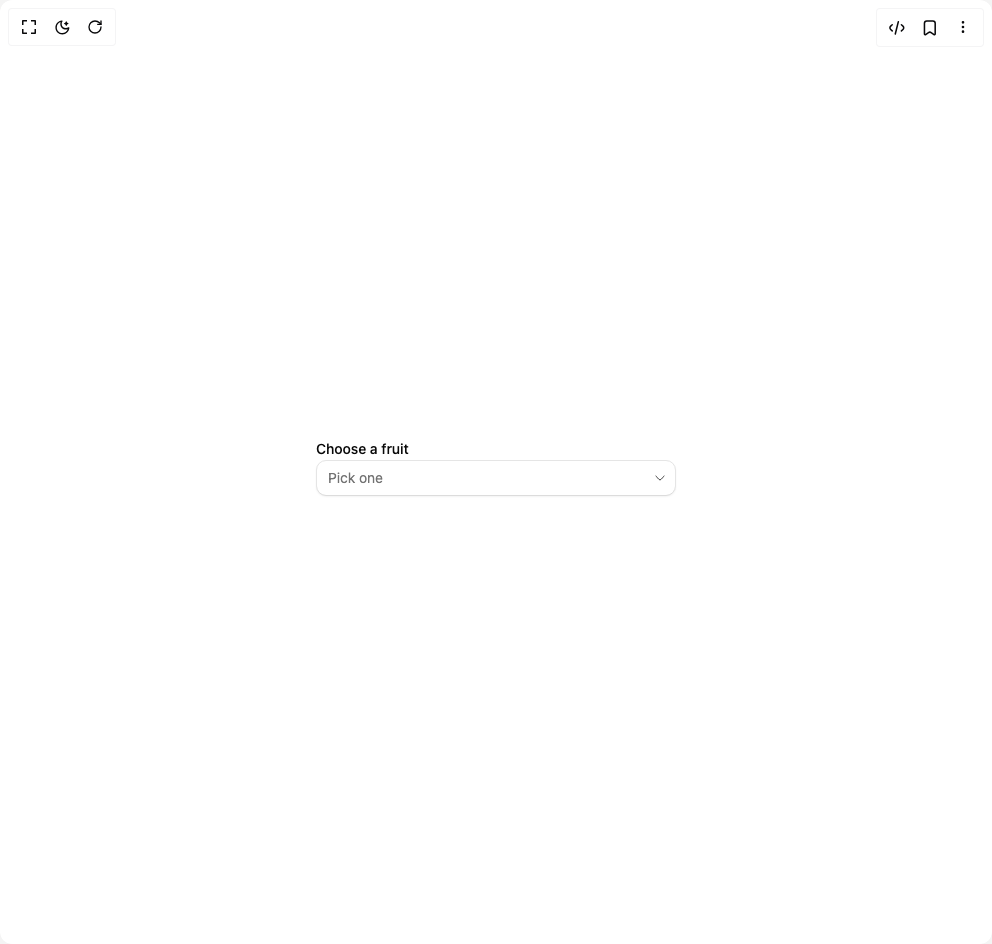

# Build Select in BuilderStudio

> Build this component in our Agentic IDE: [BuilderStudio](https://builderstudio.dev).
>
> Join the BuilderStudio community on [Discord](https://discord.gg/QdWeSGCqfe) and [Reddit](https://reddit.com/r/builderstudio).



## Component

- Author group: `extend-hq`
- Component: `select`
- Variant: `default`
- Rendered HTML snapshot: [`rendered.html`](rendered.html)

## BuilderStudio prompt

You are implementing a React component based on a component reference.

## Component identity

- Author: extend-hq
- Component slug: select
- Demo slug: default
- Title: select
- Description: 

## Goal

Recreate this component in a React + TypeScript + Tailwind CSS project. Preserve the visual layout, spacing, colors, border radius, shadows, interaction behavior, animation behavior, responsive behavior, and dark mode behavior shown in the rendered demo.

## Implementation requirements

- Use React and TypeScript.
- Use Tailwind CSS classes whenever possible.
- Keep the component self-contained unless the source files require helper components.
- If the source uses CSS variables, custom CSS, animations, or keyframes, include them.
- If the source uses external packages, list and use the required packages.
- Preserve accessibility attributes, button semantics, links, keyboard behavior, and ARIA attributes when visible in the source.
- Do not replace the component with a simplified placeholder.
- Return complete production-ready code.

## Dependencies

No reference metadata available.

## Rendered DOM snapshot

This is the rendered demo HTML extracted from the live preview. Use it to verify structure, class names, visible content, and layout.

```html
<div id="root"><div class="w-screen min-h-screen flex justify-center items-center"><div class="w-screen min-h-screen flex justify-center items-center"><div class="flex min-h-screen w-full items-center justify-center bg-background p-8"><div class="w-[360px] space-y-3"><label class="text-sm font-medium text-foreground">Choose a fruit</label><button type="button" data-placeholder="" tabindex="0" id="base-ui-«r0»" role="combobox" aria-expanded="false" aria-haspopup="listbox" data-slot="select-trigger" class="relative inline-flex min-w-36 items-center justify-between gap-2 rounded-lg border border-input bg-background px-[calc(--spacing(3)-1px)] text-left text-base text-foreground shadow-xs/5 ring-ring/24 transition-shadow outline-none select-none not-dark:bg-clip-padding before:pointer-events-none before:absolute before:inset-0 before:rounded-[calc(var(--radius-lg)-1px)] not-data-disabled:not-focus-visible:not-aria-invalid:not-data-pressed:before:shadow-[0_1px_--theme(--color-black/4%)] focus-visible:border-ring focus-visible:ring-[3px] aria-invalid:border-destructive/36 focus-visible:aria-invalid:border-destructive/64 focus-visible:aria-invalid:ring-destructive/16 sm:text-sm dark:bg-input/32 dark:not-data-disabled:not-focus-visible:not-aria-invalid:not-data-pressed:before:shadow-[0_-1px_--theme(--color-white/6%)] dark:aria-invalid:ring-destructive/24 pointer-coarse:after:absolute pointer-coarse:after:size-full pointer-coarse:after:min-h-11 data-disabled:pointer-events-none data-disabled:opacity-64 [&amp;_svg]:pointer-events-none [&amp;_svg]:shrink-0 [&amp;_svg:not([class*='opacity-'])]:opacity-80 [&amp;_svg:not([class*='size-'])]:size-4.5 sm:[&amp;_svg:not([class*='size-'])]:size-4 [[data-disabled],:focus-visible,[aria-invalid],[data-pressed]]:shadow-none min-h-10 sm:min-h-9 w-full"><span data-placeholder="" data-slot="select-value" class="flex-1 truncate data-placeholder:text-muted-foreground">Pick one</span><span aria-hidden="true" data-slot="select-icon"><svg xmlns="http://www.w3.org/2000/svg" width="24" height="24" viewBox="0 0 24 24" fill="none" color="currentColor" class="-me-1 size-4.5 opacity-80 sm:size-4"><path d="M18 9.00005C18 9.00005 13.5811 15 12 15C10.4188 15 6 9 6 9" stroke="currentColor" stroke-linecap="round" stroke-linejoin="round" stroke-width="1.5"></path></svg></span></button><input id="base-ui-«r0»-hidden-input" tabindex="-1" aria-hidden="true" value="" style="clip-path: inset(50%); overflow: hidden; white-space: nowrap; border: 0px; padding: 0px; width: 1px; height: 1px; margin: -1px; position: fixed; top: 0px; left: 0px;"></div></div></div></div></div>
```

## Reference source files

No reference source files were available.
