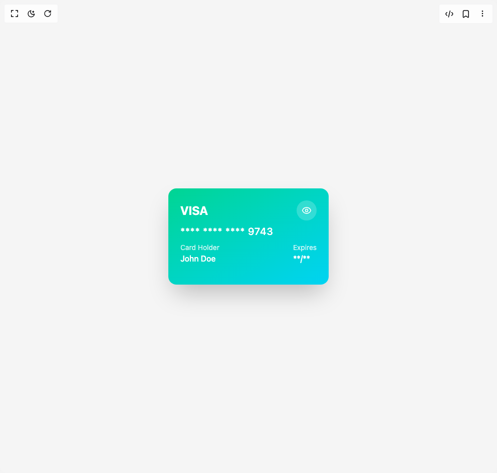

# Build 3d Card 1 in BuilderStudio

> Build this component in our Agentic IDE: [BuilderStudio](https://builderstudio.dev).
>
> Join the BuilderStudio community on [Discord](https://discord.gg/QdWeSGCqfe) and [Reddit](https://reddit.com/r/builderstudio).



## Component

- Author group: `extendui`
- Component: `3d-card-1`
- Variant: `default`
- Rendered HTML snapshot: [`rendered.html`](rendered.html)

## BuilderStudio prompt

You are implementing a React component based on a component reference.

## Component identity

- Author: extendui
- Component slug: 3d-card-1
- Demo slug: default
- Title: 3d-card-1
- Description: 

## Goal

Recreate this component in a React + TypeScript + Tailwind CSS project. Preserve the visual layout, spacing, colors, border radius, shadows, interaction behavior, animation behavior, responsive behavior, and dark mode behavior shown in the rendered demo.

## Implementation requirements

- Use React and TypeScript.
- Use Tailwind CSS classes whenever possible.
- Keep the component self-contained unless the source files require helper components.
- If the source uses CSS variables, custom CSS, animations, or keyframes, include them.
- If the source uses external packages, list and use the required packages.
- Preserve accessibility attributes, button semantics, links, keyboard behavior, and ARIA attributes when visible in the source.
- Do not replace the component with a simplified placeholder.
- Return complete production-ready code.

## Dependencies

No reference metadata available.

## Rendered DOM snapshot

This is the rendered demo HTML extracted from the live preview. Use it to verify structure, class names, visible content, and layout.

```html
<div id="root"><div class="w-screen min-h-screen flex justify-center items-center"><div class="w-screen min-h-screen flex justify-center items-center"><div class="flex w-full h-screen justify-center items-center bg-muted"><div class="flex items-center justify-center p-8"><div class="relative touch-none" style="perspective: 400px; opacity: 1; transform: none;"><div style="transform: none;"><div class="relative h-48 w-80 overflow-hidden rounded-2xl bg-gradient-to-br from-emerald-400 to-cyan-400 p-6 shadow-2xl" style="opacity: 1; transform: none;"><div class="flex items-center justify-between"><div class="flex items-center space-x-2 text-2xl font-bold text-white" style="opacity: 1; transform: none;"><span>VISA</span></div><button class="flex h-10 w-10 items-center justify-center rounded-full bg-white/20 text-white backdrop-blur-xs transition-colors hover:bg-white/30" aria-label="Show card details" style="transform: none;"><svg xmlns="http://www.w3.org/2000/svg" width="24" height="24" viewBox="0 0 24 24" fill="none" stroke="currentColor" stroke-width="2" stroke-linecap="round" stroke-linejoin="round" class="lucide lucide-eye h-5 w-5" aria-hidden="true"><path d="M2.062 12.348a1 1 0 0 1 0-.696 10.75 10.75 0 0 1 19.876 0 1 1 0 0 1 0 .696 10.75 10.75 0 0 1-19.876 0"></path><circle cx="12" cy="12" r="3"></circle></svg></button></div><div class="mt-2 text-xl font-medium tracking-wider text-white" style="opacity: 1;">**** **** **** 9743</div><div class="mt-2 flex justify-between text-white"><div style="opacity: 1; transform: none;"><div class="text-sm opacity-80">Card Holder</div><div class="font-medium">John Doe</div></div><div style="opacity: 1; transform: none;"><div class="text-sm opacity-80">Expires</div><div class="font-medium">**/**</div></div></div></div></div></div></div></div></div></div></div>
```

## Reference source files

No reference source files were available.
