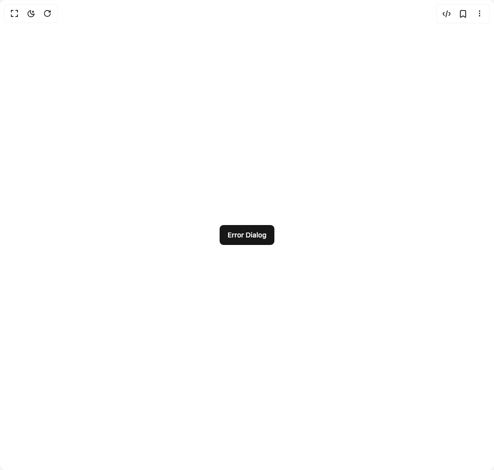
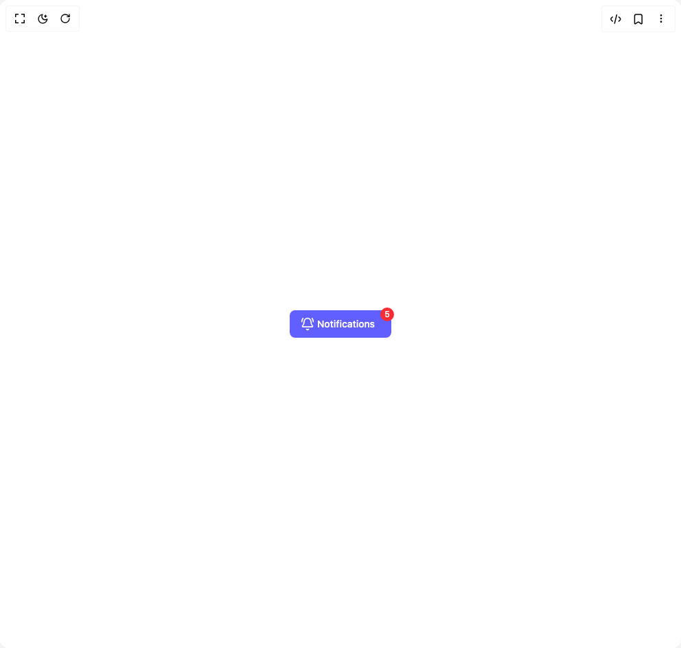
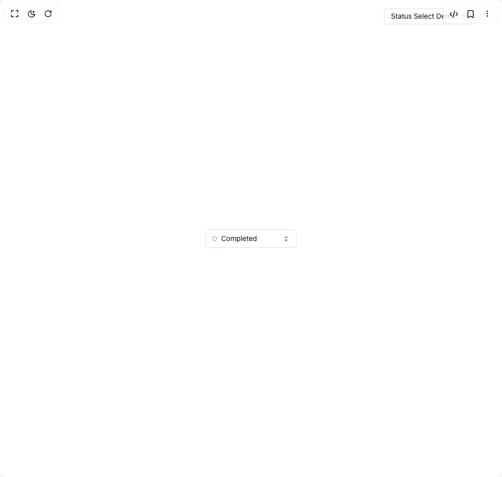

# Extendui Components

5 components are available in this author group.

> Build any component in [BuilderStudio](https://builderstudio.dev), then share improvements with the community on [Discord](https://discord.gg/QdWeSGCqfe) or [Reddit](https://reddit.com/r/builderstudio).

| Preview | Component | Variant |
| --- | --- | --- |
|  | [3d Card 1](3d-card-1/default/README.md) | `default` |
|  | [Alert Dialog Icon](alert-dialog-icon/default/README.md) | `default` |
|  | [Error Alert Dialog](error-alert-dialog/default/README.md) | `default` |
|  | [Notification Alert Dialog](notification-alert-dialog/default/README.md) | `default` |
|  | [Select](select/default/README.md) | `default` |
