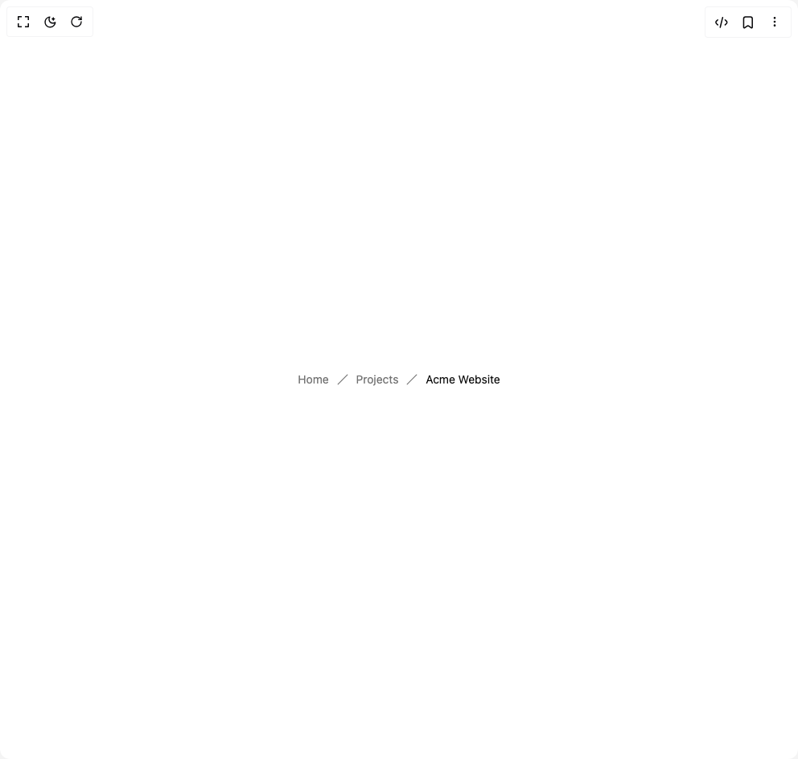

# Build Flexnative Breadcrumb in BuilderStudio

> Build this component in our Agentic IDE: [BuilderStudio](https://builderstudio.dev).
>
> Join the BuilderStudio community on [Discord](https://discord.gg/QdWeSGCqfe) and [Reddit](https://reddit.com/r/builderstudio).



## Component

- Author group: `felipemenezes098`
- Component: `flexnative-breadcrumb`
- Variant: `custom-separator`
- Rendered HTML snapshot: [`rendered.html`](rendered.html)

## BuilderStudio prompt

You are implementing a React component based on a component reference.

## Component identity

- Author: felipemenezes098
- Component slug: flexnative-breadcrumb
- Demo slug: custom-separator
- Title: flexnative-breadcrumb
- Description: 

## Goal

Recreate this component in a React + TypeScript + Tailwind CSS project. Preserve the visual layout, spacing, colors, border radius, shadows, interaction behavior, animation behavior, responsive behavior, and dark mode behavior shown in the rendered demo.

## Implementation requirements

- Use React and TypeScript.
- Use Tailwind CSS classes whenever possible.
- Keep the component self-contained unless the source files require helper components.
- If the source uses CSS variables, custom CSS, animations, or keyframes, include them.
- If the source uses external packages, list and use the required packages.
- Preserve accessibility attributes, button semantics, links, keyboard behavior, and ARIA attributes when visible in the source.
- Do not replace the component with a simplified placeholder.
- Return complete production-ready code.

## Dependencies

No reference metadata available.

## Rendered DOM snapshot

This is the rendered demo HTML extracted from the live preview. Use it to verify structure, class names, visible content, and layout.

```html
<div id="root"><div class="w-screen min-h-screen flex justify-center items-center"><div class="w-screen min-h-screen flex justify-center items-center"><div class="flex min-h-screen w-full items-center justify-center bg-background p-10"><nav aria-label="breadcrumb" data-slot="breadcrumb" class=""><ol data-slot="breadcrumb-list" class="text-muted-foreground flex flex-wrap items-center gap-1.5 text-sm wrap-break-word sm:gap-2.5"><li data-slot="breadcrumb-item" class="inline-flex items-center gap-1.5"><a data-slot="breadcrumb-link" class="hover:text-foreground transition-colors" href="#">Home</a></li><li data-slot="breadcrumb-separator" role="presentation" aria-hidden="true" class="[&amp;&gt;svg]:size-3.5"><svg xmlns="http://www.w3.org/2000/svg" width="24" height="24" viewBox="0 0 24 24" fill="none" stroke="currentColor" stroke-width="2" stroke-linecap="round" stroke-linejoin="round" class="lucide lucide-slash" aria-hidden="true"><path d="M22 2 2 22"></path></svg></li><li data-slot="breadcrumb-item" class="inline-flex items-center gap-1.5"><a data-slot="breadcrumb-link" class="hover:text-foreground transition-colors" href="#">Projects</a></li><li data-slot="breadcrumb-separator" role="presentation" aria-hidden="true" class="[&amp;&gt;svg]:size-3.5"><svg xmlns="http://www.w3.org/2000/svg" width="24" height="24" viewBox="0 0 24 24" fill="none" stroke="currentColor" stroke-width="2" stroke-linecap="round" stroke-linejoin="round" class="lucide lucide-slash" aria-hidden="true"><path d="M22 2 2 22"></path></svg></li><li data-slot="breadcrumb-item" class="inline-flex items-center gap-1.5"><span data-slot="breadcrumb-page" role="link" aria-disabled="true" aria-current="page" class="text-foreground font-normal">Acme Website</span></li></ol></nav></div></div></div></div>
```

## Reference source files

No reference source files were available.
