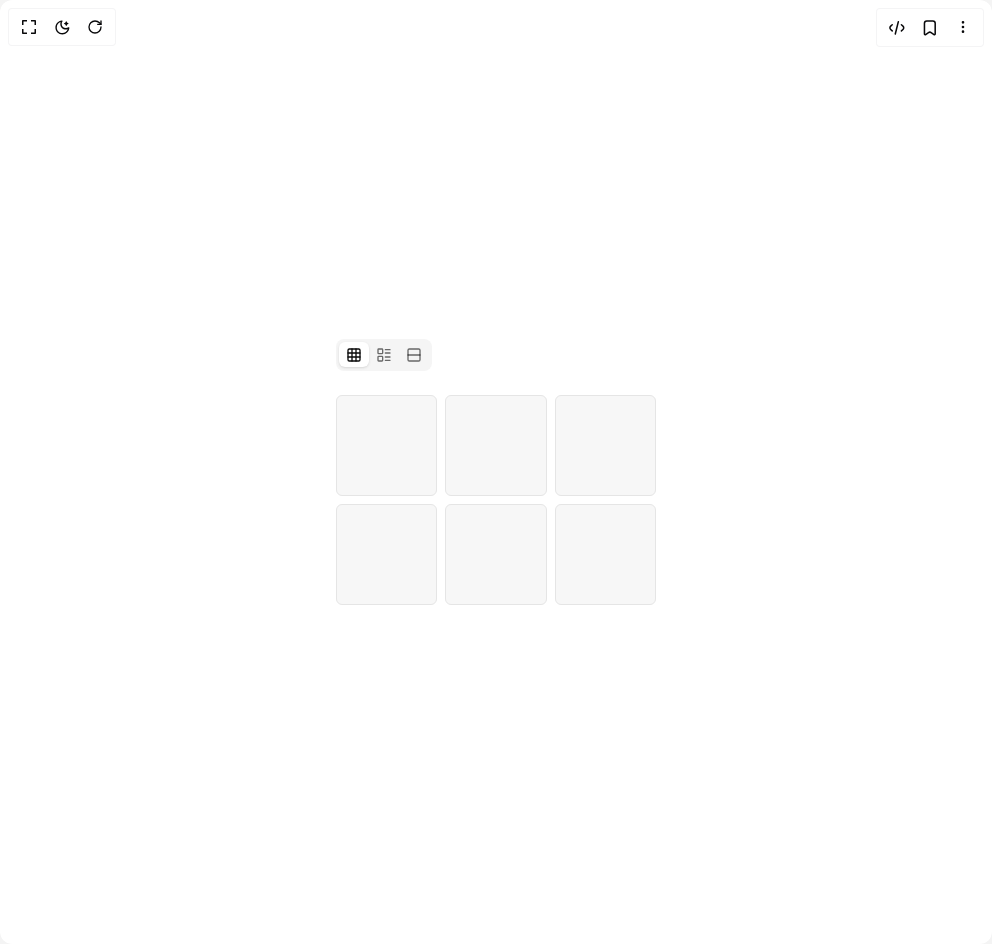

# Build Flexnative Tabs More in BuilderStudio

> Build this component in our Agentic IDE: [BuilderStudio](https://builderstudio.dev).
>
> Join the BuilderStudio community on [Discord](https://discord.gg/QdWeSGCqfe) and [Reddit](https://reddit.com/r/builderstudio).



## Component

- Author group: `felipemenezes098`
- Component: `flexnative-tabs-more`
- Variant: `icon-only`
- Rendered HTML snapshot: [`rendered.html`](rendered.html)

## BuilderStudio prompt

You are implementing a React component based on a component reference.

## Component identity

- Author: felipemenezes098
- Component slug: flexnative-tabs-more
- Demo slug: icon-only
- Title: flexnative-tabs-more
- Description: 

## Goal

Recreate this component in a React + TypeScript + Tailwind CSS project. Preserve the visual layout, spacing, colors, border radius, shadows, interaction behavior, animation behavior, responsive behavior, and dark mode behavior shown in the rendered demo.

## Implementation requirements

- Use React and TypeScript.
- Use Tailwind CSS classes whenever possible.
- Keep the component self-contained unless the source files require helper components.
- If the source uses CSS variables, custom CSS, animations, or keyframes, include them.
- If the source uses external packages, list and use the required packages.
- Preserve accessibility attributes, button semantics, links, keyboard behavior, and ARIA attributes when visible in the source.
- Do not replace the component with a simplified placeholder.
- Return complete production-ready code.

## Dependencies

No reference metadata available.

## Rendered DOM snapshot

This is the rendered demo HTML extracted from the live preview. Use it to verify structure, class names, visible content, and layout.

```html
<div id="root"><div class="w-screen min-h-screen flex justify-center items-center"><div class="w-screen min-h-screen flex justify-center items-center"><div class="flex min-h-screen w-full items-center justify-center bg-background p-10"><div data-slot="tabs" data-orientation="horizontal" class="group/tabs flex gap-2 data-horizontal:flex-col w-full max-w-xs"><div role="tablist" data-slot="tabs-list" data-variant="default" aria-orientation="horizontal" class="group/tabs-list inline-flex w-fit items-center justify-center rounded-lg p-[3px] text-muted-foreground group-data-horizontal/tabs:h-8 group-data-vertical/tabs:h-fit group-data-vertical/tabs:flex-col data-[variant=line]:rounded-none bg-muted"><button type="button" role="tab" data-slot="tabs-trigger" data-state="active" aria-selected="true" tabindex="0" class="text-foreground/60 hover:text-foreground focus-visible:border-ring focus-visible:ring-ring/50 focus-visible:outline-ring dark:text-muted-foreground dark:hover:text-foreground relative inline-flex h-[calc(100%-1px)] flex-1 items-center justify-center gap-1.5 rounded-md border border-transparent px-1.5 py-0.5 text-sm font-medium whitespace-nowrap transition-all group-data-vertical/tabs:w-full group-data-vertical/tabs:justify-start focus-visible:ring-[3px] focus-visible:outline-1 disabled:pointer-events-none disabled:opacity-50 has-data-[icon=inline-end]:pr-1 has-data-[icon=inline-start]:pl-1 group-data-[variant=default]/tabs-list:data-active:shadow-sm group-data-[variant=line]/tabs-list:data-active:shadow-none [&amp;_svg]:pointer-events-none [&amp;_svg]:shrink-0 [&amp;_svg:not([class*='size-'])]:size-4 group-data-[variant=line]/tabs-list:bg-transparent group-data-[variant=line]/tabs-list:data-active:bg-transparent dark:group-data-[variant=line]/tabs-list:data-active:border-transparent dark:group-data-[variant=line]/tabs-list:data-active:bg-transparent data-active:bg-background data-active:text-foreground dark:data-active:border-input dark:data-active:bg-input/30 dark:data-active:text-foreground after:bg-foreground after:absolute after:opacity-0 after:transition-opacity group-data-horizontal/tabs:after:inset-x-0 group-data-horizontal/tabs:after:bottom-[-5px] group-data-horizontal/tabs:after:h-0.5 group-data-vertical/tabs:after:inset-y-0 group-data-vertical/tabs:after:-right-1 group-data-vertical/tabs:after:w-0.5 group-data-[variant=line]/tabs-list:data-active:after:opacity-100" aria-label="Grid view"><svg xmlns="http://www.w3.org/2000/svg" width="24" height="24" viewBox="0 0 24 24" fill="none" stroke="currentColor" stroke-width="2" stroke-linecap="round" stroke-linejoin="round" class="lucide lucide-grid3x3 lucide-grid-3x3" aria-hidden="true"><rect width="18" height="18" x="3" y="3" rx="2"></rect><path d="M3 9h18"></path><path d="M3 15h18"></path><path d="M9 3v18"></path><path d="M15 3v18"></path></svg></button><button type="button" role="tab" data-slot="tabs-trigger" data-state="inactive" aria-selected="false" tabindex="-1" class="text-foreground/60 hover:text-foreground focus-visible:border-ring focus-visible:ring-ring/50 focus-visible:outline-ring dark:text-muted-foreground dark:hover:text-foreground relative inline-flex h-[calc(100%-1px)] flex-1 items-center justify-center gap-1.5 rounded-md border border-transparent px-1.5 py-0.5 text-sm font-medium whitespace-nowrap transition-all group-data-vertical/tabs:w-full group-data-vertical/tabs:justify-start focus-visible:ring-[3px] focus-visible:outline-1 disabled:pointer-events-none disabled:opacity-50 has-data-[icon=inline-end]:pr-1 has-data-[icon=inline-start]:pl-1 group-data-[variant=default]/tabs-list:data-active:shadow-sm group-data-[variant=line]/tabs-list:data-active:shadow-none [&amp;_svg]:pointer-events-none [&amp;_svg]:shrink-0 [&amp;_svg:not([class*='size-'])]:size-4 group-data-[variant=line]/tabs-list:bg-transparent group-data-[variant=line]/tabs-list:data-active:bg-transparent dark:group-data-[variant=line]/tabs-list:data-active:border-transparent dark:group-data-[variant=line]/tabs-list:data-active:bg-transparent data-active:bg-background data-active:text-foreground dark:data-active:border-input dark:data-active:bg-input/30 dark:data-active:text-foreground after:bg-foreground after:absolute after:opacity-0 after:transition-opacity group-data-horizontal/tabs:after:inset-x-0 group-data-horizontal/tabs:after:bottom-[-5px] group-data-horizontal/tabs:after:h-0.5 group-data-vertical/tabs:after:inset-y-0 group-data-vertical/tabs:after:-right-1 group-data-vertical/tabs:after:w-0.5 group-data-[variant=line]/tabs-list:data-active:after:opacity-100" aria-label="List view"><svg xmlns="http://www.w3.org/2000/svg" width="24" height="24" viewBox="0 0 24 24" fill="none" stroke="currentColor" stroke-width="2" stroke-linecap="round" stroke-linejoin="round" class="lucide lucide-layout-list" aria-hidden="true"><rect width="7" height="7" x="3" y="3" rx="1"></rect><rect width="7" height="7" x="3" y="14" rx="1"></rect><path d="M14 4h7"></path><path d="M14 9h7"></path><path d="M14 15h7"></path><path d="M14 20h7"></path></svg></button><button type="button" role="tab" data-slot="tabs-trigger" data-state="inactive" aria-selected="false" tabindex="-1" class="text-foreground/60 hover:text-foreground focus-visible:border-ring focus-visible:ring-ring/50 focus-visible:outline-ring dark:text-muted-foreground dark:hover:text-foreground relative inline-flex h-[calc(100%-1px)] flex-1 items-center justify-center gap-1.5 rounded-md border border-transparent px-1.5 py-0.5 text-sm font-medium whitespace-nowrap transition-all group-data-vertical/tabs:w-full group-data-vertical/tabs:justify-start focus-visible:ring-[3px] focus-visible:outline-1 disabled:pointer-events-none disabled:opacity-50 has-data-[icon=inline-end]:pr-1 has-data-[icon=inline-start]:pl-1 group-data-[variant=default]/tabs-list:data-active:shadow-sm group-data-[variant=line]/tabs-list:data-active:shadow-none [&amp;_svg]:pointer-events-none [&amp;_svg]:shrink-0 [&amp;_svg:not([class*='size-'])]:size-4 group-data-[variant=line]/tabs-list:bg-transparent group-data-[variant=line]/tabs-list:data-active:bg-transparent dark:group-data-[variant=line]/tabs-list:data-active:border-transparent dark:group-data-[variant=line]/tabs-list:data-active:bg-transparent data-active:bg-background data-active:text-foreground dark:data-active:border-input dark:data-active:bg-input/30 dark:data-active:text-foreground after:bg-foreground after:absolute after:opacity-0 after:transition-opacity group-data-horizontal/tabs:after:inset-x-0 group-data-horizontal/tabs:after:bottom-[-5px] group-data-horizontal/tabs:after:h-0.5 group-data-vertical/tabs:after:inset-y-0 group-data-vertical/tabs:after:-right-1 group-data-vertical/tabs:after:w-0.5 group-data-[variant=line]/tabs-list:data-active:after:opacity-100" aria-label="Rows view"><svg xmlns="http://www.w3.org/2000/svg" width="24" height="24" viewBox="0 0 24 24" fill="none" stroke="currentColor" stroke-width="2" stroke-linecap="round" stroke-linejoin="round" class="lucide lucide-rows2 lucide-rows-2" aria-hidden="true"><rect width="18" height="18" x="3" y="3" rx="2"></rect><path d="M3 12h18"></path></svg></button></div><div role="tabpanel" data-slot="tabs-content" data-state="active" data-orientation="horizontal" class="flex-1 text-sm outline-none w-full pt-4"><div class="grid w-full grid-cols-3 gap-2"><div class="bg-muted/80 aspect-square rounded-md border"></div><div class="bg-muted/80 aspect-square rounded-md border"></div><div class="bg-muted/80 aspect-square rounded-md border"></div><div class="bg-muted/80 aspect-square rounded-md border"></div><div class="bg-muted/80 aspect-square rounded-md border"></div><div class="bg-muted/80 aspect-square rounded-md border"></div></div></div></div></div></div></div></div>
```

## Reference source files

No reference source files were available.
