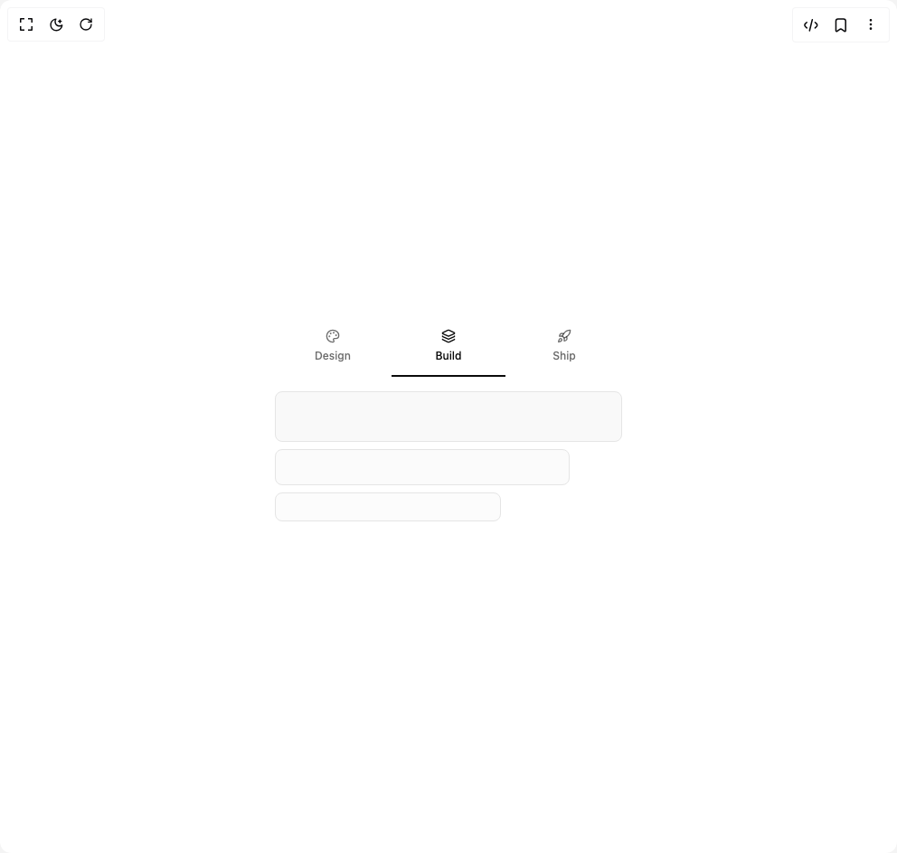

# Build Flexnative Tabs More in BuilderStudio

> Build this component in our Agentic IDE: [BuilderStudio](https://builderstudio.dev).
>
> Join the BuilderStudio community on [Discord](https://discord.gg/QdWeSGCqfe) and [Reddit](https://reddit.com/r/builderstudio).



## Component

- Author group: `felipemenezes098`
- Component: `flexnative-tabs-more`
- Variant: `icon-with-title`
- Rendered HTML snapshot: [`rendered.html`](rendered.html)

## BuilderStudio prompt

You are implementing a React component based on a component reference.

## Component identity

- Author: felipemenezes098
- Component slug: flexnative-tabs-more
- Demo slug: icon-with-title
- Title: flexnative-tabs-more
- Description: 

## Goal

Recreate this component in a React + TypeScript + Tailwind CSS project. Preserve the visual layout, spacing, colors, border radius, shadows, interaction behavior, animation behavior, responsive behavior, and dark mode behavior shown in the rendered demo.

## Implementation requirements

- Use React and TypeScript.
- Use Tailwind CSS classes whenever possible.
- Keep the component self-contained unless the source files require helper components.
- If the source uses CSS variables, custom CSS, animations, or keyframes, include them.
- If the source uses external packages, list and use the required packages.
- Preserve accessibility attributes, button semantics, links, keyboard behavior, and ARIA attributes when visible in the source.
- Do not replace the component with a simplified placeholder.
- Return complete production-ready code.

## Dependencies

No reference metadata available.

## Rendered DOM snapshot

This is the rendered demo HTML extracted from the live preview. Use it to verify structure, class names, visible content, and layout.

```html
<div id="root"><div class="w-screen min-h-screen flex justify-center items-center"><div class="w-screen min-h-screen flex justify-center items-center"><div class="flex min-h-screen w-full items-center justify-center bg-background p-10"><div data-slot="tabs" data-orientation="horizontal" class="group/tabs flex gap-2 data-horizontal:flex-col w-full max-w-sm"><div role="tablist" data-slot="tabs-list" data-variant="line" aria-orientation="horizontal" class="group/tabs-list inline-flex items-center justify-center rounded-lg text-muted-foreground group-data-horizontal/tabs:h-8 group-data-vertical/tabs:h-fit group-data-vertical/tabs:flex-col data-[variant=line]:rounded-none bg-transparent mb-2.5 h-auto w-full gap-0 p-0"><button type="button" role="tab" data-slot="tabs-trigger" data-state="inactive" aria-selected="false" tabindex="-1" class="text-foreground/60 hover:text-foreground focus-visible:border-ring focus-visible:ring-ring/50 focus-visible:outline-ring dark:text-muted-foreground dark:hover:text-foreground relative inline-flex items-center justify-center rounded-md border border-transparent text-sm font-medium whitespace-nowrap transition-all group-data-vertical/tabs:w-full group-data-vertical/tabs:justify-start focus-visible:ring-[3px] focus-visible:outline-1 disabled:pointer-events-none disabled:opacity-50 has-data-[icon=inline-end]:pr-1 has-data-[icon=inline-start]:pl-1 group-data-[variant=default]/tabs-list:data-active:shadow-sm group-data-[variant=line]/tabs-list:data-active:shadow-none [&amp;_svg]:pointer-events-none [&amp;_svg]:shrink-0 [&amp;_svg:not([class*='size-'])]:size-4 group-data-[variant=line]/tabs-list:bg-transparent group-data-[variant=line]/tabs-list:data-active:bg-transparent dark:group-data-[variant=line]/tabs-list:data-active:border-transparent dark:group-data-[variant=line]/tabs-list:data-active:bg-transparent data-active:bg-background data-active:text-foreground dark:data-active:border-input dark:data-active:bg-input/30 dark:data-active:text-foreground after:bg-foreground after:absolute after:opacity-0 after:transition-opacity group-data-horizontal/tabs:after:inset-x-0 group-data-horizontal/tabs:after:bottom-[-5px] group-data-horizontal/tabs:after:h-0.5 group-data-vertical/tabs:after:inset-y-0 group-data-vertical/tabs:after:-right-1 group-data-vertical/tabs:after:w-0.5 group-data-[variant=line]/tabs-list:data-active:after:opacity-100 h-auto min-w-0 flex-1 flex-col gap-1.5 px-2 py-2.5"><svg xmlns="http://www.w3.org/2000/svg" width="24" height="24" viewBox="0 0 24 24" fill="none" stroke="currentColor" stroke-width="2" stroke-linecap="round" stroke-linejoin="round" class="lucide lucide-palette size-4 shrink-0" aria-hidden="true"><path d="M12 22a1 1 0 0 1 0-20 10 9 0 0 1 10 9 5 5 0 0 1-5 5h-2.25a1.75 1.75 0 0 0-1.4 2.8l.3.4a1.75 1.75 0 0 1-1.4 2.8z"></path><circle cx="13.5" cy="6.5" r=".5" fill="currentColor"></circle><circle cx="17.5" cy="10.5" r=".5" fill="currentColor"></circle><circle cx="6.5" cy="12.5" r=".5" fill="currentColor"></circle><circle cx="8.5" cy="7.5" r=".5" fill="currentColor"></circle></svg><span class="text-xs font-medium">Design</span></button><button type="button" role="tab" data-slot="tabs-trigger" data-state="active" aria-selected="true" tabindex="0" class="text-foreground/60 hover:text-foreground focus-visible:border-ring focus-visible:ring-ring/50 focus-visible:outline-ring dark:text-muted-foreground dark:hover:text-foreground relative inline-flex items-center justify-center rounded-md border border-transparent text-sm font-medium whitespace-nowrap transition-all group-data-vertical/tabs:w-full group-data-vertical/tabs:justify-start focus-visible:ring-[3px] focus-visible:outline-1 disabled:pointer-events-none disabled:opacity-50 has-data-[icon=inline-end]:pr-1 has-data-[icon=inline-start]:pl-1 group-data-[variant=default]/tabs-list:data-active:shadow-sm group-data-[variant=line]/tabs-list:data-active:shadow-none [&amp;_svg]:pointer-events-none [&amp;_svg]:shrink-0 [&amp;_svg:not([class*='size-'])]:size-4 group-data-[variant=line]/tabs-list:bg-transparent group-data-[variant=line]/tabs-list:data-active:bg-transparent dark:group-data-[variant=line]/tabs-list:data-active:border-transparent dark:group-data-[variant=line]/tabs-list:data-active:bg-transparent data-active:bg-background data-active:text-foreground dark:data-active:border-input dark:data-active:bg-input/30 dark:data-active:text-foreground after:bg-foreground after:absolute after:opacity-0 after:transition-opacity group-data-horizontal/tabs:after:inset-x-0 group-data-horizontal/tabs:after:bottom-[-5px] group-data-horizontal/tabs:after:h-0.5 group-data-vertical/tabs:after:inset-y-0 group-data-vertical/tabs:after:-right-1 group-data-vertical/tabs:after:w-0.5 group-data-[variant=line]/tabs-list:data-active:after:opacity-100 h-auto min-w-0 flex-1 flex-col gap-1.5 px-2 py-2.5"><svg xmlns="http://www.w3.org/2000/svg" width="24" height="24" viewBox="0 0 24 24" fill="none" stroke="currentColor" stroke-width="2" stroke-linecap="round" stroke-linejoin="round" class="lucide lucide-layers size-4 shrink-0" aria-hidden="true"><path d="M12.83 2.18a2 2 0 0 0-1.66 0L2.6 6.08a1 1 0 0 0 0 1.83l8.58 3.91a2 2 0 0 0 1.66 0l8.58-3.9a1 1 0 0 0 0-1.83z"></path><path d="M2 12a1 1 0 0 0 .58.91l8.6 3.91a2 2 0 0 0 1.65 0l8.58-3.9A1 1 0 0 0 22 12"></path><path d="M2 17a1 1 0 0 0 .58.91l8.6 3.91a2 2 0 0 0 1.65 0l8.58-3.9A1 1 0 0 0 22 17"></path></svg><span class="text-xs font-medium">Build</span></button><button type="button" role="tab" data-slot="tabs-trigger" data-state="inactive" aria-selected="false" tabindex="-1" class="text-foreground/60 hover:text-foreground focus-visible:border-ring focus-visible:ring-ring/50 focus-visible:outline-ring dark:text-muted-foreground dark:hover:text-foreground relative inline-flex items-center justify-center rounded-md border border-transparent text-sm font-medium whitespace-nowrap transition-all group-data-vertical/tabs:w-full group-data-vertical/tabs:justify-start focus-visible:ring-[3px] focus-visible:outline-1 disabled:pointer-events-none disabled:opacity-50 has-data-[icon=inline-end]:pr-1 has-data-[icon=inline-start]:pl-1 group-data-[variant=default]/tabs-list:data-active:shadow-sm group-data-[variant=line]/tabs-list:data-active:shadow-none [&amp;_svg]:pointer-events-none [&amp;_svg]:shrink-0 [&amp;_svg:not([class*='size-'])]:size-4 group-data-[variant=line]/tabs-list:bg-transparent group-data-[variant=line]/tabs-list:data-active:bg-transparent dark:group-data-[variant=line]/tabs-list:data-active:border-transparent dark:group-data-[variant=line]/tabs-list:data-active:bg-transparent data-active:bg-background data-active:text-foreground dark:data-active:border-input dark:data-active:bg-input/30 dark:data-active:text-foreground after:bg-foreground after:absolute after:opacity-0 after:transition-opacity group-data-horizontal/tabs:after:inset-x-0 group-data-horizontal/tabs:after:bottom-[-5px] group-data-horizontal/tabs:after:h-0.5 group-data-vertical/tabs:after:inset-y-0 group-data-vertical/tabs:after:-right-1 group-data-vertical/tabs:after:w-0.5 group-data-[variant=line]/tabs-list:data-active:after:opacity-100 h-auto min-w-0 flex-1 flex-col gap-1.5 px-2 py-2.5"><svg xmlns="http://www.w3.org/2000/svg" width="24" height="24" viewBox="0 0 24 24" fill="none" stroke="currentColor" stroke-width="2" stroke-linecap="round" stroke-linejoin="round" class="lucide lucide-rocket size-4 shrink-0" aria-hidden="true"><path d="M4.5 16.5c-1.5 1.26-2 5-2 5s3.74-.5 5-2c.71-.84.7-2.13-.09-2.91a2.18 2.18 0 0 0-2.91-.09z"></path><path d="m12 15-3-3a22 22 0 0 1 2-3.95A12.88 12.88 0 0 1 22 2c0 2.72-.78 7.5-6 11a22.35 22.35 0 0 1-4 2z"></path><path d="M9 12H4s.55-3.03 2-4c1.62-1.08 5 0 5 0"></path><path d="M12 15v5s3.03-.55 4-2c1.08-1.62 0-5 0-5"></path></svg><span class="text-xs font-medium">Ship</span></button></div><div role="tabpanel" data-slot="tabs-content" data-state="active" data-orientation="horizontal" class="flex-1 text-sm outline-none w-full pt-4"><div class="w-full space-y-2"><div class="bg-muted/60 h-14 w-full rounded-lg border"></div><div class="bg-muted/40 h-10 w-[85%] rounded-lg border"></div><div class="bg-muted/25 h-8 w-[65%] rounded-lg border"></div></div></div></div></div></div></div></div>
```

## Reference source files

No reference source files were available.
