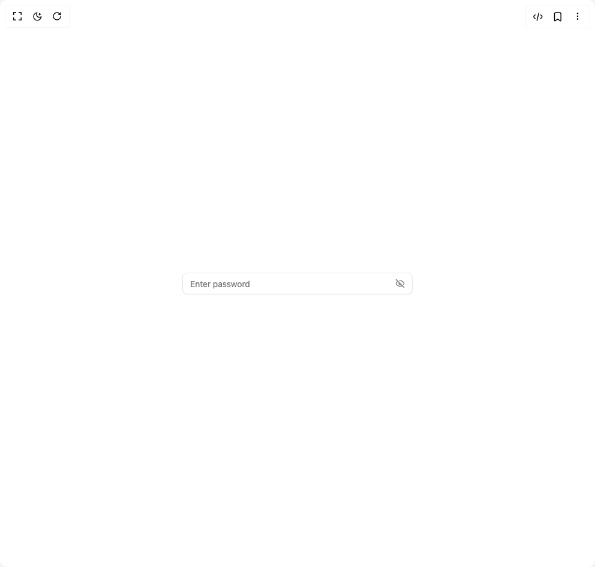

# Build The Input in BuilderStudio

> Build this component in our Agentic IDE: [BuilderStudio](https://builderstudio.dev).
>
> Join the BuilderStudio community on [Discord](https://discord.gg/QdWeSGCqfe) and [Reddit](https://reddit.com/r/builderstudio).



## Component

- Author group: `felipemenezes098`
- Component: `the-input`
- Variant: `with-addon-in-the-end`
- Rendered HTML snapshot: [`rendered.html`](rendered.html)

## BuilderStudio prompt

You are implementing a React component based on a component reference.

## Component identity

- Author: felipemenezes098
- Component slug: the-input
- Demo slug: with-addon-in-the-end
- Title: the-input
- Description: 

## Goal

Recreate this component in a React + TypeScript + Tailwind CSS project. Preserve the visual layout, spacing, colors, border radius, shadows, interaction behavior, animation behavior, responsive behavior, and dark mode behavior shown in the rendered demo.

## Implementation requirements

- Use React and TypeScript.
- Use Tailwind CSS classes whenever possible.
- Keep the component self-contained unless the source files require helper components.
- If the source uses CSS variables, custom CSS, animations, or keyframes, include them.
- If the source uses external packages, list and use the required packages.
- Preserve accessibility attributes, button semantics, links, keyboard behavior, and ARIA attributes when visible in the source.
- Do not replace the component with a simplified placeholder.
- Return complete production-ready code.

## Dependencies

No reference metadata available.

## Rendered DOM snapshot

This is the rendered demo HTML extracted from the live preview. Use it to verify structure, class names, visible content, and layout.

```html
<div id="root"><div class="w-screen min-h-screen flex justify-center items-center"><div class="w-screen min-h-screen flex justify-center items-center"><div data-slot="input-group" role="group" class="group/input-group border-input dark:bg-input/30 relative flex w-full items-center rounded-md border shadow-xs transition-[color,box-shadow] outline-none h-9 min-w-0 has-[&gt;textarea]:h-auto has-[&gt;[data-align=inline-start]]:[&amp;&gt;input]:pl-2 has-[&gt;[data-align=inline-end]]:[&amp;&gt;input]:pr-2 has-[&gt;[data-align=block-start]]:h-auto has-[&gt;[data-align=block-start]]:flex-col has-[&gt;[data-align=block-start]]:[&amp;&gt;input]:pb-3 has-[&gt;[data-align=block-end]]:h-auto has-[&gt;[data-align=block-end]]:flex-col has-[&gt;[data-align=block-end]]:[&amp;&gt;input]:pt-3 has-[[data-slot=input-group-control]:focus-visible]:border-ring has-[[data-slot=input-group-control]:focus-visible]:ring-ring/50 has-[[data-slot=input-group-control]:focus-visible]:ring-[3px] has-[[data-slot][aria-invalid=true]]:ring-destructive/20 has-[[data-slot][aria-invalid=true]]:border-destructive dark:has-[[data-slot][aria-invalid=true]]:ring-destructive/40 mx-4 max-w-sm hover:border-ring hover:ring-[3px] hover:ring-ring/20 focus-within:border-ring focus-within:ring-[3px] focus- within:ring-ring/20"><input class="flex h-10 w-full border-input px-3 py-2 text-sm ring-offset-background file:border-0 file:bg-transparent file:text-sm file:font-medium file:text-foreground placeholder:text-muted-foreground focus-visible:outline-none focus-visible:ring-ring disabled:cursor-not-allowed disabled:opacity-50 flex-1 rounded-none dark:bg-transparent border-0 bg-transparent shadow-none outline-none focus-visible:border-transparent focus-visible:ring-0 focus-visible:ring-offset-0" data-slot="input-group-control" placeholder="Enter password" type="password"><div role="group" data-slot="input-group-addon" data-align="inline-end" class="text-muted-foreground flex h-auto cursor-text items-center justify-center gap-2 py-1.5 text-sm font-medium select-none [&amp;&gt;svg:not([class*='size-'])]:size-4 [&amp;&gt;kbd]:rounded-[calc(var(--radius)-5px)] group-data-[disabled=true]/input-group:opacity-50 order-last pr-3 has-[&gt;button]:mr-[-0.45rem] has-[&gt;kbd]:mr-[-0.35rem] border-0 bg-transparent"><svg xmlns="http://www.w3.org/2000/svg" width="24" height="24" viewBox="0 0 24 24" fill="none" stroke="currentColor" stroke-width="2" stroke-linecap="round" stroke-linejoin="round" class="lucide lucide-eye-off" aria-hidden="true"><path d="M10.733 5.076a10.744 10.744 0 0 1 11.205 6.575 1 1 0 0 1 0 .696 10.747 10.747 0 0 1-1.444 2.49"></path><path d="M14.084 14.158a3 3 0 0 1-4.242-4.242"></path><path d="M17.479 17.499a10.75 10.75 0 0 1-15.417-5.151 1 1 0 0 1 0-.696 10.75 10.75 0 0 1 4.446-5.143"></path><path d="m2 2 20 20"></path></svg></div></div></div></div></div>
```

## Reference source files

No reference source files were available.
