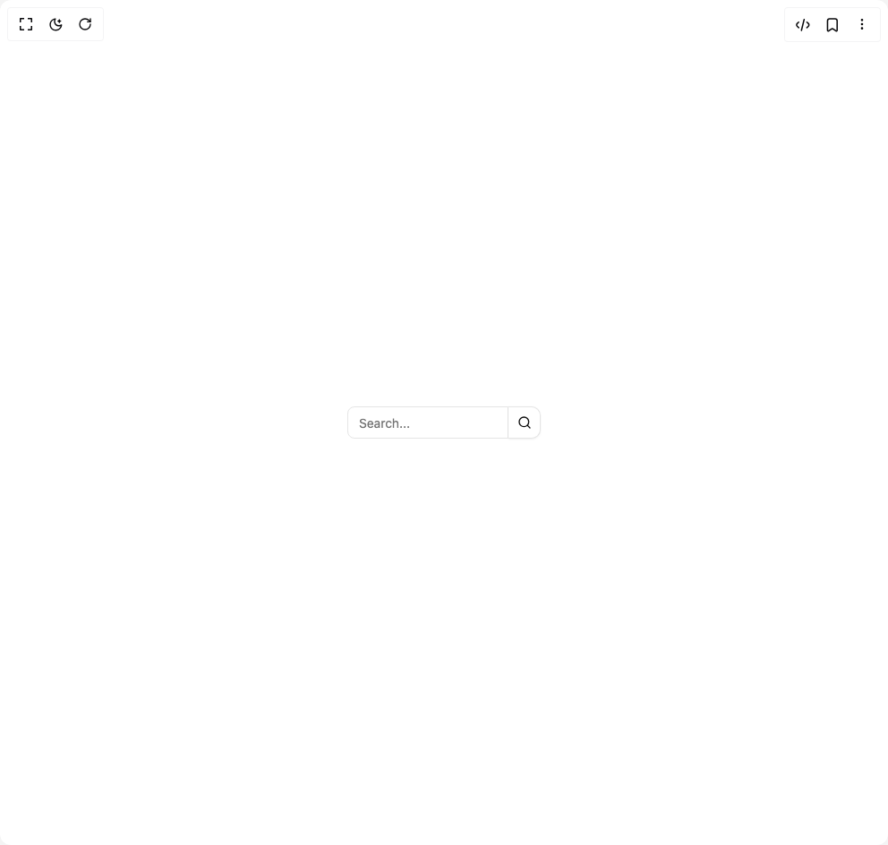

# Build The Input in BuilderStudio

> Build this component in our Agentic IDE: [BuilderStudio](https://builderstudio.dev).
>
> Join the BuilderStudio community on [Discord](https://discord.gg/QdWeSGCqfe) and [Reddit](https://reddit.com/r/builderstudio).



## Component

- Author group: `felipemenezes098`
- Component: `the-input`
- Variant: `with-search-button`
- Rendered HTML snapshot: [`rendered.html`](rendered.html)

## BuilderStudio prompt

You are implementing a React component based on a component reference.

## Component identity

- Author: felipemenezes098
- Component slug: the-input
- Demo slug: with-search-button
- Title: the-input
- Description: 

## Goal

Recreate this component in a React + TypeScript + Tailwind CSS project. Preserve the visual layout, spacing, colors, border radius, shadows, interaction behavior, animation behavior, responsive behavior, and dark mode behavior shown in the rendered demo.

## Implementation requirements

- Use React and TypeScript.
- Use Tailwind CSS classes whenever possible.
- Keep the component self-contained unless the source files require helper components.
- If the source uses CSS variables, custom CSS, animations, or keyframes, include them.
- If the source uses external packages, list and use the required packages.
- Preserve accessibility attributes, button semantics, links, keyboard behavior, and ARIA attributes when visible in the source.
- Do not replace the component with a simplified placeholder.
- Return complete production-ready code.

## Dependencies

No reference metadata available.

## Rendered DOM snapshot

This is the rendered demo HTML extracted from the live preview. Use it to verify structure, class names, visible content, and layout.

```html
<div id="root"><div class="w-screen min-h-screen flex justify-center items-center"><div class="w-screen min-h-screen flex justify-center items-center"><div role="group" data-slot="button-group" class="w-fit items-stretch [&amp;&gt;*]:focus-visible:z-10 [&amp;&gt;*]:focus-visible:relative [&amp;&gt;[data-slot=select-trigger]:not([class*='w-'])]:w-fit [&amp;&gt;input]:flex-1 has-[select[aria-hidden=true]:last-child]:[&amp;&gt;[data-slot=select-trigger]:last-of-type]:rounded-r-md has-[&gt;[data-slot=button-group]]:gap-2 [&amp;&gt;*:not(:first-child)]:rounded-l-none [&amp;&gt;*:not(:first-child)]:border-l-0 [&amp;&gt;*:not(:last-child)]:rounded-r-none mx-auto flex max-w-sm"><input class="flex w-full rounded-md border border-input bg-background px-3 py-2 text-sm ring-offset-background file:border-0 file:bg-transparent file:text-sm file:font-medium file:text-foreground placeholder:text-muted-foreground focus-visible:outline-none focus-visible:ring-2 focus-visible:ring-ring focus-visible:ring-offset-2 disabled:cursor-not-allowed disabled:opacity-50 h-9 flex-1" placeholder="Search..."><button class="inline-flex items-center justify-center whitespace-nowrap rounded-lg text-sm font-medium transition-colors outline-offset-2 focus-visible:outline-2 focus-visible:outline-ring/70 disabled:pointer-events-none disabled:opacity-50 [&amp;_svg]:pointer-events-none [&amp;_svg]:shrink-0 border border-input bg-background shadow-sm shadow-black/5 hover:bg-accent hover:text-accent-foreground py-2 h-9 w-9 shrink-0 px-0" aria-label="Search"><svg xmlns="http://www.w3.org/2000/svg" width="24" height="24" viewBox="0 0 24 24" fill="none" stroke="currentColor" stroke-width="2" stroke-linecap="round" stroke-linejoin="round" class="lucide lucide-search size-4" aria-hidden="true"><circle cx="11" cy="11" r="8"></circle><path d="m21 21-4.3-4.3"></path></svg></button></div></div></div></div>
```

## Reference source files

No reference source files were available.
