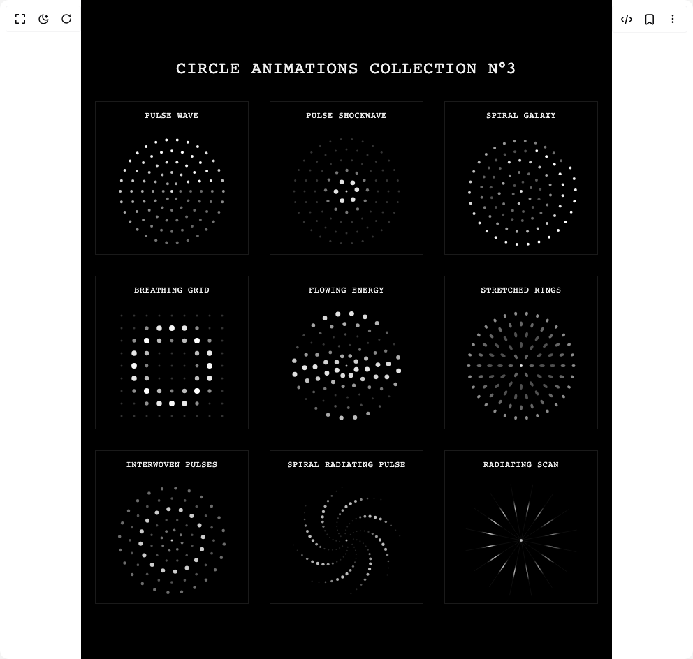

# Build Circle Animations Collection 3 in BuilderStudio

> Build this component in our Agentic IDE: [BuilderStudio](https://builderstudio.dev).
>
> Join the BuilderStudio community on [Discord](https://discord.gg/QdWeSGCqfe) and [Reddit](https://reddit.com/r/builderstudio).



## Component

- Author group: `filipz`
- Component: `circle-animations-collection-3`
- Variant: `default`
- Rendered HTML snapshot: [`rendered.html`](rendered.html)

## BuilderStudio prompt

You are implementing a React component based on a component reference.

## Component identity

- Author: filipz
- Component slug: circle-animations-collection-3
- Demo slug: default
- Title: circle-animations-collection-3
- Description: 

## Goal

Recreate this component in a React + TypeScript + Tailwind CSS project. Preserve the visual layout, spacing, colors, border radius, shadows, interaction behavior, animation behavior, responsive behavior, and dark mode behavior shown in the rendered demo.

## Implementation requirements

- Use React and TypeScript.
- Use Tailwind CSS classes whenever possible.
- Keep the component self-contained unless the source files require helper components.
- If the source uses CSS variables, custom CSS, animations, or keyframes, include them.
- If the source uses external packages, list and use the required packages.
- Preserve accessibility attributes, button semantics, links, keyboard behavior, and ARIA attributes when visible in the source.
- Do not replace the component with a simplified placeholder.
- Return complete production-ready code.

## Dependencies

No reference metadata available.

## Rendered DOM snapshot

This is the rendered demo HTML extracted from the live preview. Use it to verify structure, class names, visible content, and layout.

```html
<div id="root"><div class="w-screen min-h-screen flex justify-center items-center"><div class="w-screen min-h-screen flex justify-center items-center"><div class="page-container"><h1>CIRCLE ANIMATIONS COLLECTION N°3</h1><div class="animations-grid-container"><div class="animation-container"><div class="corner top-left"><svg width="16" height="16" viewBox="0 0 24 24" xmlns="http://www.w3.org/2000/svg" fill="currentColor"><path d="M11,4H13V11H20V13H13V20H11V13H4V11H11V4Z"></path></svg></div><div class="corner top-right"><svg width="16" height="16" viewBox="0 0 24 24" xmlns="http://www.w3.org/2000/svg" fill="currentColor"><path d="M11,4H13V11H20V13H13V20H11V13H4V11H11V4Z"></path></svg></div><div class="corner bottom-left"><svg width="16" height="16" viewBox="0 0 24 24" xmlns="http://www.w3.org/2000/svg" fill="currentColor"><path d="M11,4H13V11H20V13H13V20H11V13H4V11H11V4Z"></path></svg></div><div class="corner bottom-right"><svg width="16" height="16" viewBox="0 0 24 24" xmlns="http://www.w3.org/2000/svg" fill="currentColor"><path d="M11,4H13V11H20V13H13V20H11V13H4V11H11V4Z"></path></svg></div><div class="animation-title">Pulse Wave</div><div class="circle-container"><canvas width="180" height="180"></canvas></div></div><div class="animation-container"><div class="corner top-left"><svg width="16" height="16" viewBox="0 0 24 24" xmlns="http://www.w3.org/2000/svg" fill="currentColor"><path d="M11,4H13V11H20V13H13V20H11V13H4V11H11V4Z"></path></svg></div><div class="corner top-right"><svg width="16" height="16" viewBox="0 0 24 24" xmlns="http://www.w3.org/2000/svg" fill="currentColor"><path d="M11,4H13V11H20V13H13V20H11V13H4V11H11V4Z"></path></svg></div><div class="corner bottom-left"><svg width="16" height="16" viewBox="0 0 24 24" xmlns="http://www.w3.org/2000/svg" fill="currentColor"><path d="M11,4H13V11H20V13H13V20H11V13H4V11H11V4Z"></path></svg></div><div class="corner bottom-right"><svg width="16" height="16" viewBox="0 0 24 24" xmlns="http://www.w3.org/2000/svg" fill="currentColor"><path d="M11,4H13V11H20V13H13V20H11V13H4V11H11V4Z"></path></svg></div><div class="animation-title">Pulse Shockwave</div><div class="circle-container"><canvas width="180" height="180"></canvas></div></div><div class="animation-container"><div class="corner top-left"><svg width="16" height="16" viewBox="0 0 24 24" xmlns="http://www.w3.org/2000/svg" fill="currentColor"><path d="M11,4H13V11H20V13H13V20H11V13H4V11H11V4Z"></path></svg></div><div class="corner top-right"><svg width="16" height="16" viewBox="0 0 24 24" xmlns="http://www.w3.org/2000/svg" fill="currentColor"><path d="M11,4H13V11H20V13H13V20H11V13H4V11H11V4Z"></path></svg></div><div class="corner bottom-left"><svg width="16" height="16" viewBox="0 0 24 24" xmlns="http://www.w3.org/2000/svg" fill="currentColor"><path d="M11,4H13V11H20V13H13V20H11V13H4V11H11V4Z"></path></svg></div><div class="corner bottom-right"><svg width="16" height="16" viewBox="0 0 24 24" xmlns="http://www.w3.org/2000/svg" fill="currentColor"><path d="M11,4H13V11H20V13H13V20H11V13H4V11H11V4Z"></path></svg></div><div class="animation-title">Spiral Galaxy</div><div class="circle-container"><canvas width="180" height="180"></canvas></div></div><div class="animation-container"><div class="corner top-left"><svg width="16" height="16" viewBox="0 0 24 24" xmlns="http://www.w3.org/2000/svg" fill="currentColor"><path d="M11,4H13V11H20V13H13V20H11V13H4V11H11V4Z"></path></svg></div><div class="corner top-right"><svg width="16" height="16" viewBox="0 0 24 24" xmlns="http://www.w3.org/2000/svg" fill="currentColor"><path d="M11,4H13V11H20V13H13V20H11V13H4V11H11V4Z"></path></svg></div><div class="corner bottom-left"><svg width="16" height="16" viewBox="0 0 24 24" xmlns="http://www.w3.org/2000/svg" fill="currentColor"><path d="M11,4H13V11H20V13H13V20H11V13H4V11H11V4Z"></path></svg></div><div class="corner bottom-right"><svg width="16" height="16" viewBox="0 0 24 24" xmlns="http://www.w3.org/2000/svg" fill="currentColor"><path d="M11,4H13V11H20V13H13V20H11V13H4V11H11V4Z"></path></svg></div><div class="animation-title">Breathing Grid</div><div class="circle-container"><canvas width="180" height="180"></canvas></div></div><div class="animation-container"><div class="corner top-left"><svg width="16" height="16" viewBox="0 0 24 24" xmlns="http://www.w3.org/2000/svg" fill="currentColor"><path d="M11,4H13V11H20V13H13V20H11V13H4V11H11V4Z"></path></svg></div><div class="corner top-right"><svg width="16" height="16" viewBox="0 0 24 24" xmlns="http://www.w3.org/2000/svg" fill="currentColor"><path d="M11,4H13V11H20V13H13V20H11V13H4V11H11V4Z"></path></svg></div><div class="corner bottom-left"><svg width="16" height="16" viewBox="0 0 24 24" xmlns="http://www.w3.org/2000/svg" fill="currentColor"><path d="M11,4H13V11H20V13H13V20H11V13H4V11H11V4Z"></path></svg></div><div class="corner bottom-right"><svg width="16" height="16" viewBox="0 0 24 24" xmlns="http://www.w3.org/2000/svg" fill="currentColor"><path d="M11,4H13V11H20V13H13V20H11V13H4V11H11V4Z"></path></svg></div><div class="animation-title">Flowing Energy</div><div class="circle-container"><canvas width="180" height="180"></canvas></div></div><div class="animation-container"><div class="corner top-left"><svg width="16" height="16" viewBox="0 0 24 24" xmlns="http://www.w3.org/2000/svg" fill="currentColor"><path d="M11,4H13V11H20V13H13V20H11V13H4V11H11V4Z"></path></svg></div><div class="corner top-right"><svg width="16" height="16" viewBox="0 0 24 24" xmlns="http://www.w3.org/2000/svg" fill="currentColor"><path d="M11,4H13V11H20V13H13V20H11V13H4V11H11V4Z"></path></svg></div><div class="corner bottom-left"><svg width="16" height="16" viewBox="0 0 24 24" xmlns="http://www.w3.org/2000/svg" fill="currentColor"><path d="M11,4H13V11H20V13H13V20H11V13H4V11H11V4Z"></path></svg></div><div class="corner bottom-right"><svg width="16" height="16" viewBox="0 0 24 24" xmlns="http://www.w3.org/2000/svg" fill="currentColor"><path d="M11,4H13V11H20V13H13V20H11V13H4V11H11V4Z"></path></svg></div><div class="animation-title">Stretched Rings</div><div class="circle-container"><canvas width="180" height="180"></canvas></div></div><div class="animation-container"><div class="corner top-left"><svg width="16" height="16" viewBox="0 0 24 24" xmlns="http://www.w3.org/2000/svg" fill="currentColor"><path d="M11,4H13V11H20V13H13V20H11V13H4V11H11V4Z"></path></svg></div><div class="corner top-right"><svg width="16" height="16" viewBox="0 0 24 24" xmlns="http://www.w3.org/2000/svg" fill="currentColor"><path d="M11,4H13V11H20V13H13V20H11V13H4V11H11V4Z"></path></svg></div><div class="corner bottom-left"><svg width="16" height="16" viewBox="0 0 24 24" xmlns="http://www.w3.org/2000/svg" fill="currentColor"><path d="M11,4H13V11H20V13H13V20H11V13H4V11H11V4Z"></path></svg></div><div class="corner bottom-right"><svg width="16" height="16" viewBox="0 0 24 24" xmlns="http://www.w3.org/2000/svg" fill="currentColor"><path d="M11,4H13V11H20V13H13V20H11V13H4V11H11V4Z"></path></svg></div><div class="animation-title">Interwoven Pulses</div><div class="circle-container"><canvas width="180" height="180"></canvas></div></div><div class="animation-container"><div class="corner top-left"><svg width="16" height="16" viewBox="0 0 24 24" xmlns="http://www.w3.org/2000/svg" fill="currentColor"><path d="M11,4H13V11H20V13H13V20H11V13H4V11H11V4Z"></path></svg></div><div class="corner top-right"><svg width="16" height="16" viewBox="0 0 24 24" xmlns="http://www.w3.org/2000/svg" fill="currentColor"><path d="M11,4H13V11H20V13H13V20H11V13H4V11H11V4Z"></path></svg></div><div class="corner bottom-left"><svg width="16" height="16" viewBox="0 0 24 24" xmlns="http://www.w3.org/2000/svg" fill="currentColor"><path d="M11,4H13V11H20V13H13V20H11V13H4V11H11V4Z"></path></svg></div><div class="corner bottom-right"><svg width="16" height="16" viewBox="0 0 24 24" xmlns="http://www.w3.org/2000/svg" fill="currentColor"><path d="M11,4H13V11H20V13H13V20H11V13H4V11H11V4Z"></path></svg></div><div class="animation-title">Spiral Radiating Pulse</div><div class="circle-container"><canvas width="180" height="180"></canvas></div></div><div class="animation-container"><div class="corner top-left"><svg width="16" height="16" viewBox="0 0 24 24" xmlns="http://www.w3.org/2000/svg" fill="currentColor"><path d="M11,4H13V11H20V13H13V20H11V13H4V11H11V4Z"></path></svg></div><div class="corner top-right"><svg width="16" height="16" viewBox="0 0 24 24" xmlns="http://www.w3.org/2000/svg" fill="currentColor"><path d="M11,4H13V11H20V13H13V20H11V13H4V11H11V4Z"></path></svg></div><div class="corner bottom-left"><svg width="16" height="16" viewBox="0 0 24 24" xmlns="http://www.w3.org/2000/svg" fill="currentColor"><path d="M11,4H13V11H20V13H13V20H11V13H4V11H11V4Z"></path></svg></div><div class="corner bottom-right"><svg width="16" height="16" viewBox="0 0 24 24" xmlns="http://www.w3.org/2000/svg" fill="currentColor"><path d="M11,4H13V11H20V13H13V20H11V13H4V11H11V4Z"></path></svg></div><div class="animation-title">Radiating Scan</div><div class="circle-container"><canvas width="180" height="180"></canvas></div></div></div></div></div></div></div>
```

## Reference source files

No reference source files were available.
