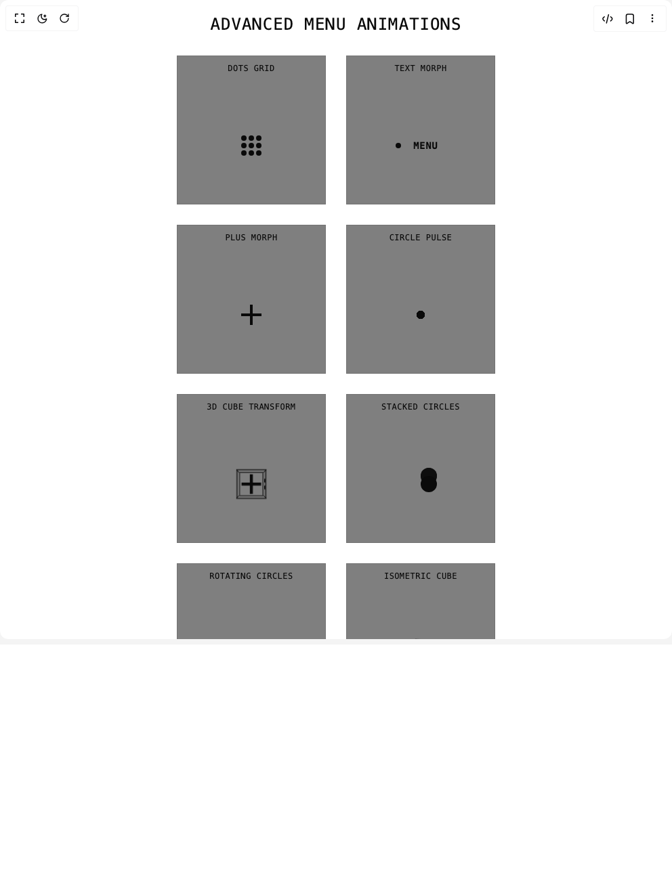

# Build Menu Animations in BuilderStudio

> Build this component in our Agentic IDE: [BuilderStudio](https://builderstudio.dev).
>
> Join the BuilderStudio community on [Discord](https://discord.gg/QdWeSGCqfe) and [Reddit](https://reddit.com/r/builderstudio).



## Component

- Author group: `filipz`
- Component: `menu-animations`
- Variant: `default`
- Rendered HTML snapshot: [`rendered.html`](rendered.html)

## BuilderStudio prompt

You are implementing a React component based on a component reference.

## Component identity

- Author: filipz
- Component slug: menu-animations
- Demo slug: default
- Title: menu-animations
- Description: 

## Goal

Recreate this component in a React + TypeScript + Tailwind CSS project. Preserve the visual layout, spacing, colors, border radius, shadows, interaction behavior, animation behavior, responsive behavior, and dark mode behavior shown in the rendered demo.

## Implementation requirements

- Use React and TypeScript.
- Use Tailwind CSS classes whenever possible.
- Keep the component self-contained unless the source files require helper components.
- If the source uses CSS variables, custom CSS, animations, or keyframes, include them.
- If the source uses external packages, list and use the required packages.
- Preserve accessibility attributes, button semantics, links, keyboard behavior, and ARIA attributes when visible in the source.
- Do not replace the component with a simplified placeholder.
- Return complete production-ready code.

## Dependencies

No reference metadata available.

## Rendered DOM snapshot

This is the rendered demo HTML extracted from the live preview. Use it to verify structure, class names, visible content, and layout.

```html
<div id="root"><div class="w-screen min-h-screen flex justify-center items-center"><div class="w-screen min-h-screen flex justify-center items-center"><div class="flex min-h-screen w-full flex-col items-center p-5"><h1 class="mb-[30px] text-center text-2xl tracking-[1px]">ADVANCED MENU ANIMATIONS</h1><div class="mx-auto grid max-w-[750px] grid-cols-1 gap-[30px] sm:grid-cols-2 lg:grid-cols-3"><div class="group relative flex h-[220px] w-[220px] flex-col items-center overflow-visible border border-foreground/10 bg-black/50 p-2.5 transition-colors duration-300 hover:border-foreground/30"><div class="absolute h-4 w-4 text-foreground opacity-0 transition-opacity duration-300 group-hover:opacity-100 top-[-8px] left-[-8px]" style="transform: rotate(0deg);"><svg viewBox="0 0 24 24" class="h-full w-full"><path fill="currentColor" d="M12 4V12H4V14H14V4H12Z"></path></svg></div><div class="absolute h-4 w-4 text-foreground opacity-0 transition-opacity duration-300 group-hover:opacity-100 top-[-8px] right-[-8px]" style="transform: rotate(90deg);"><svg viewBox="0 0 24 24" class="h-full w-full"><path fill="currentColor" d="M12 4V12H4V14H14V4H12Z"></path></svg></div><div class="absolute h-4 w-4 text-foreground opacity-0 transition-opacity duration-300 group-hover:opacity-100 bottom-[-8px] left-[-8px]" style="transform: rotate(-90deg);"><svg viewBox="0 0 24 24" class="h-full w-full"><path fill="currentColor" d="M12 4V12H4V14H14V4H12Z"></path></svg></div><div class="absolute h-4 w-4 text-foreground opacity-0 transition-opacity duration-300 group-hover:opacity-100 bottom-[-8px] right-[-8px]" style="transform: rotate(180deg);"><svg viewBox="0 0 24 24" class="h-full w-full"><path fill="currentColor" d="M12 4V12H4V14H14V4H12Z"></path></svg></div><div class="mb-[30px] text-center text-xs uppercase tracking-[0.5px]">Dots Grid</div><div class="m-auto flex cursor-pointer items-center justify-center"><div class="dots-grid relative h-[60px] w-[60px]"><div class="dot absolute h-2 w-2 rounded-full bg-foreground" style="translate: none; rotate: none; scale: none; opacity: 1; transform: translate(0px, 0px);"></div><div class="dot absolute h-2 w-2 rounded-full bg-foreground" style="translate: none; rotate: none; scale: none; opacity: 1; transform: translate(-50%, 0%);"></div><div class="dot absolute h-2 w-2 rounded-full bg-foreground" style="translate: none; rotate: none; scale: none; opacity: 1; transform: translate(0px, 0px);"></div><div class="dot absolute h-2 w-2 rounded-full bg-foreground" style="translate: none; rotate: none; scale: none; opacity: 1; transform: translate(0%, -50%);"></div><div class="dot absolute h-2 w-2 rounded-full bg-foreground" style="translate: none; rotate: none; scale: none; opacity: 1; transform: translate(-50%, -50%);"></div><div class="dot absolute h-2 w-2 rounded-full bg-foreground" style="translate: none; rotate: none; scale: none; opacity: 1; transform: translate(0%, -50%);"></div><div class="dot absolute h-2 w-2 rounded-full bg-foreground" style="translate: none; rotate: none; scale: none; opacity: 1; transform: translate(0px, 0px);"></div><div class="dot absolute h-2 w-2 rounded-full bg-foreground" style="translate: none; rotate: none; scale: none; opacity: 1; transform: translate(-50%, 0%);"></div><div class="dot absolute h-2 w-2 rounded-full bg-foreground" style="translate: none; rotate: none; scale: none; opacity: 1; transform: translate(0px, 0px);"></div></div></div></div><div class="group relative flex h-[220px] w-[220px] flex-col items-center overflow-visible border border-foreground/10 bg-black/50 p-2.5 transition-colors duration-300 hover:border-foreground/30"><div class="absolute h-4 w-4 text-foreground opacity-0 transition-opacity duration-300 group-hover:opacity-100 top-[-8px] left-[-8px]" style="transform: rotate(0deg);"><svg viewBox="0 0 24 24" class="h-full w-full"><path fill="currentColor" d="M12 4V12H4V14H14V4H12Z"></path></svg></div><div class="absolute h-4 w-4 text-foreground opacity-0 transition-opacity duration-300 group-hover:opacity-100 top-[-8px] right-[-8px]" style="transform: rotate(90deg);"><svg viewBox="0 0 24 24" class="h-full w-full"><path fill="currentColor" d="M12 4V12H4V14H14V4H12Z"></path></svg></div><div class="absolute h-4 w-4 text-foreground opacity-0 transition-opacity duration-300 group-hover:opacity-100 bottom-[-8px] left-[-8px]" style="transform: rotate(-90deg);"><svg viewBox="0 0 24 24" class="h-full w-full"><path fill="currentColor" d="M12 4V12H4V14H14V4H12Z"></path></svg></div><div class="absolute h-4 w-4 text-foreground opacity-0 transition-opacity duration-300 group-hover:opacity-100 bottom-[-8px] right-[-8px]" style="transform: rotate(180deg);"><svg viewBox="0 0 24 24" class="h-full w-full"><path fill="currentColor" d="M12 4V12H4V14H14V4H12Z"></path></svg></div><div class="mb-[30px] text-center text-xs uppercase tracking-[0.5px]">Text Morph</div><div class="m-auto flex cursor-pointer items-center justify-center"><div class="text-morph relative h-5 w-[75px]"><div class="text-container relative h-full w-[60px] overflow-hidden ml-[15px]"><span class="menu absolute flex h-full w-full items-center justify-center text-sm font-bold tracking-wider text-foreground" style="translate: none; rotate: none; scale: none; transform: translate(0px, 0px);">MENU</span><span class="close absolute flex h-full w-full items-center justify-center text-sm font-bold tracking-wider text-foreground" style="translate: none; rotate: none; scale: none; transform: translate(0px, 20px);">CLOSE</span></div><div class="circle absolute left-0 top-1/2 z-10 h-2 w-2 -translate-y-1/2 rounded-full bg-foreground" style="transform: translate(0%, -50%); translate: none; rotate: none; scale: none; border-radius: 50%;"></div></div></div></div><div class="group relative flex h-[220px] w-[220px] flex-col items-center overflow-visible border border-foreground/10 bg-black/50 p-2.5 transition-colors duration-300 hover:border-foreground/30"><div class="absolute h-4 w-4 text-foreground opacity-0 transition-opacity duration-300 group-hover:opacity-100 top-[-8px] left-[-8px]" style="transform: rotate(0deg);"><svg viewBox="0 0 24 24" class="h-full w-full"><path fill="currentColor" d="M12 4V12H4V14H14V4H12Z"></path></svg></div><div class="absolute h-4 w-4 text-foreground opacity-0 transition-opacity duration-300 group-hover:opacity-100 top-[-8px] right-[-8px]" style="transform: rotate(90deg);"><svg viewBox="0 0 24 24" class="h-full w-full"><path fill="currentColor" d="M12 4V12H4V14H14V4H12Z"></path></svg></div><div class="absolute h-4 w-4 text-foreground opacity-0 transition-opacity duration-300 group-hover:opacity-100 bottom-[-8px] left-[-8px]" style="transform: rotate(-90deg);"><svg viewBox="0 0 24 24" class="h-full w-full"><path fill="currentColor" d="M12 4V12H4V14H14V4H12Z"></path></svg></div><div class="absolute h-4 w-4 text-foreground opacity-0 transition-opacity duration-300 group-hover:opacity-100 bottom-[-8px] right-[-8px]" style="transform: rotate(180deg);"><svg viewBox="0 0 24 24" class="h-full w-full"><path fill="currentColor" d="M12 4V12H4V14H14V4H12Z"></path></svg></div><div class="mb-[30px] text-center text-xs uppercase tracking-[0.5px]">Plus Morph</div><div class="m-auto flex cursor-pointer items-center justify-center" style="translate: none; rotate: none; scale: none; transform: translate(0px, 0px);"><div class="plus-morph relative flex h-[60px] w-[60px] items-center justify-center"><div class="horizontal absolute left-1/2 top-1/2 h-1 w-[30px] origin-center -translate-x-1/2 -translate-y-1/2 bg-foreground"></div><div class="vertical absolute left-1/2 top-1/2 h-[30px] w-1 origin-center -translate-x-1/2 -translate-y-1/2 bg-foreground"></div></div></div></div><div class="group relative flex h-[220px] w-[220px] flex-col items-center overflow-visible border border-foreground/10 bg-black/50 p-2.5 transition-colors duration-300 hover:border-foreground/30"><div class="absolute h-4 w-4 text-foreground opacity-0 transition-opacity duration-300 group-hover:opacity-100 top-[-8px] left-[-8px]" style="transform: rotate(0deg);"><svg viewBox="0 0 24 24" class="h-full w-full"><path fill="currentColor" d="M12 4V12H4V14H14V4H12Z"></path></svg></div><div class="absolute h-4 w-4 text-foreground opacity-0 transition-opacity duration-300 group-hover:opacity-100 top-[-8px] right-[-8px]" style="transform: rotate(90deg);"><svg viewBox="0 0 24 24" class="h-full w-full"><path fill="currentColor" d="M12 4V12H4V14H14V4H12Z"></path></svg></div><div class="absolute h-4 w-4 text-foreground opacity-0 transition-opacity duration-300 group-hover:opacity-100 bottom-[-8px] left-[-8px]" style="transform: rotate(-90deg);"><svg viewBox="0 0 24 24" class="h-full w-full"><path fill="currentColor" d="M12 4V12H4V14H14V4H12Z"></path></svg></div><div class="absolute h-4 w-4 text-foreground opacity-0 transition-opacity duration-300 group-hover:opacity-100 bottom-[-8px] right-[-8px]" style="transform: rotate(180deg);"><svg viewBox="0 0 24 24" class="h-full w-full"><path fill="currentColor" d="M12 4V12H4V14H14V4H12Z"></path></svg></div><div class="mb-[30px] text-center text-xs uppercase tracking-[0.5px]">Circle Pulse</div><div class="m-auto flex cursor-pointer items-center justify-center"><div class="circle-pulse relative h-[60px] w-[60px] overflow-visible"><div class="circle absolute left-1/2 top-1/2 z-[3] h-3 w-3 -translate-x-1/2 -translate-y-1/2 rounded-full bg-foreground" style="transform: translate(-50%, -50%); translate: none; rotate: none; scale: none;"></div><div class="ring absolute left-1/2 top-1/2 z-[2] h-3 w-3 -translate-x-1/2 -translate-y-1/2 rounded-full border border-foreground" style="transform: translate(-50%, -50%) scale(0.5, 0.5); translate: none; rotate: none; scale: none; opacity: 0;"></div><div class="wave absolute left-1/2 top-1/2 h-3 w-3 -translate-x-1/2 -translate-y-1/2 rounded-full border border-foreground/50" style="transform: translate(-50%, -50%) scale(0.5, 0.5); translate: none; rotate: none; scale: none; opacity: 0;"></div><div class="particles absolute left-1/2 top-1/2 h-full w-full -translate-x-1/2 -translate-y-1/2"><div class="particle absolute left-1/2 top-1/2 h-3 w-3 -translate-x-1/2 -translate-y-1/2 rounded-full border border-foreground bg-transparent" style="transform: translate(-50%, -50%); translate: none; rotate: none; scale: none; opacity: 1;"></div><div class="particle absolute left-1/2 top-1/2 h-3 w-3 -translate-x-1/2 -translate-y-1/2 rounded-full border border-foreground bg-transparent" style="transform: translate(-50%, -50%); translate: none; rotate: none; scale: none; opacity: 1;"></div><div class="particle absolute left-1/2 top-1/2 h-3 w-3 -translate-x-1/2 -translate-y-1/2 rounded-full border border-foreground bg-transparent" style="transform: translate(-50%, -50%); translate: none; rotate: none; scale: none; opacity: 1;"></div><div class="particle absolute left-1/2 top-1/2 h-3 w-3 -translate-x-1/2 -translate-y-1/2 rounded-full border border-foreground bg-transparent" style="transform: translate(-50%, -50%); translate: none; rotate: none; scale: none; opacity: 1;"></div><div class="particle absolute left-1/2 top-1/2 h-3 w-3 -translate-x-1/2 -translate-y-1/2 rounded-full border border-foreground bg-transparent" style="transform: translate(-50%, -50%); translate: none; rotate: none; scale: none; opacity: 1;"></div><div class="particle absolute left-1/2 top-1/2 h-3 w-3 -translate-x-1/2 -translate-y-1/2 rounded-full border border-foreground bg-transparent" style="transform: translate(-50%, -50%); translate: none; rotate: none; scale: none; opacity: 1;"></div><div class="particle absolute left-1/2 top-1/2 h-3 w-3 -translate-x-1/2 -translate-y-1/2 rounded-full border border-foreground bg-transparent" style="transform: translate(-50%, -50%); translate: none; rotate: none; scale: none; opacity: 1;"></div><div class="particle absolute left-1/2 top-1/2 h-3 w-3 -translate-x-1/2 -translate-y-1/2 rounded-full border border-foreground bg-transparent" style="transform: translate(-50%, -50%); translate: none; rotate: none; scale: none; opacity: 1;"></div></div></div></div></div><div class="group relative flex h-[220px] w-[220px] flex-col items-center overflow-visible border border-foreground/10 bg-black/50 p-2.5 transition-colors duration-300 hover:border-foreground/30"><div class="absolute h-4 w-4 text-foreground opacity-0 transition-opacity duration-300 group-hover:opacity-100 top-[-8px] left-[-8px]" style="transform: rotate(0deg);"><svg viewBox="0 0 24 24" class="h-full w-full"><path fill="currentColor" d="M12 4V12H4V14H14V4H12Z"></path></svg></div><div class="absolute h-4 w-4 text-foreground opacity-0 transition-opacity duration-300 group-hover:opacity-100 top-[-8px] right-[-8px]" style="transform: rotate(90deg);"><svg viewBox="0 0 24 24" class="h-full w-full"><path fill="currentColor" d="M12 4V12H4V14H14V4H12Z"></path></svg></div><div class="absolute h-4 w-4 text-foreground opacity-0 transition-opacity duration-300 group-hover:opacity-100 bottom-[-8px] left-[-8px]" style="transform: rotate(-90deg);"><svg viewBox="0 0 24 24" class="h-full w-full"><path fill="currentColor" d="M12 4V12H4V14H14V4H12Z"></path></svg></div><div class="absolute h-4 w-4 text-foreground opacity-0 transition-opacity duration-300 group-hover:opacity-100 bottom-[-8px] right-[-8px]" style="transform: rotate(180deg);"><svg viewBox="0 0 24 24" class="h-full w-full"><path fill="currentColor" d="M12 4V12H4V14H14V4H12Z"></path></svg></div><div class="mb-[30px] text-center text-xs uppercase tracking-[0.5px]">3D Cube Transform</div><div class="m-auto flex cursor-pointer items-center justify-center"><div class="cube-spin flex h-[60px] w-[60px] items-center justify-center" style="perspective: 200px;"><div class="cube absolute h-10 w-10" style="transform-style: preserve-3d; translate: none; rotate: none; scale: none; transform: translate(0px, 0px);"><div class="face front absolute flex h-10 w-10 items-center justify-center border-2 border-foreground/60"><div class="plus-symbol relative h-[26px] w-[26px]"><div class="horizontal absolute left-1/2 top-1/2 h-1 w-full -translate-x-1/2 -translate-y-1/2 bg-foreground"></div><div class="vertical absolute left-1/2 top-1/2 h-full w-1 -translate-x-1/2 -translate-y-1/2 bg-foreground"></div></div></div><div class="face right absolute flex h-10 w-10 items-center justify-center border-2 border-foreground/60"><div class="x-symbol relative h-[26px] w-[26px]"><div class="absolute left-1/2 top-1/2 h-1 w-[30px] origin-center -translate-x-1/2 -translate-y-1/2 rotate-45 bg-foreground"></div><div class="absolute left-1/2 top-1/2 h-1 w-[30px] origin-center -translate-x-1/2 -translate-y-1/2 -rotate-45 bg-foreground"></div></div></div><div class="face back absolute h-10 w-10 border-2 border-foreground/60"></div><div class="face left absolute h-10 w-10 border-2 border-foreground/60"></div></div></div></div></div><div class="group relative flex h-[220px] w-[220px] flex-col items-center overflow-visible border border-foreground/10 bg-black/50 p-2.5 transition-colors duration-300 hover:border-foreground/30"><div class="absolute h-4 w-4 text-foreground opacity-0 transition-opacity duration-300 group-hover:opacity-100 top-[-8px] left-[-8px]" style="transform: rotate(0deg);"><svg viewBox="0 0 24 24" class="h-full w-full"><path fill="currentColor" d="M12 4V12H4V14H14V4H12Z"></path></svg></div><div class="absolute h-4 w-4 text-foreground opacity-0 transition-opacity duration-300 group-hover:opacity-100 top-[-8px] right-[-8px]" style="transform: rotate(90deg);"><svg viewBox="0 0 24 24" class="h-full w-full"><path fill="currentColor" d="M12 4V12H4V14H14V4H12Z"></path></svg></div><div class="absolute h-4 w-4 text-foreground opacity-0 transition-opacity duration-300 group-hover:opacity-100 bottom-[-8px] left-[-8px]" style="transform: rotate(-90deg);"><svg viewBox="0 0 24 24" class="h-full w-full"><path fill="currentColor" d="M12 4V12H4V14H14V4H12Z"></path></svg></div><div class="absolute h-4 w-4 text-foreground opacity-0 transition-opacity duration-300 group-hover:opacity-100 bottom-[-8px] right-[-8px]" style="transform: rotate(180deg);"><svg viewBox="0 0 24 24" class="h-full w-full"><path fill="currentColor" d="M12 4V12H4V14H14V4H12Z"></path></svg></div><div class="mb-[30px] text-center text-xs uppercase tracking-[0.5px]">Stacked Circles</div><div class="m-auto flex cursor-pointer items-center justify-center"><div class="stacked-circles relative flex h-[60px] w-[60px] items-center justify-center"><div class="circle absolute left-1/2 top-1/2 h-6 w-6 rounded-full bg-foreground" style="translate: none; rotate: none; scale: none; transform: translate(0px, -50%);"></div><div class="circle absolute left-1/2 top-1/2 h-6 w-6 rounded-full bg-foreground" style="translate: none; rotate: none; scale: none; transform: translate(0%, -50%) translate(0px, -50%);"></div><div class="circle absolute left-1/2 top-1/2 h-6 w-6 rounded-full bg-foreground" style="translate: none; rotate: none; scale: none; transform: translate(0%, -50%) translate(0px, -50%);"></div><div class="circle absolute left-1/2 top-1/2 h-6 w-6 rounded-full bg-foreground" style="translate: none; rotate: none; scale: none; transform: translate(0%, -50%) translate(0px, -50%);"></div><div class="circle absolute left-1/2 top-1/2 h-6 w-6 rounded-full bg-foreground" style="translate: none; rotate: none; scale: none; transform: translate(0%, -50%) translate(0px, -50%);"></div></div></div></div><div class="group relative flex h-[220px] w-[220px] flex-col items-center overflow-visible border border-foreground/10 bg-black/50 p-2.5 transition-colors duration-300 hover:border-foreground/30"><div class="absolute h-4 w-4 text-foreground opacity-0 transition-opacity duration-300 group-hover:opacity-100 top-[-8px] left-[-8px]" style="transform: rotate(0deg);"><svg viewBox="0 0 24 24" class="h-full w-full"><path fill="currentColor" d="M12 4V12H4V14H14V4H12Z"></path></svg></div><div class="absolute h-4 w-4 text-foreground opacity-0 transition-opacity duration-300 group-hover:opacity-100 top-[-8px] right-[-8px]" style="transform: rotate(90deg);"><svg viewBox="0 0 24 24" class="h-full w-full"><path fill="currentColor" d="M12 4V12H4V14H14V4H12Z"></path></svg></div><div class="absolute h-4 w-4 text-foreground opacity-0 transition-opacity duration-300 group-hover:opacity-100 bottom-[-8px] left-[-8px]" style="transform: rotate(-90deg);"><svg viewBox="0 0 24 24" class="h-full w-full"><path fill="currentColor" d="M12 4V12H4V14H14V4H12Z"></path></svg></div><div class="absolute h-4 w-4 text-foreground opacity-0 transition-opacity duration-300 group-hover:opacity-100 bottom-[-8px] right-[-8px]" style="transform: rotate(180deg);"><svg viewBox="0 0 24 24" class="h-full w-full"><path fill="currentColor" d="M12 4V12H4V14H14V4H12Z"></path></svg></div><div class="mb-[30px] text-center text-xs uppercase tracking-[0.5px]">Rotating Circles</div><div class="m-auto flex cursor-pointer items-center justify-center"><div class="rotating-circles relative flex h-[60px] w-[60px] items-center justify-center"><div class="circle absolute h-[10px] w-[10px] rounded-full bg-foreground" style="translate: none; rotate: none; scale: none; transform: translate(-50%, -50%) translate(-20px, 0px); z-index: 6; opacity: 1;"></div><div class="circle absolute h-[10px] w-[10px] rounded-full bg-foreground" style="translate: none; rotate: none; scale: none; transform: translate(-50%, -50%) translate(-12px, 0px); z-index: 5; opacity: 0.9;"></div><div class="circle absolute h-[10px] w-[10px] rounded-full bg-foreground" style="translate: none; rotate: none; scale: none; transform: translate(-50%, -50%) translate(-4px, 0px); z-index: 4; opacity: 0.8;"></div><div class="circle absolute h-[10px] w-[10px] rounded-full bg-foreground" style="translate: none; rotate: none; scale: none; transform: translate(-50%, -50%) translate(4px, 0px); z-index: 3; opacity: 0.7;"></div><div class="circle absolute h-[10px] w-[10px] rounded-full bg-foreground" style="translate: none; rotate: none; scale: none; transform: translate(-50%, -50%) translate(12px, 0px); z-index: 2; opacity: 0.6;"></div><div class="circle absolute h-[10px] w-[10px] rounded-full bg-foreground" style="translate: none; rotate: none; scale: none; transform: translate(-50%, -50%) translate(20px, 0px); z-index: 1; opacity: 0.5;"></div></div></div></div><div class="group relative flex h-[220px] w-[220px] flex-col items-center overflow-visible border border-foreground/10 bg-black/50 p-2.5 transition-colors duration-300 hover:border-foreground/30"><div class="absolute h-4 w-4 text-foreground opacity-0 transition-opacity duration-300 group-hover:opacity-100 top-[-8px] left-[-8px]" style="transform: rotate(0deg);"><svg viewBox="0 0 24 24" class="h-full w-full"><path fill="currentColor" d="M12 4V12H4V14H14V4H12Z"></path></svg></div><div class="absolute h-4 w-4 text-foreground opacity-0 transition-opacity duration-300 group-hover:opacity-100 top-[-8px] right-[-8px]" style="transform: rotate(90deg);"><svg viewBox="0 0 24 24" class="h-full w-full"><path fill="currentColor" d="M12 4V12H4V14H14V4H12Z"></path></svg></div><div class="absolute h-4 w-4 text-foreground opacity-0 transition-opacity duration-300 group-hover:opacity-100 bottom-[-8px] left-[-8px]" style="transform: rotate(-90deg);"><svg viewBox="0 0 24 24" class="h-full w-full"><path fill="currentColor" d="M12 4V12H4V14H14V4H12Z"></path></svg></div><div class="absolute h-4 w-4 text-foreground opacity-0 transition-opacity duration-300 group-hover:opacity-100 bottom-[-8px] right-[-8px]" style="transform: rotate(180deg);"><svg viewBox="0 0 24 24" class="h-full w-full"><path fill="currentColor" d="M12 4V12H4V14H14V4H12Z"></path></svg></div><div class="mb-[30px] text-center text-xs uppercase tracking-[0.5px]">Isometric Cube</div><div class="m-auto flex cursor-pointer items-center justify-center"><div class="isometric-cube flex h-[60px] w-[60px] items-center justify-center" style="perspective: 1200px;"><div class="cube absolute h-[30px] w-[30px]" style="transform-style: preserve-3d; translate: none; rotate: none; scale: none; transform: rotateY(45deg) rotateX(35.264deg);"><div class="face front absolute flex h-full w-full items-center justify-center border border-foreground/50 bg-[#222] [box-shadow:0_0_10px_rgba(0,0,0,0.5)_inset]"><div class="plus-symbol relative h-3 w-3"><div class="horizontal absolute left-1/2 top-1/2 h-[2px] w-full -translate-x-1/2 -translate-y-1/2 bg-foreground"></div><div class="vertical absolute left-1/2 top-1/2 h-full w-[2px] -translate-x-1/2 -translate-y-1/2 bg-foreground"></div></div></div><div class="face back absolute flex h-full w-full items-center justify-center border border-foreground/50 bg-[#222] [box-shadow:0_0_10px_rgba(0,0,0,0.5)_inset]"><div class="x-symbol relative h-3 w-3"><div class="absolute left-1/2 top-1/2 h-[2px] w-full origin-center -translate-x-1/2 -translate-y-1/2 rotate-45 bg-foreground"></div><div class="absolute left-1/2 top-1/2 h-[2px] w-full origin-center -translate-x-1/2 -translate-y-1/2 -rotate-45 bg-foreground"></div></div></div><div class="face right absolute h-full w-full border border-foreground/50 bg-[#222] [box-shadow:0_0_10px_rgba(0,0,0,0.5)_inset]"></div><div class="face left absolute h-full w-full border border-foreground/50 bg-[#222] [box-shadow:0_0_10px_rgba(0,0,0,0.5)_inset]"></div><div class="face top absolute h-full w-full border border-foreground/50 bg-[#222] [box-shadow:0_0_10px_rgba(0,0,0,0.5)_inset]"></div><div class="face bottom absolute h-full w-full border border-foreground/50 bg-[#222] [box-shadow:0_0_10px_rgba(0,0,0,0.5)_inset]"></div></div></div></div></div><div class="group relative flex h-[220px] w-[220px] flex-col items-center overflow-visible border border-foreground/10 bg-black/50 p-2.5 transition-colors duration-300 hover:border-foreground/30"><div class="absolute h-4 w-4 text-foreground opacity-0 transition-opacity duration-300 group-hover:opacity-100 top-[-8px] left-[-8px]" style="transform: rotate(0deg);"><svg viewBox="0 0 24 24" class="h-full w-full"><path fill="currentColor" d="M12 4V12H4V14H14V4H12Z"></path></svg></div><div class="absolute h-4 w-4 text-foreground opacity-0 transition-opacity duration-300 group-hover:opacity-100 top-[-8px] right-[-8px]" style="transform: rotate(90deg);"><svg viewBox="0 0 24 24" class="h-full w-full"><path fill="currentColor" d="M12 4V12H4V14H14V4H12Z"></path></svg></div><div class="absolute h-4 w-4 text-foreground opacity-0 transition-opacity duration-300 group-hover:opacity-100 bottom-[-8px] left-[-8px]" style="transform: rotate(-90deg);"><svg viewBox="0 0 24 24" class="h-full w-full"><path fill="currentColor" d="M12 4V12H4V14H14V4H12Z"></path></svg></div><div class="absolute h-4 w-4 text-foreground opacity-0 transition-opacity duration-300 group-hover:opacity-100 bottom-[-8px] right-[-8px]" style="transform: rotate(180deg);"><svg viewBox="0 0 24 24" class="h-full w-full"><path fill="currentColor" d="M12 4V12H4V14H14V4H12Z"></path></svg></div><div class="mb-[30px] text-center text-xs uppercase tracking-[0.5px]">Expanding Circles</div><div class="m-auto flex cursor-pointer items-center justify-center" style="translate: none; rotate: none; scale: none; transform: translate(0px, 0px);"><div class="expanding-circles relative flex h-[60px] w-[60px] items-center justify-center"><div class="circle extra absolute h-2 w-2 rounded-full bg-foreground" style="translate: none; rotate: none; scale: none; opacity: 0; transform: translate(-50%, -50%) scale(0, 0);"></div><div class="circle extra absolute h-2 w-2 rounded-full bg-foreground" style="translate: none; rotate: none; scale: none; opacity: 0; transform: translate(-50%, -50%) scale(0, 0);"></div><div class="circle extra absolute h-2 w-2 rounded-full bg-foreground" style="translate: none; rotate: none; scale: none; opacity: 0; transform: translate(-50%, -50%) scale(0, 0);"></div><div class="circle extra absolute h-2 w-2 rounded-full bg-foreground" style="translate: none; rotate: none; scale: none; opacity: 0; transform: translate(-50%, -50%) scale(0, 0);"></div><div class="circle extra absolute h-2 w-2 rounded-full bg-foreground" style="translate: none; rotate: none; scale: none; opacity: 0; transform: translate(-50%, -50%) scale(0, 0);"></div><div class="circle extra absolute h-2 w-2 rounded-full bg-foreground" style="translate: none; rotate: none; scale: none; opacity: 0; transform: translate(-50%, -50%) scale(0, 0);"></div><div class="circle extra absolute h-2 w-2 rounded-full bg-foreground" style="translate: none; rotate: none; scale: none; opacity: 0; transform: translate(-50%, -50%) scale(0, 0);"></div><div class="circle extra absolute h-2 w-2 rounded-full bg-foreground" style="translate: none; rotate: none; scale: none; opacity: 0; transform: translate(-50%, -50%) scale(0, 0);"></div><div class="circle extra absolute h-2 w-2 rounded-full bg-foreground" style="translate: none; rotate: none; scale: none; opacity: 0; transform: translate(-50%, -50%) scale(0, 0);"></div><div class="circle extra absolute h-2 w-2 rounded-full bg-foreground" style="translate: none; rotate: none; scale: none; opacity: 0; transform: translate(-50%, -50%) scale(0, 0);"></div><div class="circle extra absolute h-2 w-2 rounded-full bg-foreground" style="translate: none; rotate: none; scale: none; opacity: 0; transform: translate(-50%, -50%) scale(0, 0);"></div><div class="circle extra absolute h-2 w-2 rounded-full bg-foreground" style="translate: none; rotate: none; scale: none; opacity: 0; transform: translate(-50%, -50%) scale(0, 0);"></div><div class="circle micro absolute h-1 w-1 rounded-full bg-foreground" style="translate: none; rotate: none; scale: none; opacity: 0; transform: translate(-50%, -50%) scale(0, 0);"></div><div class="circle micro absolute h-1 w-1 rounded-full bg-foreground" style="translate: none; rotate: none; scale: none; opacity: 0; transform: translate(-50%, -50%) scale(0, 0);"></div><div class="circle micro absolute h-1 w-1 rounded-full bg-foreground" style="translate: none; rotate: none; scale: none; opacity: 0; transform: translate(-50%, -50%) scale(0, 0);"></div><div class="circle micro absolute h-1 w-1 rounded-full bg-foreground" style="translate: none; rotate: none; scale: none; opacity: 0; transform: translate(-50%, -50%) scale(0, 0);"></div><div class="circle micro absolute h-1 w-1 rounded-full bg-foreground" style="translate: none; rotate: none; scale: none; opacity: 0; transform: translate(-50%, -50%) scale(0, 0);"></div><div class="circle micro absolute h-1 w-1 rounded-full bg-foreground" style="translate: none; rotate: none; scale: none; opacity: 0; transform: translate(-50%, -50%) scale(0, 0);"></div><div class="circle micro absolute h-1 w-1 rounded-full bg-foreground" style="translate: none; rotate: none; scale: none; opacity: 0; transform: translate(-50%, -50%) scale(0, 0);"></div><div class="circle micro absolute h-1 w-1 rounded-full bg-foreground" style="translate: none; rotate: none; scale: none; opacity: 0; transform: translate(-50%, -50%) scale(0, 0);"></div><div class="circle micro absolute h-1 w-1 rounded-full bg-foreground" style="translate: none; rotate: none; scale: none; opacity: 0; transform: translate(-50%, -50%) scale(0, 0);"></div><div class="circle micro absolute h-1 w-1 rounded-full bg-foreground" style="translate: none; rotate: none; scale: none; opacity: 0; transform: translate(-50%, -50%) scale(0, 0);"></div><div class="circle micro absolute h-1 w-1 rounded-full bg-foreground" style="translate: none; rotate: none; scale: none; opacity: 0; transform: translate(-50%, -50%) scale(0, 0);"></div><div class="circle micro absolute h-1 w-1 rounded-full bg-foreground" style="translate: none; rotate: none; scale: none; opacity: 0; transform: translate(-50%, -50%) scale(0, 0);"></div><div class="circle absolute h-2 w-2 rounded-full bg-foreground" style="translate: none; rotate: none; scale: none; opacity: 1; transform: translate(-50%, -50%) translate(15px, 0px);"></div><div class="circle absolute h-2 w-2 rounded-full bg-foreground" style="translate: none; rotate: none; scale: none; opacity: 1; transform: translate(-50%, -50%) translate(7.5px, 12.9904px);"></div><div class="circle absolute h-2 w-2 rounded-full bg-foreground" style="translate: none; rotate: none; scale: none; opacity: 1; transform: translate(-50%, -50%) translate(-7.5px, 12.9904px);"></div><div class="circle absolute h-2 w-2 rounded-full bg-foreground" style="translate: none; rotate: none; scale: none; opacity: 1; transform: translate(-50%, -50%) translate(-15px, 0px);"></div><div class="circle absolute h-2 w-2 rounded-full bg-foreground" style="translate: none; rotate: none; scale: none; opacity: 1; transform: translate(-50%, -50%) translate(-7.5px, -12.9904px);"></div><div class="circle absolute h-2 w-2 rounded-full bg-foreground" style="translate: none; rotate: none; scale: none; opacity: 1; transform: translate(-50%, -50%) translate(7.5px, -12.9904px);"></div></div></div></div></div></div></div></div></div>
```

## Reference source files

No reference source files were available.
