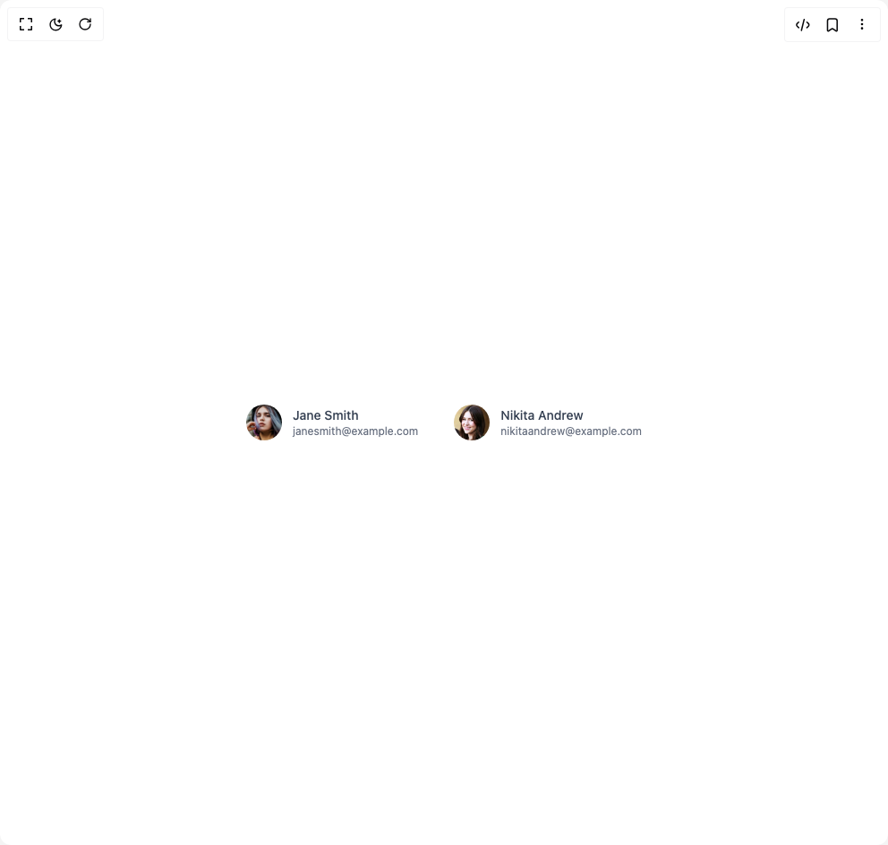

# Build Avatars in BuilderStudio

> Build this component in our Agentic IDE: [BuilderStudio](https://builderstudio.dev).
>
> Join the BuilderStudio community on [Discord](https://discord.gg/QdWeSGCqfe) and [Reddit](https://reddit.com/r/builderstudio).



## Component

- Author group: `float_ui`
- Component: `avatars`
- Variant: `avatar-with-info`
- Rendered HTML snapshot: [`rendered.html`](rendered.html)

## BuilderStudio prompt

You are implementing a React component based on a component reference.

## Component identity

- Author: float_ui
- Component slug: avatars
- Demo slug: avatar-with-info
- Title: avatars
- Description: 

## Goal

Recreate this component in a React + TypeScript + Tailwind CSS project. Preserve the visual layout, spacing, colors, border radius, shadows, interaction behavior, animation behavior, responsive behavior, and dark mode behavior shown in the rendered demo.

## Implementation requirements

- Use React and TypeScript.
- Use Tailwind CSS classes whenever possible.
- Keep the component self-contained unless the source files require helper components.
- If the source uses CSS variables, custom CSS, animations, or keyframes, include them.
- If the source uses external packages, list and use the required packages.
- Preserve accessibility attributes, button semantics, links, keyboard behavior, and ARIA attributes when visible in the source.
- Do not replace the component with a simplified placeholder.
- Return complete production-ready code.

## Dependencies

No reference metadata available.

## Rendered DOM snapshot

This is the rendered demo HTML extracted from the live preview. Use it to verify structure, class names, visible content, and layout.

```html
<div id="root"><div class="w-screen min-h-screen flex justify-center items-center"><div class="w-screen min-h-screen flex justify-center items-center"><div class="flex items-center justify-center gap-10"><div class="flex items-center space-x-3"><span class="w-10 h-10 rounded-full overflow-hidden"></span><div><span class="block text-gray-700 text-sm font-medium">Jane Smith</span><span class="block text-gray-500 text-xs">janesmith@example.com</span></div></div><div class="flex items-center space-x-3"><span class="w-10 h-10 rounded-full overflow-hidden"></span><div><span class="block text-gray-700 text-sm font-medium">Nikita Andrew</span><span class="block text-gray-500 text-xs">nikitaandrew@example.com</span></div></div></div></div></div></div>
```

## Reference source files

No reference source files were available.
