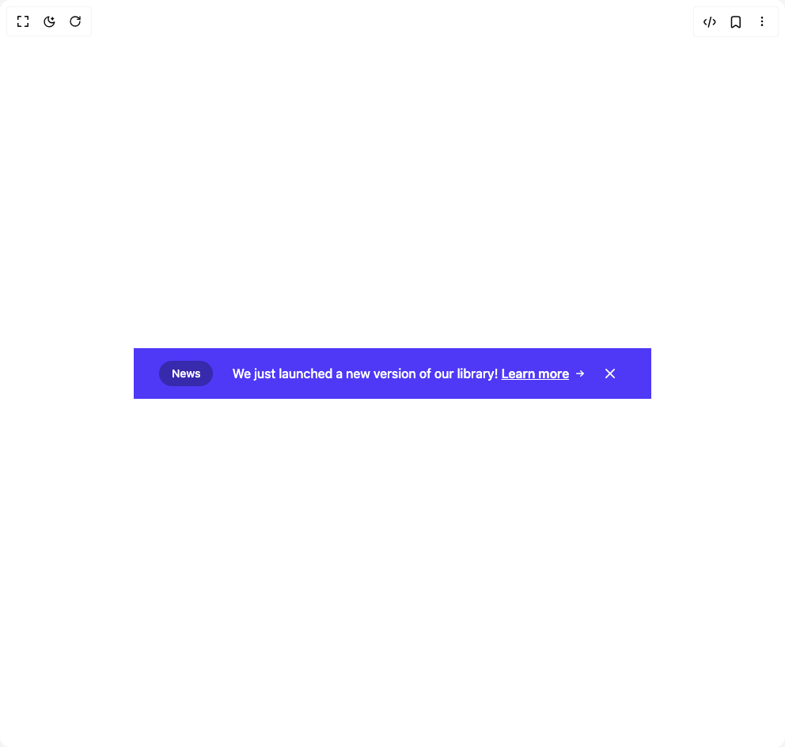

# Build Banner Centred in BuilderStudio

> Build this component in our Agentic IDE: [BuilderStudio](https://builderstudio.dev).
>
> Join the BuilderStudio community on [Discord](https://discord.gg/QdWeSGCqfe) and [Reddit](https://reddit.com/r/builderstudio).



## Component

- Author group: `float_ui`
- Component: `banner-centred`
- Variant: `banner-centred-with-badge`
- Rendered HTML snapshot: [`rendered.html`](rendered.html)

## BuilderStudio prompt

You are implementing a React component based on a component reference.

## Component identity

- Author: float_ui
- Component slug: banner-centred
- Demo slug: banner-centred-with-badge
- Title: banner-centred
- Description: 

## Goal

Recreate this component in a React + TypeScript + Tailwind CSS project. Preserve the visual layout, spacing, colors, border radius, shadows, interaction behavior, animation behavior, responsive behavior, and dark mode behavior shown in the rendered demo.

## Implementation requirements

- Use React and TypeScript.
- Use Tailwind CSS classes whenever possible.
- Keep the component self-contained unless the source files require helper components.
- If the source uses CSS variables, custom CSS, animations, or keyframes, include them.
- If the source uses external packages, list and use the required packages.
- Preserve accessibility attributes, button semantics, links, keyboard behavior, and ARIA attributes when visible in the source.
- Do not replace the component with a simplified placeholder.
- Return complete production-ready code.

## Dependencies

No reference metadata available.

## Rendered DOM snapshot

This is the rendered demo HTML extracted from the live preview. Use it to verify structure, class names, visible content, and layout.

```html
<div id="root"><div class="w-screen min-h-screen flex justify-center items-center"><div class="w-screen min-h-screen flex justify-center items-center"><div class="bg-indigo-600"><div class="max-w-screen-xl mx-auto px-4 py-3 flex items-start justify-between text-white sm:items-center md:px-8"><div class="flex-1 justify-center flex items-start gap-x-4 sm:items-center"><div class="flex-none p-1.5 px-4 rounded-full bg-indigo-800 flex items-center justify-center font-medium text-sm">News</div><p class="font-medium p-2">We just launched a new version of our library! <a href="#" class="font-semibold underline duration-150 hover:text-indigo-100 inline-flex items-center gap-x-1">Learn more<svg xmlns="http://www.w3.org/2000/svg" viewBox="0 0 20 20" fill="currentColor" class="w-5 h-5"><path fill-rule="evenodd" d="M5 10a.75.75 0 01.75-.75h6.638L10.23 7.29a.75.75 0 111.04-1.08l3.5 3.25a.75.75 0 010 1.08l-3.5 3.25a.75.75 0 11-1.04-1.08l2.158-1.96H5.75A.75.75 0 015 10z" clip-rule="evenodd"></path></svg></a></p></div><button class="p-2 rounded-lg duration-150 hover:bg-indigo-500 ring-offset-2 focus:ring"><svg xmlns="http://www.w3.org/2000/svg" viewBox="0 0 20 20" fill="currentColor" class="w-6 h-6"><path d="M6.28 5.22a.75.75 0 00-1.06 1.06L8.94 10l-3.72 3.72a.75.75 0 101.06 1.06L10 11.06l3.72 3.72a.75.75 0 101.06-1.06L11.06 10l3.72-3.72a.75.75 0 00-1.06-1.06L10 8.94 6.28 5.22z"></path></svg></button></div></div></div></div></div>
```

## Reference source files

No reference source files were available.
