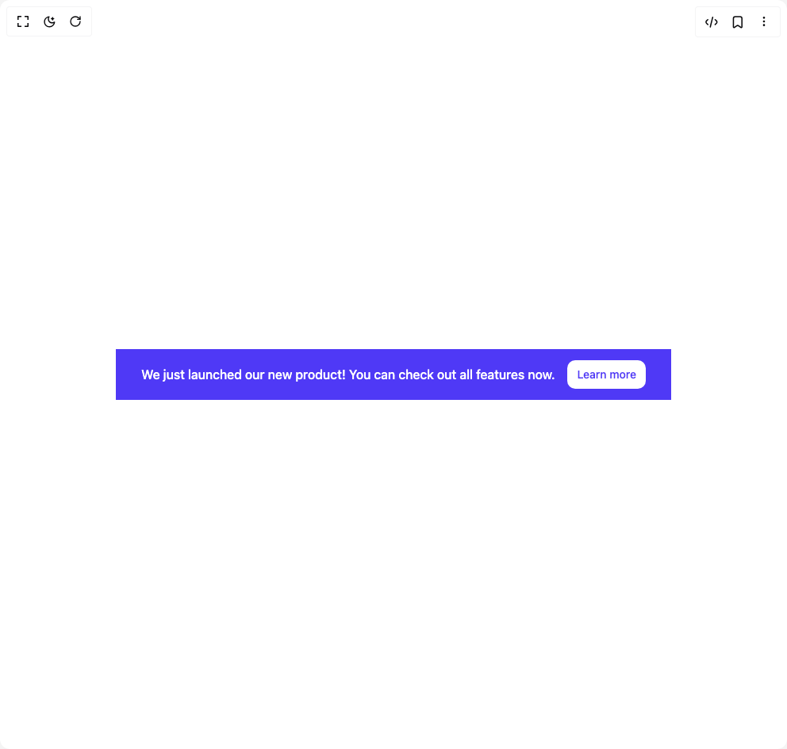

# Build Banner Centred in BuilderStudio

> Build this component in our Agentic IDE: [BuilderStudio](https://builderstudio.dev).
>
> Join the BuilderStudio community on [Discord](https://discord.gg/QdWeSGCqfe) and [Reddit](https://reddit.com/r/builderstudio).



## Component

- Author group: `float_ui`
- Component: `banner-centred`
- Variant: `banner-centred-with-link`
- Rendered HTML snapshot: [`rendered.html`](rendered.html)

## BuilderStudio prompt

You are implementing a React component based on a component reference.

## Component identity

- Author: float_ui
- Component slug: banner-centred
- Demo slug: banner-centred-with-link
- Title: banner-centred
- Description: 

## Goal

Recreate this component in a React + TypeScript + Tailwind CSS project. Preserve the visual layout, spacing, colors, border radius, shadows, interaction behavior, animation behavior, responsive behavior, and dark mode behavior shown in the rendered demo.

## Implementation requirements

- Use React and TypeScript.
- Use Tailwind CSS classes whenever possible.
- Keep the component self-contained unless the source files require helper components.
- If the source uses CSS variables, custom CSS, animations, or keyframes, include them.
- If the source uses external packages, list and use the required packages.
- Preserve accessibility attributes, button semantics, links, keyboard behavior, and ARIA attributes when visible in the source.
- Do not replace the component with a simplified placeholder.
- Return complete production-ready code.

## Dependencies

No reference metadata available.

## Rendered DOM snapshot

This is the rendered demo HTML extracted from the live preview. Use it to verify structure, class names, visible content, and layout.

```html
<div id="root"><div class="w-screen min-h-screen flex justify-center items-center"><div class="w-screen min-h-screen flex justify-center items-center"><div class="bg-indigo-600"><div class="max-w-screen-xl mx-auto px-4 py-3 items-center gap-x-4 justify-center text-white sm:flex md:px-8"><p class="py-2 font-medium">We just launched our new product! You can check out all features now.</p><a href="#" class="flex-none inline-block w-full mt-3 py-2 px-3 text-center text-indigo-600 font-medium bg-white duration-150 hover:bg-gray-100 active:bg-gray-200 rounded-lg sm:w-auto sm:mt-0 sm:text-sm">Learn more</a></div></div></div></div></div>
```

## Reference source files

No reference source files were available.
