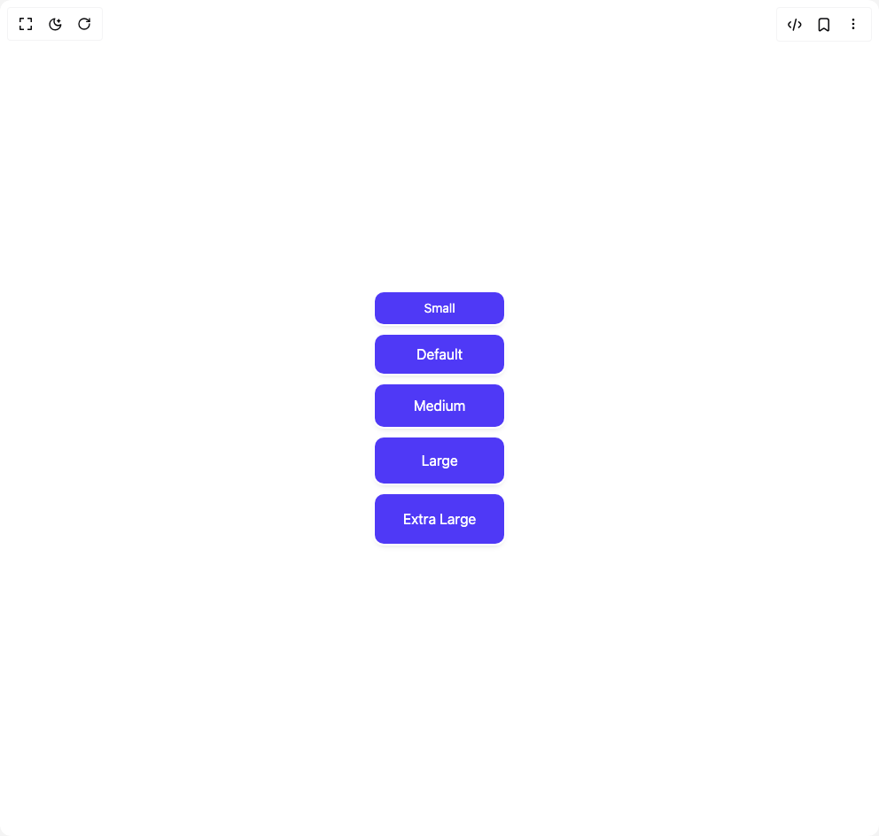

# Build Button 1 in BuilderStudio

> Build this component in our Agentic IDE: [BuilderStudio](https://builderstudio.dev).
>
> Join the BuilderStudio community on [Discord](https://discord.gg/QdWeSGCqfe) and [Reddit](https://reddit.com/r/builderstudio).



## Component

- Author group: `float_ui`
- Component: `button-1`
- Variant: `buttons-with-shadow`
- Rendered HTML snapshot: [`rendered.html`](rendered.html)

## BuilderStudio prompt

You are implementing a React component based on a component reference.

## Component identity

- Author: float_ui
- Component slug: button-1
- Demo slug: buttons-with-shadow
- Title: button-1
- Description: 

## Goal

Recreate this component in a React + TypeScript + Tailwind CSS project. Preserve the visual layout, spacing, colors, border radius, shadows, interaction behavior, animation behavior, responsive behavior, and dark mode behavior shown in the rendered demo.

## Implementation requirements

- Use React and TypeScript.
- Use Tailwind CSS classes whenever possible.
- Keep the component self-contained unless the source files require helper components.
- If the source uses CSS variables, custom CSS, animations, or keyframes, include them.
- If the source uses external packages, list and use the required packages.
- Preserve accessibility attributes, button semantics, links, keyboard behavior, and ARIA attributes when visible in the source.
- Do not replace the component with a simplified placeholder.
- Return complete production-ready code.

## Dependencies

No reference metadata available.

## Rendered DOM snapshot

This is the rendered demo HTML extracted from the live preview. Use it to verify structure, class names, visible content, and layout.

```html
<div id="root"><div class="w-screen min-h-screen flex justify-center items-center"><div class="w-screen min-h-screen flex justify-center items-center"><div class="flex flex-col gap-3"><button class="px-4 py-2 text-sm text-white bg-indigo-600 rounded-lg shadow-md 
      duration-100 focus:shadow-none ring-offset-2 ring-indigo-600 focus:ring-2 ">Small</button><button class="px-5 py-2.5 text-white bg-indigo-600 rounded-lg shadow-md 
      duration-100 focus:shadow-none ring-offset-2 ring-indigo-600 focus:ring-2 ">Default</button><button class="px-6 py-3 text-white bg-indigo-600 rounded-lg shadow-md 
      duration-100 focus:shadow-none ring-offset-2 ring-indigo-600 focus:ring-2 ">Medium</button><button class="px-7 py-3.5 text-white bg-indigo-600 rounded-lg shadow-md 
      duration-100 focus:shadow-none ring-offset-2 ring-indigo-600 focus:ring-2 ">Large</button><button class="px-8 py-4 text-white bg-indigo-600 rounded-lg shadow-md 
      duration-100 focus:shadow-none ring-offset-2 ring-indigo-600 focus:ring-2 ">Extra Large</button></div></div></div></div>
```

## Reference source files

No reference source files were available.
