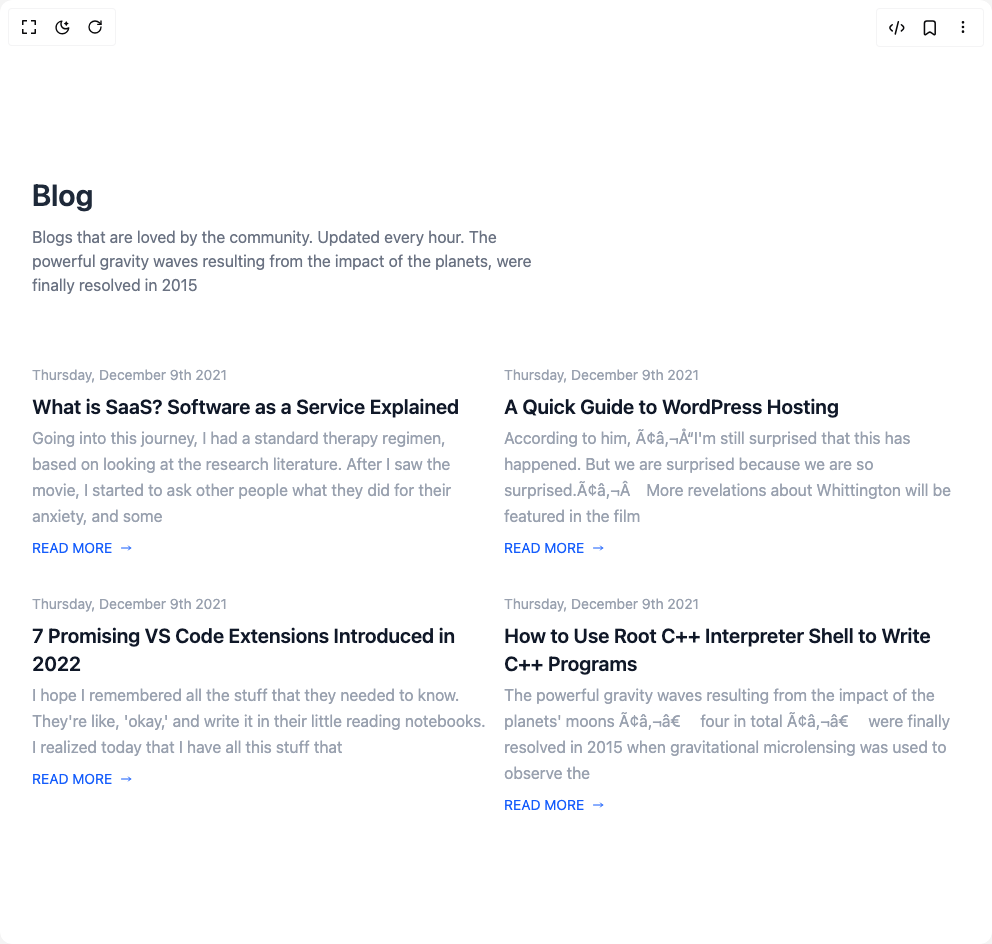

# Build Cards in BuilderStudio

> Build this component in our Agentic IDE: [BuilderStudio](https://builderstudio.dev).
>
> Join the BuilderStudio community on [Discord](https://discord.gg/QdWeSGCqfe) and [Reddit](https://reddit.com/r/builderstudio).



## Component

- Author group: `float_ui`
- Component: `cards`
- Variant: `blog-cards-secondary`
- Rendered HTML snapshot: [`rendered.html`](rendered.html)

## BuilderStudio prompt

You are implementing a React component based on a component reference.

## Component identity

- Author: float_ui
- Component slug: cards
- Demo slug: blog-cards-secondary
- Title: cards
- Description: 

## Goal

Recreate this component in a React + TypeScript + Tailwind CSS project. Preserve the visual layout, spacing, colors, border radius, shadows, interaction behavior, animation behavior, responsive behavior, and dark mode behavior shown in the rendered demo.

## Implementation requirements

- Use React and TypeScript.
- Use Tailwind CSS classes whenever possible.
- Keep the component self-contained unless the source files require helper components.
- If the source uses CSS variables, custom CSS, animations, or keyframes, include them.
- If the source uses external packages, list and use the required packages.
- Preserve accessibility attributes, button semantics, links, keyboard behavior, and ARIA attributes when visible in the source.
- Do not replace the component with a simplified placeholder.
- Return complete production-ready code.

## Dependencies

No reference metadata available.

## Rendered DOM snapshot

This is the rendered demo HTML extracted from the live preview. Use it to verify structure, class names, visible content, and layout.

```html
<div id="root"><div class="w-screen min-h-screen flex justify-center items-center"><div class="w-screen min-h-screen flex justify-center items-center"><section class="mt-12 mx-auto px-4 max-w-screen-xl md:px-8"><div class="max-w-lg"><h1 class="text-3xl text-gray-800 font-semibold">Blog</h1><p class="mt-3 text-gray-500">Blogs that are loved by the community. Updated every hour. The powerful gravity waves resulting from the impact of the planets, were finally resolved in 2015</p></div><div class="mt-12 grid gap-4 divide-y md:grid-cols-2 md:divide-y-0 lg:grid-cols-3"><article class="mt-5 pt-8 md:pt-0"><a href="javascript:throw new Error('React has blocked a javascript: URL as a security precaution.')"><span class="block text-gray-400 text-sm">Thursday, December 9th 2021</span><div class="mt-2"><h3 class="text-xl text-gray-900 font-semibold hover:underline">What is SaaS? Software as a Service Explained</h3><p class="text-gray-400 mt-1 leading-relaxed">Going into this journey, I had a standard therapy regimen, based on looking at the research literature. After I saw the movie, I started to ask other people what they did for their anxiety, and some</p></div><button class="mt-2 outline-none flex items-center text-[14px] text-blue-600 decoration-blue-600 hover:underline">READ MORE<svg xmlns="http://www.w3.org/2000/svg" class="h-3 w-3 ml-2" fill="none" viewBox="0 0 24 24" stroke="currentColor"><path stroke-linecap="round" stroke-linejoin="round" stroke-width="2" d="M17 8l4 4m0 0l-4 4m4-4H3"></path></svg></button></a></article><article class="mt-5 pt-8 md:pt-0"><a href="javascript:throw new Error('React has blocked a javascript: URL as a security precaution.')"><span class="block text-gray-400 text-sm">Thursday, December 9th 2021</span><div class="mt-2"><h3 class="text-xl text-gray-900 font-semibold hover:underline">A Quick Guide to WordPress Hosting</h3><p class="text-gray-400 mt-1 leading-relaxed">According to him, “I'm still surprised that this has happened. But we are surprised because we are so surprised.”More revelations about Whittington will be featured in the film</p></div><button class="mt-2 outline-none flex items-center text-[14px] text-blue-600 decoration-blue-600 hover:underline">READ MORE<svg xmlns="http://www.w3.org/2000/svg" class="h-3 w-3 ml-2" fill="none" viewBox="0 0 24 24" stroke="currentColor"><path stroke-linecap="round" stroke-linejoin="round" stroke-width="2" d="M17 8l4 4m0 0l-4 4m4-4H3"></path></svg></button></a></article><article class="mt-5 pt-8 md:pt-0"><a href="javascript:throw new Error('React has blocked a javascript: URL as a security precaution.')"><span class="block text-gray-400 text-sm">Thursday, December 9th 2021</span><div class="mt-2"><h3 class="text-xl text-gray-900 font-semibold hover:underline">7 Promising VS Code Extensions Introduced in 2022</h3><p class="text-gray-400 mt-1 leading-relaxed">I hope I remembered all the stuff that they needed to know. They're like, 'okay,' and write it in their little reading notebooks. I realized today that I have all this stuff that</p></div><button class="mt-2 outline-none flex items-center text-[14px] text-blue-600 decoration-blue-600 hover:underline">READ MORE<svg xmlns="http://www.w3.org/2000/svg" class="h-3 w-3 ml-2" fill="none" viewBox="0 0 24 24" stroke="currentColor"><path stroke-linecap="round" stroke-linejoin="round" stroke-width="2" d="M17 8l4 4m0 0l-4 4m4-4H3"></path></svg></button></a></article><article class="mt-5 pt-8 md:pt-0"><a href="javascript:throw new Error('React has blocked a javascript: URL as a security precaution.')"><span class="block text-gray-400 text-sm">Thursday, December 9th 2021</span><div class="mt-2"><h3 class="text-xl text-gray-900 font-semibold hover:underline">How to Use Root C++ Interpreter Shell to Write C++ Programs</h3><p class="text-gray-400 mt-1 leading-relaxed">The powerful gravity waves resulting from the impact of the planets' moons — four in total — were finally resolved in 2015 when gravitational microlensing was used to observe the</p></div><button class="mt-2 outline-none flex items-center text-[14px] text-blue-600 decoration-blue-600 hover:underline">READ MORE<svg xmlns="http://www.w3.org/2000/svg" class="h-3 w-3 ml-2" fill="none" viewBox="0 0 24 24" stroke="currentColor"><path stroke-linecap="round" stroke-linejoin="round" stroke-width="2" d="M17 8l4 4m0 0l-4 4m4-4H3"></path></svg></button></a></article></div></section></div></div></div>
```

## Reference source files

No reference source files were available.
