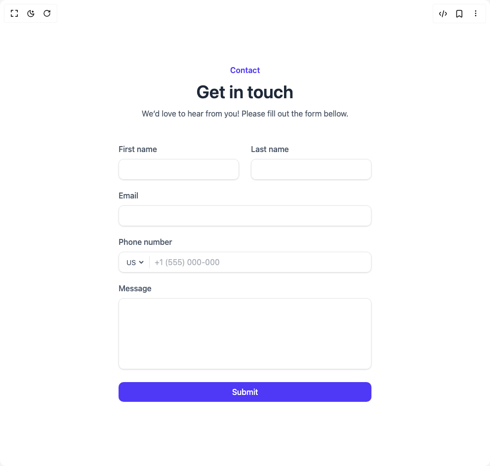

# Build Contact Sections in BuilderStudio

> Build this component in our Agentic IDE: [BuilderStudio](https://builderstudio.dev).
>
> Join the BuilderStudio community on [Discord](https://discord.gg/QdWeSGCqfe) and [Reddit](https://reddit.com/r/builderstudio).



## Component

- Author group: `float_ui`
- Component: `contact-sections`
- Variant: `centered-contact-section`
- Rendered HTML snapshot: [`rendered.html`](rendered.html)

## BuilderStudio prompt

You are implementing a React component based on a component reference.

## Component identity

- Author: float_ui
- Component slug: contact-sections
- Demo slug: centered-contact-section
- Title: contact-sections
- Description: 

## Goal

Recreate this component in a React + TypeScript + Tailwind CSS project. Preserve the visual layout, spacing, colors, border radius, shadows, interaction behavior, animation behavior, responsive behavior, and dark mode behavior shown in the rendered demo.

## Implementation requirements

- Use React and TypeScript.
- Use Tailwind CSS classes whenever possible.
- Keep the component self-contained unless the source files require helper components.
- If the source uses CSS variables, custom CSS, animations, or keyframes, include them.
- If the source uses external packages, list and use the required packages.
- Preserve accessibility attributes, button semantics, links, keyboard behavior, and ARIA attributes when visible in the source.
- Do not replace the component with a simplified placeholder.
- Return complete production-ready code.

## Dependencies

No reference metadata available.

## Rendered DOM snapshot

This is the rendered demo HTML extracted from the live preview. Use it to verify structure, class names, visible content, and layout.

```html
<div id="root"><div class="w-screen min-h-screen flex justify-center items-center"><div class="w-screen min-h-screen flex justify-center items-center"><main class="py-14"><div class="max-w-screen-xl mx-auto px-4 text-gray-600 md:px-8"><div class="max-w-lg mx-auto space-y-3 sm:text-center"><h3 class="text-indigo-600 font-semibold">Contact</h3><p class="text-gray-800 text-3xl font-semibold sm:text-4xl">Get in touch</p><p>We’d love to hear from you! Please fill out the form bellow.</p></div><div class="mt-12 max-w-lg mx-auto"><form class="space-y-5"><div class="flex flex-col items-center gap-y-5 gap-x-6 [&amp;&gt;*]:w-full sm:flex-row"><div><label class="font-medium">First name</label><input required="" class="w-full mt-2 px-3 py-2 text-gray-500 bg-transparent outline-none border focus:border-indigo-600 shadow-sm rounded-lg" type="text"></div><div><label class="font-medium">Last name</label><input required="" class="w-full mt-2 px-3 py-2 text-gray-500 bg-transparent outline-none border focus:border-indigo-600 shadow-sm rounded-lg" type="text"></div></div><div><label class="font-medium">Email</label><input required="" class="w-full mt-2 px-3 py-2 text-gray-500 bg-transparent outline-none border focus:border-indigo-600 shadow-sm rounded-lg" type="email"></div><div><label class="font-medium">Phone number</label><div class="relative mt-2"><div class="absolute inset-y-0 left-3 my-auto h-6 flex items-center border-r pr-2"><select class="text-sm bg-transparent outline-none rounded-lg h-full"><option>US</option><option>ES</option><option>MR</option></select></div><input placeholder="+1 (555) 000-000" required="" class="w-full pl-[4.5rem] pr-3 py-2 appearance-none bg-transparent outline-none border focus:border-indigo-600 shadow-sm rounded-lg" type="number"></div></div><div><label class="font-medium">Message</label><textarea required="" class="w-full mt-2 h-36 px-3 py-2 resize-none appearance-none bg-transparent outline-none border focus:border-indigo-600 shadow-sm rounded-lg"></textarea></div><button class="w-full px-4 py-2 text-white font-medium bg-indigo-600 hover:bg-indigo-500 active:bg-indigo-600 rounded-lg duration-150">Submit</button></form></div></div></main></div></div></div>
```

## Reference source files

No reference source files were available.
