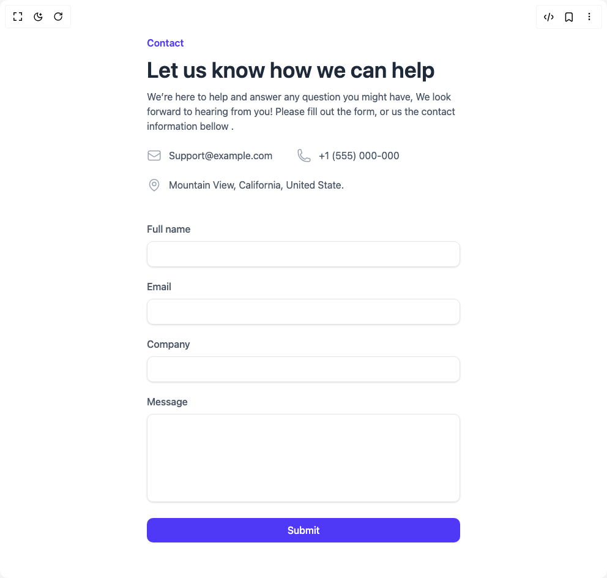

# Build Contact Sections in BuilderStudio

> Build this component in our Agentic IDE: [BuilderStudio](https://builderstudio.dev).
>
> Join the BuilderStudio community on [Discord](https://discord.gg/QdWeSGCqfe) and [Reddit](https://reddit.com/r/builderstudio).



## Component

- Author group: `float_ui`
- Component: `contact-sections`
- Variant: `contact-section-with-info`
- Rendered HTML snapshot: [`rendered.html`](rendered.html)

## BuilderStudio prompt

You are implementing a React component based on a component reference.

## Component identity

- Author: float_ui
- Component slug: contact-sections
- Demo slug: contact-section-with-info
- Title: contact-sections
- Description: 

## Goal

Recreate this component in a React + TypeScript + Tailwind CSS project. Preserve the visual layout, spacing, colors, border radius, shadows, interaction behavior, animation behavior, responsive behavior, and dark mode behavior shown in the rendered demo.

## Implementation requirements

- Use React and TypeScript.
- Use Tailwind CSS classes whenever possible.
- Keep the component self-contained unless the source files require helper components.
- If the source uses CSS variables, custom CSS, animations, or keyframes, include them.
- If the source uses external packages, list and use the required packages.
- Preserve accessibility attributes, button semantics, links, keyboard behavior, and ARIA attributes when visible in the source.
- Do not replace the component with a simplified placeholder.
- Return complete production-ready code.

## Dependencies

No reference metadata available.

## Rendered DOM snapshot

This is the rendered demo HTML extracted from the live preview. Use it to verify structure, class names, visible content, and layout.

```html
<div id="root"><div class="w-screen min-h-screen flex justify-center items-center"><div class="w-screen min-h-screen flex justify-center items-center"><main class="py-14"><div class="max-w-screen-xl mx-auto px-4 text-gray-600 md:px-8"><div class="max-w-lg mx-auto gap-12 justify-between lg:flex lg:max-w-none"><div class="max-w-lg space-y-3"><h3 class="text-indigo-600 font-semibold">Contact</h3><p class="text-gray-800 text-3xl font-semibold sm:text-4xl">Let us know how we can help</p><p>We’re here to help and answer any question you might have, We look forward to hearing from you! Please fill out the form, or us the contact information bellow .</p><div><ul class="mt-6 flex flex-wrap gap-x-10 gap-y-6 items-center"><li class="flex items-center gap-x-3"><div class="flex-none text-gray-400"><svg xmlns="http://www.w3.org/2000/svg" fill="none" viewBox="0 0 24 24" stroke-width="1.5" stroke="currentColor" class="w-6 h-6"><path stroke-linecap="round" stroke-linejoin="round" d="M21.75 6.75v10.5a2.25 2.25 0 01-2.25 2.25h-15a2.25 2.25 0 01-2.25-2.25V6.75m19.5 0A2.25 2.25 0 0019.5 4.5h-15a2.25 2.25 0 00-2.25 2.25m19.5 0v.243a2.25 2.25 0 01-1.07 1.916l-7.5 4.615a2.25 2.25 0 01-2.36 0L3.32 8.91a2.25 2.25 0 01-1.07-1.916V6.75"></path></svg></div><p>Support@example.com</p></li><li class="flex items-center gap-x-3"><div class="flex-none text-gray-400"><svg xmlns="http://www.w3.org/2000/svg" fill="none" viewBox="0 0 24 24" stroke-width="1.5" stroke="currentColor" class="w-6 h-6"><path stroke-linecap="round" stroke-linejoin="round" d="M2.25 6.75c0 8.284 6.716 15 15 15h2.25a2.25 2.25 0 002.25-2.25v-1.372c0-.516-.351-.966-.852-1.091l-4.423-1.106c-.44-.11-.902.055-1.173.417l-.97 1.293c-.282.376-.769.542-1.21.38a12.035 12.035 0 01-7.143-7.143c-.162-.441.004-.928.38-1.21l1.293-.97c.363-.271.527-.734.417-1.173L6.963 3.102a1.125 1.125 0 00-1.091-.852H4.5A2.25 2.25 0 002.25 4.5v2.25z"></path></svg></div><p>+1 (555) 000-000</p></li><li class="flex items-center gap-x-3"><div class="flex-none text-gray-400"><svg xmlns="http://www.w3.org/2000/svg" fill="none" viewBox="0 0 24 24" stroke-width="1.5" stroke="currentColor" class="w-6 h-6"><path stroke-linecap="round" stroke-linejoin="round" d="M15 10.5a3 3 0 11-6 0 3 3 0 016 0z"></path><path stroke-linecap="round" stroke-linejoin="round" d="M19.5 10.5c0 7.142-7.5 11.25-7.5 11.25S4.5 17.642 4.5 10.5a7.5 7.5 0 1115 0z"></path></svg></div><p>Mountain View, California, United State.</p></li></ul></div></div><div class="flex-1 mt-12 sm:max-w-lg lg:max-w-md"><form class="space-y-5"><div><label class="font-medium">Full name</label><input required="" class="w-full mt-2 px-3 py-2 text-gray-500 bg-transparent outline-none border focus:border-indigo-600 shadow-sm rounded-lg" type="text"></div><div><label class="font-medium">Email</label><input required="" class="w-full mt-2 px-3 py-2 text-gray-500 bg-transparent outline-none border focus:border-indigo-600 shadow-sm rounded-lg" type="email"></div><div><label class="font-medium">Company</label><input required="" class="w-full mt-2 px-3 py-2 text-gray-500 bg-transparent outline-none border focus:border-indigo-600 shadow-sm rounded-lg" type="text"></div><div><label class="font-medium">Message</label><textarea required="" class="w-full mt-2 h-36 px-3 py-2 resize-none appearance-none bg-transparent outline-none border focus:border-indigo-600 shadow-sm rounded-lg"></textarea></div><button class="w-full px-4 py-2 text-white font-medium bg-indigo-600 hover:bg-indigo-500 active:bg-indigo-600 rounded-lg duration-150">Submit</button></form></div></div></div></main></div></div></div>
```

## Reference source files

No reference source files were available.
