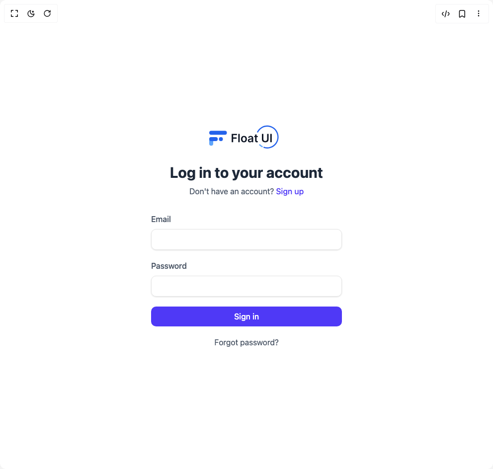

# Build Login With Listed Provider in BuilderStudio

> Build this component in our Agentic IDE: [BuilderStudio](https://builderstudio.dev).
>
> Join the BuilderStudio community on [Discord](https://discord.gg/QdWeSGCqfe) and [Reddit](https://reddit.com/r/builderstudio).



## Component

- Author group: `float_ui`
- Component: `login-with-listed-provider`
- Variant: `basic-login-form`
- Rendered HTML snapshot: [`rendered.html`](rendered.html)

## BuilderStudio prompt

You are implementing a React component based on a component reference.

## Component identity

- Author: float_ui
- Component slug: login-with-listed-provider
- Demo slug: basic-login-form
- Title: login-with-listed-provider
- Description: 

## Goal

Recreate this component in a React + TypeScript + Tailwind CSS project. Preserve the visual layout, spacing, colors, border radius, shadows, interaction behavior, animation behavior, responsive behavior, and dark mode behavior shown in the rendered demo.

## Implementation requirements

- Use React and TypeScript.
- Use Tailwind CSS classes whenever possible.
- Keep the component self-contained unless the source files require helper components.
- If the source uses CSS variables, custom CSS, animations, or keyframes, include them.
- If the source uses external packages, list and use the required packages.
- Preserve accessibility attributes, button semantics, links, keyboard behavior, and ARIA attributes when visible in the source.
- Do not replace the component with a simplified placeholder.
- Return complete production-ready code.

## Dependencies

No reference metadata available.

## Rendered DOM snapshot

This is the rendered demo HTML extracted from the live preview. Use it to verify structure, class names, visible content, and layout.

```html
<div id="root"><div class="w-screen min-h-screen flex justify-center items-center"><div class="w-screen min-h-screen flex justify-center items-center"><main class="w-full h-screen flex flex-col items-center justify-center px-4"><div class="max-w-sm w-full text-gray-600"><div class="text-center"><div class="mt-5 space-y-2"><h3 class="text-gray-800 text-2xl font-bold sm:text-3xl">Log in to your account</h3><p>Don't have an account? <a href="#" class="font-medium text-indigo-600 hover:text-indigo-500">Sign up</a></p></div></div><form class="mt-8 space-y-5"><div><label class="font-medium">Email</label><input required="" class="w-full mt-2 px-3 py-2 text-gray-500 bg-transparent outline-none border focus:border-indigo-600 shadow-sm rounded-lg" type="email"></div><div><label class="font-medium">Password</label><input required="" class="w-full mt-2 px-3 py-2 text-gray-500 bg-transparent outline-none border focus:border-indigo-600 shadow-sm rounded-lg" type="password"></div><button type="submit" class="w-full px-4 py-2 text-white font-medium bg-indigo-600 hover:bg-indigo-500 active:bg-indigo-600 rounded-lg duration-150">Sign in</button><div class="text-center"><a href="#" class="hover:text-indigo-600">Forgot password?</a></div></form></div></main></div></div></div>
```

## Reference source files

No reference source files were available.
