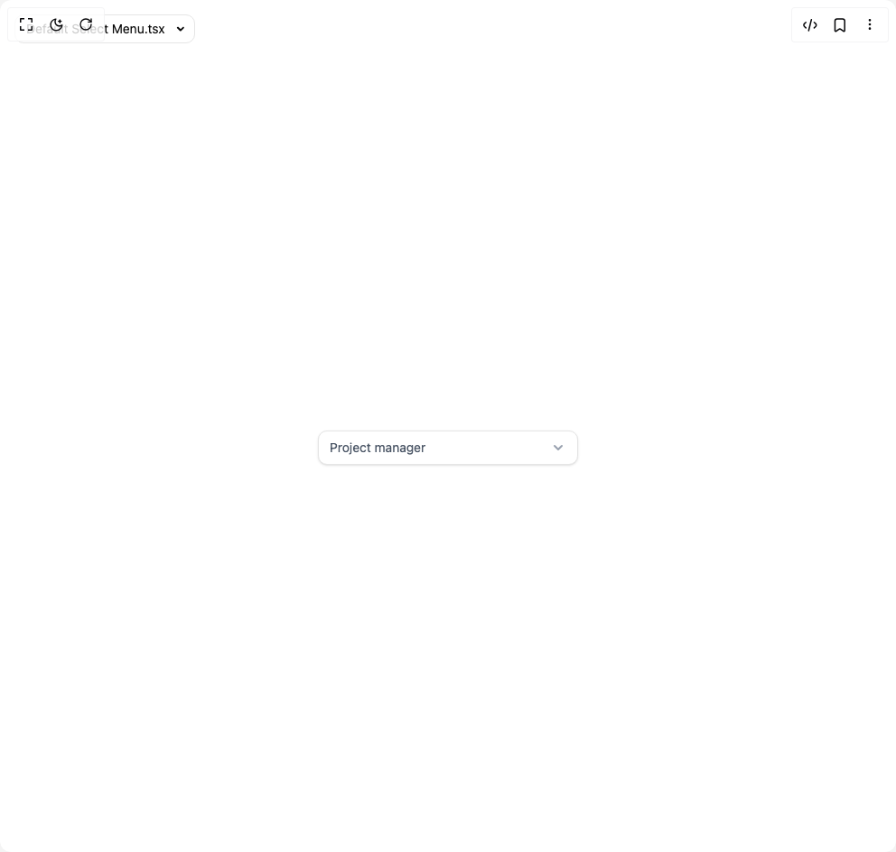

# Build Select Menu in BuilderStudio

> Build this component in our Agentic IDE: [BuilderStudio](https://builderstudio.dev).
>
> Join the BuilderStudio community on [Discord](https://discord.gg/QdWeSGCqfe) and [Reddit](https://reddit.com/r/builderstudio).



## Component

- Author group: `float_ui`
- Component: `select-menu`
- Variant: `default-select-menu`
- Rendered HTML snapshot: [`rendered.html`](rendered.html)

## BuilderStudio prompt

You are implementing a React component based on a component reference.

## Component identity

- Author: float_ui
- Component slug: select-menu
- Demo slug: default-select-menu
- Title: select-menu
- Description: 

## Goal

Recreate this component in a React + TypeScript + Tailwind CSS project. Preserve the visual layout, spacing, colors, border radius, shadows, interaction behavior, animation behavior, responsive behavior, and dark mode behavior shown in the rendered demo.

## Implementation requirements

- Use React and TypeScript.
- Use Tailwind CSS classes whenever possible.
- Keep the component self-contained unless the source files require helper components.
- If the source uses CSS variables, custom CSS, animations, or keyframes, include them.
- If the source uses external packages, list and use the required packages.
- Preserve accessibility attributes, button semantics, links, keyboard behavior, and ARIA attributes when visible in the source.
- Do not replace the component with a simplified placeholder.
- Return complete production-ready code.

## Dependencies

No reference metadata available.

## Rendered DOM snapshot

This is the rendered demo HTML extracted from the live preview. Use it to verify structure, class names, visible content, and layout.

```html
<div id="root"><div class="w-screen min-h-screen flex justify-center items-center"><div class="fixed top-4 left-4 z-10"><select class="appearance-none h-8 max-w-[200px] text-sm leading-tight rounded-lg pl-3 pr-7 py-0 border bg-background focus:outline-none focus:ring-0"><option value="Default Select Menu.tsx_SelectMenu$6">Default Select Menu.tsx</option><option value="Primary Select Menu.tsx_SelectMenu$5">Primary Select Menu.tsx</option><option value="Select Menu with Avatars.tsx_SelectMenu$4">Select Menu with Avatars.tsx</option><option value="Select Menu with Icon.tsx_SelectMenu$3">Select Menu with Icon.tsx</option><option value="Select Menu with search box .tsx_SelectMenu$2">Select Menu with search box .tsx</option><option value="Status Select Menu.tsx_SelectMenu$1">Status Select Menu.tsx</option><option value="default.tsx_DemoOne">default.tsx</option></select><div class="absolute top-1/2 transform -translate-y-1/2 right-2 pointer-events-none"><svg class="w-4 h-4 fill-current" viewBox="0 0 20 20"><path d="M5.516 7.548c.436-.446 1.043-.48 1.576 0L10 10.405l2.908-2.857c.533-.48 1.14-.446 1.576 0 .436.445.408 1.197 0 1.615l-3.734 3.705c-.533.534-1.39.534-1.923 0l-3.734-3.705c-.408-.418-.436-1.17 0-1.615z"></path></svg></div></div><div class="w-screen min-h-screen flex justify-center items-center"><div class="relative w-72 max-w-full mx-auto mt-12"><svg xmlns="http://www.w3.org/2000/svg" class="absolute top-0 bottom-0 w-5 h-5 my-auto text-gray-400 right-3" viewBox="0 0 20 20" fill="currentColor"><path fill-rule="evenodd" d="M5.293 7.293a1 1 0 011.414 0L10 10.586l3.293-3.293a1 1 0 111.414 1.414l-4 4a1 1 0 01-1.414 0l-4-4a1 1 0 010-1.414z" clip-rule="evenodd"></path></svg><select class="w-full px-3 py-2 text-sm text-gray-600 bg-white border rounded-lg shadow-sm outline-none appearance-none focus:ring-offset-2 focus:ring-indigo-600 focus:ring-2"><option>Project manager</option><option>Software engineer</option><option>IT manager</option><option>UI / UX designer</option></select></div></div></div></div>
```

## Reference source files

No reference source files were available.
