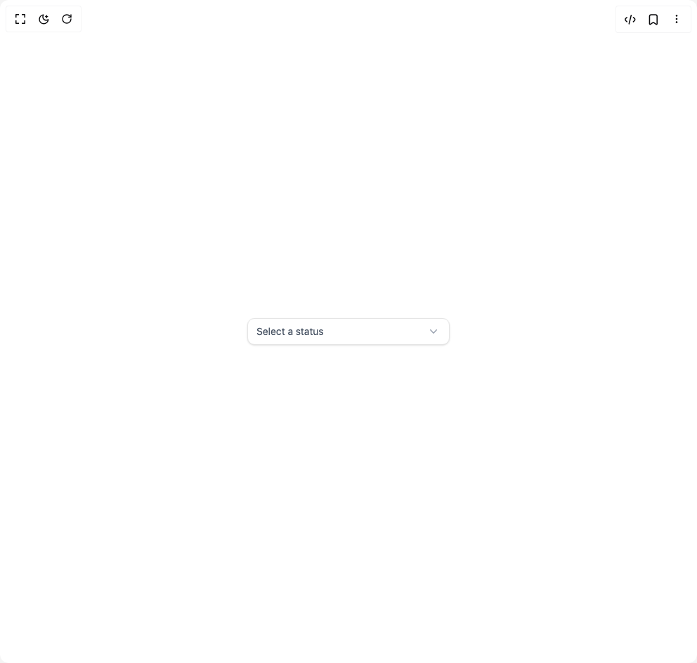

# Build Select Menu in BuilderStudio

> Build this component in our Agentic IDE: [BuilderStudio](https://builderstudio.dev).
>
> Join the BuilderStudio community on [Discord](https://discord.gg/QdWeSGCqfe) and [Reddit](https://reddit.com/r/builderstudio).



## Component

- Author group: `float_ui`
- Component: `select-menu`
- Variant: `status-select-menu`
- Rendered HTML snapshot: [`rendered.html`](rendered.html)

## BuilderStudio prompt

You are implementing a React component based on a component reference.

## Component identity

- Author: float_ui
- Component slug: select-menu
- Demo slug: status-select-menu
- Title: select-menu
- Description: 

## Goal

Recreate this component in a React + TypeScript + Tailwind CSS project. Preserve the visual layout, spacing, colors, border radius, shadows, interaction behavior, animation behavior, responsive behavior, and dark mode behavior shown in the rendered demo.

## Implementation requirements

- Use React and TypeScript.
- Use Tailwind CSS classes whenever possible.
- Keep the component self-contained unless the source files require helper components.
- If the source uses CSS variables, custom CSS, animations, or keyframes, include them.
- If the source uses external packages, list and use the required packages.
- Preserve accessibility attributes, button semantics, links, keyboard behavior, and ARIA attributes when visible in the source.
- Do not replace the component with a simplified placeholder.
- Return complete production-ready code.

## Dependencies

No reference metadata available.

## Rendered DOM snapshot

This is the rendered demo HTML extracted from the live preview. Use it to verify structure, class names, visible content, and layout.

```html
<div id="root"><div class="w-screen min-h-screen flex justify-center items-center"><div class="w-screen min-h-screen flex justify-center items-center"><div class="w-72 max-w-full"><button type="button" role="combobox" aria-controls="radix-«r0»" aria-expanded="false" aria-autocomplete="none" dir="ltr" data-state="closed" data-placeholder="" class="w-full inline-flex items-center justify-between px-3 py-2 text-sm text-gray-600 bg-white border rounded-lg shadow-sm outline-none focus:ring-offset-2 focus:ring-indigo-600 focus:ring-2"><span style="pointer-events: none;">Select a status</span><span aria-hidden="true" class="text-gray-400"><svg xmlns="http://www.w3.org/2000/svg" viewBox="0 0 20 20" fill="currentColor" class="w-5 h-5 text-gray-400"><path fill-rule="evenodd" d="M5.23 7.21a.75.75 0 011.06.02L10 11.168l3.71-3.938a.75.75 0 111.08 1.04l-4.25 4.5a.75.75 0 01-1.08 0l-4.25-4.5a.75.75 0 01.02-1.06z" clip-rule="evenodd"></path></svg></span></button></div></div></div></div>
```

## Reference source files

No reference source files were available.
