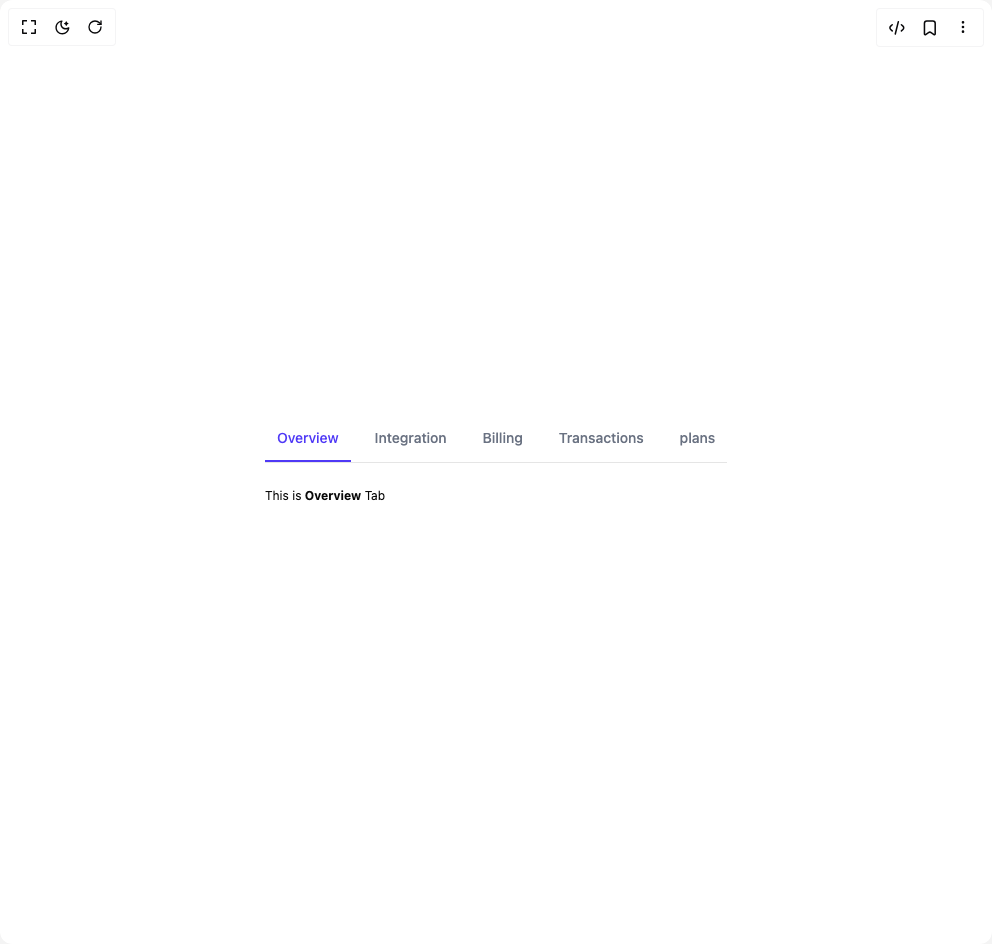

# Build Tabs 2 in BuilderStudio

> Build this component in our Agentic IDE: [BuilderStudio](https://builderstudio.dev).
>
> Join the BuilderStudio community on [Discord](https://discord.gg/QdWeSGCqfe) and [Reddit](https://reddit.com/r/builderstudio).



## Component

- Author group: `float_ui`
- Component: `tabs-2`
- Variant: `basic-tabs`
- Rendered HTML snapshot: [`rendered.html`](rendered.html)

## BuilderStudio prompt

You are implementing a React component based on a component reference.

## Component identity

- Author: float_ui
- Component slug: tabs-2
- Demo slug: basic-tabs
- Title: tabs-2
- Description: 

## Goal

Recreate this component in a React + TypeScript + Tailwind CSS project. Preserve the visual layout, spacing, colors, border radius, shadows, interaction behavior, animation behavior, responsive behavior, and dark mode behavior shown in the rendered demo.

## Implementation requirements

- Use React and TypeScript.
- Use Tailwind CSS classes whenever possible.
- Keep the component self-contained unless the source files require helper components.
- If the source uses CSS variables, custom CSS, animations, or keyframes, include them.
- If the source uses external packages, list and use the required packages.
- Preserve accessibility attributes, button semantics, links, keyboard behavior, and ARIA attributes when visible in the source.
- Do not replace the component with a simplified placeholder.
- Return complete production-ready code.

## Dependencies

No reference metadata available.

## Rendered DOM snapshot

This is the rendered demo HTML extracted from the live preview. Use it to verify structure, class names, visible content, and layout.

```html
<div id="root"><div class="w-screen min-h-screen flex justify-center items-center"><div class="w-screen min-h-screen flex justify-center items-center"><div dir="ltr" data-orientation="horizontal" class="max-w-screen-xl mx-auto px-4 md:px-8"><div role="tablist" aria-orientation="horizontal" class="w-full border-b flex items-center gap-x-3 overflow-x-auto text-sm" aria-label="Manage your account" tabindex="0" data-orientation="horizontal" style="outline: none;"><button type="button" role="tab" aria-selected="true" aria-controls="radix-«r0»-content-Overview" data-state="active" id="radix-«r0»-trigger-Overview" class="group outline-none py-1.5 border-b-2 border-white text-gray-500 data-[state=active]:border-indigo-600 data-[state=active]:text-indigo-600" tabindex="-1" data-orientation="horizontal" data-radix-collection-item=""><div class="py-1.5 px-3 rounded-lg duration-150 group-hover:text-indigo-600 group-hover:bg-gray-50 group-active:bg-gray-100 font-medium">Overview</div></button><button type="button" role="tab" aria-selected="false" aria-controls="radix-«r0»-content-Integration" data-state="inactive" id="radix-«r0»-trigger-Integration" class="group outline-none py-1.5 border-b-2 border-white text-gray-500 data-[state=active]:border-indigo-600 data-[state=active]:text-indigo-600" tabindex="-1" data-orientation="horizontal" data-radix-collection-item=""><div class="py-1.5 px-3 rounded-lg duration-150 group-hover:text-indigo-600 group-hover:bg-gray-50 group-active:bg-gray-100 font-medium">Integration</div></button><button type="button" role="tab" aria-selected="false" aria-controls="radix-«r0»-content-Billing" data-state="inactive" id="radix-«r0»-trigger-Billing" class="group outline-none py-1.5 border-b-2 border-white text-gray-500 data-[state=active]:border-indigo-600 data-[state=active]:text-indigo-600" tabindex="-1" data-orientation="horizontal" data-radix-collection-item=""><div class="py-1.5 px-3 rounded-lg duration-150 group-hover:text-indigo-600 group-hover:bg-gray-50 group-active:bg-gray-100 font-medium">Billing</div></button><button type="button" role="tab" aria-selected="false" aria-controls="radix-«r0»-content-Transactions" data-state="inactive" id="radix-«r0»-trigger-Transactions" class="group outline-none py-1.5 border-b-2 border-white text-gray-500 data-[state=active]:border-indigo-600 data-[state=active]:text-indigo-600" tabindex="-1" data-orientation="horizontal" data-radix-collection-item=""><div class="py-1.5 px-3 rounded-lg duration-150 group-hover:text-indigo-600 group-hover:bg-gray-50 group-active:bg-gray-100 font-medium">Transactions</div></button><button type="button" role="tab" aria-selected="false" aria-controls="radix-«r0»-content-plans" data-state="inactive" id="radix-«r0»-trigger-plans" class="group outline-none py-1.5 border-b-2 border-white text-gray-500 data-[state=active]:border-indigo-600 data-[state=active]:text-indigo-600" tabindex="-1" data-orientation="horizontal" data-radix-collection-item=""><div class="py-1.5 px-3 rounded-lg duration-150 group-hover:text-indigo-600 group-hover:bg-gray-50 group-active:bg-gray-100 font-medium">plans</div></button></div><div data-state="active" data-orientation="horizontal" role="tabpanel" aria-labelledby="radix-«r0»-trigger-Overview" id="radix-«r0»-content-Overview" tabindex="0" class="py-6" style="animation-duration: 0s;"><p class="text-xs leading-normal">This is <b>Overview</b> Tab</p></div><div data-state="inactive" data-orientation="horizontal" role="tabpanel" aria-labelledby="radix-«r0»-trigger-Integration" hidden="" id="radix-«r0»-content-Integration" tabindex="0" class="py-6"></div><div data-state="inactive" data-orientation="horizontal" role="tabpanel" aria-labelledby="radix-«r0»-trigger-Billing" hidden="" id="radix-«r0»-content-Billing" tabindex="0" class="py-6"></div><div data-state="inactive" data-orientation="horizontal" role="tabpanel" aria-labelledby="radix-«r0»-trigger-Transactions" hidden="" id="radix-«r0»-content-Transactions" tabindex="0" class="py-6"></div><div data-state="inactive" data-orientation="horizontal" role="tabpanel" aria-labelledby="radix-«r0»-trigger-plans" hidden="" id="radix-«r0»-content-plans" tabindex="0" class="py-6"></div></div></div></div></div>
```

## Reference source files

No reference source files were available.
