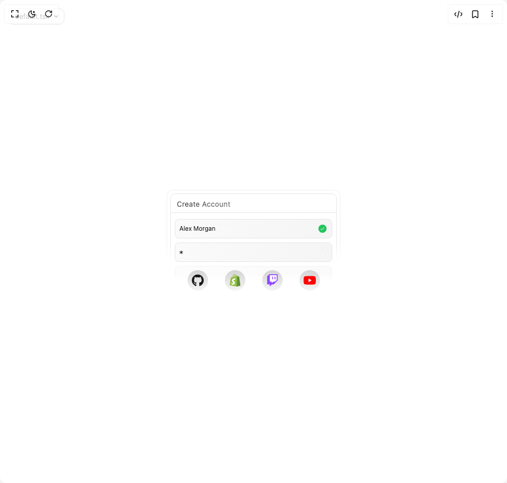
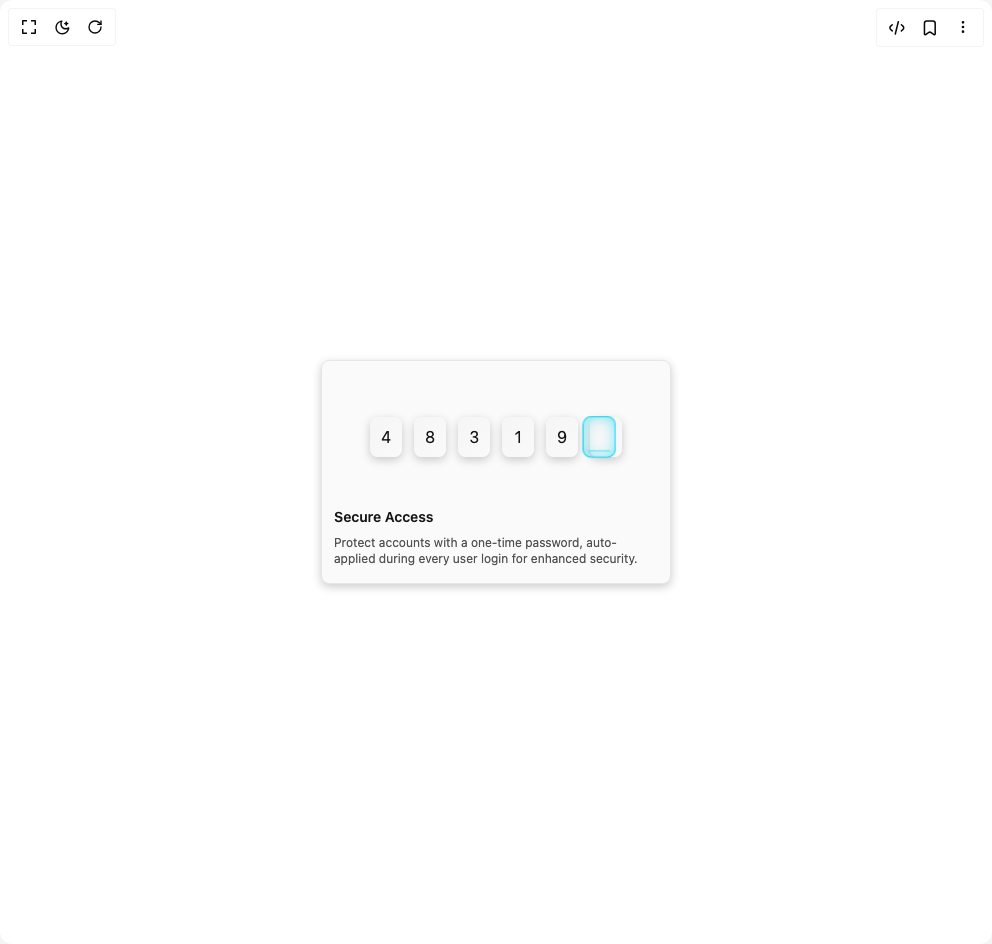
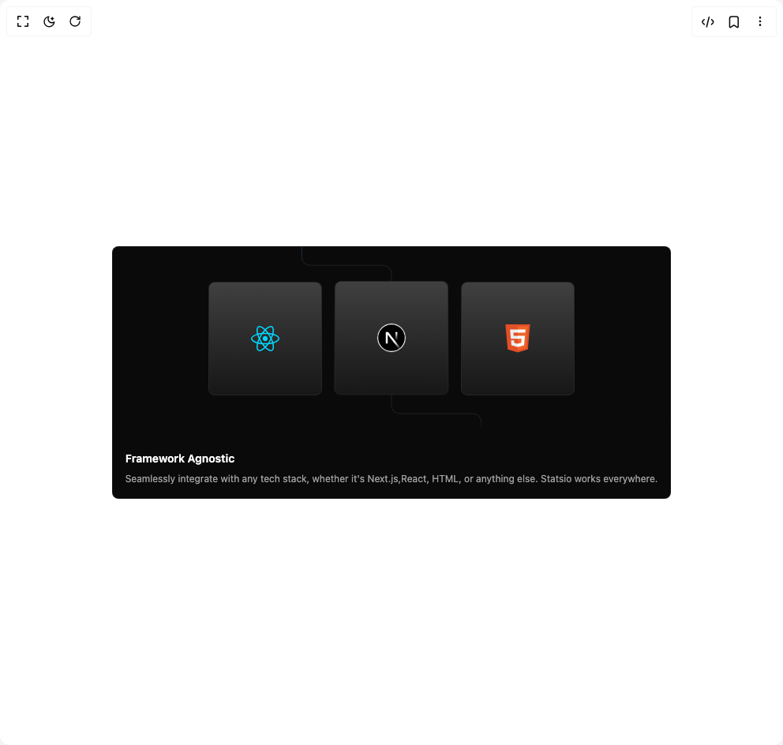
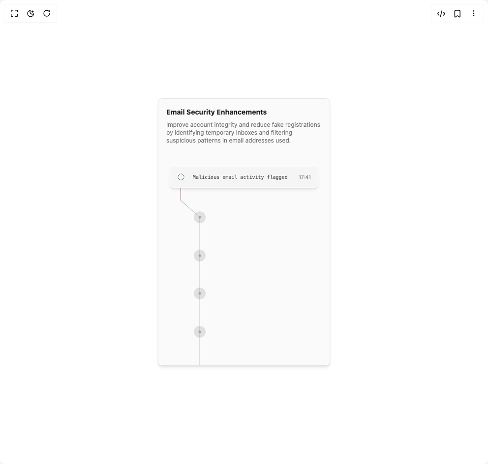
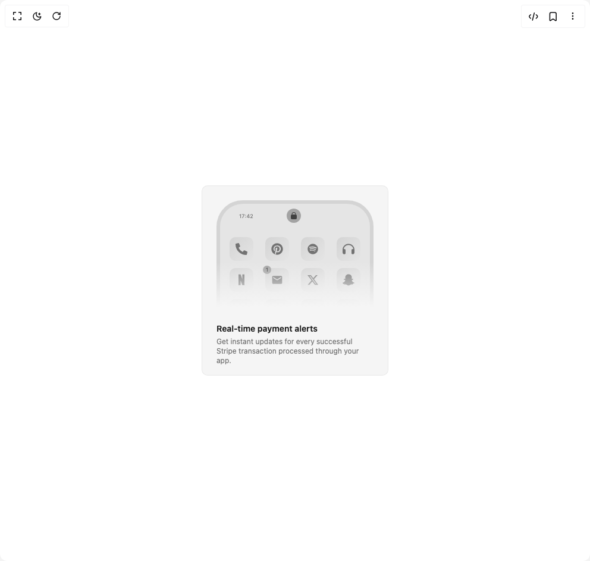

# Forge Ui Components

6 components are available in this author group.

> Build any component in [BuilderStudio](https://builderstudio.dev), then share improvements with the community on [Discord](https://discord.gg/QdWeSGCqfe) or [Reddit](https://reddit.com/r/builderstudio).

| Preview | Component | Variant |
| --- | --- | --- |
|  | [Animated Form](animated-form/default/README.md) | `default` |
|  | [Animated Otp](animated-otp/default/README.md) | `default` |
|  | [Framework Agnostic](framework-agnostic/default/README.md) | `default` |
|  | [Fraud Card](fraud-card/default/README.md) | `default` |
|  | [Notification Center](notification-center/default/README.md) | `default` |
|  | [Security Card](security-card/default/README.md) | `default` |
