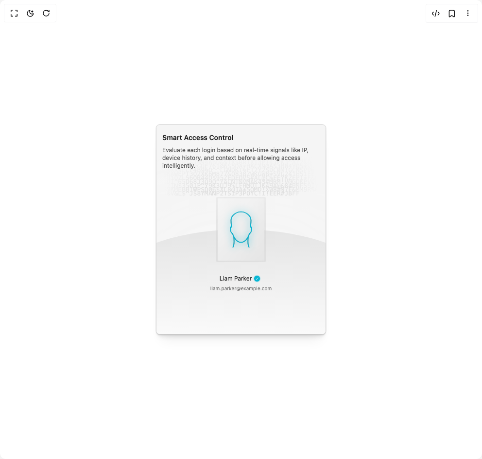

# Build Security Card in BuilderStudio

> Build this component in our Agentic IDE: [BuilderStudio](https://builderstudio.dev).
>
> Join the BuilderStudio community on [Discord](https://discord.gg/QdWeSGCqfe) and [Reddit](https://reddit.com/r/builderstudio).



## Component

- Author group: `forge-ui`
- Component: `security-card`
- Variant: `default`
- Rendered HTML snapshot: [`rendered.html`](rendered.html)

## BuilderStudio prompt

You are implementing a React component based on a component reference.

## Component identity

- Author: forge-ui
- Component slug: security-card
- Demo slug: default
- Title: security-card
- Description: 

## Goal

Recreate this component in a React + TypeScript + Tailwind CSS project. Preserve the visual layout, spacing, colors, border radius, shadows, interaction behavior, animation behavior, responsive behavior, and dark mode behavior shown in the rendered demo.

## Implementation requirements

- Use React and TypeScript.
- Use Tailwind CSS classes whenever possible.
- Keep the component self-contained unless the source files require helper components.
- If the source uses CSS variables, custom CSS, animations, or keyframes, include them.
- If the source uses external packages, list and use the required packages.
- Preserve accessibility attributes, button semantics, links, keyboard behavior, and ARIA attributes when visible in the source.
- Do not replace the component with a simplified placeholder.
- Return complete production-ready code.

## Dependencies

No reference metadata available.

## Rendered DOM snapshot

This is the rendered demo HTML extracted from the live preview. Use it to verify structure, class names, visible content, and layout.

```html
<div id="root"><div class="w-screen min-h-screen flex justify-center items-center"><div class="w-screen min-h-screen flex justify-center items-center"><div class="relative overflow-hidden flex h-[27rem] w-full max-w-[350px] items-center justify-center rounded-md border border-neutral-300 bg-neutral-100 dark:border-neutral-800 dark:bg-neutral-900 shadow-[0px_0px_0px_1px_rgba(0,0,0,0.06),0px_1px_1px_-0.5px_rgba(0,0,0,0.06),0px_3px_3px_-1.5px_rgba(0,0,0,0.06),_0px_6px_6px_-3px_rgba(0,0,0,0.06),0px_12px_12px_-6px_rgba(0,0,0,0.06),0px_24px_24px_-12px_rgba(0,0,0,0.06)]"><div class="absolute top-[15%] max-w-[322px]"><p class="leading-2 whitespace-normal break-words font-mono text-[13px] text-neutral-500 opacity-35">Y4#!I*ZO1QCFU07QJFDVW#6$17$WW^#7MR5Q50I^2FFKJQW1&amp;1%94ABU&amp;$TX$RRTXT3P!4JPK3^A12&amp;DQ15S08%Q^X*GUE761@6S5DA*HACX9@AS3B04YQ5*VD1*$XX9ECF4B9%O^^LGNDKT%FT2Y2SDC0M!GCNSPVWVNBAWEPT3Q2XK6M877&amp;Q838ZWKGW8*SVG241H51EB2SU1QZL56OR44Q$95ZEDFOVS#AL@C%FEYKZEPI*F&amp;EQUT^65O68J3Q9O^YACNTNVMAK4S#MRM!V@GOKPV0HO2IN$3501P^Y9K3UJ9%LFHMQTJK49A@&amp;84HNFS9IYB@KMEBHIWPSD06$XL8@1A*5OMD!XW8#N7F&amp;MM9R%6E&amp;V&amp;L$^J$8YMANP2TSIP3POYC!I!EER#JBFF</p></div><div class="absolute left-0 top-0 hidden h-full w-[80px] [background-image:linear-gradient(to_right,rgb(23,23,23)_20%,transparent_100%)] dark:block"></div><div class="absolute left-0 top-0 block h-full w-[80px] [background-image:linear-gradient(to_right,rgb(245,245,245)_20%,transparent_100%)] dark:hidden"></div><div class="absolute right-0 top-0 hidden h-full w-[80px] [background-image:linear-gradient(to_left,rgb(23,23,23)_20%,transparent_100%)] dark:block"></div><div class="absolute right-0 top-0 block h-full w-[80px] [background-image:linear-gradient(to_left,rgb(245,245,245)_20%,transparent_100%)] dark:hidden"></div><div class="absolute bottom-0 h-1/2 w-[150%] rounded-t-[60%] bg-gradient-to-b from-neutral-200 to-neutral-50 shadow-[0_0_900px_rgba(250,250,250,0.9)] dark:from-neutral-800 dark:to-neutral-950 dark:shadow-[0_0_900px_rgba(10,10,10,0.9)]"></div><div class="absolute top-[70%] flex h-12 w-full flex-col items-center justify-center gap-1"><div class="flex items-center justify-center text-xs text-primary"><p style="transform: translateX(-2px);">Liam Parker</p><div class="relative"><svg width="18" height="18"><circle cx="9" cy="9" r="6" fill="#06b6d4" class="rounded-full [filter:drop-shadow(0_0_1px_#06b6d4)]" opacity="1"></circle></svg><div class="absolute left-[5px] top-[5px] flex items-center justify-center text-white dark:text-black" style="opacity: 1; transform: none;"><svg stroke="currentColor" fill="currentColor" stroke-width="0" viewBox="0 0 512 512" class="size-2" height="1em" width="1em" xmlns="http://www.w3.org/2000/svg"><path d="M186.301 339.893L96 249.461l-32 30.507L186.301 402 448 140.506 416 110z"></path></svg></div></div></div><div class="no-ios-link text-[10px] text-neutral-500">liam.parker@example.com</div></div><div class="relative rounded-[2px] bg-neutral-300/50 px-[3px] py-[3.2px] dark:bg-neutral-950/50"><div class="relative h-32 w-24 rounded-[2px] bg-gradient-to-br from-neutral-100 to-neutral-200 dark:from-neutral-700 dark:to-neutral-800"><svg viewBox="0 0 80 96" fill="none" class="absolute inset-0 h-full w-full" stroke-linecap="round" stroke-linejoin="round" stroke-width="1.5"><path d="M26.22 78.25c2.679-3.522 1.485-17.776 1.485-17.776-1.084-2.098-1.918-4.288-2.123-5.619-3.573 0-3.7-8.05-3.827-9.937-.102-1.509 1.403-1.383 2.169-1.132-.298-1.3-.92-5.408-1.021-11.446C22.775 24.794 30.94 17.75 40 17.75h.005c9.059 0 17.225 7.044 17.097 14.59-.102 6.038-.723 10.147-1.021 11.446.765-.251 2.271-.377 2.169 1.132-.128 1.887-.254 9.937-3.827 9.937-.205 1.331-1.039 3.521-2.123 5.619 0 0-1.194 14.254 1.485 17.776" class="stroke-neutral-500 dark:stroke-neutral-900"></path><path d="M27.705 60.474a26.884 26.884 0 0 0 1.577 2.682c1.786 2.642 5.36 6.792 10.718 6.792h.005c5.358 0 8.932-4.15 10.718-6.792a26.884 26.884 0 0 0 1.577-2.682" class="stroke-neutral-500 dark:stroke-neutral-900"></path><path d="M26.22 78.25c2.679-3.522 1.485-17.776 1.485-17.776-1.084-2.098-1.918-4.288-2.123-5.619-3.573 0-3.7-8.05-3.827-9.937-.102-1.509 1.403-1.383 2.169-1.132-.298-1.3-.92-5.408-1.021-11.446C22.775 24.794 30.94 17.75 40 17.75h.005c9.059 0 17.225 7.044 17.097 14.59-.102 6.038-.723 10.147-1.021 11.446.765-.251 2.271-.377 2.169 1.132-.128 1.887-.254 9.937-3.827 9.937-.205 1.331-1.039 3.521-2.123 5.619 0 0-1.194 14.254 1.485 17.776" class="animate-draw-outline stroke-[#06b6d4] [filter:drop-shadow(0_0_6px_#06b6d4)]"></path><path d="M27.705 60.474a26.884 26.884 0 0 0 1.577 2.682c1.786 2.642 5.36 6.792 10.718 6.792h.005c5.358 0 8.932-4.15 10.718-6.792a26.884 26.884 0 0 0 1.577-2.682" class="animate-draw stroke-[#06b6d4] [filter:drop-shadow(0_0_6px_#06b6d4)]"></path></svg></div></div><div class="absolute left-0 top-0 hidden h-[200px] w-full [background-image:linear-gradient(to_bottom,rgb(23,23,23)_30%,transparent_100%)] dark:block"></div><div class="absolute left-0 top-0 block h-[200px] w-full [background-image:linear-gradient(to_bottom,rgb(245,245,245)_30%,transparent_100%)] dark:hidden"></div><div class="absolute left-0 top-4 w-full px-3"><h3 class="text-sm font-semibold text-primary">Smart Access Control</h3><p class="mt-2 text-xs text-neutral-600 dark:text-neutral-400">Evaluate each login based on real-time signals like IP, device history, and context before allowing access intelligently.</p></div></div></div></div></div>
```

## Reference source files

No reference source files were available.
