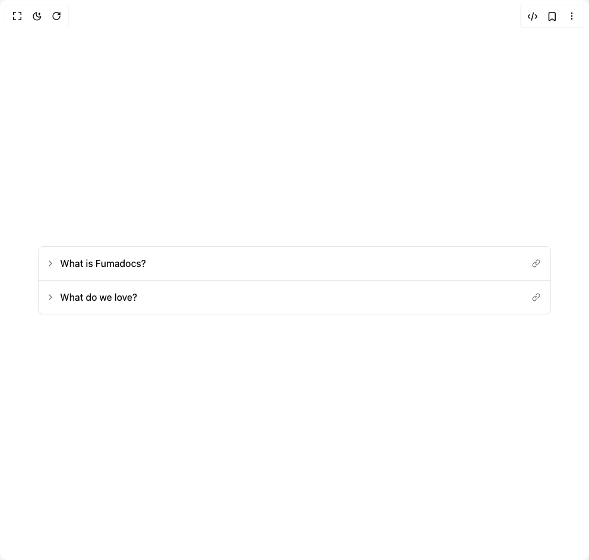
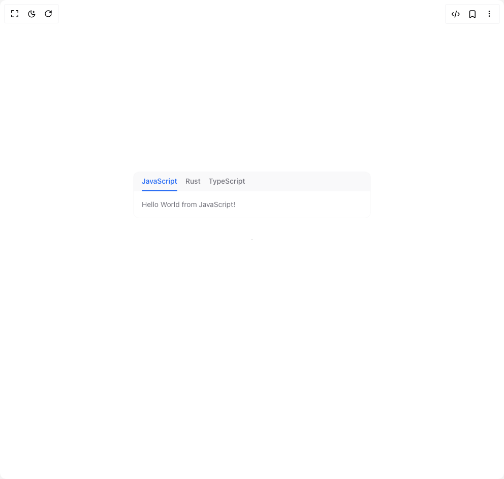
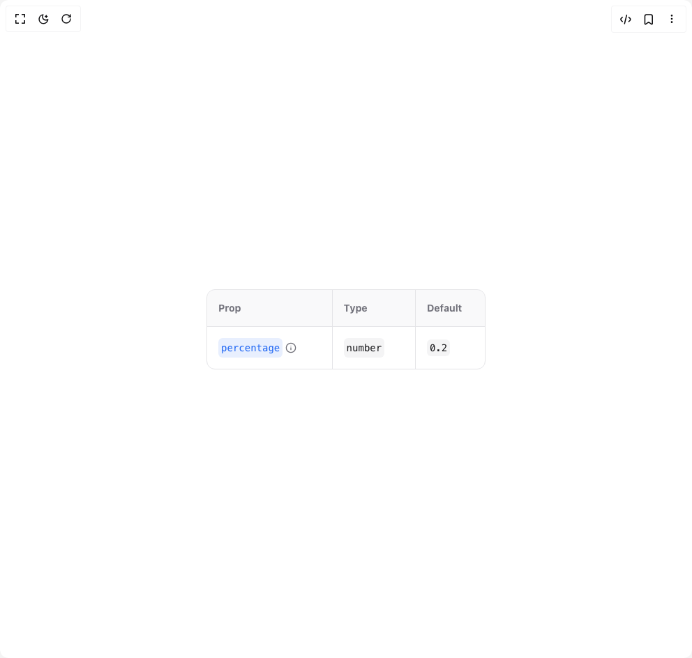

# Fuma Nama Components

5 components are available in this author group.

> Build any component in [BuilderStudio](https://builderstudio.dev), then share improvements with the community on [Discord](https://discord.gg/QdWeSGCqfe) or [Reddit](https://reddit.com/r/builderstudio).

| Preview | Component | Variant |
| --- | --- | --- |
|  | [Accordion](accordion/default/README.md) | `default` |
|  | [Root Toggle](root-toggle/default/README.md) | `default` |
|  | [Tabs](tabs/default/README.md) | `default` |
|  | [Type Table](type-table/default/README.md) | `default` |
|  | [Zoomable Image](zoomable-image/default/README.md) | `default` |
