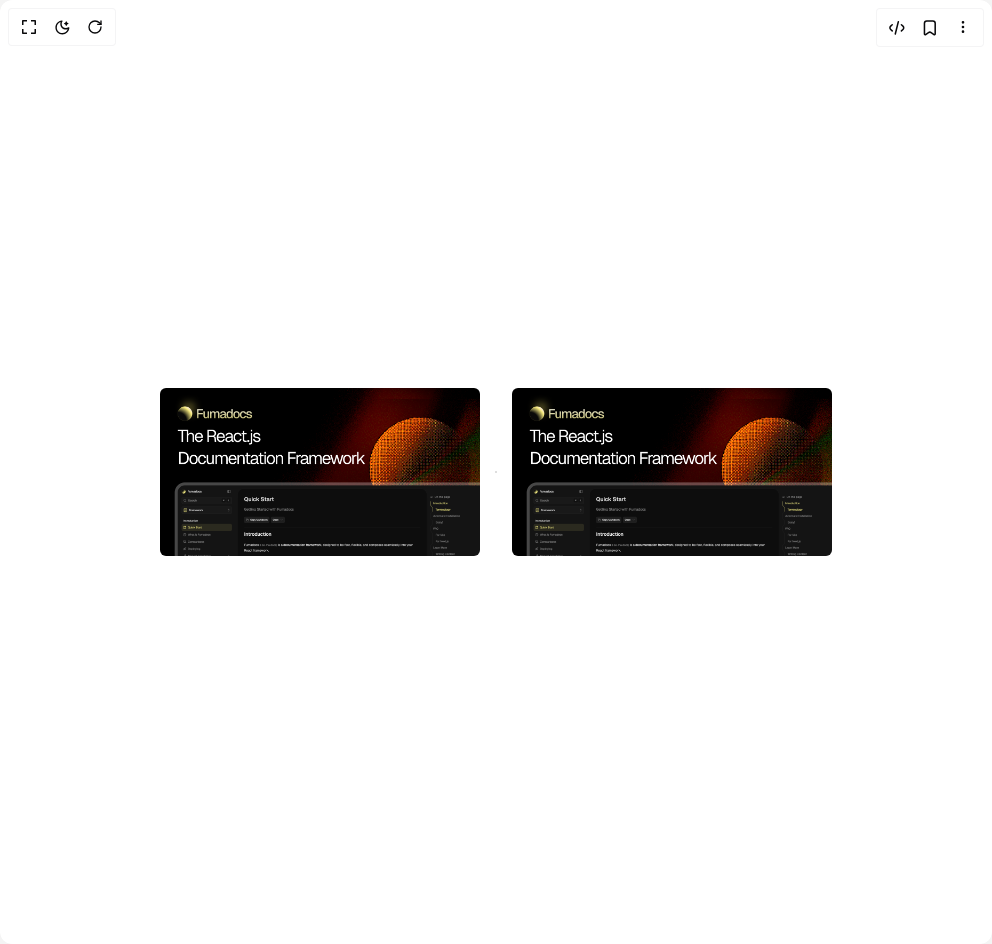

# Build Zoomable Image in BuilderStudio

> Build this component in our Agentic IDE: [BuilderStudio](https://builderstudio.dev).
>
> Join the BuilderStudio community on [Discord](https://discord.gg/QdWeSGCqfe) and [Reddit](https://reddit.com/r/builderstudio).



## Component

- Author group: `fuma-nama`
- Component: `zoomable-image`
- Variant: `default`
- Rendered HTML snapshot: [`rendered.html`](rendered.html)

## BuilderStudio prompt

You are implementing a React component based on a component reference.

## Component identity

- Author: fuma-nama
- Component slug: zoomable-image
- Demo slug: default
- Title: zoomable-image
- Description: 

## Goal

Recreate this component in a React + TypeScript + Tailwind CSS project. Preserve the visual layout, spacing, colors, border radius, shadows, interaction behavior, animation behavior, responsive behavior, and dark mode behavior shown in the rendered demo.

## Implementation requirements

- Use React and TypeScript.
- Use Tailwind CSS classes whenever possible.
- Keep the component self-contained unless the source files require helper components.
- If the source uses CSS variables, custom CSS, animations, or keyframes, include them.
- If the source uses external packages, list and use the required packages.
- Preserve accessibility attributes, button semantics, links, keyboard behavior, and ARIA attributes when visible in the source.
- Do not replace the component with a simplified placeholder.
- Return complete production-ready code.

## Dependencies

No reference metadata available.

## Rendered DOM snapshot

This is the rendered demo HTML extracted from the live preview. Use it to verify structure, class names, visible content, and layout.

```html
<div id="root"><div class="relative flex items-center justify-center h-screen w-full m-auto p-16 bg-background text-foreground"><div class="absolute lab-bg inset-0 size-full"><div class="absolute inset-0 bg-[radial-gradient(#00000021_1px,transparent_1px)] dark:bg-[radial-gradient(#ffffff22_1px,transparent_1px)]"></div></div><div class="flex w-full justify-center relative"><div class="mx-auto max-w-2xl space-y-8"><div class="grid gap-8 sm:grid-cols-2"><span aria-owns="rmiz-modal-4268f44c968e" data-rmiz=""><span data-rmiz-content="found" style="visibility: visible;"></span><span data-rmiz-ghost="" style="height: 168px; left: 0px; width: 320px; top: 0px;"><button aria-label="Expand image: Fumadocs Banner" data-rmiz-btn-zoom="" type="button"><svg aria-hidden="true" data-rmiz-btn-zoom-icon="true" fill="currentColor" focusable="false" viewBox="0 0 16 16" xmlns="http://www.w3.org/2000/svg"><path d="M 9 1 L 9 2 L 12.292969 2 L 2 12.292969 L 2 9 L 1 9 L 1 14 L 6 14 L 6 13 L 2.707031 13 L 13 2.707031 L 13 6 L 14 6 L 14 1 Z"></path></svg></button></span></span><span aria-owns="rmiz-modal-69053632d068" data-rmiz=""><span data-rmiz-content="found" style="visibility: visible;"></span><span data-rmiz-ghost="" style="height: 168px; left: 0px; width: 320px; top: 0px;"><button aria-label="Expand image: Fumadocs Banner" data-rmiz-btn-zoom="" type="button"><svg aria-hidden="true" data-rmiz-btn-zoom-icon="true" fill="currentColor" focusable="false" viewBox="0 0 16 16" xmlns="http://www.w3.org/2000/svg"><path d="M 9 1 L 9 2 L 12.292969 2 L 2 12.292969 L 2 9 L 1 9 L 1 14 L 6 14 L 6 13 L 2.707031 13 L 13 2.707031 L 13 6 L 14 6 L 14 1 Z"></path></svg></button></span></span></div></div></div></div></div>
```

## Reference source files

No reference source files were available.
