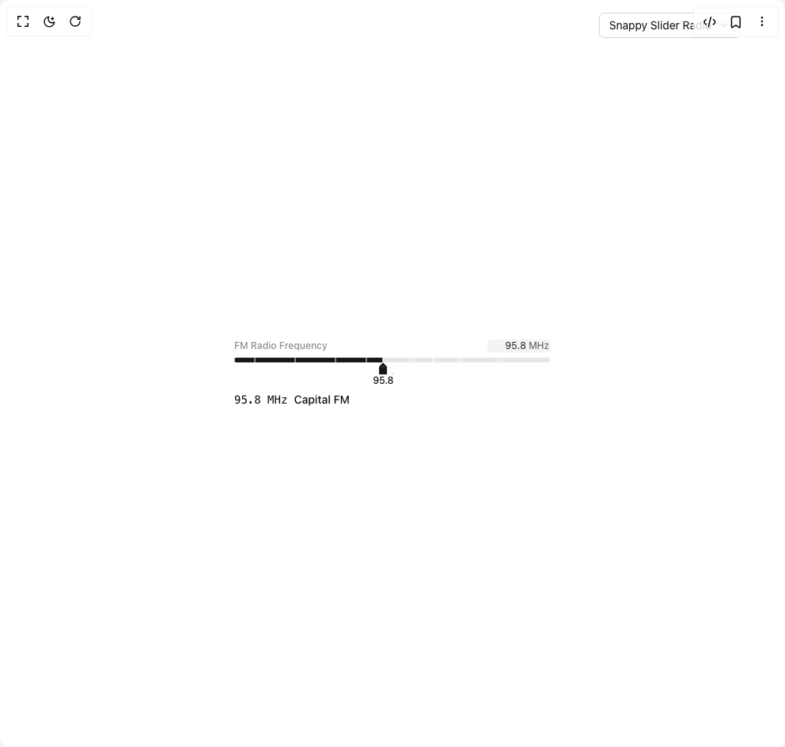

# Build Snappy Slider in BuilderStudio

> Build this component in our Agentic IDE: [BuilderStudio](https://builderstudio.dev).
>
> Join the BuilderStudio community on [Discord](https://discord.gg/QdWeSGCqfe) and [Reddit](https://reddit.com/r/builderstudio).



## Component

- Author group: `ghcpuman902`
- Component: `snappy-slider`
- Variant: `default`
- Rendered HTML snapshot: [`rendered.html`](rendered.html)

## BuilderStudio prompt

You are implementing a React component based on a component reference.

## Component identity

- Author: ghcpuman902
- Component slug: snappy-slider
- Demo slug: default
- Title: snappy-slider
- Description: 

## Goal

Recreate this component in a React + TypeScript + Tailwind CSS project. Preserve the visual layout, spacing, colors, border radius, shadows, interaction behavior, animation behavior, responsive behavior, and dark mode behavior shown in the rendered demo.

## Implementation requirements

- Use React and TypeScript.
- Use Tailwind CSS classes whenever possible.
- Keep the component self-contained unless the source files require helper components.
- If the source uses CSS variables, custom CSS, animations, or keyframes, include them.
- If the source uses external packages, list and use the required packages.
- Preserve accessibility attributes, button semantics, links, keyboard behavior, and ARIA attributes when visible in the source.
- Do not replace the component with a simplified placeholder.
- Return complete production-ready code.

## Dependencies

No reference metadata available.

## Rendered DOM snapshot

This is the rendered demo HTML extracted from the live preview. Use it to verify structure, class names, visible content, and layout.

```html
<div id="root"><div class="relative flex items-center justify-center h-screen w-full m-auto p-16 bg-background text-foreground"><div class="absolute lab-bg inset-0 size-full"><div class="absolute inset-0 bg-[radial-gradient(#00000021_1px,transparent_1px)] dark:bg-[radial-gradient(#ffffff22_1px,transparent_1px)]"></div></div><div class="absolute z-10 top-4 right-14 flex flex-col items-end gap-1"><button type="button" role="combobox" aria-controls="radix-«r0»" aria-expanded="false" aria-autocomplete="none" dir="ltr" data-state="closed" class="flex w-full items-center justify-between rounded-md border border-input bg-background px-3 py-2 text-sm ring-offset-background placeholder:text-muted-foreground focus:outline-none focus:ring-2 focus:ring-ring focus:ring-offset-2 disabled:cursor-not-allowed disabled:opacity-50 [&amp;&gt;span]:line-clamp-1 gap-2 h-8"><span style="pointer-events: none;">Snappy Slider Radio</span><svg xmlns="http://www.w3.org/2000/svg" width="24" height="24" viewBox="0 0 24 24" fill="none" stroke="currentColor" stroke-width="2" stroke-linecap="round" stroke-linejoin="round" class="lucide lucide-chevron-down h-4 w-4 opacity-50" aria-hidden="true"><path d="m6 9 6 6 6-6"></path></svg></button></div><div class="flex w-full justify-center relative"><div class="space-y-2 w-[400px]"><div class="[--mark-slider-gap:0.25rem] [--mark-slider-height:0.5rem] [--mark-slider-track-height:0.375rem] [--mark-slider-marker-width:1px] flex flex-col gap-[--mark-slider-gap] pb-7"><div class="flex justify-between items-center mb-0.5"><label class="text-xs font-medium text-primary/50">FM Radio Frequency</label><div class="group inline-flex items-center bg-primary/5 rounded px-0.5 focus-within:ring-1 focus-within:ring-primary cursor-text w-20"><input inputmode="decimal" class="w-full min-w-0 text-right text-xs bg-transparent border-none focus:outline-none [appearance:textfield] [&amp;::-webkit-outer-spin-button]:appearance-none [&amp;::-webkit-inner-spin-button]:appearance-none tabular-nums text-primary" type="number" value="95.8"><span class="text-xs text-primary/75 select-none shrink-0">&nbsp;MHz</span></div></div><div class="relative h-[--mark-slider-height]"><div class="absolute inset-0"><div class="absolute top-1/2 -translate-y-1/2 w-full h-[--mark-slider-track-height] bg-primary/10 rounded-sm overflow-hidden"><div class="absolute top-0 h-full z-[1] bg-primary" style="width: 47.093%;"></div><div class="absolute top-0 w-[--mark-slider-marker-width] z-[2] h-full -translate-x-[calc(var(--mark-slider-marker-width)/2)] bg-white/90 dark:bg-black/90" style="left: 0%;"></div><div class="absolute top-0 w-[--mark-slider-marker-width] z-[2] h-full -translate-x-[calc(var(--mark-slider-marker-width)/2)] bg-white/90 dark:bg-black/90" style="left: 6.39535%;"></div><div class="absolute top-0 w-[--mark-slider-marker-width] z-[2] h-full -translate-x-[calc(var(--mark-slider-marker-width)/2)] bg-white/90 dark:bg-black/90" style="left: 19.186%;"></div><div class="absolute top-0 w-[--mark-slider-marker-width] z-[2] h-full -translate-x-[calc(var(--mark-slider-marker-width)/2)] bg-white/90 dark:bg-black/90" style="left: 31.9767%;"></div><div class="absolute top-0 w-[--mark-slider-marker-width] z-[2] h-full -translate-x-[calc(var(--mark-slider-marker-width)/2)] bg-white/90 dark:bg-black/90" style="left: 41.8605%;"></div><div class="absolute top-0 w-[--mark-slider-marker-width] z-[2] h-full -translate-x-[calc(var(--mark-slider-marker-width)/2)] bg-white/90 dark:bg-black/90" style="left: 47.093%;"></div><div class="absolute top-0 w-[--mark-slider-marker-width] z-[2] h-full -translate-x-[calc(var(--mark-slider-marker-width)/2)] bg-white/90 dark:bg-black/90" style="left: 47.093%;"></div><div class="absolute top-0 w-[--mark-slider-marker-width] z-[2] h-full -translate-x-[calc(var(--mark-slider-marker-width)/2)] bg-white/90 dark:bg-black/90" style="left: 55.814%;"></div><div class="absolute top-0 w-[--mark-slider-marker-width] z-[2] h-full -translate-x-[calc(var(--mark-slider-marker-width)/2)] bg-white/90 dark:bg-black/90" style="left: 62.7907%;"></div><div class="absolute top-0 w-[--mark-slider-marker-width] z-[2] h-full -translate-x-[calc(var(--mark-slider-marker-width)/2)] bg-white/90 dark:bg-black/90" style="left: 71.5116%;"></div><div class="absolute top-0 w-[--mark-slider-marker-width] z-[2] h-full -translate-x-[calc(var(--mark-slider-marker-width)/2)] bg-white/90 dark:bg-black/90" style="left: 84.3023%;"></div><div class="absolute top-0 w-[--mark-slider-marker-width] z-[2] h-full -translate-x-[calc(var(--mark-slider-marker-width)/2)] bg-white/90 dark:bg-black/90" style="left: 100%;"></div></div><div class="absolute z-30 top-1/2 -translate-y-[35%] -translate-x-1/2 cursor-grab active:cursor-grabbing" style="left: 47.093%;"><div class="w-0 h-0 border-[5px] border-transparent border-b-primary mt-2"></div><div class="w-[10px] h-[10px] bg-primary"></div><div class="absolute top-[22px] left-1/2 -translate-x-1/2 whitespace-nowrap"><span class="text-xs font-medium">95.8</span></div></div></div></div></div><div class="mt-2 text-sm"><span class="font-mono">95.8 MHz</span><span class="ml-2 font-medium text-foreground">Capital FM</span></div></div></div></div></div>
```

## Reference source files

No reference source files were available.
