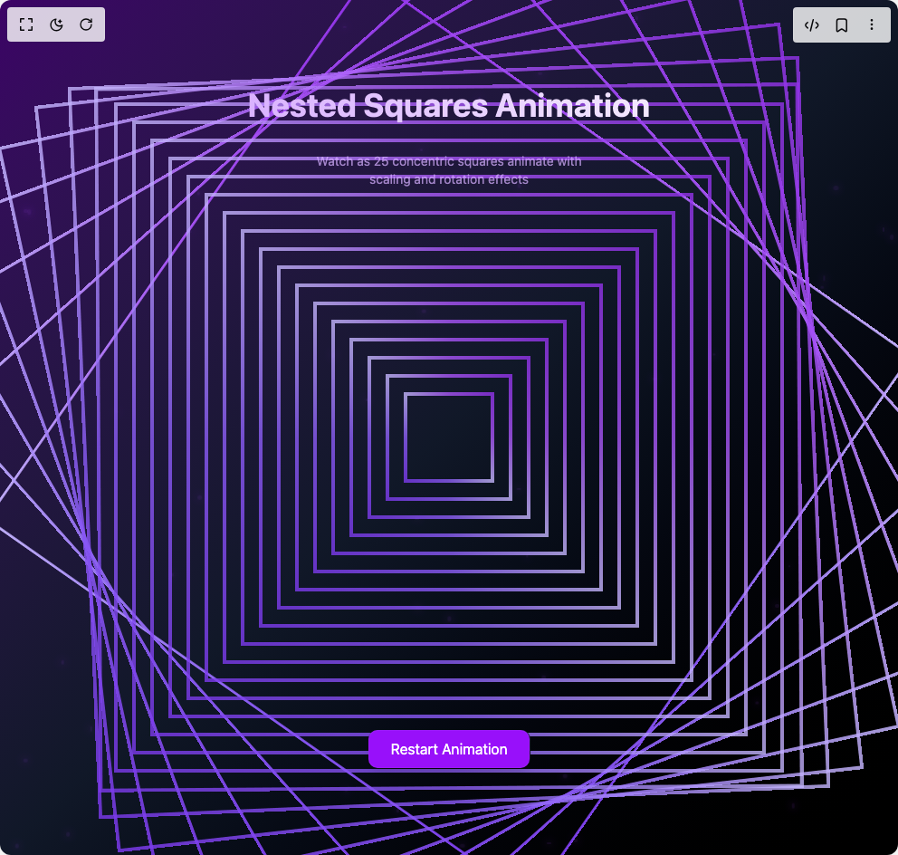
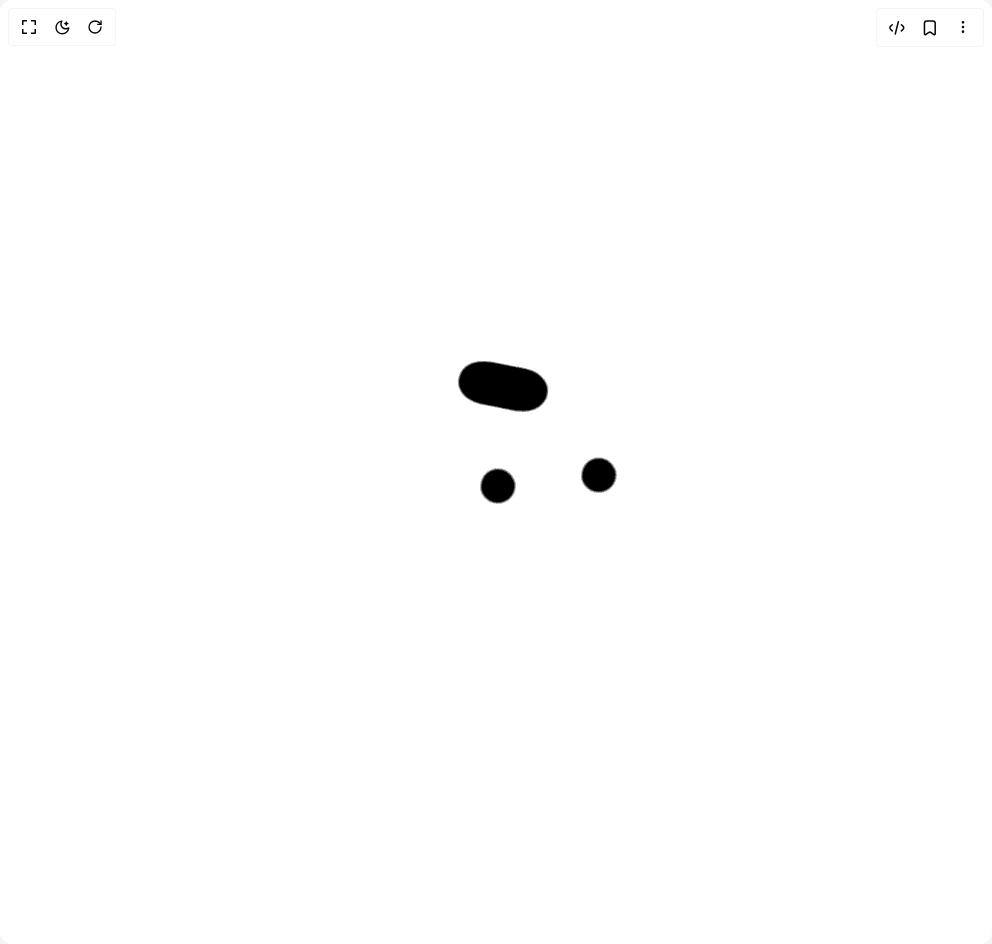
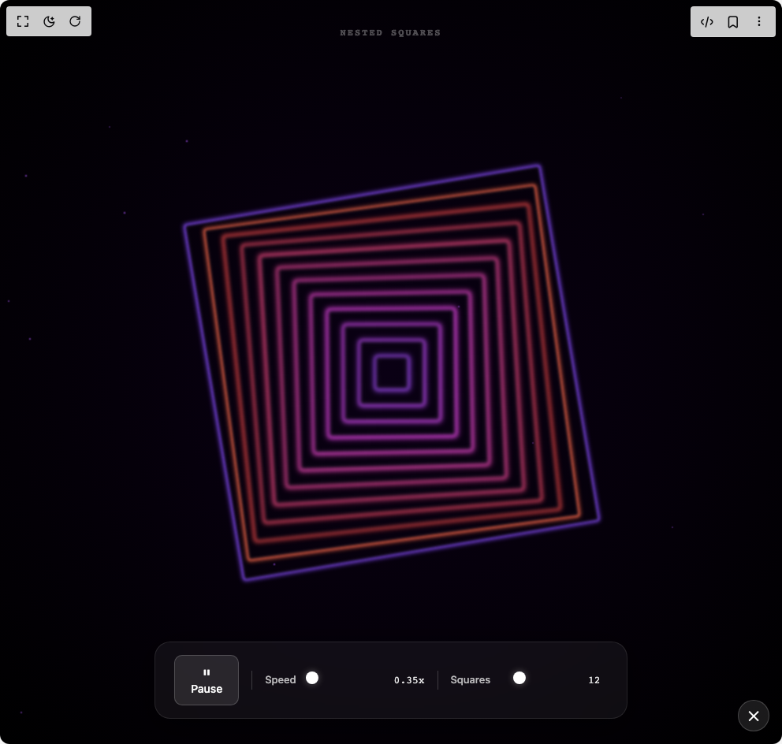

# H0bb5 Components

6 components are available in this author group.

> Build any component in [BuilderStudio](https://builderstudio.dev), then share improvements with the community on [Discord](https://discord.gg/QdWeSGCqfe) or [Reddit](https://reddit.com/r/builderstudio).

| Preview | Component | Variant |
| --- | --- | --- |
|  | [Bloom](bloom/default/README.md) | `default` |
|  | [Bloom](bloom/hero/README.md) | `hero` |
|  | [Cool Blob Effect](cool-blob-effect/default/README.md) | `default` |
|  | [Customizable Loader Spinner Transition](customizable-loader-spinner-transition/default/README.md) | `default` |
|  | [Generative Art](generative-art/default/README.md) | `default` |
|  | [Zima Blue](zima-blue/default/README.md) | `default` |
