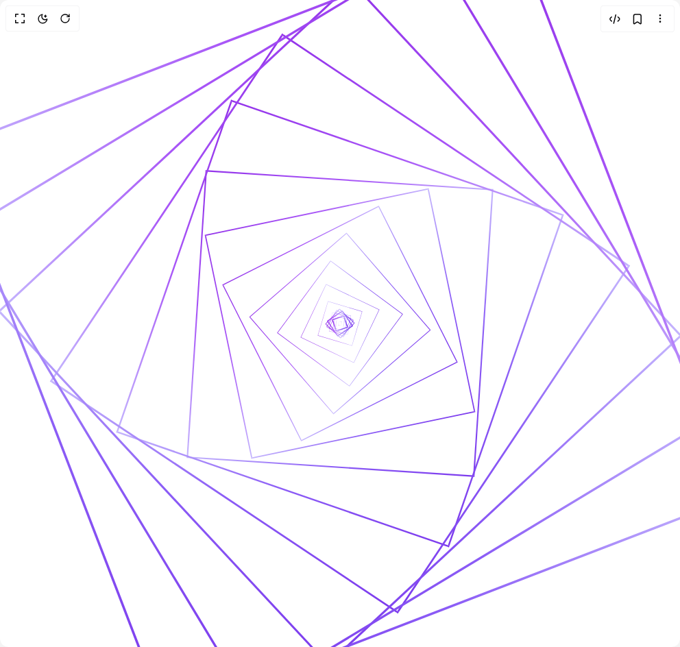

# Build Bloom in BuilderStudio

> Build this component in our Agentic IDE: [BuilderStudio](https://builderstudio.dev).
>
> Join the BuilderStudio community on [Discord](https://discord.gg/QdWeSGCqfe) and [Reddit](https://reddit.com/r/builderstudio).



## Component

- Author group: `h0bb5`
- Component: `bloom`
- Variant: `default`
- Rendered HTML snapshot: [`rendered.html`](rendered.html)

## BuilderStudio prompt

You are implementing a React component based on a component reference.

## Component identity

- Author: h0bb5
- Component slug: bloom
- Demo slug: default
- Title: bloom
- Description: 

## Goal

Recreate this component in a React + TypeScript + Tailwind CSS project. Preserve the visual layout, spacing, colors, border radius, shadows, interaction behavior, animation behavior, responsive behavior, and dark mode behavior shown in the rendered demo.

## Implementation requirements

- Use React and TypeScript.
- Use Tailwind CSS classes whenever possible.
- Keep the component self-contained unless the source files require helper components.
- If the source uses CSS variables, custom CSS, animations, or keyframes, include them.
- If the source uses external packages, list and use the required packages.
- Preserve accessibility attributes, button semantics, links, keyboard behavior, and ARIA attributes when visible in the source.
- Do not replace the component with a simplified placeholder.
- Return complete production-ready code.

## Dependencies

No reference metadata available.

## Rendered DOM snapshot

This is the rendered demo HTML extracted from the live preview. Use it to verify structure, class names, visible content, and layout.

```html
<div id="root"><div class="w-screen min-h-screen flex justify-center items-center"><div class="w-screen min-h-screen flex justify-center items-center"><div class="min-h-screen bg-background flex items-center justify-center p-8"><div class="relative w-96 h-96 flex items-center justify-center bg-background"><div class="absolute border-2 border-transparent" style="padding: 10px; border-image: linear-gradient(45deg, rgb(147, 51, 234), rgb(168, 85, 247), rgb(196, 181, 253), rgb(139, 92, 246), rgb(124, 58, 237)) 1 / 1 / 0 stretch; transform: scale(0.719926) rotate(64.7934deg);"></div><div class="absolute border-2 border-transparent" style="padding: 20px; border-image: linear-gradient(45deg, rgb(147, 51, 234), rgb(168, 85, 247), rgb(196, 181, 253), rgb(139, 92, 246), rgb(124, 58, 237)) 1 / 1 / 0 stretch; transform: scale(0.5631) rotate(50.679deg);"></div><div class="absolute border-2 border-transparent" style="padding: 30px; border-image: linear-gradient(45deg, rgb(147, 51, 234), rgb(168, 85, 247), rgb(196, 181, 253), rgb(139, 92, 246), rgb(124, 58, 237)) 1 / 1 / 0 stretch; transform: scale(0.419875) rotate(37.7887deg);"></div><div class="absolute border-2 border-transparent" style="padding: 40px; border-image: linear-gradient(45deg, rgb(147, 51, 234), rgb(168, 85, 247), rgb(196, 181, 253), rgb(139, 92, 246), rgb(124, 58, 237)) 1 / 1 / 0 stretch; transform: scale(0.296722) rotate(26.7049deg);"></div><div class="absolute border-2 border-transparent" style="padding: 50px; border-image: linear-gradient(45deg, rgb(147, 51, 234), rgb(168, 85, 247), rgb(196, 181, 253), rgb(139, 92, 246), rgb(124, 58, 237)) 1 / 1 / 0 stretch; transform: scale(0.194041) rotate(17.4637deg);"></div><div class="absolute border-2 border-transparent" style="padding: 60px; border-image: linear-gradient(45deg, rgb(147, 51, 234), rgb(168, 85, 247), rgb(196, 181, 253), rgb(139, 92, 246), rgb(124, 58, 237)) 1 / 1 / 0 stretch; transform: scale(0.113622) rotate(10.2259deg);"></div><div class="absolute border-2 border-transparent" style="padding: 70px; border-image: linear-gradient(45deg, rgb(147, 51, 234), rgb(168, 85, 247), rgb(196, 181, 253), rgb(139, 92, 246), rgb(124, 58, 237)) 1 / 1 / 0 stretch; transform: scale(0.0547932) rotate(4.93139deg);"></div><div class="absolute border-2 border-transparent" style="padding: 80px; border-image: linear-gradient(45deg, rgb(147, 51, 234), rgb(168, 85, 247), rgb(196, 181, 253), rgb(139, 92, 246), rgb(124, 58, 237)) 1 / 1 / 0 stretch; transform: scale(0.0177473) rotate(1.59726deg);"></div><div class="absolute border-2 border-transparent" style="padding: 90px; border-image: linear-gradient(45deg, rgb(147, 51, 234), rgb(168, 85, 247), rgb(196, 181, 253), rgb(139, 92, 246), rgb(124, 58, 237)) 1 / 1 / 0 stretch; transform: scale(0.00115115) rotate(0.103604deg);"></div><div class="absolute border-2 border-transparent" style="padding: 100px; border-image: linear-gradient(45deg, rgb(147, 51, 234), rgb(168, 85, 247), rgb(196, 181, 253), rgb(139, 92, 246), rgb(124, 58, 237)) 1 / 1 / 0 stretch; transform: scale(0.00402317) rotate(0.362086deg);"></div><div class="absolute border-2 border-transparent" style="padding: 110px; border-image: linear-gradient(45deg, rgb(147, 51, 234), rgb(168, 85, 247), rgb(196, 181, 253), rgb(139, 92, 246), rgb(124, 58, 237)) 1 / 1 / 0 stretch; transform: scale(0.026574) rotate(2.39166deg);"></div><div class="absolute border-2 border-transparent" style="padding: 120px; border-image: linear-gradient(45deg, rgb(147, 51, 234), rgb(168, 85, 247), rgb(196, 181, 253), rgb(139, 92, 246), rgb(124, 58, 237)) 1 / 1 / 0 stretch; transform: scale(0.0703007) rotate(6.32706deg);"></div><div class="absolute border-2 border-transparent" style="padding: 130px; border-image: linear-gradient(45deg, rgb(147, 51, 234), rgb(168, 85, 247), rgb(196, 181, 253), rgb(139, 92, 246), rgb(124, 58, 237)) 1 / 1 / 0 stretch; transform: scale(0.135504) rotate(12.1953deg);"></div><div class="absolute border-2 border-transparent" style="padding: 140px; border-image: linear-gradient(45deg, rgb(147, 51, 234), rgb(168, 85, 247), rgb(196, 181, 253), rgb(139, 92, 246), rgb(124, 58, 237)) 1 / 1 / 0 stretch; transform: scale(0.222158) rotate(19.9942deg);"></div><div class="absolute border-2 border-transparent" style="padding: 150px; border-image: linear-gradient(45deg, rgb(147, 51, 234), rgb(168, 85, 247), rgb(196, 181, 253), rgb(139, 92, 246), rgb(124, 58, 237)) 1 / 1 / 0 stretch; transform: scale(0.331943) rotate(29.8748deg);"></div><div class="absolute border-2 border-transparent" style="padding: 160px; border-image: linear-gradient(45deg, rgb(147, 51, 234), rgb(168, 85, 247), rgb(196, 181, 253), rgb(139, 92, 246), rgb(124, 58, 237)) 1 / 1 / 0 stretch; transform: scale(0.460723) rotate(41.4651deg);"></div><div class="absolute border-2 border-transparent" style="padding: 170px; border-image: linear-gradient(45deg, rgb(147, 51, 234), rgb(168, 85, 247), rgb(196, 181, 253), rgb(139, 92, 246), rgb(124, 58, 237)) 1 / 1 / 0 stretch; transform: scale(0.608892) rotate(54.8003deg);"></div><div class="absolute border-2 border-transparent" style="padding: 180px; border-image: linear-gradient(45deg, rgb(147, 51, 234), rgb(168, 85, 247), rgb(196, 181, 253), rgb(139, 92, 246), rgb(124, 58, 237)) 1 / 1 / 0 stretch; transform: scale(0.769676) rotate(69.2709deg);"></div><div class="absolute border-2 border-transparent" style="padding: 190px; border-image: linear-gradient(45deg, rgb(147, 51, 234), rgb(168, 85, 247), rgb(196, 181, 253), rgb(139, 92, 246), rgb(124, 58, 237)) 1 / 1 / 0 stretch; transform: scale(0.939242) rotate(84.5318deg);"></div><div class="absolute border-2 border-transparent" style="padding: 200px; border-image: linear-gradient(45deg, rgb(147, 51, 234), rgb(168, 85, 247), rgb(196, 181, 253), rgb(139, 92, 246), rgb(124, 58, 237)) 1 / 1 / 0 stretch; transform: scale(1.11185) rotate(100.067deg);"></div><div class="absolute border-2 border-transparent" style="padding: 210px; border-image: linear-gradient(45deg, rgb(147, 51, 234), rgb(168, 85, 247), rgb(196, 181, 253), rgb(139, 92, 246), rgb(124, 58, 237)) 1 / 1 / 0 stretch; transform: scale(1.28007) rotate(115.207deg);"></div><div class="absolute border-2 border-transparent" style="padding: 220px; border-image: linear-gradient(45deg, rgb(147, 51, 234), rgb(168, 85, 247), rgb(196, 181, 253), rgb(139, 92, 246), rgb(124, 58, 237)) 1 / 1 / 0 stretch; transform: scale(1.4369) rotate(129.321deg);"></div><div class="absolute border-2 border-transparent" style="padding: 230px; border-image: linear-gradient(45deg, rgb(147, 51, 234), rgb(168, 85, 247), rgb(196, 181, 253), rgb(139, 92, 246), rgb(124, 58, 237)) 1 / 1 / 0 stretch; transform: scale(1.58013) rotate(142.211deg);"></div><div class="absolute border-2 border-transparent" style="padding: 240px; border-image: linear-gradient(45deg, rgb(147, 51, 234), rgb(168, 85, 247), rgb(196, 181, 253), rgb(139, 92, 246), rgb(124, 58, 237)) 1 / 1 / 0 stretch; transform: scale(1.70328) rotate(153.295deg);"></div><div class="absolute border-2 border-transparent" style="padding: 250px; border-image: linear-gradient(45deg, rgb(147, 51, 234), rgb(168, 85, 247), rgb(196, 181, 253), rgb(139, 92, 246), rgb(124, 58, 237)) 1 / 1 / 0 stretch; transform: scale(1.80596) rotate(162.536deg);"></div></div></div></div></div></div>
```

## Reference source files

No reference source files were available.
